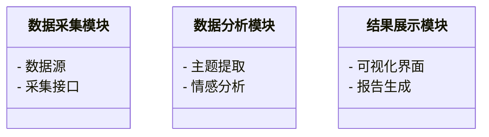
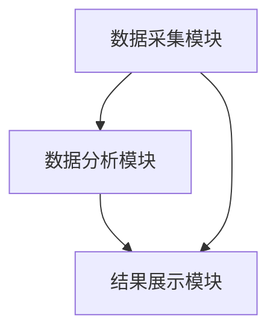

                 


# 费雪的质性分析：超越数字的公司研究方法

> 关键词：质性分析，费雪分析法，企业研究，数据分析，Python实现

> 摘要：本文深入探讨了费雪的质性分析方法，分析其在公司研究中的独特优势，结合实际案例和系统架构设计，详细讲解了质性分析的算法原理、数学模型和系统实现过程。

---

## 第一部分: 费雪的质性分析概述

### 第1章: 质性分析的背景与核心概念

#### 1.1 质性分析的背景
质性分析是一种基于文本和语义的分析方法，旨在超越传统定量分析的局限性。传统定量分析依赖于数字和统计指标，但在某些情况下，数字无法完全反映企业的实际状况。费雪的质性分析方法通过关注企业的语言、行为和文化，提供了更全面的公司研究视角。

##### 1.1.1 传统定量分析的局限性
- 无法捕捉企业文化和战略意图。
- 忽略了非结构化数据（如文本、图像）的价值。
- 可能导致“数字游戏”（通过调整会计科目 manipulate financial figures 而非实际改善业务）。

##### 1.1.2 质性分析的兴起与应用
质性分析通过自然语言处理（NLP）和机器学习技术，从非结构化数据中提取有用信息。它广泛应用于企业风险评估、市场分析和投资决策等领域。

##### 1.1.3 费雪分析法的独特性
费雪分析法是一种结合语义分析和逻辑推理的质性分析方法，特别适用于对公司管理团队的语言和行为进行深入研究。

---

#### 1.2 费雪质性分析的核心概念
费雪质性分析的核心在于通过分析企业的公开声明、管理层发言和行业报告，挖掘其隐藏的信息和潜在风险。

##### 1.2.1 质性分析的基本原理
质性分析基于以下假设：
- 企业的语言反映了其战略意图和管理风格。
- 通过分析语言的变化，可以预测企业的未来行为。

##### 1.2.2 费雪分析法的定义与特点
费雪分析法是一种通过分析企业高管的语言、行为和决策模式，评估企业管理和战略能力的方法。其特点包括：
- **语义深度**：关注语言中的细微差别。
- **逻辑推理**：结合上下文进行分析。
- **动态性**：适用于实时监测企业变化。

##### 1.2.3 质性分析与定量分析的结合
质性分析与定量分析并非对立，而是相辅相成。例如，可以通过质性分析验证定量分析的结果，或者通过定量分析补充质性分析的不足。

---

### 第2章: 质性分析的核心概念与联系

#### 2.1 质性分析的核心原理
质性分析的核心原理是通过语义分析和逻辑推理，从非结构化数据中提取有用信息。

##### 2.1.1 质性分析的理论基础
质性分析的理论基础包括：
- 自然语言处理（NLP）：用于文本解析和语义理解。
- 计算机视觉：用于图像和视频分析。
- 机器学习：用于模式识别和分类。

##### 2.1.2 费雪分析法的数学模型
费雪分析法的数学模型包括：
- **主题模型**：如LDA（主题建模）。
- **情感分析模型**：如VADER算法。
- **序列分析模型**：如HMM（隐马尔可夫模型）。

##### 2.1.3 质性分析与企业研究的关系
质性分析是企业研究的重要工具，可以帮助研究者更好地理解企业的内部运作和外部环境。

---

#### 2.2 核心概念属性对比
以下是质性分析与定量分析的核心概念对比表：

| **属性**       | **质性分析**               | **定量分析**               |
|----------------|----------------------------|----------------------------|
| 数据类型       | 文本、图像、视频           | 数值型数据                 |
| 分析目标       | 挖掘隐含信息和语义         | 计算统计指标和趋势         |
| 分析方法       | NLP、机器学习             | 统计分析、回归分析         |
| 应用场景       | 风险评估、市场分析         | 财务分析、趋势预测         |

##### 2.2.2 费雪分析法与其他质性分析方法的对比
以下是费雪分析法与其他质性分析方法的对比：

| **方法**       | **费雪分析法**             | **传统语料分析**           | **情感分析**               |
|----------------|----------------------------|----------------------------|----------------------------|
| 核心目标       | 分析企业语言和行为         | 分析文本语义               | 分析情感倾向               |
| 技术基础       | NLP 和逻辑推理            | NLP                        | NLP 和统计学习             |
| 应用领域       | 企业研究、投资决策         | 学术研究、内容分析         | 社交媒体分析、品牌监测      |

##### 2.2.3 质性分析的核心要素与ER实体关系图
以下是质性分析的核心要素与ER实体关系图：

```mermaid
entity Relationship {
  研究对象 (企业、高管、行业)
  分析方法 (NLP、机器学习、逻辑推理)
  分析结果 (主题、情感、风险)
}
```

---

### 第3章: 费雪质性分析的算法原理

#### 3.1 质性分析的算法流程
以下是质性分析的算法流程图：

```mermaid
graph TD
A[开始] -> B[数据预处理]
B -> C[主题提取]
C -> D[情感分析]
D -> E[结果验证]
E -> F[结束]
```

##### 3.1.1 数据预处理
数据预处理包括：
- 分词：将文本分割成词语或短语。
- 去停用词：去除无意义的词汇（如“的”、“是”等）。
- 词干提取：将词语转换为基本形式（如“running”转换为“run”）。

##### 3.1.2 主题提取
主题提取可以使用LDA（主题建模）或TF-IDF方法。

##### 3.1.3 情感分析
情感分析可以使用VADER算法或训练好的深度学习模型（如BERT）。

##### 3.1.4 结果验证
结果验证可以通过人工检查或交叉验证进行。

##### 3.1.5 代码实现
以下是主题提取和情感分析的Python代码示例：

```python
# 主题提取
from gensim.models import LdaModel
from gensim.corpora import Dictionary

# 假设 corpus 已经准备好
dictionary = Dictionary(corpus)
dictionary.filter_extremes(no_below=5, no_above=0.5)
corpus_dict = [dictionary.doc2bow(doc) for doc in corpus]

lda = LdaModel(corpus_dict, num_topics=5, random_state=42)
topics = lda.get_topics()

# 情感分析
from vaderSentiment.vaderSentiment import SentimentIntensityAnalyzer

analyzer = SentimentIntensityAnalyzer()
sentiments = []
for text in texts:
    sentiment = analyzer.polarity_scores(text)
    sentiments.append(sentiment)
```

---

#### 3.2 质性分析的数学模型
以下是质性分析中常用的一些数学模型和公式：

##### 3.2.1 情感倾向计算公式
情感倾向可以通过以下公式计算：

$$
\text{情感倾向} = \frac{\sum (\text{权重} \times \text{情感得分})}{\sum \text{权重}}
$$

##### 3.2.2 主题权重计算公式
主题权重可以通过TF-IDF计算：

$$
\text{TF-IDF}(w, d) = \text{TF}(w, d) \times \text{IDF}(w)
$$

其中：
- TF(w, d) 表示词语w在文档d中的词频。
- IDF(w) 表示词语w的逆文档频率。

##### 3.2.3 数据相似度计算公式
数据相似度可以通过余弦相似度计算：

$$
\text{相似度}(d1, d2) = \frac{\sum d1_i \times d2_i}{\sqrt{\sum d1_i^2} \times \sqrt{\sum d2_i^2}}
$$

---

### 第4章: 质性分析的系统架构设计

#### 4.1 系统应用场景
质性分析系统可以应用于以下场景：
- **公司研究**：分析企业的管理风格和战略意图。
- **投资决策**：评估企业的潜在风险和投资价值。
- **市场分析**：监控行业趋势和竞争格局。

#### 4.2 系统功能设计
以下是系统功能设计的类图：



#### 4.3 系统架构设计图
以下是系统架构设计图：



---

### 第5章: 费雪质性分析的项目实战

#### 5.1 项目环境安装
以下是项目环境安装步骤：
1. 安装Python和Jupyter Notebook。
2. 安装必要的库（如`gensim`、`vaderSentiment`、`networkx`）。

#### 5.2 核心算法实现
以下是核心算法实现代码：

```python
# 主题提取
from gensim.models import LdaModel
from gensim.corpora import Dictionary

# 数据预处理
texts = [...]  # 假设texts已经准备好

dictionary = Dictionary(texts)
dictionary.filter_extremes(no_below=5, no_above=0.5)
corpus = [dictionary.doc2bow(text) for text in texts]

# 训练LDA模型
lda_model = LdaModel(corpus, num_topics=5, random_state=42)
topics = lda_model.get_topics()

# 情感分析
from vaderSentiment.vaderSentiment import SentimentIntensityAnalyzer

analyzer = SentimentIntensityAnalyzer()
sentiments = []
for text in texts:
    sentiment = analyzer.polarity_scores(text)
    sentiments.append(sentiment)
```

#### 5.3 项目案例分析
以下是项目案例分析：

假设我们有一个企业的高管演讲文本，我们可以使用费雪分析法提取主题并进行情感分析，以评估企业的管理风格和潜在风险。

---

### 第6章: 费雪质性分析的最佳实践

#### 6.1 小结
费雪质性分析是一种超越数字的公司研究方法，通过分析企业的语言和行为，提供更全面的评估。

#### 6.2 注意事项
- 数据质量是关键，确保数据的完整性和准确性。
- 结果需要结合实际情况进行验证和调整。
- 注意模型的可解释性和透明度。

#### 6.3 拓展阅读
- 《自然语言处理入门》
- 《机器学习实战》
- 《深度学习》

---

通过本文的详细讲解，我们了解了费雪质性分析的核心概念、算法原理和系统实现过程。希望本文能够为读者在公司研究和投资决策中提供新的思路和方法。

