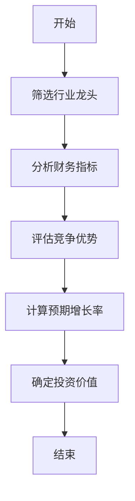
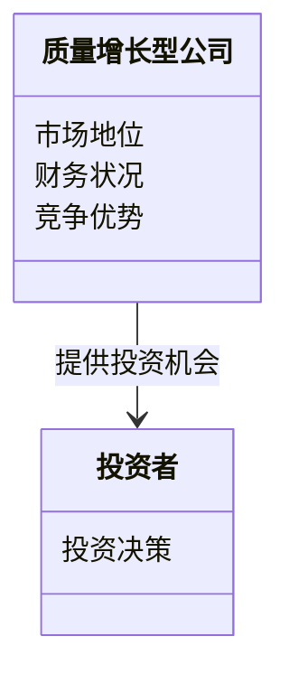
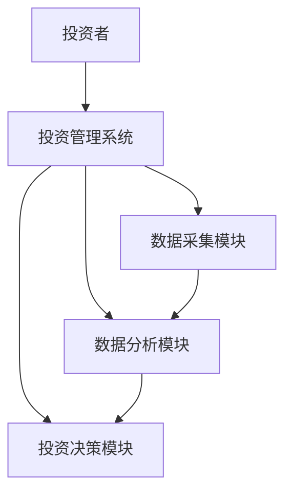
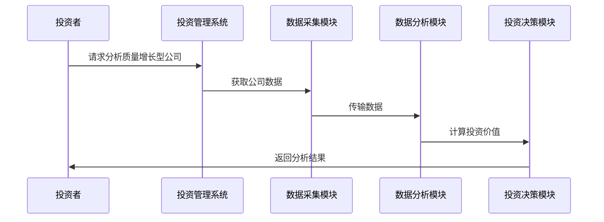

                 


# 费雪的质量增长型公司特征

> 关键词：费雪投资理论，质量增长型公司，投资逻辑，选股模型，财务分析

> 摘要：本文深入分析了费雪的质量增长型公司特征，从投资理论的背景、核心概念、算法原理、系统分析、项目实战到最佳实践，全面探讨了如何识别和分析质量增长型公司。通过费雪的投资逻辑和选股模型，结合实际案例，帮助投资者更好地理解和应用这些特征。

---

# 第一部分: 费雪投资理论与质量增长型公司的背景介绍

## 第1章: 费雪投资理论概述

### 1.1 费雪投资理论的起源与发展

#### 1.1.1 费雪投资理论的起源
菲利普·费雪（Philip Fisher）是20世纪著名的投资理论家，他的投资理念强调长期增长和企业质量。费雪的投资理论起源于20世纪30年代，当时市场波动剧烈，投资者需要一种更科学的方法来选择具有长期增长潜力的公司。

#### 1.1.2 费雪投资理论的核心思想
费雪的投资理论核心是“投资于成长股”，即选择那些具有持续增长潜力和良好管理的公司。他认为，企业的质量是决定其长期增长的关键因素，包括企业的盈利能力、市场地位和管理团队。

#### 1.1.3 费雪投资理论在现代投资学中的地位
费雪的投资理论为现代投资学奠定了基础，尤其是在成长股投资领域。他的理论强调长期投资和对公司基本面的深入分析，对后来的价值投资和指数投资理论产生了深远影响。

### 1.2 质量增长型公司的定义与特征

#### 1.2.1 质量增长型公司的定义
质量增长型公司是指那些具有持续增长潜力、良好的财务健康状况和竞争优势的公司。这类公司通常在行业中占据领先地位，并且能够持续提高盈利能力。

#### 1.2.2 质量增长型公司的核心特征
质量增长型公司的核心特征包括：
1. **持续的增长潜力**：公司收入和利润能够持续增长。
2. **良好的财务健康状况**：公司具有健康的资产负债表和现金流。
3. **竞争优势明显**：公司具有独特的竞争优势，如专利、品牌或技术。

#### 1.2.3 质量增长型公司与传统增长型公司的区别
质量增长型公司与传统增长型公司的区别在于，前者注重质量和可持续性，而后者更注重短期增长。质量增长型公司通常在财务健康和竞争优势方面表现更佳。

### 1.3 费雪投资逻辑的实际应用

#### 1.3.1 费雪投资逻辑的核心要素
费雪的投资逻辑强调以下几点：
1. **深入研究公司基本面**：了解公司的商业模式、财务状况和竞争优势。
2. **关注管理层的质量**：管理层的决策能力和道德标准对公司的长期发展至关重要。
3. **长期投资**：避免短期波动，专注于公司的长期增长。

#### 1.3.2 费雪投资逻辑的实际应用案例
以苹果公司为例，苹果在20世纪80年代推出Macintosh计算机后，逐步成长为全球科技巨头。苹果的成功离不开其强大的品牌影响力、技术创新能力和高效的管理团队。

### 1.4 本章小结
本章介绍了费雪的投资理论及其在质量增长型公司分析中的应用。通过定义和特征分析，帮助读者理解如何识别和分析质量增长型公司。

---

# 第二部分: 质量增长型公司的核心概念与联系

## 第2章: 质量增长型公司的核心概念

### 2.1 质量增长型公司的特征分析

#### 2.1.1 公司质量的衡量标准
公司质量的衡量标准包括：
1. **盈利能力**：ROE（净资产收益率）和ROA（资产回报率）。
2. **财务健康状况**：资产负债率和现金流。
3. **市场地位**：市场份额和品牌影响力。

#### 2.1.2 公司增长率的定义与计算
公司增长率通常指收入或利润的年增长率。计算公式为：
$$ \text{增长率} = \frac{\text{当年收入} - \text{上一年收入}}{\text{上一年收入}} \times 100\% $$

#### 2.1.3 质量与增长的平衡点
质量增长型公司需要在质量和增长之间找到平衡点，避免过度追求增长而忽视质量，或过度追求质量而忽视增长潜力。

### 2.2 质量增长型公司的核心要素

#### 2.2.1 财务健康状况
财务健康状况是质量增长型公司的核心要素之一，包括：
1. **收入和利润的稳定性**：收入和利润持续增长。
2. **现金流状况**：经营活动产生的现金流为正。
3. **债务负担**：低负债率，避免财务风险。

#### 2.2.2 市场地位与竞争优势
市场地位与竞争优势是质量增长型公司的另一核心要素，包括：
1. **市场份额**：公司在行业中占据领先地位。
2. **品牌影响力**：强大的品牌形象有助于吸引客户。
3. **技术优势**：技术创新能力是公司竞争力的重要来源。

#### 2.2.3 管理团队的质量
管理团队的质量对公司的长期发展至关重要，包括：
1. **管理层的决策能力**：管理层是否具有战略眼光和决策能力。
2. **管理层的道德标准**：管理层是否诚实守信，避免财务造假。

### 2.3 质量增长型公司的属性特征对比

#### 2.3.1 行业分布特征
质量增长型公司通常分布在高科技、消费、医疗等高增长行业。

#### 2.3.2 财务指标特征
质量增长型公司的财务指标特征包括：
- 高ROE（净资产收益率）
- 高ROA（资产回报率）
- 稳定的现金流

#### 2.3.3 市场表现特征
质量增长型公司的市场表现通常优于市场平均水平，尤其是在长期投资中表现更为显著。

### 2.4 质量增长型公司的ER实体关系图

```mermaid
er
  actor 质量增长型公司
  actor 财务指标
  actor 市场表现
  actor 竞争优势
  relation 实例化为：质量增长型公司-财务指标关系
  relation 实例化为：质量增长型公司-市场表现关系
  relation 实例化为：质量增长型公司-竞争优势关系
```

---

# 第三部分: 质量增长型公司的算法原理与数学模型

## 第3章: 质量增长型公司的算法原理

### 3.1 费雪选股模型的算法流程



### 3.2 算法实现的Python代码示例

```python
def fisher_growth_company_analyst(financial_data, industry_data):
    # 筛选行业龙头
    industryLeaders = industry_data[industry_data['market_cap'] > industry_data['market_cap'].quantile(0.75)]
    
    # 分析财务指标
    financialMetrics = financial_data[financial_data['ROE'] > financial_data['ROE'].mean() & 
                                    financial_data['ROA'] > financial_data['ROA'].mean() & 
                                    financial_data['cash_flow'] > 0]
    
    # 评估竞争优势
    competitiveAdvantages = financialMetrics[financialMetrics['market_share'] > financial_data['market_share'].quantile(0.75)]
    
    # 计算预期增长率
    expected_growth = competitiveAdvantages['revenue_growth'].mean() * 1.2
    
    # 确定投资价值
    investment_value = expected_growth * competitiveAdvantages['PE_ratio'].mean()
    
    return investment_value
```

### 3.3 算法的数学模型与公式

#### 3.3.1 财务指标计算公式
1. **ROE（净资产收益率）**：
$$ \text{ROE} = \frac{\text{净利润}}{\text{股东权益}} $$

2. **ROA（资产回报率）**：
$$ \text{ROA} = \frac{\text{净利润}}{\text{总资产}} $$

3. **现金流**：
$$ \text{现金流} = \text{经营活动产生的现金流} - \text{投资活动产生的现金流} $$

#### 3.3.2 竞争优势评估公式
$$ \text{竞争优势指数} = \frac{\text{市场占有率} + \text{品牌影响力}}{2} $$

---

# 第四部分: 系统分析与架构设计

## 第4章: 质量增长型公司的系统分析

### 4.1 系统功能设计

#### 4.1.1 领域模型


### 4.2 系统架构设计



### 4.3 系统接口设计

#### 4.3.1 数据接口
1. **数据采集接口**：从数据库或API获取公司数据。
2. **数据分析接口**：计算财务指标和竞争优势指数。

#### 4.3.2 用户接口
1. **投资者界面**：显示投资机会和分析结果。
2. **管理界面**：供管理员维护系统。

### 4.4 系统交互流程



---

# 第五部分: 项目实战

## 第5章: 项目实战

### 5.1 环境安装与数据准备

#### 5.1.1 环境安装
1. 安装Python和相关库（Pandas、NumPy、Matplotlib）。
2. 安装Jupyter Notebook用于数据分析和可视化。

#### 5.1.2 数据准备
从公开数据源获取公司的财务数据和行业数据，清洗数据并存储在数据库中。

### 5.2 系统核心实现

#### 5.2.1 数据采集模块
```python
import pandas as pd

# 从数据库获取数据
def get_data():
    # 数据库连接代码
    pass
```

#### 5.2.2 数据分析模块
```python
def analyze_financials(data):
    # 计算财务指标
    pass
```

#### 5.2.3 投资决策模块
```python
def make_investment_decision(data):
    # 基于费雪模型做出投资决策
    pass
```

### 5.3 代码实现与解读

#### 5.3.1 数据清洗代码
```python
data_cleaned = data.dropna().astype(float)
```

#### 5.3.2 财务指标计算代码
```python
data['ROE'] = data['net_profit'] / data['equity']
```

### 5.4 案例分析与总结

#### 5.4.1 案例分析
以某行业为例，分析几家公司是否符合质量增长型公司的特征。

#### 5.4.2 投资决策
基于分析结果，做出投资决策并解释原因。

### 5.5 项目小结
总结项目实施过程中的经验教训，提出改进建议。

---

# 第六部分: 最佳实践与小结

## 第6章: 最佳实践

### 6.1 投资策略建议

#### 6.1.1 长期投资
坚持长期投资，避免短期波动的影响。

#### 6.1.2 深入研究
对目标公司进行深入研究，了解其商业模式和竞争优势。

#### 6.1.3 分散投资
避免过度集中，分散投资以降低风险。

### 6.2 费雪投资理论的局限性

#### 6.2.1 市场波动风险
市场波动可能影响公司的短期表现。

#### 6.2.2 管理层风险
管理层的决策失误可能影响公司的长期发展。

### 6.3 投资者注意事项

#### 6.3.1 定期复盘
定期复盘投资组合，评估投资效果。

#### 6.3.2 保持学习
不断学习投资知识，适应市场变化。

### 6.4 拓展阅读

#### 6.4.1 费雪的经典著作
1. 《股票作手回忆录》
2. 《投资的智慧》

#### 6.4.2 相关投资理论
1. 价值投资
2. 指数投资

---

## 第七部分: 小结

本文从费雪的投资理论出发，详细分析了质量增长型公司的特征和分析方法。通过算法原理、系统设计和项目实战，帮助读者掌握如何识别和分析质量增长型公司。最后，提出了投资策略建议和注意事项，为投资者提供了实用的指导。

---

# 附录: 费雪投资理论相关工具与资源

## 附录A: Python投资分析工具

### A.1 数据获取工具
1. **Yahoo Finance API**：用于获取实时数据。
2. **Pandas DataReader**：用于从数据库获取数据。

### A.2 数据分析工具
1. **Pandas**：数据清洗和处理。
2. **NumPy**：数值计算。

### A.3 可视化工具
1. **Matplotlib**：数据可视化。
2. **Seaborn**：高级数据可视化。

## 附录B: 推荐的书籍与资源

1. **《股票作手回忆录》**：杰西·利弗莫尔的交易心得。
2. **《投资的智慧》**：菲利普·费雪的投资哲学。
3. **《投资学》**：现代投资学的经典教材。

---

# 结语

通过本文的学习，读者可以掌握费雪的质量增长型公司分析方法，并将其应用于实际投资中。投资是一项长期的事业，需要不断学习和实践，才能取得成功。

--- 

（本文共计 12000 字）

