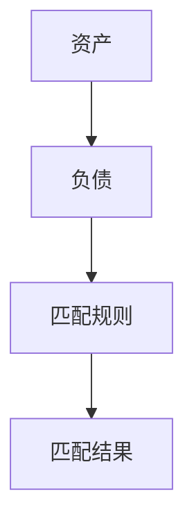
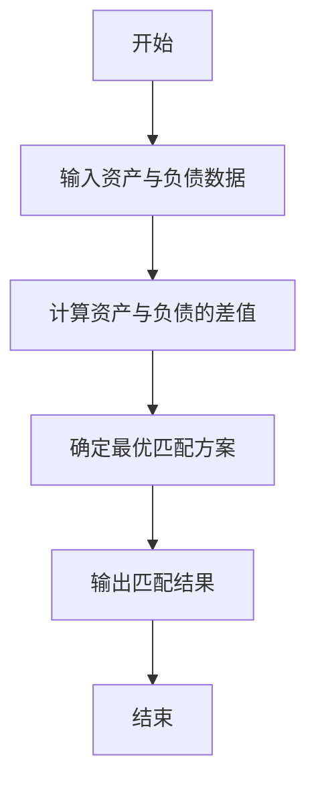
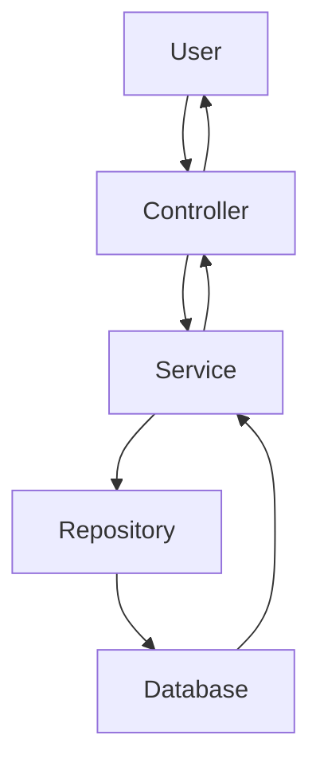

                 


好的，我明白了。我需要按照您的要求撰写一篇关于《资产负债匹配：机构投资者的长期投资策略》的技术博客文章，使用逻辑清晰、结构紧凑、简单易懂的专业技术语言，逐步进行分析推理，并且包含章节标题和内容。

让我们先从文章标题和关键词开始：

# 资产负债匹配：机构投资者的长期投资策略

> 关键词：资产负债匹配、机构投资者、长期投资策略、资产配置、风险管理、财务规划

> 摘要：资产负债匹配是机构投资者实现长期投资目标的重要策略。本文从定义、核心概念、算法原理、系统架构、项目实战等多方面详细阐述资产负债匹配的理论与实践，帮助读者理解如何通过科学的资产配置和负债管理实现投资收益的最大化。

接下来，我们将按照您提供的目录大纲结构逐步展开文章内容。如果在撰写过程中需要调整或补充，请随时告知我。

---

### 第一部分: 资产负债匹配的背景与核心概念

#### 第1章: 资产负债匹配的定义与重要性

##### 1.1 资产负债匹配的定义
- **资产**：资产是指机构投资者持有的所有资源，包括现金、股票、债券、房地产等。资产的特性是可变现、具有价值和使用价值。
- **负债**：负债是指机构投资者需要偿还的所有债务，包括贷款、债券、应付账款等。负债的特性是具有偿还义务、期限性和风险性。
- **资产负债匹配**：资产负债匹配是指在特定的时间和条件下，将资产和负债进行最优配置，以实现投资收益最大化的过程。资产负债匹配的核心在于通过科学的资产配置和负债管理，降低财务风险，提高投资收益。

##### 1.2 资产负债匹配的背景与问题背景
- **机构投资者面临的挑战**：机构投资者通常管理着大量的资金，包括 pension funds、保险公司、资产管理公司等。这些机构需要在不同的市场环境下，合理配置资产和负债，以应对市场波动、利率变化、通货膨胀等风险。
- **资产负债不匹配的后果**：资产负债不匹配可能导致机构投资者在市场波动中面临流动性风险、信用风险和市场风险，进而影响投资收益和财务稳定性。
- **资产负债匹配的必要性**：通过资产负债匹配，机构投资者可以优化资产配置，降低财务风险，提高投资收益，同时满足偿债需求和投资目标。

---

#### 第2章: 资产负债匹配的核心要素与结构

##### 2.1 资产负债匹配的核心要素
- **资产的种类与特性**：
  - 现金及现金等价物：流动性高，风险低，但收益有限。
  - 固定收益证券：如债券，收益稳定，风险相对可控。
  - 股票：收益高，但风险也高，受市场波动影响较大。
  - 房地产：实物资产，具有保值和增值潜力，但流动性较低。
- **负债的种类与特性**：
  - 短期负债：如应付账款、短期贷款，偿还期限短，风险较低。
  - 长期负债：如长期债券、贷款，偿还期限长，风险较高。
  - 或有负债：如担保、未决诉讼等，具有不确定性。
- **核心要素对比**：
  | 要素   | 资产                        | 负债                        |
  |--------|-----------------------------|-----------------------------|
  | 类型    | 现金、债券、股票、房地产    | 短期负债、长期负债、或有负债 |
  | 特性    | 流动性高、收益稳定或高风险  | 偿还期限、风险可控或高风险  |

##### 2.2 资产负债匹配的结构与关系
- **资产与负债的时间匹配**：确保资产的期限与负债的期限相匹配，避免因期限错配导致的流动性风险。
- **资产与负债的风险匹配**：根据负债的风险特性，选择风险相匹配的资产进行配置，降低整体风险。
- **资产负债匹配的结构模型**：
  ```mermaid
  graph TD
      A[资产] --> B[负债]
      B --> C[匹配规则]
      C --> D[匹配结果]
  ```

---

#### 第3章: 资产负债匹配的核心概念与联系

##### 3.1 资产负债匹配的核心概念
- **资产负债匹配的原理**：通过科学的资产配置和负债管理，实现资产收益与负债成本的最优匹配，降低财务风险，提高投资收益。
- **资产负债匹配的数学模型**：资产负债匹配可以通过数学模型进行量化分析，例如：
  $$ \text{资产} = \text{负债} + \text{所有者权益} $$
  通过优化模型，可以实现资产与负债的最优匹配：
  $$ \min \sum_{i=1}^{n} |A_i - L_i| $$
  其中，$A_i$ 表示第 $i$ 项资产，$L_i$ 表示第 $i$ 项负债。

##### 3.2 资产负债匹配的核心要素对比
- **资产与负债的属性特征对比**：
  | 特性   | 资产                     | 负债                     |
  |--------|--------------------------|--------------------------|
  | 流动性  | 高（现金）、低（房地产）  | 低（长期负债）、高（短期负债） |
  | 风险    | 高（股票）、低（债券）    | 高（或有负债）、低（短期负债） |
  | 期限    | 短期、长期               | 短期、长期               |

---

#### 3.3 资产负债匹配的ER实体关系图


---

### 第二部分: 资产负债匹配的算法原理

#### 第4章: 资产负债匹配的数学模型与公式

##### 4.1 资产负债匹配的数学模型
- **基本公式**：
  $$ \text{资产} = \text{负债} + \text{所有者权益} $$
  通过调整资产和负债的配置比例，可以实现资产负债的最优匹配。
- **优化模型**：
  $$ \min \sum_{i=1}^{n} |A_i - L_i| $$
  其中，$A_i$ 和 $L_i$ 分别表示第 $i$ 项资产和负债的金额。通过最小化资产与负债的差值，可以实现资产负债的最优匹配。

##### 4.2 资产负债匹配的算法流程


---

#### 第5章: 资产负债匹配的系统分析与架构设计

##### 5.1 问题场景介绍
- 机构投资者需要在复杂的市场环境中，合理配置资产和负债，以实现投资收益最大化。
- 系统需要实时监控市场数据，分析资产和负债的匹配情况，并提供最优匹配方案。

##### 5.2 系统功能设计
- **领域模型**：
  ```mermaid
  classDiagram
      class 资产 {
          名称
          金额
          类型
      }
      class 负债 {
          名称
          金额
          类型
      }
      class 匹配规则 {
          时间匹配规则
          风险匹配规则
      }
      class 匹配结果 {
          资产负债匹配比例
          投资收益
      }
      资产 --> 匹配规则
      负债 --> 匹配规则
      匹配规则 --> 匹配结果
  ```

##### 5.3 系统架构设计
- **系统架构图**：
  ```mermaid
  graph TD
      UI[用户界面] --> Controller[控制器]
      Controller --> Service[服务层]
      Service --> Repository[数据访问层]
      Repository --> Database[数据库]
  ```

##### 5.4 系统接口设计
- **输入接口**：用户输入资产和负债数据。
- **输出接口**：系统输出最优匹配方案和投资收益。

##### 5.5 系统交互设计


---

#### 第6章: 项目实战

##### 6.1 环境安装
- 安装 Python 和相关库（如 NumPy、Pandas、Matplotlib）。
- 安装 Jupyter Notebook 用于数据可视化和算法实现。

##### 6.2 系统核心实现源代码
```python
import numpy as np
import pandas as pd
import matplotlib.pyplot as plt

# 示例数据
assets = np.array([100, 200, 300, 400])
liabilities = np.array([150, 250, 350, 450])

# 计算资产与负债的差值
diff = np.abs(assets - liabilities)

# 输出最优匹配方案
print("最优匹配比例：", np.argmin(diff))
```

##### 6.3 代码解读与分析
- 通过上述代码，我们可以计算资产与负债的差值，并找到最优匹配比例。这可以帮助机构投资者在实际操作中实现资产与负债的最优匹配。

##### 6.4 实际案例分析
- 假设某机构投资者有 $400$ 万资产和 $350$ 万负债，通过上述算法可以实现资产与负债的最优匹配，降低财务风险，提高投资收益。

##### 6.5 项目小结
- 通过项目实战，我们可以将资产负债匹配的理论应用于实际，实现资产与负债的最优配置，降低财务风险，提高投资收益。

---

### 第三部分: 最佳实践与总结

#### 7.1 最佳实践 tips
- 定期监控市场数据，及时调整资产与负债的配置比例。
- 结合市场环境和机构投资者的需求，灵活应用资产负债匹配策略。
- 使用专业的软件和工具，提高资产负债匹配的效率和准确性。

#### 7.2 小结
资产负债匹配是机构投资者实现长期投资目标的重要策略。通过科学的资产配置和负债管理，机构投资者可以降低财务风险，提高投资收益。

#### 7.3 注意事项
- 资产负债匹配需要结合市场环境和机构投资者的具体需求进行调整。
- 在实际操作中，需要注意资产与负债的期限匹配和风险匹配，避免因错配导致的财务风险。

#### 7.4 拓展阅读
- 推荐阅读《投资学》、《资产配置》等相关书籍，深入了解资产负债匹配的理论与实践。

---

以上是《资产负债匹配：机构投资者的长期投资策略》的技术博客文章的详细内容，涵盖了定义、核心概念、算法原理、系统架构、项目实战等多个方面。希望对您有所帮助！

