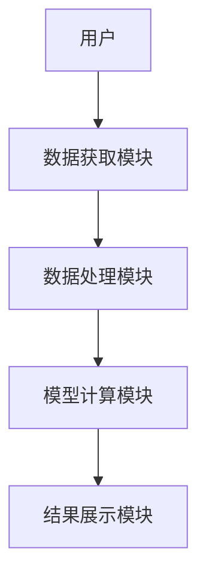

                 


# 资产配置模型：优化风险收益比的科学方法

## 关键词：资产配置模型，风险收益比，投资组合优化，现代投资组合理论，资本资产定价模型

## 摘要：  
资产配置模型是金融领域中优化风险与收益之间关系的重要工具。本文从资产配置模型的背景与概念入手，详细探讨了现代投资组合理论（MPT）和资本资产定价模型（CAPM）的核心原理与实际应用，分析了资产配置模型的数学基础与算法实现。通过系统架构设计与项目实战案例，展示了如何构建一个高效的资产配置系统，并通过具体的数据分析和代码实现，帮助读者深入理解如何优化风险收益比。文章最后总结了资产配置模型的最佳实践和未来发展方向。

---

# 第一部分: 资产配置模型的背景与概念

## 第1章: 资产配置模型概述

### 1.1 资产配置的基本概念
#### 1.1.1 资产配置的定义与核心要素  
资产配置是指根据投资目标、风险承受能力和市场环境，将资金分配到不同资产类别（如股票、债券、现金等）中的过程。其核心要素包括：  
1. **投资目标**：确定投资的最终目的（如财富增长、保值等）。  
2. **资产类别**：选择不同的资产类别以分散风险。  
3. **权重分配**：确定各类资产在投资组合中的比例。  
4. **时间跨度**：考虑投资的长期性与短期性。  

#### 1.1.2 资产配置的目标与意义  
资产配置的目标是通过科学的资产分配，实现风险与收益的最佳平衡。其意义在于：  
1. **分散风险**：通过多样化投资降低非系统性风险。  
2. **提高收益**：通过合理分配资产类别，捕捉不同市场的收益机会。  
3. **动态调整**：根据市场变化和个人目标的变化，及时优化资产配置。  

#### 1.1.3 资产配置的边界与外延  
资产配置的边界包括：  
1. **资金限制**：总投资金额和各类资产的最低投资额。  
2. **风险承受能力**：投资者对风险的容忍度。  
3. **市场环境**：宏观经济环境和市场周期的影响。  
资产配置的外延包括：  
1. **动态调整**：根据市场变化实时优化配置。  
2. **税收影响**：考虑不同资产的税务负担。  
3. **杠杆使用**：通过杠杆工具放大收益或风险。  

### 1.2 资产配置与风险收益比的关系
#### 1.2.1 风险与收益的基本概念  
风险是指投资收益的不确定性，通常用方差或标准差衡量。收益则是投资的最终目标，通常以预期收益率衡量。  

#### 1.2.2 资产配置对风险收益比的影响  
资产配置通过调整各类资产的比例，可以在一定程度上平衡风险与收益。例如：  
- **高风险资产**（如股票）可以带来高收益，但波动性大。  
- **低风险资产**（如债券）收益相对稳定，但增长潜力有限。  
通过合理分配，可以在降低整体风险的同时保持较高的收益水平。  

#### 1.2.3 优化风险收益比的必要性  
优化风险收益比是资产配置的核心目标。通过科学的资产配置，可以：  
1. **提高收益**：在相同风险水平下，获得更高的收益。  
2. **降低风险**：在相同收益水平下，承受更低的风险。  
3. **平滑波动**：通过多样化投资降低组合的波动性。  

### 1.3 资产配置模型的发展历程
#### 1.3.1 传统资产配置方法  
传统的资产配置方法主要包括：  
1. **恒定比例法**：根据经验或固定比例分配资产。  
2. **资产类别法**：基于市场研究选择特定资产类别。  

#### 1.3.2 现代资产配置模型的演变  
随着金融理论的发展，资产配置模型逐渐从经验驱动向科学化、量化方向发展。现代模型主要包括：  
1. **现代投资组合理论（MPT）**：基于数学模型优化投资组合。  
2. **资本资产定价模型（CAPM）**：通过市场风险定价优化资产配置。  
3. **多因子模型**：综合考虑多个因子（如市值、价值、动量等）进行资产配置。  

#### 1.3.3 当前主流资产配置模型的特点  
当前主流资产配置模型的特点包括：  
1. **数据驱动**：基于历史数据和市场规律进行分析。  
2. **动态调整**：根据市场变化和投资者需求实时优化。  
3. **多目标优化**：在收益、风险、流动性等多个目标之间寻找平衡。  

### 1.4 本章小结  
本章从资产配置的基本概念出发，探讨了资产配置与风险收益比的关系，并总结了资产配置模型的发展历程和当前特点。通过本章的学习，读者可以理解资产配置的核心目标和基本原理。

---

# 第二部分: 资产配置的核心理论

## 第2章: 现代投资组合理论（MPT）

### 2.1 MPT的核心原理
#### 2.1.1 投资组合理论的基本假设  
MPT假设：  
1. 投资者是理性的，追求收益最大化，厌恶风险。  
2. 市场是有效的，不存在套利机会。  
3. 资产收益服从单变量正态分布。  

#### 2.1.2 有效前沿的概念与意义  
**有效前沿**是指，在给定风险水平下，能够提供最高收益的投资组合所构成的曲线。其意义在于：  
1. 优化投资组合：通过有效前沿找到最优资产配置。  
2. 指导投资决策：帮助投资者在风险与收益之间找到最佳平衡点。  

#### 2.1.3 马科维茨均值-方差模型  
马科维茨均值-方差模型是MPT的核心模型，其目标是最小化投资组合的方差（即风险），在给定收益下，或者在给定风险下最大化收益。数学公式如下：  
$$ \min_w \frac{1}{2} w^T \Sigma w \quad \text{subject to} \quad w^T \mu = \mu_p \quad \text{和} \quad w^T \mathbf{1} = 1 $$  
其中，$w$ 是资产权重向量，$\Sigma$ 是协方差矩阵，$\mu$ 是资产收益均值向量，$\mu_p$ 是目标收益。  

### 2.2 MPT的数学模型与公式
#### 2.2.1 投资组合的期望收益公式  
$$ E(r_p) = \sum_{i=1}^n w_i E(r_i) $$  
其中，$w_i$ 是第 $i$ 个资产的权重，$E(r_i)$ 是第 $i$ 个资产的期望收益。  

#### 2.2.2 投资组合的方差公式  
$$ \sigma_p^2 = \sum_{i=1}^n \sum_{j=1}^n w_i w_j \sigma_{ij} $$  
其中，$\sigma_{ij}$ 是第 $i$ 个资产和第 $j$ 个资产的协方差。  

#### 2.2.3 投资组合的夏普比率  
夏普比率衡量投资组合的风险调整后收益：  
$$ \text{夏普比率} = \frac{E(r_p) - R_f}{\sigma_p} $$  
其中，$R_f$ 是无风险利率，$\sigma_p$ 是投资组合的标准差。  

### 2.3 MPT的实际应用与局限性
#### 2.3.1 MPT在资产配置中的应用  
MPT广泛应用于机构投资者的资产配置，尤其是在股票和债券之间的配置。  

#### 2.3.2 MPT的局限性与改进方向  
1. **假设限制**：MPT假设资产收益服从正态分布，但在现实中可能不成立。  
2. **计算复杂**：求解优化问题需要复杂的数学运算，对中小投资者来说门槛较高。  
3. **动态调整**：市场环境变化快，静态优化结果可能失效。  

---

## 第3章: 资本资产定价模型（CAPM）

### 3.1 CAPM的核心原理
#### 3.1.1 市场风险与非系统性风险  
**市场风险**：影响整个市场的风险（如经济衰退）。  
**非系统性风险**：特定资产或行业的风险（如公司违约）。  

#### 3.1.2 CAPM的基本假设  
CAPM假设：  
1. 资产可以无摩擦地买卖。  
2. 短期国库券是无风险资产。  
3. 投资者是理性的，追求收益最大化，厌恶风险。  

#### 3.1.3 CAPM的公式与应用  
CAPM公式：  
$$ E(r_i) = R_f + \beta_i (E(r_m) - R_f) $$  
其中，$R_f$ 是无风险利率，$\beta_i$ 是第 $i$ 个资产的贝塔系数，$E(r_m)$ 是市场预期收益。  

### 3.2 CAPM的扩展与改进
#### 3.2.1 多因子模型的提出  
多因子模型（如Fama-French三因子模型）通过引入更多因子（如市值、价值、动量等）来解释资产收益。  

#### 3.2.2 Fama-French三因子模型  
Fama-French模型扩展了CAPM，加入大小盘因子和价值因子：  
$$ E(r_i) = R_f + \beta_i (E(r_m) - R_f) + \beta_{\text{小盘}} \times \text{小盘因子} + \beta_{\text{价值}} \times \text{价值因子} $$  

#### 3.2.3 CAPM的局限性与改进方向  
1. **因子局限性**：CAPM仅考虑市场风险，忽视其他重要因子。  
2. **数据依赖**：模型结果依赖于历史数据的准确性。  
3. **实际应用中的调整**：在实际投资中，CAPM常用于资产定价和组合优化。  

---

## 第4章: 资产配置模型的系统架构设计

### 4.1 系统功能设计
#### 4.1.1 数据获取与处理  
包括市场数据（如价格、收益、风险指标）和宏观经济数据的获取与清洗。  

#### 4.1.2 模型实现  
实现均值-方差模型、CAPM等资产配置模型，并进行参数优化。  

#### 4.1.3 优化策略与风险控制  
基于模型结果，制定动态调整策略，并通过风险对冲等手段控制整体风险。  

### 4.2 系统架构设计
#### 4.2.1 数据流与模块划分  
数据流包括：  
1. 数据获取模块：从数据库或API获取市场数据。  
2. 数据处理模块：清洗、转换和存储数据。  
3. 模型计算模块：实现资产配置算法。  
4. 结果展示模块：可视化投资组合的收益与风险。  

#### 4.2.2 系统架构图  


### 4.3 项目实战: 资产配置系统实现

#### 4.3.1 环境安装与配置
- 安装Python、Pandas、NumPy、Plotly等库。  

#### 4.3.2 核心代码实现
```python
import numpy as np
import pandas as pd

# 示例数据
assets = ['股票', '债券', '现金']
returns = pd.DataFrame({
    '股票': [0.1, 0.05, 0.08],
    '债券': [0.03, 0.04, 0.02],
    '现金': [0, 0, 0]
})

# 均值-方差优化
mu = returns.mean()
cov = returns.cov()
weights = np.array([1/3, 1/3, 1/3])
portfolio_return = mu.dot(weights)
portfolio_variance = weights.dot(cov).dot(weights)
```

#### 4.3.3 代码解读与分析  
- **数据获取与处理**：从数据库或API获取市场数据，并清洗异常值。  
- **模型计算**：基于均值-方差模型计算最优资产配置权重。  
- **结果展示**：可视化投资组合的收益与风险。  

#### 4.3.4 案例分析与结果解读  
以股票、债券和现金为例，计算投资组合的夏普比率和最大回撤，评估配置效果。  

---

## 第5章: 总结与展望

### 5.1 本章总结  
本文从资产配置模型的背景与概念出发，详细探讨了现代投资组合理论（MPT）和资本资产定价模型（CAPM）的核心原理与实际应用，分析了资产配置模型的数学基础与算法实现。通过系统架构设计与项目实战案例，展示了如何构建一个高效的资产配置系统，并通过具体的数据分析和代码实现，帮助读者深入理解如何优化风险收益比。  

### 5.2 未来展望  
随着人工智能和大数据技术的发展，资产配置模型将更加智能化和个性化。未来的研究方向包括：  
1. **AI驱动的资产配置**：利用机器学习算法优化资产配置策略。  
2. **动态调整模型**：基于实时数据和市场变化动态优化配置。  
3. **多目标优化**：在收益、风险、流动性等多个目标之间寻找更优平衡。  

---

通过本文的学习，读者可以全面理解资产配置模型的科学方法，并在实际投资中应用这些理论与技术，实现风险与收益的最佳平衡。

