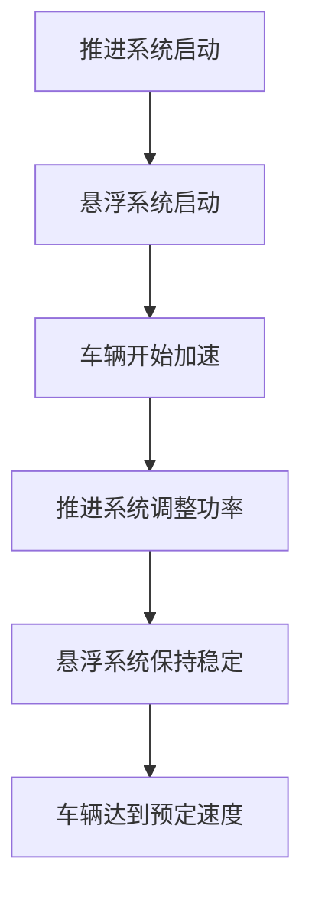

                 


# 超级高铁技术的发展与交通运输业投资机会

## 关键词：超级高铁, 交通运输, 投资机会, 技术发展, 交通效率

## 摘要：超级高铁作为一种革命性的交通技术，正在改变传统的交通运输方式。本文将探讨超级高铁的技术发展、核心系统与关键部件、对交通运输业的影响，以及其带来的投资机会。通过分析全球超级高铁的发展现状，结合实际案例和系统架构设计，本文为投资者和技术爱好者提供了深入的技术见解和市场分析。

---

## 第1章: 超级高铁技术的背景与发展趋势

### 1.1 超级高铁的起源与发展

#### 1.1.1 超级高铁的定义与核心概念

超级高铁（Hyperloop）是一种新兴的高速交通系统，由埃隆·马斯克（Elon Musk）于2013年首次提出。其核心理念是通过在几乎真空的管道中运行 pods（悬浮舱），以接近音速的速度进行点对点运输。超级高铁的设计目标是将旅行时间缩短到传统高铁和飞机无法企及的水平。

超级高铁的核心概念包括：
- **真空管道**：通过抽气技术将管道内的气压降至接近真空，减少空气阻力，提高运行速度。
- **悬浮技术**：利用磁悬浮或气悬浮原理，使 pods 与轨道分离，降低摩擦损耗。
- **电磁推进**：通过电磁力驱动 pods 运动，实现高速加速和减速。

#### 1.1.2 超级高铁的技术优势

超级高铁相比传统交通方式具有显著的优势：
- **高速性**：设计时速可达 1200 公里/小时，远超高铁和飞机的速度。
- **安全性**：真空管道设计减少了外部天气因素的影响，运行更加稳定。
- **环保性**：采用可再生能源供电，减少碳排放，符合绿色交通的发展趋势。
- **经济性**：相比传统交通方式，超级高铁的建设和运营成本较低，长期经济效益显著。

#### 1.1.3 超级高铁与传统交通方式的对比

| 对比维度 | 高铁 | 飞机 | 超级高铁 |
|----------|------|------|-----------|
| 速度     | 300公里/小时 | 900公里/小时（巡航速度） | 1200公里/小时 |
| 建设成本 | 高    | 极高  | 中等       |
| 运营成本 | 中等  | 高    | 低         |
| 环保性   | 中等  | 较低  | 高         |

通过对比可以看出，超级高铁在速度和经济性方面具有显著优势，尤其适合中短途高频次的旅客和货物运输。

### 1.2 超级高铁技术的全球发展现状

#### 1.2.1 美国Hyperloop One的技术进展

Hyperloop One是全球领先的超级高铁研发公司之一，其技术核心包括：
- **真空管道**：采用创新的管道设计和抽气技术，确保接近真空的环境。
- **悬浮技术**：利用电磁悬浮（EMS）技术，使 pods 浮在轨道上。
- **推进系统**：通过线性电机提供动力，实现高速加速和减速。

Hyperloop One已经在迪拜和美国进行试验，展示了其技术可行性。

#### 1.2.2 中国超级高铁技术的发展

中国在超级高铁技术上也取得了显著进展，主要体现在：
- **真空管道制造**：中国在高铁建设方面具有丰富的经验，真空管道的技术也在逐步突破。
- **悬浮技术研究**：中国科研机构在磁悬浮技术上投入了大量资源，取得了一定成果。
- **商业化探索**：中国已经开始规划超级高铁线路，计划在未来实现商业化运营。

#### 1.2.3 欧洲超级高铁技术的探索

欧洲国家如德国、法国等也在积极探索超级高铁技术，主要关注：
- **技术创新**：欧洲在材料科学和工程设计方面具有优势，致力于开发更高效的超级高铁系统。
- **国际合作**：通过欧盟框架下的合作项目，推动超级高铁技术的发展。
- **市场应用**：欧洲计划将超级高铁技术应用于城市间快速交通，减少碳排放。

### 1.3 超级高铁技术的未来发展趋势

#### 1.3.1 技术创新方向

- **真空管道优化**：进一步降低管道内的气压，提高运行速度。
- **悬浮技术升级**：探索更高效的悬浮方式，如新型磁悬浮技术。
- **能源供应改进**：采用更清洁的能源，如太阳能和风能，减少对环境的影响。

#### 1.3.2 市场需求预测

根据市场研究机构的预测，到2030年，全球超级高铁市场规模将达到数千亿美元。主要需求集中在发达国家和地区，如美国、欧洲和亚洲。

#### 1.3.3 行业竞争格局分析

目前，超级高铁领域的竞争主要集中在几个领先企业之间，如Hyperloop One、中国高铁企业和欧洲的科研机构。未来，随着技术的成熟和市场的扩大，竞争将更加激烈，技术创新和成本控制将成为关键。

---

## 第2章: 超级高铁技术的核心系统与关键部件

### 2.1 真空管道系统

#### 2.1.1 真空管道的设计原理

真空管道是超级高铁的核心基础设施，其设计需要考虑以下几个方面：
- **管道形状**：通常采用圆形或椭圆形截面，以减少气流阻力。
- **管道材料**：选择高强度、轻质材料，如碳纤维复合材料。
- **真空泵**：用于维持管道内的低气压环境，通常采用多级泵和分布式抽气系统。

#### 2.1.2 管道材料与制造工艺

真空管道的材料选择至关重要，以下是几种常见的材料及其特点：

| 材料类型 | 特性 | 适用场景 |
|----------|------|----------|
| 碳纤维复合材料 | 轻质、高强度、耐腐蚀 | 适用于高速超级高铁 |
| 钢材     | 成本低、强度高 | 适用于中低速超级高铁 |
| 铝合金   | 耐腐蚀、易于加工 | 适用于轻轨超级高铁 |

#### 2.1.3 管道维护与安全性分析

真空管道需要定期维护，确保其气密性和结构安全。维护工作包括：
- **管道检查**：定期检查管道是否有裂缝或腐蚀。
- **真空泵维护**：确保真空泵正常运行，维持管道内的低气压环境。
- **应急系统**：在管道出现故障时，启动应急系统，确保乘客安全。

### 2.2 车辆悬浮与推进系统

#### 2.2.1 悬浮技术的实现原理

悬浮技术是超级高铁的核心技术之一，主要有两种实现方式：
- **磁悬浮（EMS）**：利用电磁力使车辆悬浮在轨道上，通过线性电机提供动力。
- **气悬浮（ pneumatic suspension）**：通过压缩空气产生悬浮力，适用于低速场景。

#### 2.2.2 电磁推进系统的构造与功能

电磁推进系统是超级高铁的动力来源，其构造主要包括：
- **线性电机**：通过电磁感应产生推动力，驱动车辆运动。
- **控制系统**：实时调整电机的功率，确保车辆按预定路线行驶。

#### 2.2.3 悬浮与推进系统的协同工作

悬浮系统和推进系统需要协同工作，确保车辆在高速运行时的稳定性和安全性。以下是它们的协同工作流程：



### 2.3 能源供应与控制系统

#### 2.3.1 能源供应的优化设计

超级高铁的能源供应系统需要高效可靠，通常采用以下方式：
- **分布式能源供应**：在管道沿线布置多个能源站，减少能源传输损耗。
- **可再生能源**：利用太阳能、风能等可再生能源为系统供电，降低能源成本和环境影响。

#### 2.3.2 控制系统的架构与功能

超级高铁的控制系统需要实现对整个系统的实时监控和管理，主要包括：
- **中央控制室**：负责协调各个子系统的运行，确保系统的正常运转。
- **传感器网络**：实时监测车辆、管道和能源系统的运行状态。
- **数据处理系统**：对传感器数据进行分析，做出相应的控制决策。

#### 2.3.3 能耗分析与节能措施

超级高铁的能耗主要集中在推进系统和能源供应系统。为了降低能耗，可以采取以下措施：
- **优化推进系统效率**：通过技术创新提高推进系统的能量转换效率。
- **能量回收系统**：在车辆制动时回收能量，用于其他系统的供电。

---

## 第3章: 超级高铁技术对交通运输业的影响

### 3.1 交通运输业的现状分析

#### 3.1.1 当前交通运输的主要模式

当前，全球交通运输主要以公路、铁路、航空和水运为主。随着城市化进程的加快，交通拥堵和污染问题日益严重，传统的交通方式已经无法满足人们的需求。

#### 3.1.2 传统交通方式的优缺点

| 交通方式 | 优点 | 缺点 |
|----------|------|------|
| 公路     | 灵活性高 | 易拥堵、能耗高 |
| 铁路     | 速度快、安全性高 | 建设成本高 |
| 航空     | 速度快、覆盖范围广 | 噪音大、能耗高 |
| 水运     | 成本低 | 速度慢 |

#### 3.1.3 交通运输业的未来发展方向

未来的交通运输业将更加注重绿色化、智能化和高效化。超级高铁作为新兴的交通方式，将在其中发挥重要作用。

### 3.2 超级高铁技术对交通效率的提升

#### 3.2.1 超级高铁的高速运行能力

超级高铁的设计时速为 1200 公里/小时，比传统高铁和飞机更快。例如，从北京到上海的高铁需要约 4.5 小时，而超级高铁只需要 1 小时。

#### 3.2.2 旅客运输效率的提升

超级高铁的高速运行能力将显著提高旅客运输效率。例如，对于短途旅行，超级高铁将比飞机更具优势。

#### 3.2.3 货物运输的高效解决方案

超级高铁不仅可以用于旅客运输，还可以用于货物运输。其高速运行能力将显著缩短货物运输时间，提高物流效率。

### 3.3 超级高铁技术对投资机会的影响

#### 3.3.1 超级高铁产业链的投资价值

超级高铁的产业链包括设计、制造、建设和运营等多个环节，每个环节都存在投资机会。以下是几个关键领域：
- **真空管道制造**：需要大量高性能材料和精密制造技术。
- **悬浮系统研发**：需要投入大量资源用于技术研发。
- **能源供应系统**：需要建设和运营分布式能源供应网络。

#### 3.3.2 超级高铁技术的商业化前景

随着技术的成熟和市场的扩大，超级高铁的商业化前景广阔。预计到2030年，全球超级高铁市场规模将达到数千亿美元。

#### 3.3.3 投资风险与回报分析

尽管超级高铁技术具有巨大的市场潜力，但投资也存在一定的风险。以下是主要风险和回报分析：

| 风险因素 | 影响 | 应对措施 |
|----------|------|----------|
| 技术风险 | 技术不成熟可能导致项目失败 | 加大研发投入，确保技术可行性 |
| 市场风险 | 市场需求不足 | 加强市场调研，确保项目符合市场需求 |
| 财务风险 | 投资成本高 | 优化项目管理，降低运营成本 |

---

## 第4章: 超级高铁技术的系统架构与设计

### 4.1 超级高铁系统的整体架构

超级高铁系统的整体架构包括以下几个部分：
- **真空管道**：提供接近真空的运行环境。
- **悬浮系统**：使车辆悬浮在轨道上。
- **推进系统**：提供车辆的动力。
- **能源供应系统**：为整个系统提供能源。
- **控制系统**：实现对整个系统的实时监控和管理。

### 4.2 超级高铁系统的通信与控制

#### 4.2.1 通信网络的设计与实现

超级高铁的通信系统需要实现车辆与控制中心之间的实时通信，通常采用光纤通信和无线通信相结合的方式。

#### 4.2.2 控制系统的功能与实现

控制系统是超级高铁的核心，负责协调各个子系统的运行。以下是其主要功能：
- **实时监控**：监测车辆、管道和能源系统的运行状态。
- **自动控制**：根据实时数据调整系统的运行参数。
- **应急处理**：在出现故障时启动应急系统，确保乘客安全。

### 4.3 超级高铁系统的安全与可靠性

#### 4.3.1 系统安全性设计

超级高铁的安全性设计包括以下几个方面：
- **冗余设计**：在关键系统中采用冗余设计，确保系统的可靠性。
- **应急系统**：在出现故障时启动应急系统，确保乘客安全。
- **安全监测**：实时监测系统运行状态，及时发现并处理潜在问题。

#### 4.3.2 系统可靠性分析

超级高铁系统的可靠性分析包括以下几个方面：
- **故障率分析**：通过统计学方法分析系统的故障率。
- **可靠性测试**：通过实验和模拟测试验证系统的可靠性。
- **维护计划**：制定合理的维护计划，确保系统的长期可靠性。

---

## 第5章: 超级高铁技术的项目实战

### 5.1 环境安装与系统核心实现

超级高铁项目的环境安装需要考虑以下几个方面：
- **地理位置**：选择地形平坦、气候条件适合的地区。
- **基础设施**：建设真空管道、车站和控制中心等基础设施。
- **能源供应**：确保能源供应系统的稳定性和可靠性。

### 5.2 核心代码实现与应用解读

以下是超级高铁系统的部分核心代码实现：

```python
# 真空管道的抽气系统控制代码
class VacuumPump:
    def __init__(self, power, efficiency):
        self.power = power
        self.efficiency = efficiency

    def operate(self, duration):
        return self.power * duration * self.efficiency

# 悬浮系统的电磁控制代码
class EMSControl:
    def __init__(self, magnetic_field, current):
        self.magnetic_field = magnetic_field
        self.current = current

    def generate_force(self):
        return self.magnetic_field * self.current

# 推进系统的线性电机控制代码
class LinearMotor:
    def __init__(self, voltage, current):
        self.voltage = voltage
        self.current = current

    def produce_thrust(self):
        return self.voltage * self.current
```

### 5.3 项目小结

通过实际项目的实施，我们可以看到超级高铁技术的复杂性和挑战性。然而，其巨大的市场潜力和技术创新也为投资者和技术人员提供了广阔的发展空间。

---

## 第6章: 超级高铁技术的最佳实践与投资建议

### 6.1 最佳实践 tips

- **技术方面**：加大研发投入，确保技术的可行性和先进性。
- **市场方面**：深入了解市场需求，制定合理的市场策略。
- **管理方面**：优化项目管理，降低运营成本。

### 6.2 小结

超级高铁技术作为一种革命性的交通方式，正在逐步改变传统的交通运输模式。其高速性、安全性和环保性使其成为未来交通发展的主要方向之一。

### 6.3 注意事项

- **技术风险**：超级高铁技术尚未完全成熟，存在一定的技术风险。
- **市场风险**：市场需求可能不如预期，需要做好市场调研和风险评估。
- **政策风险**：需要关注相关政策的变化，确保项目符合法规要求。

### 6.4 拓展阅读

- **相关书籍**：《Hyperloop: A Fast Track to the Future》
- **技术论文**：《The Design and Implementation of Superconducting Magnetic Levitation for Hyperloop》
- **行业报告**：《Global Hyperloop Market Analysis and Forecast 2023-2030》

---

## 第7章: 总结与展望

超级高铁技术作为一项革命性的交通技术，正在逐步改变传统的交通运输方式。通过本文的分析，我们可以看到超级高铁技术的发展前景广阔，其在提高交通效率、降低能源消耗和减少环境污染方面具有显著优势。然而，超级高铁技术的商业化仍面临诸多挑战，需要政府、企业和科研机构的共同努力。

未来，随着技术的进一步发展和市场的逐步成熟，超级高铁技术将在全球范围内得到更广泛的应用，为交通运输业带来更大的变革和机遇。

---

以上是《超级高铁技术的发展与交通运输业投资机会》的完整目录大纲和文章内容，希望对您有所帮助！

