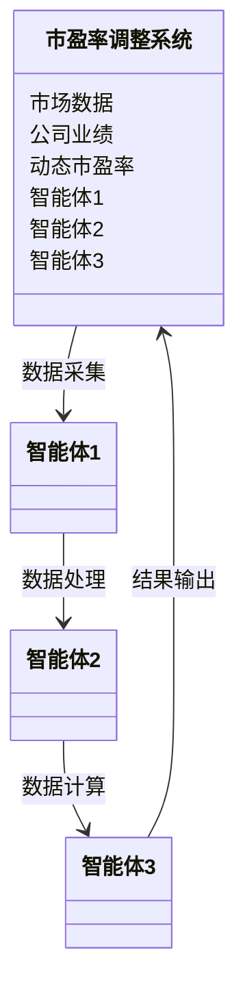
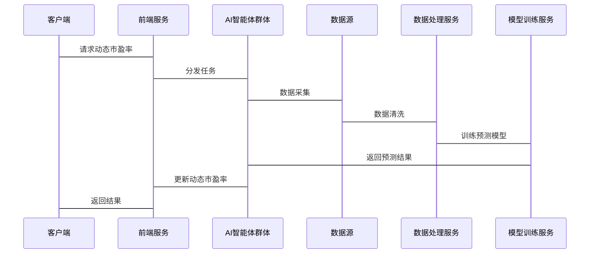

                 


# 运用AI智能体群体实现动态市盈率调整

## 关键词：动态市盈率、AI智能体、群体智能、金融数据分析、算法优化

## 摘要：本文详细探讨了如何运用AI智能体群体实现动态市盈率调整。通过分析市盈率的传统计算方法及其局限性，提出了一种基于AI智能体群体的动态调整方案，阐述了其核心原理、算法实现、系统架构及实际应用案例，为金融领域的动态市盈率计算提供了新的思路和解决方案。

---

# 第一部分: 动态市盈率调整的背景与概念

## 第1章: 动态市盈率调整的背景与问题描述

### 1.1 市盈率的基本概念

#### 1.1.1 市盈率的定义与计算公式
$$市盈率 = \frac{股价}{每股收益}$$

市盈率是衡量企业股票价值的重要指标，传统市盈率计算方法基于历史数据，无法实时反映市场动态变化。

#### 1.1.2 市盈率在投资中的作用
市盈率用于评估股票的估值合理性，帮助投资者判断股票是否被高估或低估。

#### 1.1.3 动态市盈率的必要性
传统市盈率计算方法存在滞后性，无法适应市场波动和公司业绩变化，动态市盈率能够实时调整，提供更准确的估值。

### 1.2 AI智能体群体的概念与特点

#### 1.2.1 智能体的基本定义
智能体（Agent）是一种能够感知环境、自主决策并执行任务的实体，具有主动性、反应性和社会性。

#### 1.2.2 智能体群体的特征
- **分布式计算**：智能体群体通过分布式计算实现任务的协同完成。
- **自适应能力**：智能体能够根据环境变化调整行为。
- **并行处理**：智能体群体能够同时处理多个任务。

#### 1.2.3 AI智能体在金融领域的应用潜力
AI智能体可以在金融数据采集、分析和决策中发挥重要作用，尤其适合高频交易和实时数据分析。

### 1.3 问题背景与目标

#### 1.3.1 传统市盈率计算的局限性
传统市盈率计算方法基于固定时间段的历史数据，无法实时反映市场变化。

#### 1.3.2 动态市盈率调整的需求
动态市盈率调整能够实时反映市场波动和公司业绩变化，为投资者提供更准确的估值参考。

#### 1.3.3 AI智能体群体在动态市盈率调整中的作用
AI智能体群体可以通过实时数据采集、分析和协同计算，实现动态市盈率的快速调整。

## 1.4 本章小结

---

# 第二部分: AI智能体群体实现动态市盈率调整的核心概念

## 第2章: AI智能体群体的原理与机制

### 2.1 智能体的核心原理

#### 2.1.1 智能体的基本组成
智能体由感知模块、决策模块和执行模块组成，能够感知环境、做出决策并执行任务。

#### 2.1.2 智能体的行为机制
智能体通过感知环境信息，基于预设规则或机器学习模型做出决策，并通过执行模块实现目标。

#### 2.1.3 智能体的协作方式
智能体群体通过分布式协作完成复杂任务，每个智能体负责特定子任务，通过通信模块实现协同。

### 2.2 智能体群体的属性特征

#### 2.2.1 分布式计算能力
智能体群体通过分布式计算实现任务的并行处理，提高计算效率。

#### 2.2.2 自适应能力
智能体能够根据环境变化调整行为，适应市场波动和数据变化。

#### 2.2.3 并行处理能力
智能体群体能够同时处理多个任务，提高计算效率。

### 2.3 智能体与动态市盈率调整的关联

#### 2.3.1 智能体在数据采集中的应用
智能体通过分布式数据采集，实时获取市场数据和公司业绩信息。

#### 2.3.2 智能体在数据处理中的应用
智能体通过协同计算，对数据进行清洗、特征提取和模型训练，实现动态市盈率的计算。

#### 2.3.3 智能体在结果输出中的应用
智能体通过通信模块将计算结果传递给用户或系统，实现动态市盈率的实时更新。

### 2.4 本章小结

---

# 第三部分: AI智能体群体实现动态市盈率调整的算法原理

## 第3章: 动态市盈率调整的算法模型

### 3.1 动态市盈率调整的数学模型

#### 3.1.1 基于时间序列的市盈率调整模型
$$调整后的市盈率 = \frac{原始市盈率 \times 调整因子}{1}$$

调整因子基于市场波动率和公司业绩变化计算。

#### 3.1.2 基于机器学习的市盈率预测模型
使用机器学习算法，如LSTM，预测未来市盈率变化趋势。

#### 3.1.3 市盈率调整的优化算法
通过遗传算法或模拟退火算法优化市盈率调整模型，提高计算精度。

### 3.2 AI智能体群体的算法实现

#### 3.2.1 分布式计算算法
智能体通过分布式计算，将任务分解为多个子任务并行处理。

#### 3.2.2 自适应调整算法
智能体根据环境变化动态调整计算参数，提高计算效率。

#### 3.2.3 并行处理算法
智能体通过并行计算，快速完成大规模数据处理任务。

### 3.3 算法的数学公式与实现

#### 3.3.1 市盈率调整的数学公式
$$调整后的市盈率 = \frac{原始市盈率 \times (1 + 调整系数)}{1}$$

调整系数基于市场波动率和公司业绩变化计算。

#### 3.3.2 调整因子的计算公式
$$调整因子 = \frac{市场波动率 + 公司业绩}{2}$$

### 3.4 本章小结

---

# 第四部分: 系统分析与架构设计方案

## 第4章: 系统功能设计

### 4.1 问题场景介绍

#### 4.1.1 动态市盈率调整的业务场景
动态市盈率调整系统需要实时采集市场数据和公司业绩信息，计算并更新市盈率。

#### 4.1.2 AI智能体群体的应用场景
AI智能体群体通过分布式计算和协同处理，实现动态市盈率调整的实时计算。

#### 4.1.3 系统的目标与范围
系统的目标是实现动态市盈率的实时计算和调整，范围包括数据采集、计算和结果输出。

### 4.2 领域模型设计

#### 4.2.1 领域模型的Mermaid类图


---

## 第5章: 系统架构设计

### 5.1 系统架构的Mermaid架构图


---

## 第6章: 接口设计与系统交互

### 6.1 系统接口设计
- **数据采集接口**：智能体通过API接口采集市场数据和公司业绩信息。
- **数据处理接口**：智能体通过API接口进行数据清洗和特征提取。
- **结果输出接口**：智能体通过API接口将计算结果返回给系统。

### 6.2 系统交互的Mermaid序列图


---

# 第五部分: 项目实战

## 第7章: 项目实现与案例分析

### 7.1 环境安装与配置

#### 7.1.1 安装Python环境
安装Python 3.8及以上版本，并安装必要的库，如`numpy`、`pandas`、`scikit-learn`、`keras`等。

#### 7.1.2 安装AI框架
安装TensorFlow或Keras框架，用于模型训练和预测。

#### 7.1.3 安装分布式计算框架
安装Dask或Apache Spark框架，用于智能体群体的分布式计算。

### 7.2 系统核心功能实现

#### 7.2.1 数据采集模块
```python
import requests

def get_market_data():
    response = requests.get('https://api.marketdata.com/stock')
    return response.json()
```

#### 7.2.2 数据处理模块
```python
import pandas as pd

def process_data(data):
    df = pd.DataFrame(data)
    df['调整因子'] = (df['市场波动率'] + df['公司业绩']) / 2
    return df
```

#### 7.2.3 动态市盈率计算模块
```python
def calculate_dynamic_pe(data):
    pe_ratio = data['股价'] / data['每股收益']
    adjusted_pe = pe_ratio * (1 + data['调整因子'])
    return adjusted_pe
```

### 7.3 案例分析与结果展示

#### 7.3.1 数据采集与处理
假设我们从API获取了市场数据和公司业绩信息，通过数据处理模块计算调整因子。

#### 7.3.2 动态市盈率计算
基于调整因子和原始市盈率计算动态市盈率，结果展示在图表中。

### 7.4 本章小结

---

# 第六部分: 最佳实践与总结

## 第8章: 最佳实践与总结

### 8.1 本章小结
总结全文，回顾动态市盈率调整的背景、AI智能体群体的核心原理、算法实现、系统架构设计和项目实战。

### 8.2 注意事项
- 数据采集的准确性
- 模型的实时性与稳定性
- 系统的安全性和可扩展性

### 8.3 拓展阅读
- 推荐相关书籍和论文，进一步深入学习AI智能体群体和动态市盈率调整的知识。

---

# 结语

通过本文的详细讲解，读者可以了解到如何运用AI智能体群体实现动态市盈率调整，掌握其核心原理和实际应用方法。希望本文能够为金融领域的动态市盈率计算提供新的思路和解决方案。

