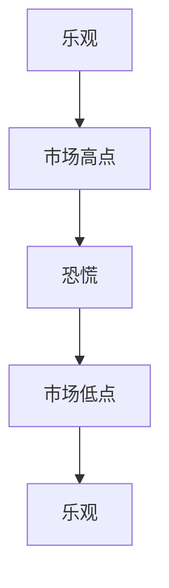

                 

# 逆向投资思维：为什么要与市场趋势相反操作

## 关键词
- 逆向投资
- 市场趋势
- 投资策略
- 独立思考
- 风险管理

## 摘要
逆向投资是一种在市场低谷时买入、在市场高峰时卖出的投资策略，与市场趋势相反。本文详细分析逆向投资的背景、核心概念、策略、风险管理及长期策略，帮助读者掌握逆向投资思维。

---

# 第1章: 逆向投资思维概述

## 1.1 逆向投资思维的基本概念
### 1.1.1 逆向投资的定义
逆向投资是指在市场低迷时买入资产，在市场繁荣时卖出资产，与市场趋势相反。其核心在于识别市场情绪与实际价值的偏差。

**背景介绍：**
- **核心概念术语说明**：逆向投资是基于价值投资理念，寻找市场低估的机会。
- **问题背景**：市场参与者往往受情绪驱动，导致资产价格偏离其实际价值。
- **问题描述**：投资者在市场高点时买入，在低点时卖出，容易亏损。
- **问题解决**：逆向思维帮助投资者在市场低谷时发现价值，高点时退出。
- **边界与外延**：逆向投资适用于长期价值投资，不适用于短期高频交易。
- **概念结构与核心要素**：逆向投资基于市场情绪周期、资产价值评估和独立思考。

### 1.1.2 市场趋势与逆向思维的关系
市场趋势通常受情绪影响，逆向思维帮助投资者在趋势中获利。

### 1.1.3 逆向投资的优缺点
- **优点**：捕捉低估机会，获得超额收益。
- **缺点**：需要承担短期市场波动风险。

**图表：市场情绪周期图**

---

## 1.2 逆向思维的必要性
### 1.2.1 市场情绪的波动性
市场情绪周期性波动，导致资产价格与价值背离。

### 1.2.2 人性的弱点与市场趋势的关系
人性中的贪婪和恐惧影响市场，逆向思维需要克服这些弱点。

### 1.2.3 逆向思维在投资中的优势
- 独立思考，避免随波逐流。
- 捕捉市场错误定价的机会。

---

## 1.3 逆向思维的核心要素
### 1.3.1 独立思考的重要性
独立思考是逆向投资的前提。

### 1.3.2 市场情绪周期
分析市场从乐观到恐慌再到乐观的周期，寻找投资机会。

---

# 第2章: 逆向思维的原理与策略

## 2.1 逆向思维的原理
### 2.1.1 人性的弱点
市场参与者受情绪影响，导致价格波动。

### 2.1.2 市场情绪周期
从乐观到恐慌再到乐观，周期性波动。

### 2.1.3 逆向思维与价值投资的关系
逆向投资基于价值评估，寻找低估资产。

---

## 2.2 逆向投资的具体策略
### 2.2.1 在市场低谷时寻找机会
识别被低估的资产，长期持有。

### 2.2.2 在市场高峰时果断离场
避免高位被套，及时卖出。

### 2.2.3 逆向资产配置
在市场低点增加仓位，在高点减少仓位。

### 2.2.4 利用市场恐慌
恐慌时买入优质资产。

---

## 2.3 逆向投资的数学模型
### 2.3.1 市场波动率分析
使用标准差衡量资产价格波动。

### 2.3.2 资产价值评估
基于基本面分析，计算内在价值。

---

# 第3章: 逆向投资的实战案例

## 3.1 历史案例分析
### 3.1.1 2008年金融危机
逆向投资优质资产，获得超额收益。

### 3.1.2 2020年疫情市场
恐慌时买入，后期反弹获利。

## 3.2 案例分析与总结
总结案例中的策略应用，分析成功与失败的原因。

---

# 第4章: 逆向投资中的风险管理

## 4.1 风险管理的重要性
### 4.1.1 分散投资
降低单一资产风险。

### 4.1.2 设置止损点
控制亏损幅度。

### 4.1.3 心理风险管理
避免情绪化决策。

---

# 第5章: 逆向思维的长期策略

## 5.1 长期趋势分析
### 5.1.1 经济周期分析
分析经济周期，判断长期趋势。

### 5.1.2 行业分析
选择具备长期增长潜力的行业。

## 5.2 投资心态的培养
### 5.2.1 耐心与纪律
坚持逆向策略，避免短期波动干扰。

### 5.2.2 定期审视与调整
根据市场变化，及时调整投资组合。

---

# 第6章: 总结与展望

## 6.1 逆向思维的重要性
逆向思维是投资者获取超额收益的关键。

## 6.2 投资者心理的反思
克服贪婪与恐惧，坚持独立思考。

## 6.3 未来投资趋势
长期关注价值投资，结合逆向思维。

---

通过以上目录，文章将详细阐述逆向投资的各个方面，帮助读者掌握逆向投资思维，提升投资决策能力。

