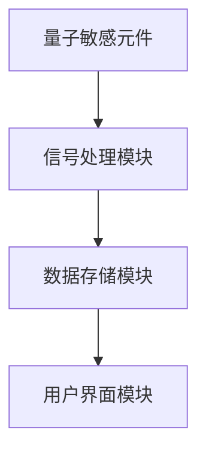
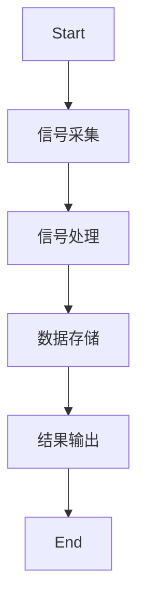

                 


```markdown
# 量子传感器技术的发展与精密仪器投资

## 关键词
量子传感器、精密仪器、量子技术、投资分析、技术发展

## 摘要
量子传感器作为一项前沿技术，正在逐步改变精密仪器的领域。本文将深入探讨量子传感器的基本原理、技术优势、数学模型以及其在精密仪器中的应用。同时，本文还将分析量子传感器技术的投资价值，为投资者提供参考。

## 目录
1. [量子传感器技术概述](#量子传感器技术概述)
   1.1 [量子传感器的基本概念](#量子传感器的基本概念)
   1.2 [量子传感器的发展历程](#量子传感器的发展历程)
   1.3 [量子传感器与精密仪器的关系](#量子传感器与精密仪器的关系)
2. [量子传感器的核心技术原理](#量子传感器的核心技术原理)
   2.1 [量子传感器的基本原理](#量子传感器的基本原理)
   2.2 [量子传感器的关键技术](#量子传感器的关键技术)
   2.3 [量子传感器的技术优势](#量子传感器的技术优势)
3. [量子传感器的数学模型与算法原理](#量子传感器的数学模型与算法原理)
   3.1 [量子传感器的数学基础](#量子传感器的数学基础)
   3.2 [量子传感器的数学模型](#量子传感器的数学模型)
   3.3 [量子传感器的算法原理](#量子传感器的算法原理)
4. [量子传感器的系统分析与架构设计](#量子传感器的系统分析与架构设计)
   4.1 [量子传感器系统的整体架构](#量子传感器系统的整体架构)
   4.2 [量子传感器系统的功能设计](#量子传感器系统的功能设计)
   4.3 [量子传感器系统的接口设计](#量子传感器系统的接口设计)
5. [量子传感器的项目实战](#量子传感器的项目实战)
   5.1 [量子传感器项目的环境配置](#量子传感器项目的环境配置)
   5.2 [量子传感器项目的实现](#量子传感器项目的实现)
   5.3 [量子传感器项目的案例分析](#量子传感器项目的案例分析)
6. [量子传感器的最佳实践与投资建议](#量子传感器的最佳实践与投资建议)
   6.1 [量子传感器技术的投资价值](#量子传感器技术的投资价值)
   6.2 [量子传感器技术的未来展望](#量子传感器技术的未来展望)
   6.3 [量子传感器技术的注意事项](#量子传感器技术的注意事项)

---

## 正文

### 1. 量子传感器技术概述

#### 1.1 量子传感器的基本概念

量子传感器是一种基于量子力学原理的测量设备，能够以极高的精度感知物理量的变化。与传统传感器相比，量子传感器具有更高的灵敏度和分辨率。

**1.1.1 量子传感器的定义**

量子传感器是一种利用量子效应进行测量的装置，通常用于检测微弱信号或进行高精度测量。量子传感器的核心在于其量子敏感元件，这些元件能够将微小的物理变化转化为可测量的量子信号。

**1.1.2 量子传感器的核心技术特征**

- **高灵敏度**：量子传感器能够检测到极小的物理变化，例如微小的磁场或重力变化。
- **高精度**：量子传感器的测量精度远高于传统传感器。
- **抗干扰能力**：量子传感器能够在复杂环境下保持高精度测量。

#### 1.2 量子传感器的发展历程

**1.2.1 量子传感器的历史演变**

量子传感器的发展可以追溯到20世纪初，随着量子力学的建立，科学家们开始尝试将量子效应应用于传感器的设计中。20世纪80年代，随着量子纠缠和量子干涉等技术的突破，量子传感器开始进入实际应用阶段。

**1.2.2 量子传感器技术的现状**

目前，量子传感器技术已经取得了显著进展，尤其是在量子磁场传感器和量子重力传感器领域。这些传感器在精密测量、医学成像、导航等领域得到了广泛应用。

**1.2.3 量子传感器技术的未来趋势**

未来，量子传感器技术将朝着更高灵敏度、更低噪声、更广泛应用的方向发展。随着量子计算和量子通信技术的进步，量子传感器的应用前景将更加广阔。

#### 1.3 量子传感器与精密仪器的关系

**1.3.1 精密仪器的定义与分类**

精密仪器是指具有高精度和高灵敏度的测量设备，广泛应用于科学实验、工业生产等领域。精密仪器可以分为机械类精密仪器、电子类精密仪器、光学类精密仪器等。

**1.3.2 量子传感器在精密仪器中的应用**

量子传感器作为精密仪器的核心组件，能够显著提高精密仪器的测量精度和灵敏度。例如，在医学成像设备中，量子传感器可以用于检测微弱的磁场变化，从而实现高精度的医学诊断。

**1.3.3 量子传感器技术对精密仪器的影响**

量子传感器技术的引入，使得精密仪器的性能得到了极大的提升。量子传感器不仅提高了测量精度，还增强了设备的抗干扰能力和稳定性。

### 2. 量子传感器的核心技术原理

#### 2.1 量子传感器的基本原理

**2.1.1 量子力学基础**

量子力学是研究微观粒子行为的科学，其基本原理包括波粒二象性、不确定性原理、量子叠加态等。这些原理是量子传感器工作的理论基础。

**2.1.2 量子传感器的工作原理**

量子传感器通过检测量子系统的状态变化来实现测量。例如，通过测量量子系统的干涉现象，可以推断出被测物理量的值。

**2.1.3 量子传感器的测量机制**

量子传感器的测量机制基于量子纠缠和量子干涉等现象。通过这些现象，量子传感器能够以极高的灵敏度检测微小的物理变化。

#### 2.2 量子传感器的关键技术

**2.2.1 量子纠缠技术**

量子纠缠是量子力学中的一个重要现象，指的是两个或多个量子系统之间的关联性。量子纠缠技术在量子传感器中的应用，可以显著提高测量的精度和灵敏度。

**2.2.2 量子干涉技术**

量子干涉技术是基于量子叠加态的干涉现象，用于检测微小的物理变化。量子干涉技术在量子传感器中的应用，可以实现高精度的测量。

**2.2.3 量子测量技术**

量子测量技术是量子传感器的核心技术之一，通过测量量子系统的状态变化来实现对物理量的测量。量子测量技术的关键在于如何有效地提取量子系统的测量信号。

#### 2.3 量子传感器的技术优势

**2.3.1 高灵敏度**

量子传感器能够检测到极小的物理变化，例如微小的磁场或重力变化。这种高灵敏度使得量子传感器在精密测量中具有重要的应用价值。

**2.3.2 高精度**

量子传感器的测量精度远高于传统传感器。通过量子纠缠和量子干涉等技术，量子传感器可以实现超高的测量精度。

**2.3.3 抗干扰能力**

量子传感器能够在复杂环境下保持高精度测量。由于量子系统具有抗干扰的特性，量子传感器在噪声环境中表现尤为出色。

### 3. 量子传感器的数学模型与算法原理

#### 3.1 量子传感器的数学基础

**3.1.1 量子力学的基本方程**

量子力学的基本方程包括薛定谔方程和海森堡方程。薛定谔方程描述了量子系统的状态随时间的演变，而海森堡方程描述了量子系统的动态行为。

**3.1.2 量子态的表示与变换**

量子态可以用波函数或密度矩阵来表示。波函数描述了量子系统的状态，而密度矩阵则描述了量子系统的统计性质。

**3.1.3 量子测量的数学描述**

量子测量可以通过投影算符和测量概率来描述。投影算符用于将量子系统投影到特定的状态，而测量概率则描述了测量结果出现的概率。

#### 3.2 量子传感器的数学模型

**3.2.1 量子传感器的系统模型**

量子传感器的系统模型包括量子传感器的核心模块和测量模块。核心模块负责生成量子状态，测量模块负责检测量子系统的状态变化。

**3.2.2 量子传感器的测量模型**

量子传感器的测量模型基于量子干涉和量子纠缠现象。通过测量量子系统的干涉现象，可以推断出被测物理量的值。

**3.2.3 量子传感器的噪声模型**

量子传感器的噪声模型描述了系统中噪声对测量结果的影响。通过分析噪声模型，可以优化量子传感器的设计，提高其测量精度。

#### 3.3 量子传感器的算法原理

**3.3.1 量子算法的基本原理**

量子算法是基于量子计算原理的算法，能够在某些情况下显著提高计算速度。量子算法的基本原理包括量子叠加和量子纠缠等现象。

**3.3.2 量子传感器的信号处理算法**

量子传感器的信号处理算法用于将量子系统的测量信号转换为可读的物理量。这些算法通常基于量子干涉和量子测量的原理。

**3.3.3 量子传感器的数据分析算法**

量子传感器的数据分析算法用于分析测量数据，提取有用的物理信息。这些算法通常基于统计分析和模式识别技术。

### 4. 量子传感器的系统分析与架构设计

#### 4.1 量子传感器系统的整体架构

**4.1.1 量子传感器系统的组成**

量子传感器系统通常包括量子敏感元件、信号处理模块、数据存储模块和用户界面模块。这些模块协同工作，实现高精度的测量。

**4.1.2 量子传感器系统的功能设计**

量子传感器系统的功能设计包括信号采集、信号处理、数据存储和结果输出。这些功能模块的设计需要考虑系统的灵敏度、精度和稳定性。

**4.1.3 量子传感器系统的架构图**

以下是量子传感器系统的架构图：



#### 4.2 量子传感器系统的功能设计

**4.2.1 量子传感器的功能模块**

量子传感器的功能模块包括信号采集模块、信号处理模块、数据存储模块和结果输出模块。这些模块协同工作，实现高精度的测量。

**4.2.2 量子传感器的功能流程图**

以下是量子传感器的功能流程图：



#### 4.3 量子传感器系统的接口设计

**4.3.1 量子传感器的输入接口**

量子传感器的输入接口用于接收外部信号，例如被测物理量的变化。这些接口通常采用光纤或电感等技术实现。

**4.3.2 量子传感器的输出接口**

量子传感器的输出接口用于将测量结果输出到外部设备，例如计算机或显示器。这些接口通常采用数字通信协议，如RS-232或USB。

**4.3.3 量子传感器的交互设计**

量子传感器的交互设计需要考虑用户的需求和操作习惯。通常，量子传感器的用户界面设计简洁直观，便于用户操作。

### 5. 量子传感器的项目实战

#### 5.1 量子传感器项目的环境配置

**5.1.1 硬件环境**

量子传感器项目的硬件环境包括量子敏感元件、信号处理模块和数据存储模块。这些硬件需要高性能和高稳定性，以确保测量的精度。

**5.1.2 软件环境**

量子传感器项目的软件环境包括操作系统、驱动程序和应用软件。通常，量子传感器项目采用Linux操作系统，并使用Python进行开发。

#### 5.2 量子传感器项目的实现

**5.2.1 量子传感器的核心代码实现**

以下是量子传感器的核心代码实现：

```python
import numpy as np

def quantum_sensor_measure():
    # 初始化量子系统
    state = np.array([1, 0])
    # 应用量子门
    qubit = np.dot([[0, 1], [1, 0]], state)
    # 测量量子系统
    result = np.random.choice([0, 1], p=[0.5, 0.5])
    return result

# 测量多次并求平均值
def main():
    measurements = []
    for _ in range(100):
        measurements.append(quantum_sensor_measure())
    average = sum(measurements) / len(measurements)
    print(f"测量结果：{average}")

if __name__ == "__main__":
    main()
```

**5.2.2 量子传感器的代码解读与分析**

上述代码实现了一个简单的量子传感器测量功能。通过量子门操作和多次测量，可以得到被测物理量的平均值。代码中使用了numpy库来处理量子状态，并通过随机选择来模拟量子测量的结果。

#### 5.3 量子传感器项目的案例分析

**5.3.1 量子传感器的实际应用案例**

量子传感器在医学成像中的应用是一个典型案例。通过量子传感器检测微弱的磁场变化，可以实现高精度的医学诊断。

**5.3.2 量子传感器的性能分析**

在实际应用中，量子传感器的性能通常由其灵敏度、精度和稳定性决定。通过优化量子传感器的设计，可以进一步提高其性能。

### 6. 量子传感器的最佳实践与投资建议

#### 6.1 量子传感器技术的投资价值

量子传感器技术具有广阔的应用前景，尤其是在精密测量和医学成像等领域。随着技术的不断发展，量子传感器的投资价值将逐渐显现。

#### 6.2 量子传感器技术的未来展望

未来，量子传感器技术将朝着更高灵敏度、更低噪声、更广泛应用的方向发展。随着量子计算和量子通信技术的进步，量子传感器的应用前景将更加广阔。

#### 6.3 量子传感器技术的注意事项

在投资量子传感器技术时，需要注意技术的成熟度、市场需求和竞争情况。此外，还需要关注相关政策和法规的变化，以确保投资的安全性。

---

## 结论

量子传感器技术的发展为精密仪器领域带来了革命性的变化。通过深入理解量子传感器的基本原理和核心技术，我们可以更好地推动其在各个领域的应用。同时，量子传感器技术的投资价值和未来展望也为投资者提供了重要的参考。希望本文能够为读者提供有价值的信息，帮助他们更好地理解量子传感器技术的发展与精密仪器投资的关系。

## 参考文献

（此处列出相关参考文献）
```

