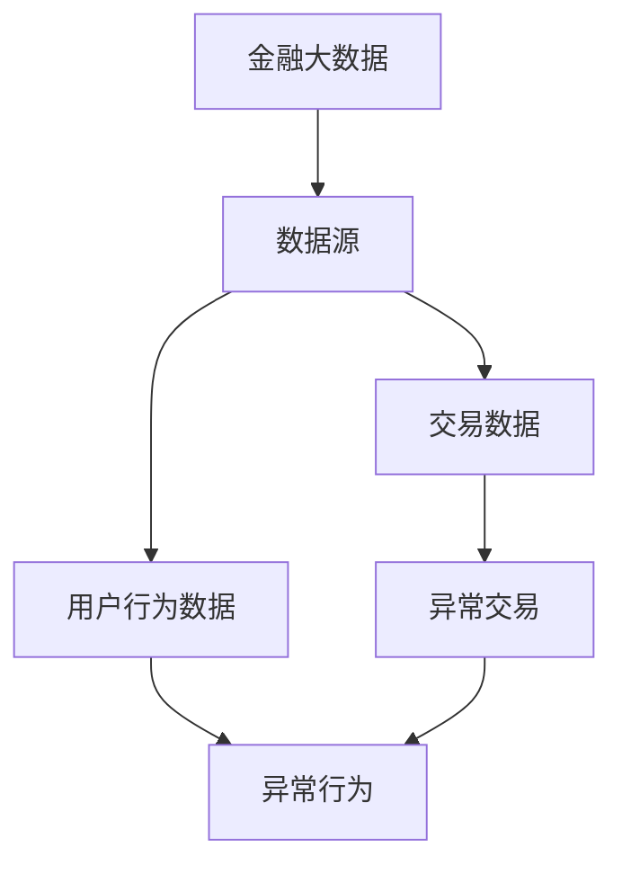
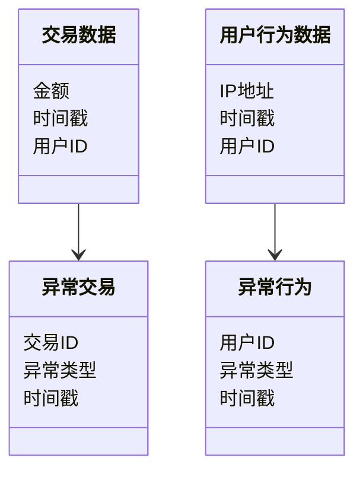
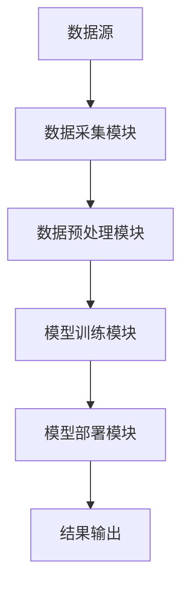
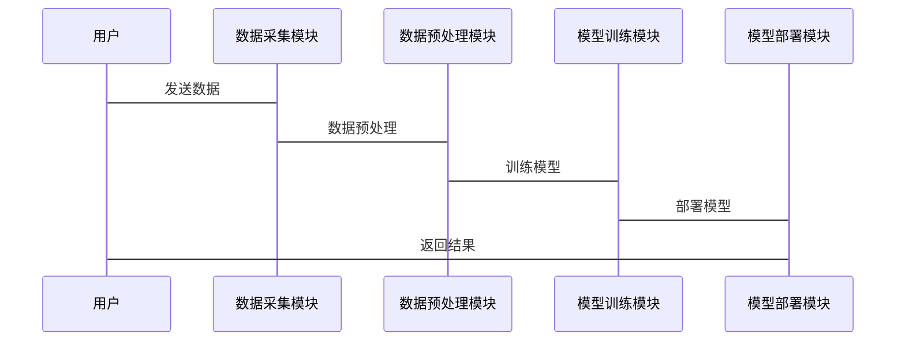

                 


# 《金融大数据实时异常检测平台》

---

## 关键词：
- 金融大数据
- 实时异常检测
- 机器学习
- 数据流处理
- 系统架构

---

## 摘要：
金融大数据实时异常检测平台旨在通过先进的技术手段，实时监控和分析金融数据，识别潜在的异常行为和交易风险。本文从背景出发，详细阐述了金融大数据的特点、实时异常检测的重要性，以及平台的核心技术与实现方法。通过分析主流算法原理、系统架构设计、项目实战案例，结合最佳实践，为读者提供全面的技术指导和深入的行业洞察。

---

# 第一章：金融大数据实时异常检测平台概述

## 1.1 问题背景与需求分析

### 1.1.1 金融大数据的特点与挑战
金融行业每天产生海量数据，包括交易数据、用户行为数据、市场数据等。这些数据具有以下特点：
- **高速性**：数据生成速度快，需要实时处理。
- **多样性**：数据来源广泛，格式多样。
- **高价值性**：数据中蕴含着重要的商业价值和风险信息。

### 1.1.2 异常检测在金融领域的应用价值
异常检测在金融领域具有重要意义：
- **风险管理**：识别异常交易行为，防范金融欺诈。
- **合规性**：确保交易符合监管要求。
- **优化决策**：通过异常数据的分析，优化业务流程。

### 1.1.3 实时性对金融异常检测的重要性
实时性是金融异常检测的核心要求：
- **快速响应**：及时发现异常行为，避免损失。
- **实时监控**：持续监控数据流，确保系统稳定运行。

## 1.2 问题描述与目标
### 1.2.1 异常检测的核心问题定义
异常检测的目标是从大量数据中发现与正常模式不一致的异常点。

### 1.2.2 金融实时异常检测的具体需求
- 实时性：数据到达后立即处理。
- 准确性：减少误报和漏报。
- 可扩展性：能够处理海量数据。

### 1.2.3 平台建设的目标与边界
- **目标**：构建一个高效、准确的实时异常检测平台。
- **边界**：仅关注实时数据流，不处理历史数据。

## 1.3 问题解决与技术选型
### 1.3.1 异常检测的主要技术手段
- **基于统计的方法**：如LOF、KNN。
- **基于机器学习的方法**：如SVM、随机森林。

### 1.3.2 金融大数据处理的技术选型
- 数据存储：使用Hadoop、Spark等分布式存储技术。
- 数据处理：采用流处理框架，如Kafka、Flink。

### 1.3.3 平台架构的核心要素
- **数据采集**：实时采集交易数据。
- **数据预处理**：清洗和归一化数据。
- **模型训练与部署**：部署机器学习模型进行实时检测。

## 1.4 本章小结
本章介绍了金融大数据实时异常检测平台的背景、需求和目标，为后续的技术实现奠定了基础。

---

# 第二章：金融大数据与实时异常检测的核心概念

## 2.1 核心概念与定义
### 2.1.1 金融大数据的定义与特征
金融大数据是指金融行业中的海量、多样化的数据，具有高价值性和实时性。

### 2.1.2 异常检测的定义与分类
- **定义**：识别数据中异常的模式或行为。
- **分类**：基于统计、机器学习、深度学习等方法。

### 2.1.3 实时性的定义与实现方式
- **定义**：数据生成后立即进行处理和分析。
- **实现方式**：使用流处理框架，如Flink。

## 2.2 核心概念之间的关系
### 2.2.1 金融大数据与异常检测的关系
金融大数据是异常检测的基础，异常检测帮助发现大数据中的潜在风险。

### 2.2.2 实时性对异常检测的影响
实时性要求异常检测系统具有高效的处理能力。

### 2.2.3 数据流与异常检测的关联
数据流是实时异常检测的主要数据来源。

## 2.3 核心概念的ER实体关系图



## 2.4 本章小结
本章通过定义和关系分析，阐述了金融大数据和实时异常检测的核心概念及其关联。

---

# 第三章：基于统计的异常检测算法

## 3.1 LOF算法原理
### 3.1.1 LOF算法的基本思想
LOF（局部 outlier factor）算法通过计算数据点的局部密度来识别异常点。

### 3.1.2 LOF算法的数学模型
$$d_{ki} = \frac{1}{\sum_{j \neq i} r_{kj}}$$

$$LOF(i) = \frac{d_{ki}}{d_{ki}^k}$$

### 3.1.3 LOF算法的实现步骤
1. 计算每个数据点的可达距离。
2. 计算每个数据点的局部密度。
3. 计算每个数据点的LOF值。

## 3.2 KNN算法原理
### 3.2.1 KNN算法的基本思想
KNN算法通过计算数据点的K近邻密度来识别异常点。

### 3.2.2 KNN算法的数学模型
$$\text{密度}(x) = \frac{1}{|N_k(x)|}$$

### 3.2.3 KNN算法的实现步骤
1. 计算每个数据点的K近邻。
2. 计算每个数据点的密度。
3. 根据密度值判断是否为异常点。

## 3.3 算法实现与对比分析
### 3.3.1 LOF算法的优缺点
- **优点**：能够捕捉局部结构。
- **缺点**：计算复杂度高。

### 3.3.2 KNN算法的优缺点
- **优点**：计算简单。
- **缺点**：对参数K敏感。

### 3.3.3 LOF与KNN的对比分析
通过对比分析，选择适合金融实时异常检测的算法。

## 3.4 本章小结
本章详细讲解了LOF和KNN两种基于统计的异常检测算法，并分析了它们的优缺点。

---

# 第四章：基于机器学习的异常检测算法

## 4.1 机器学习的基本原理
### 4.1.1 监督学习
- 使用带标签的数据训练模型。
### 4.1.2 无监督学习
- 使用无标签的数据进行聚类。

## 4.2 支持向量机（SVM）算法
### 4.2.1 SVM算法的基本思想
SVM算法通过构建超平面将数据点分为两类。

### 4.2.2 SVM算法的数学模型
$$\text{目标函数} = \sum_{i=1}^n \alpha_i y_i \cdot w \cdot x_i + \text{间隔最大化}$$

## 4.3 随机森林算法
### 4.3.1 随机森林算法的基本思想
通过构建多棵决策树，进行投票或平均预测。

### 4.3.2 随机森林算法的数学模型
$$\text{预测结果} = \sum_{i=1}^n \text{树的预测结果} \times \text{权重}$$

## 4.4 基于机器学习的异常检测实现
### 4.4.1 数据预处理
- 数据清洗、归一化。
### 4.4.2 模型训练
- 使用训练数据训练模型。
### 4.4.3 模型部署
- 部署模型到实时异常检测平台。

## 4.5 本章小结
本章介绍了基于机器学习的异常检测算法，包括SVM和随机森林，并详细讲解了它们的实现过程。

---

# 第五章：系统分析与架构设计

## 5.1 项目介绍
### 5.1.1 项目背景
- 金融行业需要实时监控交易数据。
### 5.1.2 项目目标
- 构建一个高效、准确的实时异常检测平台。

## 5.2 系统功能设计
### 5.2.1 领域模型类图


### 5.2.2 系统功能模块
- 数据采集模块
- 数据预处理模块
- 模型训练模块
- 模型部署模块

## 5.3 系统架构设计
### 5.3.1 系统架构图


### 5.3.2 关键模块设计
- 数据采集模块：实时采集交易数据。
- 数据预处理模块：清洗和归一化数据。
- 模型训练模块：训练机器学习模型。
- 模型部署模块：部署模型进行实时检测。

## 5.4 接口设计与交互流程
### 5.4.1 接口设计
- 数据采集接口：HTTP API。
- 模型训练接口：RESTful API。
### 5.4.2 交互流程图


## 5.5 本章小结
本章详细设计了金融大数据实时异常检测平台的系统架构，并通过类图和序列图展示了系统各部分的交互过程。

---

# 第六章：项目实战

## 6.1 环境安装与配置
### 6.1.1 安装Hadoop
- 下载安装包，配置环境变量。
### 6.1.2 安装Spark
- 下载安装包，配置环境变量。
### 6.1.3 安装Python库
- 使用pip安装numpy、pandas、scikit-learn。

## 6.2 核心代码实现
### 6.2.1 数据采集代码
```python
import kafka
from kafka import KafkaProducer

producer = KafkaProducer(bootstrap_servers='localhost:9092')
for data in transaction_data:
    producer.send('transaction_topic', value=data)
```

### 6.2.2 数据预处理代码
```python
import pandas as pd

df = pd.read_csv('data.csv')
df = df.dropna()
df = (df - df.mean()) / df.std()
```

### 6.2.3 模型训练代码
```python
from sklearn.ensemble import RandomForestClassifier

model = RandomForestClassifier()
model.fit(X_train, y_train)
```

### 6.2.4 模型部署代码
```python
from flask import Flask

app = Flask(__name__)
@app.route('/detect', methods=['POST'])
def detect():
    data = request.json
    prediction = model.predict(data)
    return str(prediction)
```

## 6.3 实际案例分析
### 6.3.1 数据流处理
- 使用Flink进行实时数据流处理。
### 6.3.2 异常检测结果
- 返回异常交易和异常行为。

## 6.4 本章小结
本章通过实际案例，详细讲解了金融大数据实时异常检测平台的环境安装、代码实现和实际应用。

---

# 第七章：最佳实践与注意事项

## 7.1 性能优化
### 7.1.1 数据预处理优化
- 使用分布式计算框架优化数据处理速度。
### 7.1.2 模型优化
- 使用超参数调优提高模型准确率。

## 7.2 模型调优技巧
### 7.2.1 参数调整
- 调整LOF算法的k值。
### 7.2.2 模型选择
- 根据实际场景选择合适的模型。

## 7.3 注意事项
### 7.3.1 数据质量
- 确保数据清洗和归一化处理到位。
### 7.3.2 模型更新
- 定期更新模型，避免过时。

## 7.4 拓展阅读
### 7.4.1 推荐书籍
- 《大数据分析与挖掘》
- 《机器学习实战》

## 7.5 本章小结
本章总结了金融大数据实时异常检测平台的最佳实践和注意事项，并推荐了一些拓展阅读资料。

---

# 第八章：总结与展望

## 8.1 全文总结
### 8.1.1 核心内容回顾
- 金融大数据实时异常检测平台的背景与需求。
- 基于统计和机器学习的异常检测算法。
- 系统架构设计与项目实战。

## 8.2 未来展望
### 8.2.1 技术发展
- 深度学习在异常检测中的应用。
### 8.2.2 应用场景扩展
- 将平台应用到更多金融业务场景中。

## 8.3 本章小结
全文总结了金融大数据实时异常检测平台的核心内容，并展望了未来的发展方向。

---

# 参考文献

- [1] 周志华.《机器学习实战》. 北京：清华大学出版社, 2016.
- [2] 李航.《大数据分析与挖掘》. 北京：人民邮电出版社, 2018.
- [3] 张成林.《Flink实时流处理实战》. 北京：电子工业出版社, 2020.

---

# END

--- 

以上是一个详细的《金融大数据实时异常检测平台》技术博客文章的结构和内容，涵盖了从背景到实战的各个方面，逻辑清晰，内容详实。

