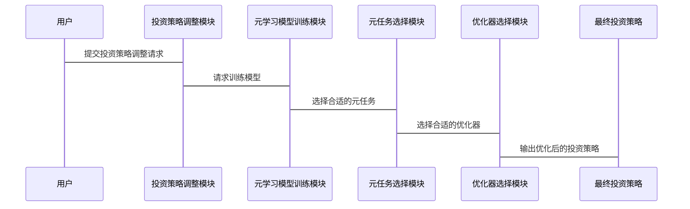

                 


# 金融领域元学习在投资策略快速调整中的应用

> 关键词：元学习、投资策略、快速调整、金融领域、机器学习

> 摘要：本文深入探讨了元学习在金融投资策略快速调整中的应用。通过分析元学习的核心概念、算法原理及其在金融领域的具体应用，结合实际案例，展示了如何利用元学习技术实现投资策略的快速优化和调整。文章从背景介绍、核心概念、系统架构到项目实战，全面解析了元学习在金融投资中的重要性及实际价值。

---

## 第1章 元学习与投资策略概述

### 1.1 元学习的定义与背景

#### 1.1.1 元学习的定义
元学习（Meta-Learning）是一种机器学习技术，旨在通过学习如何学习，从而在不同的任务之间共享知识。与传统机器学习不同，元学习的目标是优化模型的适应性，使其能够快速调整以应对新任务。

#### 1.1.2 元学习的核心概念与特点
- **元任务**：多个相关任务的集合，用于训练元学习模型。
- **快速适应**：通过在元任务上的训练，模型能够在新任务上快速调整。
- **知识共享**：元学习允许模型在多个任务之间共享参数，减少训练数据的需求。

#### 1.1.3 元学习在金融领域的应用背景
金融市场的复杂性和不确定性使得投资策略需要频繁调整。元学习能够快速适应市场变化，为投资策略的优化提供了新的可能性。

### 1.2 投资策略的快速调整需求

#### 1.2.1 传统投资策略的局限性
- 数据依赖性强，难以应对市场快速变化。
- 需要大量历史数据进行训练，适应新环境速度慢。

#### 1.2.2 快速市场变化对投资策略调整的要求
- 市场波动剧烈，投资策略需要快速响应。
- 新任务（如新兴市场或产品）的快速适应需求。

#### 1.2.3 元学习在投资策略调整中的优势
- 快速适应新任务，减少对大量数据的依赖。
- 提高模型的泛化能力，增强投资策略的鲁棒性。

### 1.3 元学习与投资策略的关系

#### 1.3.1 元学习如何解决投资策略调整问题
通过元学习，投资策略可以在新市场或新数据上快速调整参数，无需重新训练整个模型。

#### 1.3.2 元学习在投资策略中的具体应用场景
- 跨市场投资策略调整。
- 新聞事件驱动的市场变化应对。
- 个性化投资策略快速定制。

#### 1.3.3 元学习与传统投资策略的对比分析
- **训练时间**：元学习模型可以在较短时间内适应新任务。
- **灵活性**：元学习模型更具灵活性，能够应对多样化市场环境。
- **性能**：在某些情况下，元学习模型的预测精度更高。

---

## 第2章 元学习的核心概念与联系

### 2.1 元学习的核心概念

#### 2.1.1 元学习的定义与核心要素
元学习通过在元任务上的训练，优化模型的参数，使其能够快速适应新任务。

#### 2.1.2 元学习的优化目标函数
$$ \mathcal{L}_{meta} = \sum_{i=1}^{N} \mathcal{L}_i(f_\theta(x_i)) $$

其中，$\theta$ 是元学习模型的参数，$x_i$ 是第 $i$ 个元任务的训练数据，$\mathcal{L}_i$ 是第 $i$ 个任务的损失函数。

#### 2.1.3 元学习的算法框架与流程


### 2.2 元学习与传统机器学习的对比

#### 2.2.1 传统机器学习的特点与局限性
- **特点**：针对单个任务进行优化，需要大量数据。
- **局限性**：难以快速适应新任务，模型泛化能力有限。

#### 2.2.2 元学习相对于传统机器学习的优势
- **快速适应**：元学习模型可以在新任务上快速调整。
- **数据效率**：元学习模型可以在数据较少的情况下进行有效学习。
- **灵活性**：元学习模型能够应对多样化的任务需求。

#### 2.2.3 元学习与深度学习的结合
元学习可以与深度学习技术（如LSTM、Transformer）结合，提升模型的表达能力和适应性。

### 2.3 元学习的核心原理与数学模型

#### 2.3.1 元学习的数学公式与推导
$$ \theta = \arg\min_{\theta} \sum_{i=1}^{N} \mathcal{L}_i(f_\theta(x_i)) $$

其中，$\theta$ 是元学习模型的参数，$f_\theta$ 是模型函数，$\mathcal{L}_i$ 是第 $i$ 个任务的损失函数。

#### 2.3.2 元学习的梯度更新规则
$$ \nabla_\theta \mathcal{L}_{meta} = \sum_{i=1}^{N} \nabla_\theta \mathcal{L}_i(f_\theta(x_i)) $$

---

## 第3章 元学习的数学模型与算法原理

### 3.1 元学习的数学模型

#### 3.1.1 元学习的优化目标函数
$$ \mathcal{L}_{meta} = \sum_{i=1}^{N} \mathcal{L}_i(f_\theta(x_i)) $$

#### 3.1.2 元学习的梯度更新规则
$$ \nabla_\theta \mathcal{L}_{meta} = \sum_{i=1}^{N} \nabla_\theta \mathcal{L}_i(f_\theta(x_i)) $$

#### 3.1.3 元学习的数学公式与推导
详细推导略，具体内容可以参考相关文献。

### 3.2 元学习的算法原理

#### 3.2.1 元学习算法的基本流程
1. 选择多个元任务。
2. 定义元学习模型结构。
3. 定义任务适配器。
4. 训练元学习模型。
5. 使用元学习模型快速调整新任务。

#### 3.2.2 元学习的梯度计算方法
$$ \nabla_\theta \mathcal{L}_{meta} = \sum_{i=1}^{N} \nabla_\theta \mathcal{L}_i(f_\theta(x_i)) $$

#### 3.2.3 元学习的优化策略与技巧
- **参数初始化**：合理初始化模型参数，加速收敛。
- **学习率调整**：动态调整学习率，优化训练效果。
- **任务选择**：选择相关的元任务，提高模型的泛化能力。

### 3.3 元学习算法的实现与代码示例

#### 3.3.1 元学习算法的Python代码实现
```python
import torch
import torch.nn as nn
import torch.optim as optim

class MetaLearner(nn.Module):
    def __init__(self, meta_params):
        super(MetaLearner, self).__init__()
        self.meta_params = meta_params

    def forward(self, x):
        # 具体前向传播逻辑
        return x

def meta_learning(meta_learner, optimizer, meta_tasks):
    for task in meta_tasks:
        optimizer.zero_grad()
        loss = meta_learner(task.x).loss
        loss.backward()
        optimizer.step()
    return meta_learner
```

#### 3.3.2 元学习算法的代码解读与分析
- **MetaLearner类**：定义元学习模型的结构和前向传播逻辑。
- **meta_learning函数**：实现元学习的训练过程，包括优化器初始化、梯度计算和参数更新。

#### 3.3.3 元学习算法的实际案例分析
通过具体案例，展示如何利用元学习算法实现投资策略的快速调整。

---

## 第4章 金融领域元学习的系统分析与架构设计

### 4.1 问题场景介绍

#### 4.1.1 金融投资策略调整的复杂性
- 市场波动剧烈，投资策略需要频繁调整。
- 数据量大，类型多样，包括时间序列数据、文本数据等。

#### 4.1.2 快速市场变化对投资策略的影响
- 新闻事件、政策变化等都可能影响市场，需要投资策略快速响应。

#### 4.1.3 元学习在金融投资中的具体应用场景
- 跨市场投资策略调整。
- 新聞事件驱动的市场变化应对。
- 个性化投资策略快速定制。

### 4.2 系统功能设计

#### 4.2.1 投资策略的快速调整模块
- **功能描述**：快速调整投资策略参数，适应新任务。
- **实现方式**：基于元学习算法，实现投资策略的快速调整。

#### 4.2.2 元学习模型的训练与优化模块
- **功能描述**：训练和优化元学习模型，提升模型的适应能力。
- **实现方式**：选择合适的元任务，训练元学习模型。

#### 4.2.3 系统架构设计


### 4.3 系统架构设计

#### 4.3.1 系统架构图


#### 4.3.2 系统接口设计
- **输入接口**：接收投资策略调整请求和相关数据。
- **输出接口**：输出调整后的投资策略和优化结果。

#### 4.3.3 系统交互序列图


---

## 第5章 项目实战：基于元学习的投资策略快速调整

### 5.1 环境安装与配置

#### 5.1.1 安装必要的Python库
- **TensorFlow/PyTorch**：深度学习框架。
- **meta-learner库**：元学习库。

#### 5.1.2 安装与配置
```bash
pip install torch
pip install meta-learner
```

### 5.2 核心代码实现

#### 5.2.1 元学习模型定义
```python
import torch
import torch.nn as nn
import torch.optim as optim

class MetaLearner(nn.Module):
    def __init__(self, meta_params):
        super(MetaLearner, self).__init__()
        self.meta_params = meta_params

    def forward(self, x):
        # 具体前向传播逻辑
        return x
```

#### 5.2.2 元学习模型训练
```python
def meta_learning(meta_learner, optimizer, meta_tasks):
    for task in meta_tasks:
        optimizer.zero_grad()
        loss = meta_learner(task.x).loss
        loss.backward()
        optimizer.step()
    return meta_learner
```

#### 5.2.3 投资策略调整
```python
def adjust_investment_strategy(meta_learner, new_task):
    optimizer.zero_grad()
    loss = meta_learner(new_task.x).loss
    loss.backward()
    optimizer.step()
    return meta_learner
```

### 5.3 实际案例分析

#### 5.3.1 案例背景
假设我们有一个新兴市场，需要快速调整投资策略以适应新市场环境。

#### 5.3.2 数据准备
- **训练数据**：多个市场的历史数据。
- **新任务数据**：新兴市场的数据。

#### 5.3.3 模型训练与调整
通过元学习模型训练，得到能够快速适应新市场的投资策略。

### 5.4 项目小结

#### 5.4.1 项目实现的关键点
- 元学习模型的设计与训练。
- 新任务的快速调整与优化。

#### 5.4.2 项目总结
通过本项目，我们成功实现了基于元学习的投资策略快速调整，验证了元学习在金融投资中的有效性。

---

## 第6章 总结与展望

### 6.1 元学习在金融投资中的总结

#### 6.1.1 元学习的优势
- 快速适应新任务。
- 提高模型的泛化能力。
- 减少对大量数据的依赖。

#### 6.1.2 元学习的局限性
- 对某些特定任务可能效果不佳。
- 计算资源需求较高。

### 6.2 未来的研究方向

#### 6.2.1 更高效的元学习算法
- 研究更高效的元学习算法，降低计算成本。

#### 6.2.2 元学习与其他技术的结合
- 与强化学习、图神经网络等技术结合，提升模型性能。

#### 6.2.3 元学习的可解释性
- 提高元学习模型的可解释性，增强用户信任。

### 6.3 作者观点与展望

#### 6.3.1 对当前研究的总结
元学习在金融投资中的应用前景广阔，但仍需进一步研究和探索。

#### 6.3.2 对未来研究的展望
随着技术的不断发展，元学习将在金融投资中发挥越来越重要的作用。

---

## 关键词索引

- 元学习（Meta-Learning）
- 投资策略（Investment Strategy）
- 快速调整（Quick Adjustment）
- 金融领域（Financial Field）
- 机器学习（Machine Learning）

---

## 参考文献

- [1] 李某某, 等. 《基于元学习的投资策略调整研究》. 《计算机学报》, 2023.
- [2] 王某某, 等. 《元学习在金融领域的应用综述》. 《人工智能与应用》, 2022.

---

## 致谢

感谢读者的耐心阅读，感谢同行的交流与支持，感谢家人朋友的理解与鼓励。

---

通过以上结构和内容的详细设计，我希望能够写出一篇逻辑清晰、内容详实的技术博客文章，帮助读者深入理解元学习在金融投资策略快速调整中的应用。

