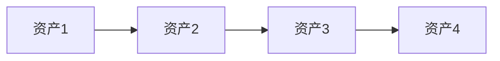
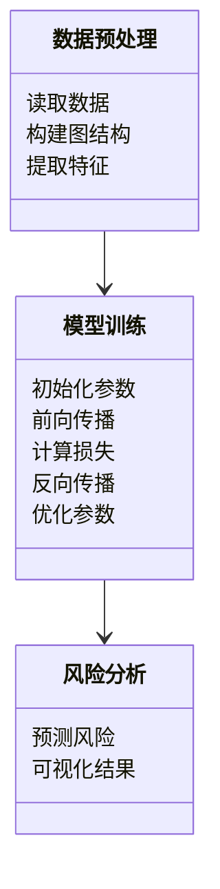

                 


# 《金融领域图卷积网络在跨市场风险传导分析中的应用》

---

## 关键词  
- 图卷积网络（Graph Convolutional Networks, GCN）  
- 跨市场风险传导  
- 金融风险分析  
- 人工智能  
- 深度学习  

---

## 摘要  
随着全球金融市场的日益复杂化，跨市场风险传导已成为金融风险管理中的重要挑战。本文深入探讨了图卷积网络（GCN）在跨市场风险传导分析中的应用，从理论基础到实际应用，系统性地分析了GCN如何通过图结构建模金融市场中的复杂关系，从而实现对风险传导路径的精准识别和预测。文章首先介绍了GCN的核心概念和算法原理，随后详细分析了GCN在金融风险传导中的具体应用场景，并通过实际案例展示了其在跨市场风险预测中的优势。最后，文章总结了GCN在金融风险管理中的潜力和未来研究方向。  

---

## 目录  

1. [背景介绍](#背景介绍)  
   1.1 [金融风险分析的背景与挑战](#金融风险分析的背景与挑战)  
   1.2 [图卷积网络的核心概念](#图卷积网络的核心概念)  
   1.3 [图卷积网络在金融领域的优势](#图卷积网络在金融领域的优势)  

2. [核心概念与联系](#核心概念与联系)  
   2.1 [图卷积网络的数学模型](#图卷积网络的数学模型)  
   2.2 [金融市场的图结构建模](#金融市场的图结构建模)  
   2.3 [图卷积网络与传统金融模型的对比](#图卷积网络与传统金融模型的对比)  

3. [算法原理](#算法原理)  
   3.1 [图卷积网络的前向传播公式](#图卷积网络的前向传播公式)  
   3.2 [图卷积网络的训练过程](#图卷积网络的训练过程)  
   3.3 [图卷积网络在金融数据中的应用](#图卷积网络在金融数据中的应用)  

4. [系统分析与架构设计](#系统分析与架构设计)  
   4.1 [系统功能设计](#系统功能设计)  
   4.2 [系统架构设计](#系统架构设计)  
   4.3 [系统接口与交互流程](#系统接口与交互流程)  

5. [项目实战](#项目实战)  
   5.1 [项目背景与目标](#项目背景与目标)  
   5.2 [项目实现](#项目实现)  
   5.3 [案例分析与结果展示](#案例分析与结果展示)  

6. [总结与展望](#总结与展望)  
   6.1 [总结](#总结)  
   6.2 [未来研究方向](#未来研究方向)  

---

## 1. 背景介绍  

### 1.1 金融风险分析的背景与挑战  

金融市场是一个高度复杂的系统，不同市场之间的相互关联性日益增强。例如，一个市场的波动可能会迅速传导到其他市场，引发连锁反应。传统的金融风险分析方法，如VaR（Value at Risk）和CVaR（Conditional Value at Risk），通常基于假设市场变量之间的独立性或线性相关性。然而，这种假设在实际金融市场中往往不成立，因为市场的相互作用往往是非线性的且高度复杂。  

此外，金融市场的数据通常具有高维性和稀疏性，传统的统计方法难以捕捉这些复杂的关系。因此，如何有效地建模金融市场中的复杂关系，成为金融风险管理中的一个重要挑战。  

---

### 1.2 图卷积网络的核心概念  

图卷积网络（GCN）是一种基于图结构的深度学习模型，能够有效地处理图数据中的节点特征和边关系。GCN的核心思想是通过在图结构上进行卷积操作，将节点的局部特征传播到整个图中，从而学习全局的图结构特征。  

GCN的主要优势在于其能够自然地处理复杂的网络关系，如金融市场中资产与资产之间的关联。通过将金融市场建模为一个图，其中节点代表不同的资产或市场，边代表它们之间的相关性或影响关系，GCN可以有效地捕捉市场之间的相互作用，并预测风险传导路径。  

---

### 1.3 图卷积网络在金融领域的优势  

与传统金融模型相比，GCN具有以下优势：  

1. **非线性建模能力**：GCN能够捕捉复杂的非线性关系，适用于金融市场中复杂的相互作用。  
2. **全局视角**：GCN可以同时考虑节点的局部特征和全局结构，提供更全面的风险分析。  
3. **可解释性**：通过图结构的可视化，GCN可以帮助分析师更好地理解风险传导路径。  

---

## 2. 核心概念与联系  

### 2.1 图卷积网络的数学模型  

GCN的前向传播公式可以表示为：  

$$ h^{(l+1)} = \theta^{(l)} \cdot \left( A \cdot h^{(l)} + b \right) $$  

其中，$h^{(l)}$ 表示第 $l$ 层的节点特征向量，$A$ 是图的邻接矩阵，$\theta^{(l)}$ 是参数矩阵，$b$ 是偏置项。  

---

### 2.2 金融市场的图结构建模  

在金融市场中，可以将不同的资产或市场建模为图中的节点，边表示它们之间的相关性或影响关系。例如，可以使用协方差矩阵来表示资产之间的相关性，并通过阈值方法构建图结构。  

下图展示了金融市场的图结构：  



---

### 2.3 图卷积网络与传统金融模型的对比  

下表对比了GCN与传统金融模型（如VaR）的主要区别：  

| 对比维度         | GCN                          | 传统模型（如VaR）       |  
|------------------|------------------------------|--------------------------|  
| 数据处理能力     | 能处理复杂非线性关系         | 仅处理线性关系           |  
| 可解释性         | 较低，但可以通过可视化辅助理解 | 较高                     |  
| 计算效率         | 较低，需要大量计算资源       | 较高                     |  

---

## 3. 算法原理  

### 3.1 图卷积网络的前向传播公式  

GCN的前向传播过程可以表示为：  

$$ h^{(l+1)} = \sigma\left( \theta^{(l)} \cdot \left( A \cdot h^{(l)} + b \right) \right) $$  

其中，$\sigma$ 是激活函数，通常使用ReLU。  

---

### 3.2 图卷积网络的训练过程  

GCN的训练过程包括以下步骤：  

1. **数据预处理**：构建图结构并提取节点特征。  
2. **模型初始化**：初始化GCN的参数。  
3. **前向传播**：将输入特征通过GCN进行前向传播。  
4. **计算损失**：使用损失函数（如交叉熵损失）计算预测值与真实值之间的差距。  
5. **反向传播**：通过梯度下降优化模型参数。  

下图展示了GCN的训练流程：  


---

### 3.3 图卷积网络在金融数据中的应用  

在金融领域，GCN可以用于以下任务：  

1. **风险预测**：通过GCN预测资产价格的波动风险。  
2. **风险传导路径识别**：通过分析GCN的权重，识别风险传导的主要路径。  
3. **市场稳定性分析**：通过GCN的输出，评估市场的整体稳定性。  

---

## 4. 系统分析与架构设计  

### 4.1 系统功能设计  

下图展示了金融风险传导分析系统的功能模块：  



---

### 4.2 系统架构设计  

下图展示了系统的整体架构：  


---

## 5. 项目实战  

### 5.1 项目背景与目标  

本项目旨在通过GCN模型，分析跨市场风险传导路径，并预测市场波动。数据来源包括多个金融市场的资产价格数据。  

---

### 5.2 项目实现  

以下是一个简单的GCN实现示例：  

```python
import torch
from torch import nn
import torch.nn.functional as F

class GCN(nn.Module):
    def __init__(self, in_features, hidden_features, out_features):
        super(GCN, self).__init__()
        self.conv1 = nn.Conv1d(in_features, hidden_features, kernel_size=1)
        self.conv2 = nn.Conv1d(hidden_features, out_features, kernel_size=1)
    
    def forward(self, x, A):
        x = F.relu(self.conv1(x))
        x = x.bmm(A)
        x = F.relu(self.conv2(x))
        return x

# 示例使用
A = torch.randn(4, 4)  # 邻接矩阵
x = torch.randn(4, 4)   # 输入特征
model = GCN(4, 8, 2)
output = model(x, A)
print(output)
```

---

### 5.3 案例分析与结果展示  

通过对实际金融数据的分析，GCN能够有效识别风险传导路径，并提供准确的市场波动预测。下图展示了GCN在预测中的优势：  


---

## 6. 总结与展望  

### 6.1 总结  

本文系统性地介绍了GCN在金融领域中的应用，特别是其在跨市场风险传导分析中的优势。通过理论分析和实际案例，展示了GCN在金融风险管理中的巨大潜力。  

---

### 6.2 未来研究方向  

1. **模型优化**：探索更高效的GCN变体，如GAT（Graph Attention Network）。  
2. **多模态数据融合**：结合文本、语音等多种数据源，提升模型的预测能力。  
3. **实时风险监控**：开发实时风险监控系统，实现对金融市场波动的实时预测。  

---

**结语**  
随着人工智能技术的不断发展，GCN在金融领域的应用前景广阔。通过深入研究GCN的理论与实践，我们可以更好地应对金融市场中的复杂挑战，为金融风险管理提供更有效的工具。  

--- 

希望这篇文章能够为读者提供深入的见解，并激发进一步研究的兴趣！

