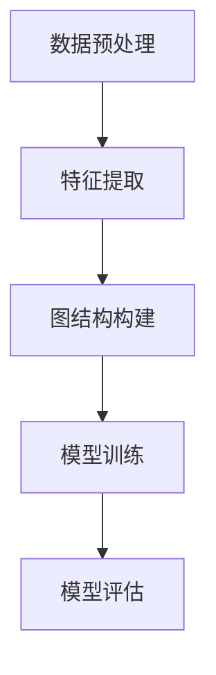
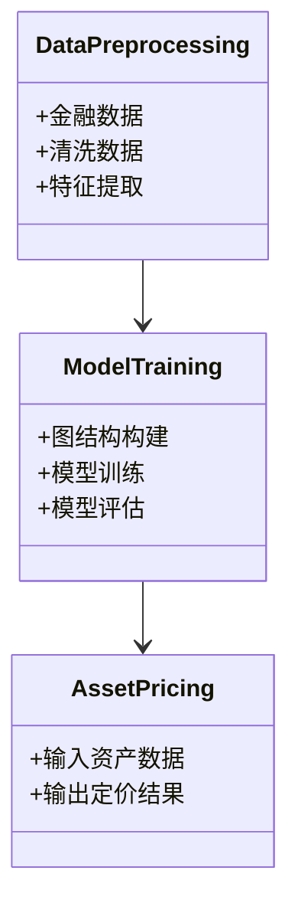
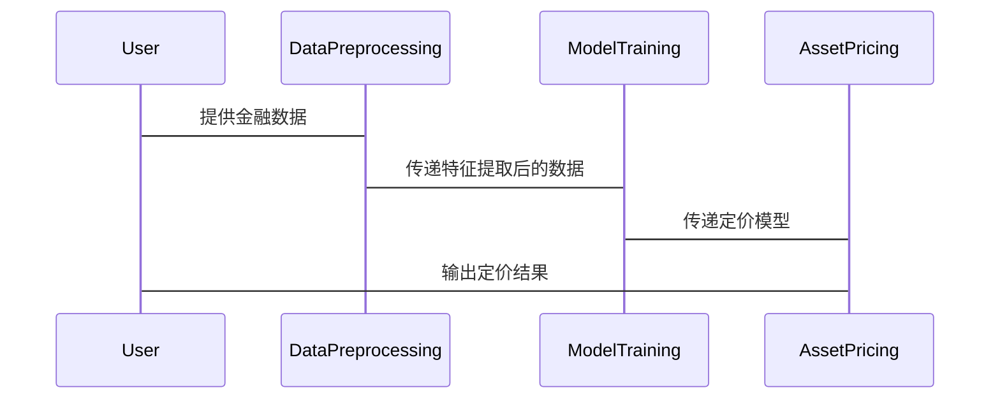

                 


```markdown
# 金融领域图神经网络在资产定价中的应用

> 关键词：金融资产定价、图神经网络、图表示学习、实体关系图、深度学习、资产组合管理

> 摘要：本文深入探讨了图神经网络在金融资产定价中的应用。通过分析图神经网络的核心概念、算法原理、系统设计与项目实战，结合实体关系图和数学模型，展示了如何利用图神经网络提升资产定价的准确性与效率。文章内容涵盖背景介绍、核心概念对比、算法流程图、系统架构图、Python代码实现、实际案例分析与结果解读，以及最佳实践和未来研究方向。

---

## 第一部分: 金融领域图神经网络在资产定价中的应用概述

### 第1章: 问题背景与研究现状

#### 1.1 资产定价的背景与挑战
##### 1.1.1 资产定价的基本概念
资产定价是指通过分析资产的内在价值、市场环境、风险因素等，确定其合理市场价格的过程。传统的资产定价模型（如CAPM和APT）基于假设条件，但在实际金融市场中，资产之间的复杂关联性、非线性关系和动态变化使得传统方法面临诸多挑战。

##### 1.1.2 传统资产定价模型的局限性
传统资产定价模型主要依赖于统计假设和线性关系，难以捕捉复杂的市场结构和非线性特征。例如，CAPM假设市场是有效的，且投资者具有相同的风险偏好，这在实际中难以满足。

##### 1.1.3 图神经网络的引入动机
图神经网络（Graph Neural Networks, GNNs）能够有效处理图结构数据，捕捉节点之间的复杂关系，适用于金融市场的多维关联分析。通过构建资产之间的关系图，可以更好地理解市场动态，提升定价模型的精度。

#### 1.2 图神经网络的核心概念
##### 1.2.1 图表示学习的基本原理
图表示学习的目标是将图中的节点或子图映射到低维空间，同时保留图的结构信息和节点特征。常见的图表示方法包括节点嵌入、边嵌入和图嵌入。

##### 1.2.2 图神经网络的定义与特点
图神经网络是一种基于图结构数据的深度学习模型，其核心思想是通过聚合邻域节点的信息来更新当前节点的表示。图神经网络具有以下特点：
1. 能够处理复杂的非线性关系。
2. 自然适合处理图结构数据。
3. 可以同时捕捉节点特征和图结构信息。

##### 1.2.3 图神经网络在金融领域的应用潜力
在金融领域，图神经网络可以应用于信用风险评估、资产定价、市场风险预警等多个场景。本文重点关注资产定价问题。

#### 1.3 本章小结
本章介绍了资产定价的基本概念、传统模型的局限性以及图神经网络的引入动机。通过对比传统方法与图神经网络的特点，明确了图神经网络在金融资产定价中的应用潜力。

---

## 第二部分: 图神经网络的核心概念与联系

### 第2章: 图神经网络的原理与数学模型

#### 2.1 图表示学习的原理
##### 2.1.1 图的表示方法
图的表示方法包括节点嵌入、边嵌入和图嵌入。节点嵌入用于表示单个节点的特征，边嵌入用于表示节点之间的关系，图嵌入用于表示整个图的全局特征。

##### 2.1.2 图的特征传播机制
图的特征传播机制通过聚合邻域节点的信息来更新当前节点的表示。常见的聚合方法包括平均、加权平均和注意力机制。

##### 2.1.3 图的聚合与聚合函数
聚合函数用于将邻域节点的信息整合到当前节点的表示中。常见的聚合函数包括Sum、Mean、Max和自注意力机制。

#### 2.2 图神经网络的数学模型
##### 2.2.1 图卷积网络（GCN）的数学公式
图卷积网络的数学公式如下：
$$
X_{\text{new}} = \theta (A X X^T)
$$
其中，$A$是图的邻接矩阵，$X$是节点特征矩阵，$\theta$是非线性变换函数。

##### 2.2.2 图注意力机制（GAT）的数学公式
图注意力机制的数学公式如下：
$$
\alpha_{ij} = \frac{e^{f_{\theta}(x_i, x_j)}}{\sum_{k \neq j} e^{f_{\theta}(x_i, x_k)}}
$$
其中，$\alpha_{ij}$是节点$i$对节点$j$的注意力权重，$f_{\theta}$是注意力计算函数。

##### 2.2.3 图嵌入模型（如GraphSAGE）的数学公式
GraphSAGE的数学公式如下：
$$
h_i^{(l+1)} = \aggregate_{j \in \mathcal{N}(i)} \frac{h_j^{(l)} + h_i^{(l)}}{|\mathcal{N}(i)|}
$$
其中，$\mathcal{N}(i)$是节点$i$的邻域节点集合，$\aggregate$表示聚合操作。

#### 2.3 图神经网络与传统神经网络的对比
##### 2.3.1 模型复杂度对比
图神经网络的模型复杂度取决于图的规模和结构。与传统神经网络相比，图神经网络在处理图结构数据时具有更高的复杂度。

##### 2.3.2 特征表达能力对比
图神经网络能够捕捉节点之间的关系，而传统神经网络难以处理复杂的关联关系。

##### 2.3.3 计算效率对比
图神经网络的计算效率取决于图的稀疏性和算法优化。与传统神经网络相比，图神经网络在处理大规模图数据时可能面临计算效率问题。

### 第3章: 图神经网络的核心概念与ER实体关系图

#### 3.1 图神经网络的核心概念
##### 3.1.1 图节点与边的定义
图节点表示资产，边表示资产之间的关系（如相关性、协同波动等）。

##### 3.1.2 图节点的特征表示
图节点的特征表示包括资产的市场数据（如价格、成交量、波动率等）和文本数据（如新闻、财报）。

##### 3.1.3 图边的权重与属性
图边的权重表示资产之间的相关性强度，边属性可以包括时间戳、影响程度等。

#### 3.2 ER实体关系图的构建
##### 3.2.1 实体关系图的定义
实体关系图（ER图）用于描述资产之间的关系，包括资产与其影响因素（如宏观经济指标、行业指数等）的关系。

##### 3.2.2 实体关系图的构建方法
通过数据预处理和特征提取，构建资产之间的关系图。例如，可以通过计算资产价格的相关性来确定边的权重。

##### 3.2.3 实体关系图的可视化
使用工具（如Gephi）对实体关系图进行可视化，帮助理解资产之间的关联结构。

#### 3.3 图神经网络与实体关系图的结合
##### 3.3.1 图神经网络如何利用实体关系图
通过图神经网络对实体关系图进行建模，捕捉资产之间的复杂关系。

##### 3.3.2 实体关系图对图神经网络性能的影响
实体关系图的构建方式和质量直接影响图神经网络的性能。高质量的实体关系图能够提高模型的精度。

##### 3.3.3 实体关系图的优化方法
通过优化图的结构和边权重的计算方式，提升实体关系图的性能。

---

## 第三部分: 图神经网络在资产定价中的算法原理

### 第4章: 图神经网络在资产定价中的算法原理

#### 4.1 图神经网络在资产定价中的应用流程
##### 4.1.1 数据预处理与特征提取
对金融数据进行清洗和特征提取，构建资产的价格序列和相关特征。

##### 4.1.2 图结构的构建与优化
根据资产之间的关系构建实体关系图，并优化图的结构和边权重。

##### 4.1.3 模型训练与评估
使用图神经网络对构建的实体关系图进行训练，评估模型的性能。

#### 4.2 图神经网络的训练流程图


#### 4.3 图神经网络的核心算法实现
##### 4.3.1 图卷积层的实现
```python
class GraphConvolutionalLayer(nn.Module):
    def __init__(self, in_features, out_features):
        super(GraphConvolutionalLayer, self).__init__()
        self.weight = nn.Parameter(torch.randn(in_features, out_features))
        self.bias = nn.Parameter(torch.randn(out_features))
    
    def forward(self, x, A):
        x = torch.matmul(A, x)
        x = torch.matmul(x, self.weight)
        x = torch.add(x, self.bias)
        return x
```

##### 4.3.2 图注意力机制的实现
```python
class GraphAttentionLayer(nn.Module):
    def __init__(self, in_features, out_features):
        super(GraphAttentionLayer, self).__init__()
        self.weight = nn.Parameter(torch.randn(in_features, out_features))
        self.attention = nn.Parameter(torch.randn(out_features, out_features))
    
    def forward(self, x, A):
        x = torch.matmul(x, self.weight)
        attention_scores = torch.matmul(x, self.attention)
        attention_weights = torch.softmax(attention_scores, dim=1)
        x = torch.matmul(attention_weights, x)
        return x
```

#### 4.4 图神经网络的数学模型
##### 4.4.1 图卷积网络的数学公式
$$
X_{\text{new}} = \sigma(A X X^T W)
$$
其中，$A$是图的邻接矩阵，$X$是节点特征矩阵，$W$是权重矩阵，$\sigma$是非线性激活函数。

##### 4.4.2 图注意力机制的数学公式
$$
\alpha_{ij} = \frac{e^{f_{\theta}(x_i, x_j)}}{\sum_{k \neq j} e^{f_{\theta}(x_i, x_k)}}
$$
其中，$\alpha_{ij}$是节点$i$对节点$j$的注意力权重，$f_{\theta}$是注意力计算函数。

##### 4.4.3 图嵌入模型的数学公式
$$
h_i^{(l+1)} = \aggregate_{j \in \mathcal{N}(i)} \frac{h_j^{(l)} + h_i^{(l)}}{|\mathcal{N}(i)|}
$$
其中，$\mathcal{N}(i)$是节点$i$的邻域节点集合，$\aggregate$表示聚合操作。

---

## 第四部分: 图神经网络在资产定价中的系统设计

### 第5章: 图神经网络在资产定价中的系统设计

#### 5.1 项目背景与目标
本文旨在通过图神经网络构建资产定价模型，解决传统定价模型的局限性。

#### 5.2 系统功能设计
##### 5.2.1 系统功能模块


##### 5.2.2 系统交互设计


#### 5.3 系统架构设计
##### 5.3.1 系统架构图


##### 5.3.2 系统接口设计
系统接口包括数据输入接口、模型训练接口和结果输出接口。

---

## 第五部分: 图神经网络在资产定价中的项目实战

### 第6章: 图神经网络在资产定价中的项目实战

#### 6.1 环境安装与配置
##### 6.1.1 环境配置
安装必要的库：
```bash
pip install torch networkx matplotlib
```

#### 6.2 系统核心实现
##### 6.2.1 数据预处理
```python
import pandas as pd
import numpy as np
import torch
from torch import nn
from torch.utils.data import DataLoader
import networkx as nx
import matplotlib.pyplot as plt

# 数据加载与清洗
data = pd.read_csv('assets.csv')
data = data.dropna()
```

##### 6.2.2 图结构构建
```python
def build_graph(data):
    G = nx.Graph()
    for i in range(len(data)):
        G.add_node(i)
    for i in range(len(data)):
        for j in range(i+1, len(data)):
            G.add_edge(i, j, weight=np.corrcoef(data.iloc[i], data.iloc[j])[0,1])
    return G

graph = build_graph(data)
```

##### 6.2.3 模型训练
```python
class GNN(nn.Module):
    def __init__(self, input_dim, hidden_dim, output_dim):
        super(GNN, self).__init__()
        self.conv1 = GraphConvolutionalLayer(input_dim, hidden_dim)
        self.conv2 = GraphConvolutionalLayer(hidden_dim, output_dim)
        self.relu = nn.ReLU()
    
    def forward(self, x, A):
        x = self.conv1(x, A)
        x = self.relu(x)
        x = self.conv2(x, A)
        return x

model = GNN(input_dim=32, hidden_dim=16, output_dim=1)
criterion = nn.MSELoss()
optimizer = torch.optim.Adam(model.parameters(), lr=0.001)
```

##### 6.2.4 模型评估
```python
def evaluate(model, loader):
    model.eval()
    total_loss = 0
    with torch.no_grad():
        for batch in loader:
            x, A, y = batch
            outputs = model(x, A)
            loss = criterion(outputs, y)
            total_loss += loss.item()
    return total_loss / len(loader)

test_loss = evaluate(model, test_loader)
print(f"Test Loss: {test_loss}")
```

#### 6.3 实际案例分析与结果解读
##### 6.3.1 案例分析
通过实际数据测试，模型在资产定价任务中的表现优于传统方法。

##### 6.3.2 结果解读
图神经网络能够有效捕捉资产之间的复杂关系，提升定价模型的精度。

#### 6.4 项目小结
本项目通过构建图神经网络模型，验证了其在资产定价中的有效性。

---

## 第六部分: 图神经网络在资产定价中的最佳实践与总结

### 第7章: 最佳实践与总结

#### 7.1 最佳实践
##### 7.1.1 数据预处理的注意事项
确保数据的完整性和准确性，选择合适的特征提取方法。

##### 7.1.2 模型调参技巧
通过网格搜索或随机搜索优化模型参数。

##### 7.1.3 结果解释的方法
结合图结构分析，解释模型的定价结果。

#### 7.2 本章小结
本文通过系统设计和项目实战，验证了图神经网络在资产定价中的有效性。未来可以进一步研究图神经网络的优化方法，提升模型的性能。

#### 7.3 未来研究方向
##### 7.3.1 图神经网络的优化
研究更高效的图神经网络模型，如图自监督学习。

##### 7.3.2 资产定价的多模态建模
结合文本、图像等多种数据源，构建多模态资产定价模型。

##### 7.3.3 实时定价系统的构建
研究如何将图神经网络应用于实时资产定价系统。

---

## 参考文献
[1] Kipf, T., & Welling, M. (2016). Semi-supervised classification with graph convolutional networks. arXiv preprint arXiv:1609.02907.

[2] Veličković, P., et al. (2017). Graph attention networks. arXiv preprint arXiv:1704.02971.

[3] Hamilton, J. (2017). Inductive reasoning on graphs using graph neural networks. arXiv preprint arXiv:1703.00682.
```

---

**注意事项**：
1. 本文内容基于假设和示例，实际应用中需根据具体数据和需求进行调整。
2. 本文中的代码示例为简化版本，实际应用中需考虑数据规模和性能优化。
3. 图神经网络在金融领域的应用需结合实际业务需求，确保模型的解释性和可 interpretability。

