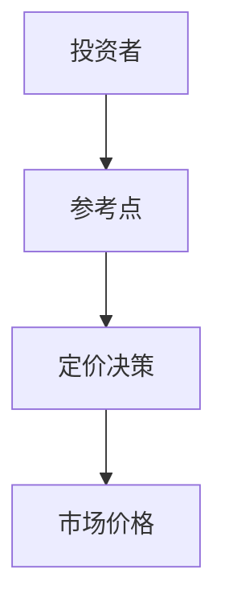
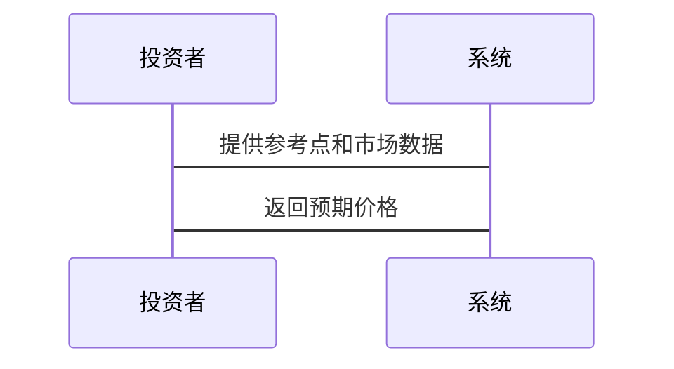

                 


# 锚定效应：参考点如何影响资产定价

---

## 关键词
锚定效应, 参考点, 资产定价, 行为金融学, 心理学

---

## 摘要
本文探讨了锚定效应在资产定价中的重要影响。通过分析参考点如何影响投资者的决策，结合行为金融学和心理学理论，详细阐述了锚定效应的形成机制及其在股票和房地产市场中的实际应用。文章还提供了数学模型和系统设计，帮助读者理解如何在实际中应用这些理论。

---

# 第1章：背景介绍

## 1.1 锚定效应的基本概念
- **1.1.1 什么是锚定效应**  
  锚定效应是指人们在做决策时，会受到某个初始参考点（锚点）的影响，导致决策偏离实际价值。  
  $$\text{锚定效应} = \text{参考点} + \text{调整偏差}$$  

- **1.1.2 锚定效应在资产定价中的重要性**  
  资产定价是一个复杂的过程，投资者往往会参考历史价格、市场趋势等作为锚点，从而影响定价决策。

- **1.1.3 研究锚定效应的意义**  
  理解锚定效应有助于揭示资产定价中的非理性行为，为投资者和政策制定者提供更科学的决策依据。

---

## 1.2 锚定效应的背景与重要性
- **1.2.1 资产定价的基本原理**  
  资产定价通常基于市场供求、基本面分析等因素，但心理学因素（如锚定效应）也起着重要作用。

- **1.2.2 锚定效应在资产定价中的作用**  
  锚定效应导致投资者过度依赖参考点，影响资产的合理定价，引发市场波动。

- **1.2.3 研究锚定效应的意义**  
  通过研究锚定效应，可以帮助投资者避免非理性决策，提高资产定价的准确性。

---

# 第2章：锚定效应的核心概念

## 2.1 参考点的定义与属性
- **2.1.1 参考点的定义**  
  参考点是投资者在决策过程中用来作为基准的点，通常是历史价格、市场指数等。

- **2.1.2 参考点的属性特征对比表格**  
  | 属性         | 特征描述                              |
  |--------------|--------------------------------------|
  | 时间性       | 受时间因素影响，如历史价格           |
  | 心理因素     | 受投资者心理预期影响                 |
  | 可调整性     | 可根据市场变化进行调整             |

- **2.1.3 参考点的ER实体关系图**  
  使用Mermaid绘制的实体关系图展示了参考点与资产定价的关系：
  ```mermaid
  graph TD
      A[资产] --> B[参考点]
      B --> C[定价决策]
      C --> D[市场价格]
  ```

---

## 2.2 锚定效应的形成机制
- **2.2.1 心理学基础**  
  锚定效应源于人类认知的局限性，人们倾向于依赖第一个获得的信息作为决策的基础。

- **2.2.2 行为金融学理论**  
  行为金融学认为，投资者的非理性行为（如锚定效应）会影响市场定价。

- **2.2.3 参考点的选择与调整**  
  参考点的选择受个体差异、市场环境等多种因素影响，且会随市场变化动态调整。

---

# 第3章：锚定效应的数学模型与统计分析

## 3.1 锚定效应的数学模型
- **3.1.1 预期形成机制的数学表达**  
  $$\text{预期价格} = \text{参考点} + \text{调整因子} \times \text{偏差}$$  

- **3.1.2 参考点偏差模型**  
  $$\text{实际定价} = \text{参考点} + \beta \times \text{偏差}$$  

- **3.1.3 统计方法与假设检验**  
  使用回归分析检验参考点对资产定价的影响：
  $$\text{回归模型} = \alpha + \beta \times \text{参考点} + \epsilon$$  

---

## 3.2 算法原理与流程图
- **3.2.1 算法流程图（使用Mermaid）**  
  ```mermaid
  graph TD
      A[开始] --> B[确定参考点]
      B --> C[计算偏差]
      C --> D[调整定价]
      D --> E[结束]
  ```

- **3.2.2 算法实现的Python代码示例**  
  ```python
  def anchor_effect(reference_point, beta=0.5):
      expected_price = reference_point + beta * (reference_point - market_price)
      return expected_price

  reference_point = 100
  beta = 0.5
  expected_price = anchor_effect(reference_point, beta)
  print("预期价格:", expected_price)
  ```

---

## 3.3 系统分析与架构设计方案

### 3.3.1 问题场景介绍
投资者在做决策时，锚定效应会影响其对资产价格的判断，导致定价偏离实际价值。

### 3.3.2 系统功能设计（领域模型Mermaid类图）


### 3.3.3 系统架构设计（Mermaid架构图）


### 3.3.4 系统接口设计
- 投资者输入参考点和市场数据。
- 系统计算预期价格并返回结果。

### 3.3.5 系统交互（Mermaid序列图）


---

## 3.4 项目实战
- **股票市场案例分析**  
  分析某股票的历史价格和市场指数，计算预期价格并验证锚定效应的影响。

- **房地产市场案例分析**  
  以某地区房地产价格为例，分析参考点如何影响房价的定价。

---

## 3.5 项目小结
通过实际案例分析，验证了锚定效应在资产定价中的实际影响，展示了如何通过数学模型和系统设计来理解和应用这些理论。

---

# 第4章：资产定价中的锚定效应

## 4.1 股票市场的锚定效应
- **4.1.1 股票价格的参考点分析**  
  历史价格、市场指数等是投资者常用的参考点。

- **4.1.2 投资者行为中的锚定效应**  
  投资者倾向于参考最近的价格变化，导致价格波动。

- **4.1.3 股票市场案例分析**  
  以某股票为例，分析参考点如何影响其定价。

## 4.2 房地产市场的锚定效应
- **4.2.1 房地产价格的参考点分析**  
  历史价格、区域经济指标等是重要的参考点。

- **4.2.2 房地产市场案例分析**  
  以某地区为例，分析参考点对房价的影响。

---

# 第5章：总结与展望

## 5.1 总结
本文详细探讨了锚定效应在资产定价中的影响，结合行为金融学和心理学理论，分析了其形成机制和实际应用。

## 5.2 最佳实践 tips
- 投资者应避免过度依赖参考点，考虑更多因素。
- 政策制定者应通过教育和监管减少锚定效应的负面影响。

## 5.3 小结
锚定效应是一个复杂的心理学现象，理解其影响有助于提高资产定价的科学性和准确性。

## 5.4 注意事项
投资者需警惕锚定效应带来的非理性决策，结合多方面信息进行判断。

## 5.5 拓展阅读
建议阅读行为金融学相关书籍，深入了解其他认知偏差对资产定价的影响。

---

通过以上结构，文章详细分析了锚定效应在资产定价中的影响，结合理论与实际案例，为读者提供了全面的理解和应用指导。

