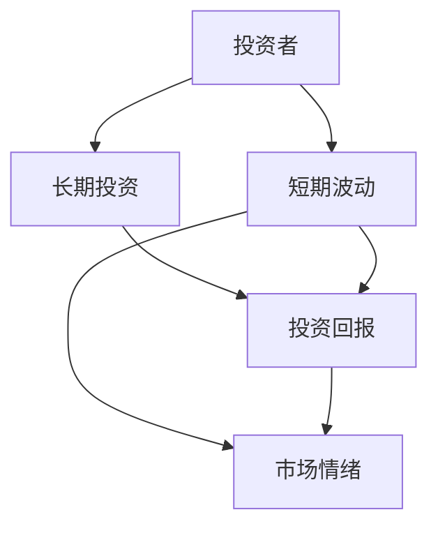
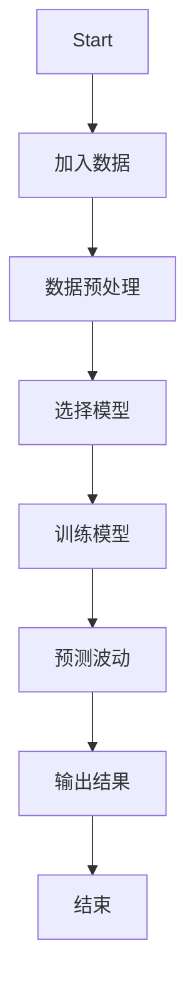

                 

# 长期投资者如何看待短期市场波动

## 关键词：长期投资、短期波动、市场情绪、风险管理、投资策略

## 摘要：  
在金融市场中，短期市场波动常常让投资者感到困惑和焦虑，但长期投资者需要超越短期波动的干扰，关注长期投资目标的实现。本文从理论基础、实际案例分析、风险管理等多个维度，深入探讨长期投资者如何应对短期市场波动，保持投资策略的稳定性与有效性。文章结合技术分析与行为金融学的视角，帮助投资者在复杂多变的市场环境中做出明智决策。

---

# 第一部分：长期投资者与短期市场波动的背景介绍

## 第1章：长期投资与短期波动的定义与背景

### 1.1 长期投资的核心概念

#### 1.1.1 长期投资的定义与特点
- **定义**：长期投资是指投资者将资金投入某种资产（如股票、债券或房地产）并持有较长时间（通常为数年）以获得资本增值或收益的投资方式。
- **特点**：
  - **时间跨度长**：投资期限通常为3年以上。
  - **目标明确**：追求资产的长期增值，而非短期收益。
  - **风险承受能力高**：能够容忍短期波动，关注长期收益。

#### 1.1.2 短期市场波动的定义与表现形式
- **定义**：短期市场波动指在短时间内市场价格的快速上涨或下跌，通常由市场情绪、突发事件或宏观经济因素引发。
- **表现形式**：
  - 市场价格的剧烈波动。
  - 投资者情绪的迅速变化。
  - 交易量的突然增加或减少。

#### 1.1.3 长期投资与短期波动的关系
- **相互影响**：短期波动可能会影响长期投资的短期表现，但长期投资的目标是通过时间平滑波动，实现资产增值。
- **动态平衡**：长期投资者需要在短期波动与长期目标之间找到平衡点，避免因短期波动而做出错误决策。

### 1.2 市场波动的成因分析

#### 1.2.1 市场情绪与投资者行为
- **市场情绪**：投资者情绪的变化是引发短期波动的重要因素。例如，恐慌性抛售或乐观性买入会导致市场价格的剧烈波动。
- **投资者行为**：个体投资者的行为（如跟风、恐慌性交易）会放大市场的短期波动。

#### 1.2.2 宏观经济因素对市场波动的影响
- **经济周期**：经济的繁荣、衰退、复苏和萧条周期会影响市场波动。
- **政策变化**：政府政策（如财政刺激、货币政策调整）会引发市场波动。
- **国际局势**：地缘政治冲突、贸易摩擦等国际事件也会对市场产生影响。

#### 1.2.3 市场结构与流动性对波动的放大效应
- **市场结构**：高频交易、算法交易等现代市场结构会放大短期波动。
- **流动性**：市场的流动性不足会导致价格的大幅波动。

### 1.3 长期投资在波动市场中的优势

#### 1.3.1 长期投资的稳定性与抗风险能力
- 长期投资通过分散投资、资产配置等方式降低风险。
- 长期视角能够平滑短期波动的影响，实现资产的长期增值。

#### 1.3.2 短期波动对长期投资目标的影响
- 短期波动不会改变长期投资的目标，但可能影响短期表现。
- 长期投资者需要耐心等待市场回归理性。

#### 1.3.3 长期投资与短期波动的平衡点
- **制定合理的投资策略**：在波动中坚持长期目标，避免盲目跟风。
- **心理调整**：长期投资者需要具备稳定的心理素质，避免因短期波动而恐慌。

## 1.4 本章小结
本章从长期投资与短期波动的定义出发，分析了市场波动的成因，并探讨了长期投资在波动市场中的优势。通过理解短期波动与长期投资的关系，投资者能够更好地应对市场的不确定性。

---

## 第2章：长期投资与短期波动的核心概念原理

### 2.1 长期投资的理论基础

#### 2.1.1 现代投资组合理论（MPT）
- **定义**：MPT由Harry Markowitz提出，认为通过合理配置资产可以最大化收益并最小化风险。
- **核心思想**：通过分散投资降低风险，实现收益的最大化。

#### 2.1.2 帕累托效率与市场均衡
- **帕累托效率**：资源分配达到最优状态，无法通过调整使某些人受益而不使其他人受损。
- **市场均衡**：供需力量的相互作用使得市场价格达到平衡状态。

#### 2.1.3 资本资产定价模型（CAPM）
- **定义**：CAPM用于确定资产的预期收益，考虑了系统性风险和非系统性风险。
- **公式**：
  $$ E(r_i) = R_f + \beta_i (E(r_m) - R_f) $$
  其中：
  - \( E(r_i) \) 是资产 \( i \) 的预期回报率。
  - \( R_f \) 是无风险利率。
  - \( \beta_i \) 是资产 \( i \) 的贝塔系数，衡量其系统性风险。
  - \( E(r_m) \) 是市场预期回报率。

### 2.2 短期波动的特征与规律

#### 2.2.1 市场波动的周期性分析
- **波动周期**：市场波动通常呈现周期性，包括上升、下跌、震荡等阶段。
- **周期性规律**：短期波动可能在一定周期内重复，但长期趋势难以预测。

#### 2.2.2 市场情绪指标与波动预测
- **指标分析**：使用市场情绪指标（如恐慌指数VIX）预测市场波动。
- **波动预测**：通过技术分析和统计模型预测短期波动的可能性。

#### 2.2.3 市场波动的随机性与可预测性
- **随机性**：短期波动具有一定的随机性，难以完全预测。
- **可预测性**：通过历史数据分析和模型构建，可以部分预测波动。

### 2.3 长期投资与短期波动的关联性分析

#### 2.3.1 长期投资视角下的短期波动影响
- **短期波动的干扰**：短期波动可能影响投资者的短期收益，但不会改变长期目标。
- **长期视角的优势**：长期投资者能够忽略短期波动，专注于长期收益。

#### 2.3.2 短期波动对长期投资策略的挑战
- **策略调整**：短期波动可能迫使投资者调整投资策略，但长期投资者需要坚持既定目标。
- **心理挑战**：短期波动可能引发投资者的恐慌或贪婪情绪，影响投资决策。

#### 2.3.3 长期与短期视角的动态平衡
- **动态调整**：在波动加剧时，长期投资者需要适当调整投资组合，降低短期风险。
- **长期视角的坚持**：在市场平静时，回归长期目标，避免被短期波动干扰。

### 2.4 核心概念对比分析

#### 2.4.1 长期投资与短期波动的属性特征对比
| 属性        | 长期投资                | 短期波动                |
|-------------|-------------------------|-------------------------|
| 时间跨度    | 数年以上                | 几天到几个月            |
| 目标         | 资产增值                | 短期收益或损失          |
| 风险承受能力| 高                     | 较低                   |
| 决策依据     | 长期趋势和基本面分析    | 短期市场情绪和新闻      |

#### 2.4.2 长期投资与短期波动的ER实体关系图

---

## 第3章：短期市场波动的预测与分析

### 3.1 市场波动预测的算法原理

#### 3.1.1 时间序列分析
- **ARIMA模型**：用于预测时间序列数据，通过自回归和移动平均部分拟合数据。
  $$ ARIMA(p, d, q) $$
  - \( p \)：自回归阶数。
  - \( d \)：差分阶数。
  - \( q \)：移动平均阶数。

#### 3.1.2 随机游走模型
- **定义**：假设价格变化是随机的，无法通过历史数据预测未来走势。
- **公式**：
  $$ P_{t} = P_{t-1} + \epsilon $$
  其中，\( \epsilon \) 是随机误差项。

#### 3.1.3 GARCH模型
- **定义**：广义自回归条件异方差模型，用于预测金融时间序列的波动性。
  $$ GARCH(p, q) = \alpha_0 + \sum_{i=1}^p \alpha_i r_{t-i}^2 + \sum_{j=1}^q \beta_j r_{t-j}^2 $$
  - \( \alpha_i \) 和 \( \beta_j \) 是模型参数。
  - \( r_{t} \) 是资产收益率。

### 3.2 基于机器学习的波动预测

#### 3.2.1 支持向量回归（SVR）
- **原理**：使用支持向量机进行回归分析，预测市场波动。
- **优点**：适合小样本数据，能够捕捉非线性关系。

#### 3.2.2 长短期记忆网络（LSTM）
- **原理**：使用循环神经网络（RNN）的变体，能够捕捉时间序列中的长期依赖关系。
- **优点**：适合处理序列数据，预测能力较强。

#### 3.2.3 强化学习在波动预测中的应用
- **原理**：通过强化学习算法（如Q-Learning）训练智能体，使其在市场环境中做出最优决策。
- **优点**：能够动态适应市场变化，但实现复杂。

### 3.3 波动预测的数学模型

#### 3.3.1 时间序列模型
$$ ARIMA(p, d, q) $$

#### 3.3.2 GARCH模型的数学公式
$$ GARCH(p, q) = \alpha_0 + \sum_{i=1}^p \alpha_i r_{t-i}^2 + \sum_{j=1}^q \beta_j r_{t-j}^2 $$

### 3.4 算法流程图

---

## 第4章：长期投资者应对短期波动的策略

### 4.1 制定合理的投资策略

#### 4.1.1 资产配置的重要性
- **分散投资**：通过配置不同资产（股票、债券、房地产等）降低风险。
- **风险控制**：设定止损点，避免过度亏损。

#### 4.1.2 长期视角下的短期波动应对
- **忽略短期波动**：关注长期趋势，避免因短期波动做出错误决策。
- **定期调整**：根据市场变化适当调整投资组合，确保与长期目标一致。

### 4.2 心理调整与纪律性

#### 4.2.1 避免情绪化决策
- **理性分析**：在市场波动中保持冷静，避免被情绪左右。
- **纪律性**：坚持投资计划，避免频繁交易。

#### 4.2.2 建立正确的投资观念
- **长期视角**：理解短期波动是市场的一部分，不会影响长期目标。
- **耐心与信心**：相信长期投资的力量，避免因短期亏损而放弃。

### 4.3 风险管理与波动应对

#### 4.3.1 识别潜在风险
- **市场风险**：经济衰退、政策变化等可能引发市场波动。
- **流动性风险**：市场流动性不足可能导致价格大幅波动。

#### 4.3.2 应对策略
- **多样化投资**：通过投资不同资产类别分散风险。
- **定期再平衡**：根据市场变化调整投资组合，保持风险可控。

---

## 第5章：经典投资策略与长期投资的结合

### 5.1 价值投资与长期投资
- **价值投资**：寻找被市场低估的资产，长期持有，等待价值回归。
- **经典案例**：巴菲特的投资理念。

### 5.2 股票投资策略
- **基本面分析**：关注企业的财务状况、行业地位和竞争优势。
- **技术分析**：通过价格走势预测短期波动，辅助投资决策。

### 5.3 债券投资与长期投资
- **债券投资**：通过固定收益资产稳定投资组合。
- **长期策略**：选择信誉良好的债券，确保长期收益。

### 5.4 资产配置与投资组合管理
- **分散投资**：通过配置不同资产降低风险。
- **动态调整**：根据市场变化调整资产配置比例。

---

## 第6章：长期投资者如何在波动中保持稳定

### 6.1 长期视角下的短期波动应对
- **坚持长期目标**：忽略短期波动，专注于长期收益。
- **灵活调整策略**：在波动加剧时适当调整投资组合，降低风险。

### 6.2 风险管理与心理调整
- **建立风险管理机制**：设定止损点，避免过度亏损。
- **保持心理稳定**：避免因短期波动而做出错误决策。

### 6.3 持续学习与优化
- **学习市场知识**：了解市场动态，提升投资能力。
- **优化投资策略**：根据市场变化不断优化投资组合。

---

## 第7章：总结与展望

### 7.1 本章总结
- 长期投资者需要关注短期波动，但更应专注于长期目标。
- 通过合理的投资策略、心理调整和风险管理，能够在波动市场中保持稳定。

### 7.2 展望
- 未来市场波动可能更加复杂，长期投资者需要不断提升自己的投资能力。
- 结合技术分析与基本面分析，制定更加科学的投资策略。

---

## 参考文献与进一步阅读
1. 巴菲特：《巴菲特致股东的信》
2. 格雷厄姆：《证券分析》
3. 现代投资组合理论（MPT）相关文献
4. GARCH模型与波动预测的研究论文

---

通过以上分析，长期投资者可以更好地理解短期市场波动，并制定有效的投资策略，实现长期的财富增长。

