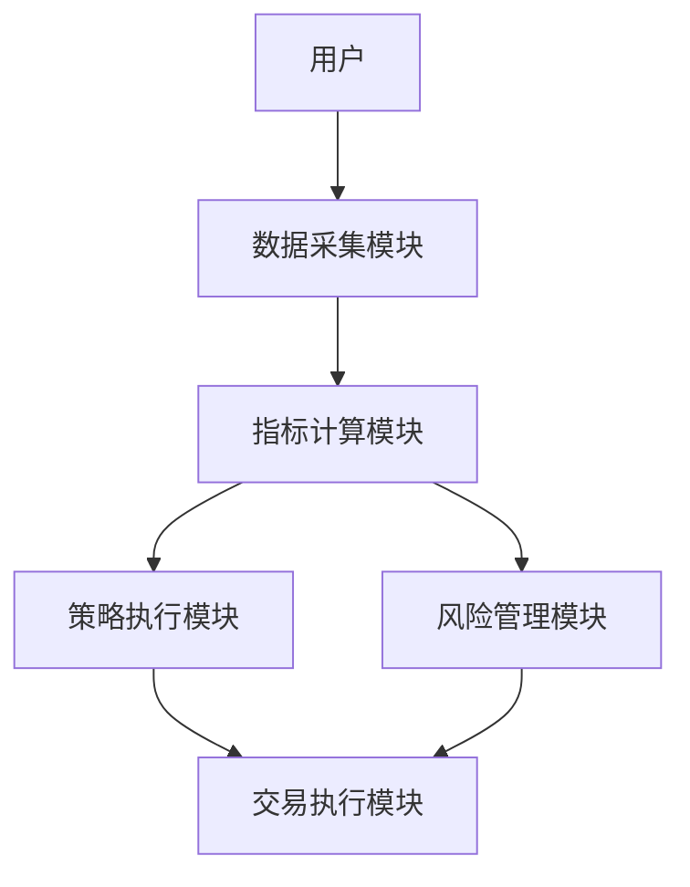

                 


# 长期持有 vs 频繁交易：巴菲特的选择

> 关键词：长期持有、频繁交易、巴菲特、价值投资、投资策略、风险管理

> 摘要：本文通过分析长期持有和频繁交易的投资策略，探讨了这两种策略的优劣势，并结合巴菲特的投资哲学，深入剖析了长期持有策略的核心理念及其成功案例。文章还从数学模型、算法原理、系统设计等多个维度，详细比较了两种策略的差异，最后结合实际案例，提出了风险管理的重要性。

---

## 第一部分：长期持有与频繁交易的背景与核心概念

### 第1章：长期持有与频繁交易的定义与特点

#### 1.1 长期持有的定义与特点
- **长期持有**：指投资者买入股票后长期持有，不频繁进行买卖操作。
  - **优势**：避免频繁交易的手续费，复利效应显著，降低交易风险。
  - **劣势**：需要较长的时间周期，对市场波动的容忍度较高，需承担较长时期的市场波动风险。
  
- **与频繁交易的对比**：
  - 长期持有注重企业的内在价值，频繁交易关注短期市场波动。
  - 长期持有适合稳健型投资者，频繁交易适合风险承受能力强的投资者。

#### 1.2 频繁交易的定义与特点
- **频繁交易**：指投资者频繁买卖股票，以捕捉短期市场波动带来的收益。
  - **优势**：可能获得短期收益，灵活应对市场变化。
  - **劣势**：交易成本高，市场摩擦大，容易受到情绪影响，操作难度大。

---

### 第2章：长期持有与频繁交易的优劣势分析

#### 2.1 长期持有的优劣势
- **优势**：
  - 复利效应显著，长期收益可能超过频繁交易。
  - 避免了频繁交易中的交易成本和税费。
  - 降低市场波动对企业长期价值的影响。
  
- **劣势**：
  - 需要较长的时间周期，资金流动性较低。
  - 需要较高的选股能力，选择优质企业。
  - 心理压力较大，需面对短期市场波动。

#### 2.2 频繁交易的优劣势
- **优势**：
  - 可能获得较高的短期收益。
  - 灵活性高，可以根据市场变化及时调整仓位。
  
- **劣势**：
  - 交易成本高，影响长期收益。
  - 需要精准判断市场短期走势，难度较大。
  - 心理压力大，容易受到市场波动影响。

---

### 第3章：巴菲特的选择与长期持有的投资哲学

#### 3.1 巴菲特的投资理念
- **价值投资**：巴菲特强调购买具有持续竞争优势的企业，长期持有，等待企业价值的实现。
- **长期持有**：巴菲特认为市场波动是短期的，而企业的内在价值是长期的，因此长期持有优质企业是最佳策略。
- **对频繁交易的评价**：巴菲特不看好频繁交易，认为其难以持续获得超额收益。

#### 3.2 巴菲特的投资哲学对长期持有的影响
- **长期持有与企业价值分析**：巴菲特定价买入优质企业，长期持有，等待企业价值增长。
- **长期持有与市场波动的关系**：市场波动为长期投资者提供了廉价买入优质资产的机会。
- **对短期交易的评价**：巴菲特认为频繁交易容易受到情绪影响，难以长期稳定盈利。

---

## 第二部分：长期持有与频繁交易的数学模型与算法原理

### 第4章：长期持有与频繁交易的数学模型

#### 4.1 长期持有的数学模型
- **收益计算公式**：
  $$\text{最终收益} = \text{初始本金} \times (1 + r)^n$$
  其中，\( r \) 是年化收益率，\( n \) 是投资年数。
- **复利效应**：长期持有通过复利效应，使收益呈指数级增长。
- **市场波动的数学关系**：长期持有可以平滑市场波动的影响，通过时间分散风险。

#### 4.2 频繁交易的数学模型
- **收益计算公式**：
  $$\text{最终收益} = \text{初始本金} \times (1 - c)^m$$
  其中，\( c \) 是每次交易的平均成本，\( m \) 是交易次数。
- **交易成本的影响**：频繁交易的总收益会因交易成本的积累而显著下降。

---

### 第5章：长期持有与频繁交易的算法原理

#### 5.1 长期持有的算法原理
- **投资策略**：买入优质企业，长期持有，定期复盘和调整仓位。
- **风险管理算法**：
  - 分散投资：避免过度集中，降低风险。
  - 估值调整：根据企业估值变化，动态调整持仓。
- **市场分析算法**：通过基本面分析，选择具有持续竞争优势的企业。

#### 5.2 频繁交易的算法原理
- **投资策略**：
  - 技术分析：通过K线图、均线、MACD等指标判断买卖时机。
  - 基本面分析：关注短期市场波动，捕捉价格波动机会。
- **风险管理算法**：
  - 止损策略：设置止损点，避免亏损过大。
  - 资金管理：合理分配资金，避免过度杠杆。

---

### 第6章：投资决策系统设计

#### 6.1 系统功能设计
- **数据采集模块**：获取实时市场数据，包括股价、成交量、财务指标等。
- **指标计算模块**：
  - 长期持有：计算市盈率、市净率、ROE等基本面指标。
  - 频繁交易：计算移动平均线、相对强度等技术指标。
- **策略执行模块**：
  - 长期持有：根据基本面指标，生成买入信号。
  - 频繁交易：根据技术指标，生成买卖信号。
- **风险管理模块**：控制仓位比例，设置止损和止盈。

#### 6.2 系统架构设计
- **系统架构图**（使用 Mermaid）：


---

## 第三部分：项目实战与案例分析

### 第7章：长期持有策略的实战分析

#### 7.1 环境安装
- **工具**：Python、Pandas、NumPy、Matplotlib、TradingStrategy框架。

#### 7.2 核心实现代码
```python
import pandas as pd
import numpy as np

def calculate_long_term_returns(prices, initial_investment):
    # 计算复利收益
    returns = prices.pct_change().dropna()
    cumulative_returns = (1 + returns).cumprod()
    final_value = initial_investment * cumulative_returns.iloc[-1]
    return final_value

# 示例数据
prices = pd.DataFrame({'AAPL': [100, 110, 120, 90, 130]})
initial_investment = 1000
long_term_return = calculate_long_term_returns(prices, initial_investment)
print(f"长期持有收益：${long_term_return:.2f}")
```

---

### 第8章：风险管理与最佳实践

#### 8.1 风险管理的重要性
- **长期持有**：分散投资、定期复盘、关注企业基本面。
- **频繁交易**：严格止损、控制仓位、避免情绪化交易。

#### 8.2 最佳实践 Tips
- 长期持有适合稳健型投资者，频繁交易适合风险承受能力强且具备较高市场敏感度的投资者。
- 不论选择何种策略，都需要结合市场环境和个人能力，制定合理的投资计划。

---

## 结语

长期持有和频繁交易各有优劣，巴菲特的选择为我们提供了一个重要的启示：投资需要耐心和对企业的深刻理解。无论是长期持有还是频繁交易，风险管理都是投资成功的关键。在实际操作中，投资者需要根据自身情况和市场环境，选择适合自己的策略，并严格执行。

---

通过以上分析和实战案例，我们深入探讨了长期持有与频繁交易的差异，以及巴菲特选择长期持有的深层原因。希望本文能为读者在投资决策中提供有价值的参考。

