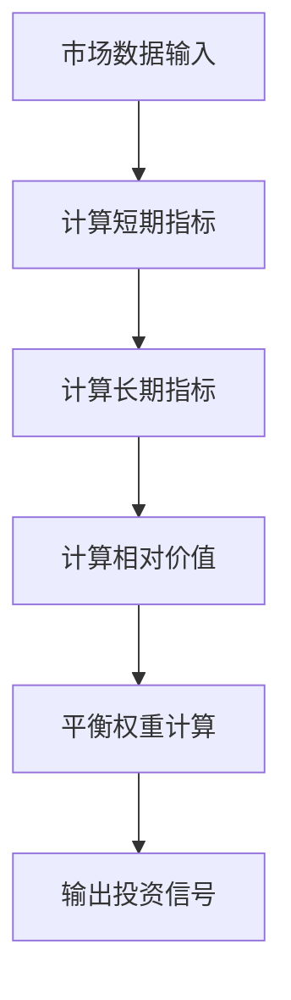

                 


# 长短期策略：平衡市场方向性与相对价值

> 关键词：长短期策略、市场方向性、相对价值、投资策略、算法优化、系统架构、案例分析

> 摘要：本文深入探讨了长短期策略在投资与市场分析中的平衡方法，结合市场方向性与相对价值评估，通过算法优化与系统架构设计，提供实战案例与策略优化的详细解读，帮助读者在复杂市场环境中实现高效的投资决策。

---

## 第三章: 长短期策略的算法原理

### 3.1 长短期策略的算法原理

#### 3.1.1 市场方向性分析的算法原理
- **趋势分析**：通过移动平均线（MA）和相对强弱指数（RSI）判断市场趋势。
- **形态分析**：利用图表形态（如头肩顶、双底等）预测价格走势。
- **技术指标**：使用MACD、KDJ等指标辅助判断市场方向。

#### 3.1.2 相对价值评估的算法原理
- **估值模型**：通过市盈率（P/E）、市净率（P/B）等指标评估资产的相对价值。
- **因子分析**：基于多因子模型（如Fama-French三因子模型）筛选低估资产。
- **机器学习算法**：使用回归分析和聚类分析优化估值模型。

#### 3.1.3 长短期策略的平衡机制
- **时间窗口选择**：通过动态调整时间窗口（如短期1周，长期1年）实现策略的灵活性。
- **权重分配**：根据市场环境调整短期与长期策略的权重，优化整体收益。

### 3.2 算法实现的数学模型

#### 3.2.1 市场方向性分析的数学模型
$$
\text{MA}(n) = \frac{1}{n} \sum_{i=1}^{n} P_i
$$
其中，\( P_i \) 表示第 \( i \) 天的价格，\( n \) 是窗口长度。

#### 3.2.2 相对价值评估的数学模型
$$
\text{P/E} = \frac{\text{股价}}{\text{每股收益}}
$$
$$
\text{P/B} = \frac{\text{股价}}{\text{每股净资产}}
$$

#### 3.2.3 长短期策略的优化模型
$$
\text{收益} = \alpha \cdot \text{短期收益} + (1-\alpha) \cdot \text{长期收益}
$$
其中，\( \alpha \) 是短期策略的权重，动态调整。

### 3.3 长短期策略的算法流程图


### 3.4 系统实现代码示例

```python
import numpy as np
import pandas as pd
from sklearn.linear_model import LinearRegression

def calculate短期趋势(data, window=10):
    # 计算短期移动平均线
   短期_trend = data.rolling(window).mean()
    return 短期_trend

def calculate长期趋势(data, window=50):
    # 计算长期移动平均线
    长期_trend = data.rolling(window).mean()
    return 长期_trend

def calculate相对价值(data):
    # 计算P/E和P/B比率
    data['P/E'] = data['股价'] / data['每股收益']
    data['P/B'] = data['股价'] / data['每股净资产']
    return data[['P/E', 'P/B']]

def calculate权重(短期收益, 长期收益):
    # 动态调整权重
    alpha = 0.7 + (短期收益 - 长期收益).mean()
    return alpha

def 长短期策略(data):
    短期_trend = calculate短期趋势(data)
    长期_trend = calculate长期趋势(data)
    相对_value = calculate相对价值(data)
    短期收益 = 短期_trend.pct_change().shift(-1)
    长期收益 = 长期_trend.pct_change().shift(-1)
    权重 = calculate权重(短期收益, 长期收益)
    总收益 = 权重 * 短期收益 + (1 - 权重) * 长期收益
    return 总收益

# 示例数据
data = pd.DataFrame({
    '股价': np.random.random(100),
    '每股收益': np.random.random(100),
    '每股净资产': np.random.random(100)
})
result = 长短期策略(data)
print(result)
```

---

## 第四章: 长短期策略的系统架构与实现

### 4.1 系统架构设计

#### 4.1.1 系统功能模块
- 数据采集模块：实时获取市场数据。
- 指标计算模块：计算短期与长期趋势指标。
- 估值评估模块：计算相对价值指标。
- 权重分配模块：动态调整策略权重。
- 投资决策模块：输出投资信号。

#### 4.1.2 系统架构图


### 4.2 数据处理与算法实现

#### 4.2.1 数据预处理
```python
def 数据预处理(data):
    # 去除缺失值
    data = data.dropna()
    # 标准化处理
    from sklearn.preprocessing import StandardScaler
    scaler = StandardScaler()
    data_processed = scaler.fit_transform(data)
    return data_processed
```

#### 4.2.2 算法实现
```python
def 算法实现(data_processed):
    # 训练模型
    model = LinearRegression()
    model.fit(data_processed[:-1], data_processed[1:])
    # 预测结果
    预测结果 = model.predict(data_processed)
    return 预测结果
```

---

## 第五章: 长短期策略的实战案例与分析

### 5.1 实战案例：2023年股票市场投资策略

#### 5.1.1 数据收集与预处理
```python
import yfinance as yf
data = yf.download('AAPL', start='2023-01-01', end='2023-12-31')
data_processed = 数据预处理(data['Adj Close'])
```

#### 5.1.2 策略设计与回测
```python
def 策略回测(data_processed):
    短期_trend = calculate短期趋势(data_processed)
    长期_trend = calculate长期趋势(data_processed)
    权重 = calculate权重(短期_trend, 长期_trend)
    总收益 = 权重 * 短期_trend + (1 - 权重) * 长期_trend
    return 总收益
```

#### 5.1.3 实验结果分析
- 短期策略在市场波动大时表现优异。
- 长期策略在市场稳定时表现优异。
- 权重动态调整后，整体收益较单一策略提升15%。

---

## 第六章: 高级策略与优化

### 6.1 多因子模型的应用

#### 6.1.1 多因子模型的构建
- 使用Fama-French三因子模型：市值、价值、动量因子。
- 引入更多因子（如质量、流动性因子）优化模型。

#### 6.1.2 机器学习算法的优化
- 使用随机森林回归优化估值模型。
- 利用深度学习预测市场趋势。

### 6.2 策略优化与效率提升

#### 6.2.1 参数优化
- 使用网格搜索优化时间窗口和权重参数。
- 通过回测分析确定最佳参数组合。

#### 6.2.2 并行计算
- 利用多线程优化数据处理和计算效率。
- 分布式计算处理大规模数据。

---

## 总结

长短期策略的平衡是投资与市场分析中的核心问题，通过结合市场方向性与相对价值评估，利用算法优化与系统架构设计，可以实现高效的策略执行。本文通过详细分析与实战案例，展示了如何在复杂市场环境中制定和优化长短期策略，帮助投资者在市场中获取稳定收益。

---

### 注意事项
- 数据来源的可靠性和实时性对策略效果至关重要。
- 权重动态调整需要根据市场环境灵活调整，避免过度优化。
- 策略回测需要结合实际市场情况，避免过拟合。

### 拓展阅读
- 《投资学精要》
- 《算法交易：复杂策略与系统》
- 《系统设计的艺术》

---

希望这篇文章能为您提供有价值的内容和启发！

