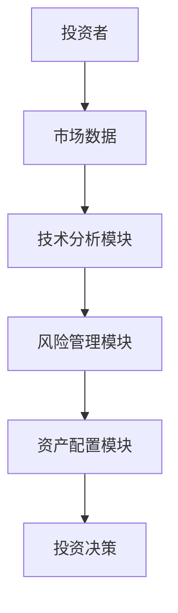

                 


# 防御性投资：在市场动荡中保护资本的策略

> 关键词：防御性投资、市场波动、风险管理、资产配置、投资策略、技术分析、资本保护

> 摘要：防御性投资是一种通过技术分析和策略规划来保护资本的稳健投资方式。本文将从市场波动的技术分析、资产配置的最优选择、风险管理的核心策略、防御性投资组合的构建等方面进行详细阐述。通过案例分析和数学模型，深入探讨防御性投资的技术细节与实战应用，为投资者提供在市场动荡中保护资本的有效策略。

---

## 第1章 引言

### 1.1 背景介绍
近年来，全球金融市场波动加剧，新冠疫情、地缘政治冲突、经济周期波动等因素都对资本市场造成了巨大冲击。在这样的环境下，投资者如何保护自己的资本不受到损失，成为了广泛关注的议题。

防御性投资是一种以稳健为导向的投资策略，旨在通过技术分析和策略规划，在市场波动中降低风险、保护资本。本文将从技术角度出发，分析防御性投资的核心原理、策略选择和实战应用。

### 1.2 核心概念与联系
#### 核心概念说明
- **防御性投资**：以保护资本为核心，通过技术分析和策略规划，选择低波动、高稳定的资产进行配置。
- **市场波动**：市场的短期波动性是防御性投资需要应对的核心挑战。
- **风险管理**：通过技术手段量化风险，制定相应的避险策略。
- **资产配置**：根据市场环境和技术分析结果，动态调整资产配置比例。

#### 核心概念与联系
通过技术分析和资产配置的结合，防御性投资能够在市场波动中实现资本的稳健增长。

---

## 第2章 市场波动的技术分析

### 2.1 市场波动的定义与技术特征
市场波动是指资产价格在短期内偏离长期趋势的现象。技术分析通过分析价格走势和成交量数据，预测市场波动的方向和幅度。

#### 市场波动的技术特征
- **趋势分析**：通过移动平均线（MA）和相对强弱指数（RSI）等指标，识别市场的趋势方向。
- **波动幅度分析**：通过标准差和波动率指标，量化市场的波动程度。
- **周期性分析**：市场波动通常具有周期性特征，可以通过历史数据分析预测未来波动。

#### 技术指标分析
- **RSI指标**：用于判断市场的超买超卖状态。
- **MACD指标**：用于判断市场的趋势强度。
- **布林带**：用于判断市场的波动范围。

### 2.2 防御性投资的技术分析策略
#### 技术分析策略
1. **趋势跟踪策略**：在市场趋势明确时，跟随趋势进行投资。
2. **波动率择时策略**：通过波动率指标选择低波动的市场环境进行投资。
3. **支撑与阻力策略**：利用技术分析中的支撑位和阻力位，判断买卖时机。

#### 技术分析与防御性投资的结合
通过技术分析，防御性投资者可以在市场波动中及时调整投资策略，规避风险。

---

## 第3章 防御性投资的资产配置

### 3.1 资产配置的核心原理
资产配置是防御性投资的重要组成部分。通过将资金分配到不同类型资产中，降低整体投资组合的波动性。

#### 资产配置的分类
- **股票**：具有较高的波动性和收益潜力。
- **债券**：相对稳定，波动性较低。
- **黄金**：作为避险资产，具有保值功能。
- **现金**：流动性高，作为应急资金使用。

### 3.2 资产配置的最优选择
#### 资产配置的数学模型
防御性投资的资产配置可以通过现代投资组合理论（MPT）进行优化。

$$
\text{最优资产配置} = \argmin_w \left( w^T \Sigma w \right)
$$

其中，\(w\) 是资产权重向量，\(\Sigma\) 是资产之间的协方差矩阵。

#### 动态资产配置策略
根据市场环境的变化，动态调整资产配置比例。例如，在市场波动加剧时，增加债券和现金的配置比例。

---

## 第4章 防御性投资的风险管理

### 4.1 风险管理的核心策略
#### 风险管理的三步走
1. **风险识别**：通过技术分析识别潜在风险。
2. **风险量化**：通过数学模型量化风险。
3. **风险对冲**：通过衍生品等工具对冲风险。

#### 风险管理的技术工具
- **止损订单**：在价格下跌到一定程度时自动卖出，避免进一步亏损。
- **对冲基金**：通过做多和做空相结合，降低投资组合的波动性。

### 4.2 技术分析中的风险管理
#### 仓位管理
通过技术分析确定合理的仓位比例，避免过度集中投资。

#### 交易纪律
严格按照技术分析信号进行交易，避免情绪化决策。

---

## 第5章 防御性投资组合的构建

### 5.1 投资组合构建的原则
#### 投资组合构建的数学模型
$$
\text{最优投资组合} = \argmin_w \left( w^T \Sigma w \right)
$$

其中，\(w\) 是资产权重向量，\(\Sigma\) 是资产之间的协方差矩阵。

#### 多目标优化
在风险可控的前提下，追求最大收益。

### 5.2 实战案例分析
#### 案例分析：2020年新冠疫情冲击下的防御性投资组合
- **资产配置**：60%债券，30%黄金，10%现金。
- **风险管理**：设置止损订单，避免进一步亏损。

---

## 第6章 防御性投资的技术架构

### 6.1 系统架构设计
#### 系统架构图


### 6.2 技术实现
#### 核心算法
$$
\text{收益} = \text{资产价格变化} \times \text{资产权重}
$$

#### 系统实现
通过量化交易平台，实现技术分析、资产配置和风险管理的自动化。

---

## 第7章 项目实战：防御性投资组合的优化

### 7.1 环境安装
#### 量化交易平台
- **回测工具**：如MetaTrader、TradingView。
- **编程语言**：Python、R。

### 7.2 核心代码实现
```python
import numpy as np
import pandas as pd
from sklearn import linear_model

# 数据加载
data = pd.read_csv('market_data.csv')

# 技术指标计算
data['MA'] = data['Close'].rolling(20).mean()
data['RSI'] = data['Close'].rolling(14).apply(lambda x: (x[-1] - x[0]) / (x[-1] - x[0]).std())

# 模型训练
model = linear_model.LinearRegression()
model.fit(data[['MA', 'RSI']], data['Close'])
```

### 7.3 投资组合优化
#### 投资组合优化的数学模型
$$
\text{最优权重} = \argmin_w \left( w^T \Sigma w \right)
$$

其中，\(w\) 是资产权重向量，\(\Sigma\) 是资产之间的协方差矩阵。

### 7.4 实战案例分析
#### 案例分析：2020年新冠疫情冲击下的防御性投资组合
- **资产配置**：60%债券，30%黄金，10%现金。
- **风险管理**：设置止损订单，避免进一步亏损。

---

## 第8章 总结与展望

### 8.1 总结
防御性投资是一种以稳健为导向的投资策略，通过技术分析和资产配置，在市场波动中保护资本。本文从技术角度详细分析了防御性投资的核心原理、策略选择和实战应用。

### 8.2 展望
随着人工智能和大数据技术的发展，防御性投资将更加智能化和自动化。投资者可以通过量化交易平台，实现技术分析、资产配置和风险管理的自动化。

---

## 第9章 最佳实践 Tips

1. **风险管理**：防御性投资的核心是风险管理，投资者需要通过技术手段量化风险，并制定相应的避险策略。
2. **资产配置**：根据市场环境的变化，动态调整资产配置比例，避免过度集中投资。
3. **技术分析**：通过技术分析识别市场波动，制定相应的投资策略。
4. **投资纪律**：严格按照技术信号进行交易，避免情绪化决策。

---

## 第10章 小结

防御性投资是一种以稳健为导向的投资策略，通过技术分析和资产配置，在市场波动中保护资本。本文从技术角度详细分析了防御性投资的核心原理、策略选择和实战应用。希望本文能够为投资者提供在市场动荡中保护资本的有效策略。

