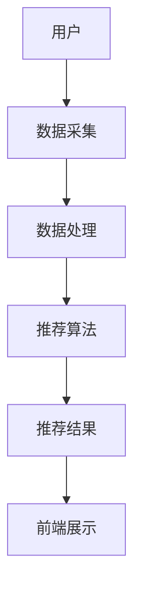

                 


# 零售业AI Agent：个性化推荐与客户洞察

## 关键词
- AI Agent
- 个性化推荐
- 客户洞察
- 零售业
- 机器学习
- 数据驱动

## 摘要
本文深入探讨AI Agent在零售业中的应用，特别是个性化推荐和客户洞察领域。通过分析零售业的痛点，介绍AI Agent的核心概念、算法原理、系统架构以及项目实战，帮助读者理解如何利用AI技术提升零售业的客户体验和业务效率。

---

# 第一部分：零售业AI Agent背景与概述

## 第1章：零售业的发展与AI Agent的引入

### 1.1 零售业的传统模式与痛点
- 传统零售业以货架式销售为主，难以满足消费者的个性化需求。
- 数据孤岛问题：消费者行为数据分散，难以整合和分析。
- 竞争加剧：线上线下的竞争使得传统零售业面临转型压力。

### 1.2 AI Agent的核心概念
- AI Agent：一种能够感知环境、自主决策并执行任务的智能体，能够根据用户行为实时调整推荐策略。
- 个性化推荐：基于用户行为数据，通过算法生成符合用户偏好的商品推荐。
- 客户洞察：通过分析客户数据，挖掘客户行为模式和需求偏好，优化客户体验。

### 1.3 AI Agent在零售业中的应用价值
- 提升客户满意度：通过个性化推荐增强客户购物体验。
- 提高销售转化率：通过精准推荐提升商品销售效率。
- 降低运营成本：通过自动化推荐减少人工干预，优化资源配置。

---

## 第2章：个性化推荐与客户洞察的背景

### 2.1 个性化推荐的定义与价值
- 定义：个性化推荐是基于用户行为数据，利用算法生成符合用户偏好的商品推荐。
- 价值：提升客户满意度，提高销售转化率，增强客户忠诚度。

### 2.2 客户洞察的核心要素
- 客户画像：通过数据分析构建客户的人口统计特征、消费习惯和偏好。
- 行为分析：分析客户的浏览、点击、购买等行为，挖掘潜在需求。
- 需求预测：基于历史数据和市场趋势，预测未来客户需求。

---

# 第二部分：AI Agent的核心概念与联系

## 第3章：AI Agent的核心原理

### 3.1 AI Agent的基本原理
- 感知与决策：通过传感器或数据输入感知环境，利用算法进行决策。
- 学习与优化：通过机器学习算法不断优化推荐策略，提升推荐准确度。
- 实时响应：根据实时数据动态调整推荐结果，满足用户即时需求。

### 3.2 个性化推荐的算法原理
- 协同过滤：基于用户行为数据，找到与目标用户相似的用户群体，推荐相似商品。
- 基于内容的推荐：分析商品属性和用户偏好，推荐与用户兴趣相符的商品。
- 深度学习推荐模型：利用神经网络模型，从大规模数据中学习用户偏好，生成推荐结果。

---

## 第4章：客户洞察的实体关系图

### 4.1 客户、产品与推荐系统的关系
```mermaid
erDiagram
    customer {
        id
        name
        age
        gender
        preferences
    }
    product {
        id
        name
        category
        price
        description
    }
    recommendation_system {
        id
        customer_id
        product_id
        recommendation_score
        timestamp
    }
    customer --> recommendation_system : 提供推荐请求
    product --> recommendation_system : 提供推荐结果
```

---

# 第三部分：算法原理与系统架构

## 第5章：算法原理与实现

### 5.1 协同过滤算法的实现
- 用户-商品矩阵：构建用户行为数据矩阵，记录用户对商品的评分或点击行为。
- 矩阵分解：通过奇异值分解（SVD）算法，将用户-商品矩阵分解为用户特征和商品特征，生成推荐结果。

### 5.2 基于内容的推荐算法
- 商品特征提取：提取商品的关键词、属性等特征，构建商品特征向量。
- 用户偏好匹配：根据用户的兴趣特征，匹配最相关的商品特征，生成推荐结果。

### 5.3 深度学习推荐模型
- 神经网络结构：设计一个多层感知机或卷积神经网络，输入用户和商品特征，输出推荐概率。
- 训练过程：通过梯度下降优化模型参数，最小化预测误差。

---

## 第6章：系统分析与架构设计

### 6.1 问题场景介绍
- 零售企业需要一个实时推荐系统，根据用户行为动态调整推荐策略。
- 系统需要处理大规模数据，支持高并发请求。

### 6.2 系统功能设计
- 数据采集模块：收集用户行为数据和商品信息。
- 数据处理模块：清洗、转换和存储数据，构建用户画像。
- 推荐算法模块：基于机器学习算法生成推荐结果。
- 推荐展示模块：将推荐结果展示在前端页面，供用户查看。

### 6.3 系统架构设计


---

## 第7章：项目实战与代码实现

### 7.1 环境安装
- 安装Python、TensorFlow、Pandas等开发工具和库。
- 配置数据库和推荐系统框架。

### 7.2 核心代码实现
```python
import numpy as np
from sklearn.metrics.pairwise import cosine_similarity

# 用户-商品矩阵
user_item_matrix = np.array([[1, 0, 1], [0, 1, 1], [1, 1, 0]])

# 协同过滤算法
def collaborative_filtering(matrix):
    # 计算余弦相似度
    similarity = cosine_similarity(matrix)
    # 生成推荐结果
    recommendations = np.dot(matrix, similarity)
    return recommendations

# 调用算法
recommendations = collaborative_filtering(user_item_matrix)
print(recommendations)
```

### 7.3 代码解读与分析
- 数据采集：从数据库中读取用户行为数据和商品信息。
- 数据处理：清洗数据，填充缺失值，标准化数据。
- 推荐算法：基于协同过滤算法生成推荐结果。
- 推荐展示：将推荐结果展示在前端页面，供用户查看。

---

## 第8章：最佳实践与注意事项

### 8.1 最佳实践
- 数据质量：确保数据的完整性和准确性，避免噪声数据干扰推荐结果。
- 模型调优：根据实际效果不断优化推荐算法，提升推荐准确度。
- 隐私保护：遵守数据隐私法规，保护用户数据安全。

### 8.2 小结
本文详细介绍了AI Agent在零售业中的应用，特别是个性化推荐和客户洞察领域。通过理论分析和实践案例，展示了如何利用AI技术提升零售业的客户体验和业务效率。

### 8.3 注意事项
- 数据隐私：在处理用户数据时，必须遵守相关法律法规，保护用户隐私。
- 模型解释性：确保推荐结果的可解释性，方便用户理解和信任推荐系统。
- 系统稳定性：设计高可用性的推荐系统，确保在高并发情况下稳定运行。

### 8.4 拓展阅读
- 《推荐系统实战》：深入讲解推荐系统的实现细节和优化方法。
- 《机器学习实战》：系统介绍机器学习算法的原理和应用。

---

# 结语
通过本文的介绍，读者可以全面了解AI Agent在零售业中的应用，从理论到实践，掌握如何利用AI技术提升零售业的客户体验和业务效率。希望本文能为零售业的数字化转型提供有价值的参考和指导。

