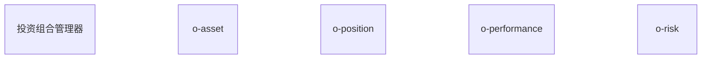
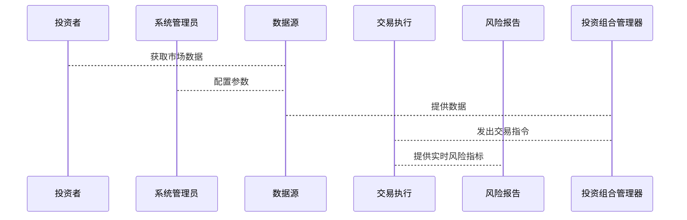

                 


# 《雷·达里奥的全天候投资组合理论》

> 关键词：全天候投资组合，风险平价，雷·达里奥，桥水基金，资产配置，经济环境，投资策略

> 摘要：本文深入探讨了雷·达里奥提出的全天候投资组合理论，分析了其核心概念、数学模型、系统架构以及在实际投资中的应用。文章从理论背景出发，逐步解析了风险平价、资产配置、经济环境识别等关键要素，并通过详细的数学公式和代码示例，展示了全天候投资策略的实现过程。最后，结合实际案例，探讨了该理论在投资实践中的优势与挑战。

---

# 第一部分：全天候投资组合理论的背景与核心概念

## 第1章：全天候投资组合理论的起源与背景

### 1.1 雷·达里奥与桥水基金简介

#### 1.1.1 雷·达里奥的生平与投资理念
雷·达里奥（Ray Dalio）是美国著名投资家、企业家和 philanthropist，桥水基金（Bridgewater Associates）的创始人和董事长。他以独特的投资理念和对市场的深刻理解闻名于世。达里奥的投资哲学强调纪律性、系统性和风险控制，主张通过量化分析和算法交易来捕捉市场机会。

#### 1.1.2 桥水基金的崛起与影响力
桥水基金是全球最大的对冲基金公司之一，管理着数千亿美元的资产。公司以量化投资和系统化交易闻名，其投资策略涵盖了股票、债券、商品等多种资产类别，并通过算法模型进行风险管理和收益优化。

#### 1.1.3 金融危机对投资理论的影响
2008年金融危机暴露了许多传统投资理论的缺陷，尤其是在资产配置和风险管理方面。达里奥提出的“全天候投资组合理论”正是在这一背景下应运而生，旨在通过系统化的资产配置和风险平价策略，应对不同经济环境下的市场波动。

### 1.2 投资组合理论的发展历程

#### 1.2.1 传统投资组合理论的局限性
传统投资组合理论（如马科维茨的现代投资组合理论）主要关注于单一资产的回报和风险，但在实际应用中，忽略了资产之间的相关性以及经济周期对资产表现的影响。此外，传统理论通常假设市场是完全理性的，但在现实中，市场的非理性波动和经济周期的变化对投资组合的收益和风险有重大影响。

#### 1.2.2 风险平价理论的提出
风险平价理论（Risk Parity）是全天候投资组合理论的核心思想之一。该理论认为，投资组合的权重不应仅基于资产的预期回报，而应基于资产的风险贡献。通过将不同资产的风险进行平价分配，可以降低组合的整体风险，同时提高收益的稳定性。

#### 1.2.3 全天候投资策略的形成
全天候投资策略的核心思想是通过分散投资于不同资产类别，以应对不同经济环境下的市场波动。策略的核心在于识别和预测经济周期的变化，并根据周期的变化调整资产配置。例如，在经济增长期，股票和债券的表现可能较好；而在通货膨胀期，商品和房地产可能更具优势。

---

## 第2章：全天候投资组合理论的核心概念

### 2.1 资产配置与风险平价

#### 2.1.1 资产配置的基本原理
资产配置是投资组合管理的核心，决定了不同资产在组合中的权重。传统的资产配置方法通常基于历史回报和波动率，但忽略了资产之间的相关性和经济周期的影响。

#### 2.1.2 风险平价的定义与计算
风险平价是一种基于资产风险贡献的配置方法。具体来说，每个资产的权重与其风险贡献成反比。公式如下：

$$ \text{权重}_i = \frac{\sigma_i}{\sum_{j=1}^{n} \sigma_j} $$

其中，$\sigma_i$ 表示资产 $i$ 的标准差，$\sum_{j=1}^{n} \sigma_j$ 是所有资产标准差的总和。

#### 2.1.3 风险平价与传统资产配置的对比
传统的资产配置方法通常基于预期回报，而风险平价方法则基于风险贡献。通过风险平价，可以降低组合的整体风险，同时提高收益的稳定性。例如，在市场波动剧烈时，风险平价组合能够更好地分散风险，避免单一资产的大幅波动对整个组合的影响。

### 2.2 经济环境与资产类别

#### 2.2.1 不同经济环境下的资产表现
经济周期的变化对资产表现有显著影响。例如，在经济增长期，股票和债券的表现较好；在通货膨胀期，商品和房地产可能更具优势。

#### 2.2.2 全天候策略的经济环境假设
全天候策略假设经济周期是可预测的，并且可以通过对不同资产类别的配置来应对经济周期的变化。例如，在经济增长期，股票和债券的权重较高；在通货膨胀期，商品和房地产的权重较高。

#### 2.2.3 典型资产类别的选择与权重分配
典型的资产类别包括股票、债券、商品和房地产等。根据经济周期的变化，每个资产类别的权重会有所不同。例如，在经济增长期，股票和债券的权重可能分别为40%和30%；在通货膨胀期，商品和房地产的权重可能分别为30%和20%。

### 2.3 组合优化与风险控制

#### 2.3.1 组合优化的目标
组合优化的目标是在给定的风险约束下，最大化预期回报，或者在给定的预期回报下，最小化风险。

#### 2.3.2 风险控制的实现
风险控制可以通过多种方式实现，例如通过调整资产权重、使用衍生品进行对冲，或者通过分散投资来降低组合的整体风险。

---

## 第3章：全天候投资组合理论的数学模型与公式

### 3.1 风险平价模型的数学推导

#### 3.1.1 风险平价模型的公式表示
风险平价模型的公式如下：

$$ \text{权重}_i = \frac{\sigma_i}{\sum_{j=1}^{n} \sigma_j} $$

其中，$\sigma_i$ 表示资产 $i$ 的标准差，$\sum_{j=1}^{n} \sigma_j$ 是所有资产标准差的总和。

#### 3.1.2 协方差矩阵的构建与应用
协方差矩阵用于描述资产之间的相关性。通过协方差矩阵，可以计算资产组合的风险和回报。公式如下：

$$ \text{Var}(r_p) = \sum_{i=1}^{n} \sum_{j=1}^{n} w_i w_j \sigma_{ij} $$

其中，$w_i$ 和 $w_j$ 是资产 $i$ 和 $j$ 的权重，$\sigma_{ij}$ 是资产 $i$ 和 $j$ 的协方差。

#### 3.1.3 风险平价模型的优化过程
风险平价模型的优化过程包括以下几个步骤：
1. 计算各资产的风险（标准差）。
2. 计算所有资产风险的总和。
3. 计算每个资产的权重，即权重等于该资产的风险除以总风险。

### 3.2 资产回报与风险的量化分析

#### 3.2.1 资产回报的期望值与方差
资产回报的期望值和方差可以通过历史数据计算得出。公式如下：

$$ E[r_i] = \mu_i $$
$$ \text{Var}(r_i) = \sigma_i^2 $$

其中，$\mu_i$ 是资产 $i$ 的期望回报，$\sigma_i^2$ 是资产 $i$ 的方差。

#### 3.2.2 组合回报与风险的计算公式
组合回报的期望值和方差可以通过以下公式计算：

$$ E[r_p] = \sum_{i=1}^{n} w_i \mu_i $$
$$ \text{Var}(r_p) = \sum_{i=1}^{n} \sum_{j=1}^{n} w_i w_j \sigma_{ij} $$

其中，$w_i$ 和 $w_j$ 是资产 $i$ 和 $j$ 的权重，$\sigma_{ij}$ 是资产 $i$ 和 $j$ 的协方差。

#### 3.2.3 组合风险的最小化
在给定的预期回报下，组合风险可以通过调整资产权重来最小化。这可以通过求解优化问题来实现。

### 3.3 经济环境下的资产轮动模型

#### 3.3.1 经济周期的划分与资产表现
经济周期通常分为四个阶段：复苏、繁荣、衰退和萧条。不同阶段下，不同资产的表现有所不同。

#### 3.3.2 不同经济环境下的资产权重调整
根据经济周期的变化，资产权重需要进行调整。例如，在经济增长期，股票和债券的权重较高；在通货膨胀期，商品和房地产的权重较高。

#### 3.3.3 资产轮动的数学模型
资产轮动模型可以通过以下公式表示：

$$ w_i(t) = f(t) \cdot w_i $$

其中，$w_i(t)$ 是资产 $i$ 在时间 $t$ 的权重，$f(t)$ 是根据经济环境调整的权重调整因子。

---

## 第4章：全天候投资组合理论的系统架构与实现

### 4.1 投资组合管理系统架构

#### 4.1.1 系统功能模块划分
投资组合管理系统通常包括以下几个功能模块：
1. 数据采集与处理
2. 资产配置与优化
3. 风险评估与对冲
4. 交易执行与监控
5. 绩效评估与报告

#### 4.1.2 系统架构的ER图设计
以下是投资组合管理系统的ER图：



#### 4.1.3 系统架构的实现
投资组合管理系统可以通过以下步骤实现：
1. 数据采集：获取市场数据，包括资产价格、收益率等。
2. 资产配置：根据经济环境和风险平价原则，计算各资产的权重。
3. 风险评估：计算组合的风险，包括方差、VaR等。
4. 交易执行：根据计算出的权重，执行交易指令。
5. 绩效评估：评估组合的绩效，包括回报、风险等。

### 4.2 系统实现与代码示例

#### 4.2.1 Python代码实现
以下是风险平价模型的Python代码示例：

```python
import numpy as np

def risk_parity(weights, covariance_matrix):
    # 计算组合风险
    portfolio_variance = np.dot(weights.T, np.dot(covariance_matrix, weights))
    # 计算风险贡献
    risk_contribution = np.sqrt(np.diag(np.dot(weights.T, covariance_matrix)))
    return risk_contribution / portfolio_variance

# 示例数据
n_assets = 3
weights = np.array([0.3, 0.4, 0.3])
covariance_matrix = np.array([
    [1, 0.5, 0.3],
    [0.5, 1, 0.4],
    [0.3, 0.4, 1]
])

# 计算风险平价权重
risk_contribution = np.sqrt(np.diag(np.dot(weights.T, covariance_matrix)))
total_risk = np.sum(risk_contribution)
new_weights = risk_contribution / total_risk

print("Risk contribution:", risk_contribution)
print("Total risk:", total_risk)
print("New weights:", new_weights)
```

#### 4.2.2 系统交互的实现
以下是系统交互的Mermaid序列图：



---

## 第5章：全天候投资组合理论的项目实战

### 5.1 项目背景与目标
本文将通过一个实际案例，展示如何利用全天候投资组合理论进行资产配置和风险管理。

### 5.2 项目实现步骤

#### 5.2.1 数据准备
需要收集不同资产的历史数据，包括股票、债券、商品等。

#### 5.2.2 计算风险平价权重
根据风险平价原则，计算各资产的权重。

#### 5.2.3 构建投资组合
根据计算出的权重，构建投资组合。

#### 5.2.4 风险评估与优化
评估组合的风险，并根据需要进行优化。

### 5.3 实际案例分析

#### 5.3.1 案例背景
假设当前经济处于通货膨胀期，我们需要配置更多的商品和房地产资产。

#### 5.3.2 资产配置方案
股票：30%
债券：20%
商品：30%
房地产：20%

#### 5.3.3 组合表现
计算组合的预期回报和风险，与市场基准进行比较。

### 5.4 代码实现与分析

#### 5.4.1 Python代码实现
以下是实际案例的Python代码实现：

```python
import numpy as np
import pandas as pd

# 示例数据
n_assets = 4
assets = ['股票', '债券', '商品', '房地产']
returns = pd.DataFrame({
    '股票': [0.1, 0.05, -0.02, 0.08],
    '债券': [0.03, 0.02, 0.05, 0.01],
    '商品': [0.08, -0.03, 0.07, 0.02],
    '房地产': [0.05, 0.04, -0.01, 0.06]
})

# 计算风险平价权重
covariance_matrix = returns.cov().values
weights = np.array([0.3, 0.2, 0.3, 0.2])

# 计算风险贡献
risk_contribution = np.sqrt(np.diag(np.dot(weights.T, covariance_matrix)))
total_risk = np.sum(risk_contribution)
new_weights = risk_contribution / total_risk

print("Risk contribution:", risk_contribution)
print("Total risk:", total_risk)
print("New weights:", new_weights)
```

#### 5.4.2 组合表现分析
根据计算结果，组合的风险和回报可以通过以下公式计算：

$$ E[r_p] = \sum_{i=1}^{n} w_i \mu_i $$
$$ \text{Var}(r_p) = \sum_{i=1}^{n} \sum_{j=1}^{n} w_i w_j \sigma_{ij} $$

通过比较组合的预期回报和风险，可以评估其在市场中的表现。

---

## 第6章：全天候投资组合理论的最佳实践与小结

### 6.1 最佳实践
1. **持续监控与调整**：根据经济环境的变化，定期调整资产配置。
2. **风险控制**：通过风险平价和分散投资来降低组合的整体风险。
3. **数据驱动**：利用历史数据和量化模型进行资产配置和风险评估。

### 6.2 小结
全天候投资组合理论通过系统化的资产配置和风险平价策略，能够有效应对不同经济环境下的市场波动。通过量化分析和算法交易，投资者可以在复杂多变的市场中实现稳定的投资回报。

### 6.3 注意事项
1. **数据质量**：确保数据的准确性和完整性。
2. **模型假设**：合理评估模型的假设和限制。
3. **市场风险**：注意市场波动和经济周期变化对组合的影响。

### 6.4 拓展阅读
1. 雷·达里奥的《投资最重要的事情》
2. 马科维茨的《投资学精要》
3. 其他相关投资组合管理的书籍和论文

