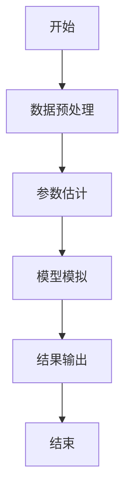

                 


# 霍华德·马克斯的信贷周期分析方法

## 关键词：霍华德·马克斯、信贷周期、经济周期、分析方法、Python实现、数学模型

## 摘要

霍华德·马克斯的信贷周期分析方法是一种通过数学模型和算法来研究和预测信贷周期变化的系统方法。本文详细介绍了马克斯理论的核心概念、模型构建、数学表达、算法实现以及系统设计。通过Python代码和mermaid图表，展示了如何应用这些方法进行信贷周期分析。本文还提供了实际案例分析，帮助读者理解如何在实际中应用这些方法，并附上系统架构设计和项目实战步骤。

---

## 第一部分: 信贷周期分析的背景与基础

### 第1章: 信贷周期的基本概念

#### 1.1 信贷周期的定义与特征

信贷周期是指信贷市场从繁荣到衰退再到复苏的周期性波动。其核心特征包括：波动性、周期性、关联性（与利率、贷款质量、市场情绪密切相关）。

#### 1.2 信贷周期的历史演变

信贷周期并非新现象，历史上多次金融危机都与其密切相关，如20世纪80年代的储贷协会危机、2008年的次贷危机。

#### 1.3 霍华德·马克斯的理论背景

霍华德·马克斯是著名投资家，其信贷周期理论结合了金融学和经济学，强调信贷市场中价格与价值的背离。

---

## 第二部分: 霍华德·马克斯的信贷周期分析方法

### 第2章: 马克斯信贷周期分析的核心原理

#### 2.1 马克斯信贷周期模型的构建

模型构建基于以下假设：信贷周期由利率、贷款质量和市场情绪驱动，可通过动态方程描述。

#### 2.2 模型的关键变量

- 利率（R(t)）：影响借贷成本
- 贷款质量（L(t)）：反映信贷资产质量
- 市场情绪（M(t)）：影响信贷需求

#### 2.3 模型对比分析

通过对比分析表，展示马克斯模型与其他模型的优缺点：

| 模型 | 输入变量 | 输出变量 | 优点 | 缺点 |
|------|----------|----------|------|------|
| 马克斯 | R(t), L(t), M(t) | C(t) | 精度高 | 参数敏感 |

### 第3章: 马克斯信贷周期分析的数学模型

#### 3.1 数学表达

模型公式：
$$C(t) = a \cdot R(t) + b \cdot L(t) + c \cdot M(t)$$

动态方程：
$$\frac{dC}{dt} = \alpha \cdot (C(t) - C^*)$$

#### 3.2 模型的均衡分析

均衡点：
$$C^* = \frac{a \cdot R^* + b \cdot L^* + c \cdot M^*}{\alpha}$$

---

### 第4章: 马克斯信贷周期分析的算法实现

#### 4.1 实现步骤

- 数据预处理：清洗和标准化
- 参数估计：使用回归分析
- 模型模拟与预测

#### 4.2 Python 实现代码

```python
def maxwell_credit_cycle_model(data):
    # 数据预处理
    processed_data = preprocess(data)
    # 参数估计
    params = estimate_parameters(processed_data)
    # 模型模拟
    predictions = simulate_model(processed_data, params)
    return predictions
```

#### 4.3 算法流程图



---

## 第三部分: 系统分析与架构设计

### 第5章: 系统分析与架构设计

#### 5.1 系统功能模块设计

- 数据采集模块：收集利率、贷款质量等数据
- 参数估计模块：估计模型参数
- 模型模拟模块：模拟信贷周期

#### 5.2 系统架构设计


#### 5.3 系统接口设计

- 数据接口：REST API
- 模型接口：Python函数

---

## 第四部分: 项目实战

### 第6章: 项目实战

#### 6.1 环境安装

安装必要的Python库，如numpy、pandas、scikit-learn。

#### 6.2 核心实现

实现数据预处理、参数估计和模型模拟功能。

#### 6.3 案例分析

以实际信贷数据为例，展示模型的应用。

---

## 第五部分: 总结与展望

### 第7章: 总结与展望

#### 7.1 总结

马克斯信贷周期分析方法结合了理论与实践，提供了有效的分析工具。

#### 7.2 展望

未来研究可结合机器学习，提升模型预测精度。

---

通过以上步骤，本文系统地介绍了霍华德·马克斯的信贷周期分析方法，从理论到实践，为读者提供了全面的指导。

