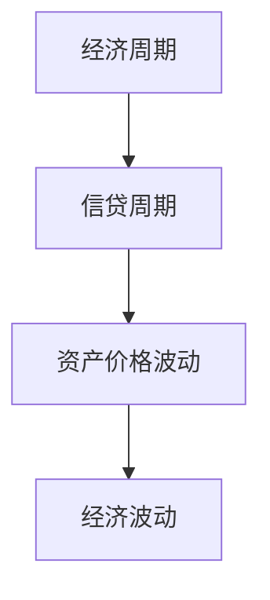

                 

# 《霍华德·马克斯的信贷周期投资策略》

> 关键词：霍华德·马克斯，信贷周期，投资策略，风险管理，经济周期，系统分析

> 摘要：本文系统地介绍了霍华德·马克斯的信贷周期投资策略，从理论基础到实际应用进行了详细阐述。文章首先分析了信贷周期的基本概念和驱动因素，然后探讨了霍华德·马克斯的理论框架和投资策略，结合数学模型和实际案例，深入分析了如何在不同信贷周期阶段进行资产配置和风险管理。最后，文章总结了该策略的优势和局限性，并提出了优化建议。

---

# 第1章 信贷周期的基本概念与背景

## 1.1 信贷周期的定义与特征

### 1.1.1 信贷周期的定义

信贷周期是指信贷市场从扩张到收缩，再从收缩到扩张的周期性波动过程。信贷周期的核心在于信贷市场的供需关系变化，以及由此引发的资产价格波动和经济波动。

信贷周期的定义可以分为以下几个方面：
- **时间跨度**：信贷周期通常以数年为单位，与经济周期密切相关。
- **波动性**：信贷周期表现为扩张期和收缩期的交替出现。
- **驱动因素**：信贷周期受宏观经济、市场情绪和金融机构行为的影响。

$$\text{信贷周期} = f(\text{宏观经济因素}, \text{市场情绪}, \text{金融机构行为})$$

### 1.1.2 信贷周期的核心特征

信贷周期的核心特征包括以下几个方面：

| 特征 | 描述 |
|------|------|
| 周期性 | 信贷周期呈现明显的周期性波动。 |
| 阶段性 | 信贷周期分为扩张期和收缩期。 |
| 不对称性 | 扩张期和收缩期的持续时间和影响程度不同。 |
| 加速性 | 信贷周期波动会放大经济波动。 |

### 1.1.3 信贷周期与经济周期的关系

信贷周期与经济周期密切相关，但并非完全一致。信贷周期是经济周期的重要驱动因素之一，尤其是在现代金融体系中，信贷市场的波动往往会导致经济周期的波动。

**图1-1：信贷周期与经济周期的关系**

---

## 1.2 霍华德·马克斯的信贷周期理论

### 1.2.1 霍华德·马克斯的生平简介

霍华德·马克斯（Howard Marks）是美国著名投资家，橡树资本（Oaktree Capital）的联合创始人。他以对信贷市场的深刻理解和独特的投资策略闻名，尤其在信贷周期理论方面贡献显著。

### 1.2.2 马克斯信贷周期理论的提出背景

马克斯的信贷周期理论提出于20世纪80年代，当时美国经济经历了多次信贷危机，尤其是1989年的储贷协会危机和1997年的亚洲金融危机。马克斯通过分析这些危机，总结出了信贷周期的规律，并提出了防御性投资策略。

### 1.2.3 理论的核心观点与创新点

马克斯信贷周期理论的核心观点是：
- 信贷市场存在周期性波动，投资者可以通过识别信贷周期所处阶段来优化投资决策。
- 在信贷周期的不同阶段，资产的风险和收益呈现不同的特征。

马克斯理论的创新点在于：
- 将信贷周期与投资策略相结合，提出了防御性投资和逆向投资策略。
- 强调风险管理和资产配置的重要性。

---

## 1.3 信贷周期与投资策略的关系

### 1.3.1 信贷周期对投资决策的影响

信贷周期对投资决策的影响主要体现在以下几个方面：
1. **资产价格波动**：信贷周期的波动会导致资产价格的波动，投资者需要根据信贷周期调整投资组合。
2. **风险偏好变化**：在信贷周期的扩张期，市场风险偏好上升；在收缩期，风险偏好下降。
3. **投资机会**：信贷周期的不同阶段提供不同的投资机会，例如在收缩期，债券的投资机会增加。

### 1.3.2 投资者如何利用信贷周期进行决策

投资者可以通过以下方式利用信贷周期进行投资决策：
1. **识别信贷周期阶段**：通过分析宏观经济指标和市场数据，判断信贷周期所处阶段。
2. **调整资产配置**：根据信贷周期阶段，调整股票、债券和其他资产的配置比例。
3. **风险管理**：在信贷周期的收缩期，加强风险控制，减少高风险资产的配置。

### 1.3.3 信贷周期在不同市场环境中的表现

信贷周期在不同市场环境中的表现有所不同，例如在成熟市场中，信贷周期的波动较为规律；在新兴市场中，信贷周期的波动更加剧烈。

---

## 1.4 本章小结

本章从信贷周期的基本概念和特征出发，介绍了霍华德·马克斯的信贷周期理论，分析了信贷周期对投资决策的影响，并探讨了投资者如何利用信贷周期进行投资决策。通过本章的学习，读者可以对信贷周期的基本理论和应用有一个全面的了解。

---

# 第2章 信贷周期的驱动因素与影响

## 2.1 宏观经济因素对信贷周期的影响

### 2.1.1 利率与信贷周期的关系

利率是影响信贷周期的重要因素。低利率环境下，企业和个人的贷款需求增加，信贷市场扩张；高利率环境下，贷款需求减少，信贷市场收缩。

$$\text{利率} \downarrow \Rightarrow \text{信贷需求} \uparrow$$

### 2.1.2 经济增长与信贷周期的互动

经济增长与信贷周期密切相关。经济增长加速时，信贷需求增加，信贷市场扩张；经济增长放缓时，信贷需求减少，信贷市场收缩。

$$\text{经济增长} \uparrow \Rightarrow \text{信贷需求} \uparrow$$

### 2.1.3 财政政策对信贷周期的调节作用

财政政策通过影响企业和个人的信贷需求，间接影响信贷周期。例如，政府通过财政刺激政策可以增加信贷需求，推动信贷市场扩张。

$$\text{财政刺激} \Rightarrow \text{信贷需求} \uparrow$$

---

## 2.2 市场情绪与信贷周期的关联

### 2.2.1 投资者情绪对信贷市场的推动作用

投资者情绪是信贷周期的重要驱动因素。在市场情绪乐观时，投资者风险偏好上升，信贷需求增加；在市场情绪悲观时，投资者风险偏好下降，信贷需求减少。

### 2.2.2 市场泡沫与信贷周期的关系

市场泡沫的形成和破裂与信贷周期密切相关。在信贷周期的扩张期，市场泡沫可能形成；在信贷周期的收缩期，市场泡沫破裂，引发资产价格下跌。

### 2.2.3 市场恐慌对信贷周期的影响

市场恐慌会导致信贷需求下降，信贷市场收缩。例如，2008年全球金融危机期间，市场恐慌导致信贷市场大幅收缩。

---

## 2.3 金融机构行为对信贷周期的塑造

### 2.3.1 银行信贷行为与信贷周期

银行作为信贷市场的主要参与者，其信贷行为对信贷周期有重要影响。在信贷周期的扩张期，银行增加贷款发放；在信贷周期的收缩期，银行减少贷款发放。

### 2.3.2 证券化与信贷周期的扩展

信贷证券化通过将信贷资产转化为证券，扩大了信贷市场的规模，同时也放大了信贷周期的波动。

### 2.3.3 机构投资者在信贷周期中的角色

机构投资者通过投资信贷资产，影响信贷市场的供需关系。在信贷周期的扩张期，机构投资者增加信贷资产配置；在信贷周期的收缩期，机构投资者减少信贷资产配置。

---

## 2.4 本章小结

本章分析了宏观经济因素、市场情绪和金融机构行为对信贷周期的影响，揭示了信贷周期的多维度驱动因素。通过本章的学习，读者可以更好地理解信贷周期的复杂性及其对投资决策的影响。

---

# 第3章 信贷周期的分析框架与模型

## 3.1 信贷周期的阶段划分

### 3.1.1 信贷周期的四个阶段

信贷周期通常分为四个阶段：
1. **扩张期**：信贷需求增加，资产价格上涨。
2. **繁荣期**：信贷需求进一步增加，资产价格达到高点。
3. **衰退期**：信贷需求减少，资产价格下跌。
4. **萧条期**：信贷需求极度减少，资产价格达到低点。

### 3.1.2 每个阶段的特征与表现

| 阶段 | 特征 | 表现 |
|------|------|------|
| 扩张期 | 信贷需求增加，资产价格上涨 | 贷款需求上升，资产价格上升 |
| 繁荣期 | 信贷需求进一步增加，资产价格达到高点 | 贷款需求继续增加，资产价格达到高点 |
| 衰退期 | 信贷需求减少，资产价格下跌 | 贷款需求下降，资产价格下跌 |
| 萧条期 | 信贷需求极度减少，资产价格达到低点 | 贷款需求极度下降，资产价格达到低点 |

### 3.1.3 阶段之间的转换机制

信贷周期的阶段转换机制主要取决于宏观经济因素和市场情绪。例如，当经济衰退时，信贷周期可能从扩张期转入衰退期。

---

## 3.2 信贷周期的数学模型与分析

### 3.2.1 信贷周期的数学模型构建

一个简单的信贷周期模型可以表示为：

$$C(t) = f(\text{利率}, \text{经济增长}, \text{市场情绪})$$

其中，$C(t)$ 表示信贷需求，$\text{利率}$、$\text{经济增长}$ 和 $\text{市场情绪}$ 是影响信贷需求的主要因素。

### 3.2.2 模型的参数设定与假设

模型的参数设定需要根据具体市场环境进行调整。例如，利率对信贷需求的影响可能在不同阶段有所不同。

### 3.2.3 模型的验证与应用

模型的验证可以通过历史数据进行回测。例如，验证模型在2008年全球金融危机期间的表现。

---

## 3.3 信贷周期的预测与预警

### 3.3.1 预测方法与工具

信贷周期的预测方法包括统计分析、时间序列分析和机器学习等。常用的工具包括回归分析和神经网络。

### 3.3.2 预警指标的选取与应用

常用的预警指标包括贷款违约率、资产价格波动率和市场情绪指标。

### 3.3.3 预测的局限性与改进方向

信贷周期的预测具有一定的局限性，例如数据的不完整性和市场的不确定性。未来的研究可以结合更多的变量进行建模，提高预测的准确性。

---

## 3.4 本章小结

本章通过构建数学模型和分析信贷周期的阶段特征，探讨了信贷周期的分析框架与模型。通过本章的学习，读者可以更好地理解信贷周期的复杂性，并为投资决策提供参考。

---

# 第4章 霍华德·马克斯的投资策略与实践

## 4.1 马克斯信贷周期理论的核心策略

### 4.1.1 防御性投资策略

防御性投资策略的核心是通过降低杠杆和分散投资来降低风险。例如，在信贷周期的收缩期，投资者可以通过增加债券配置来降低风险。

### 4.1.2 逆向投资策略

逆向投资策略是指在市场恐慌时买入，在市场乐观时卖出。例如，在信贷周期的萧条期，投资者可以买入低估的资产。

### 4.1.3 风险控制与仓位管理

风险控制是马克斯投资策略的重要组成部分。例如，通过设定止损点和调整仓位来控制风险。

---

## 4.2 投资策略的实施步骤

### 4.2.1 确定信贷周期所处阶段

投资者需要通过分析宏观经济指标和市场数据，判断信贷周期所处阶段。

### 4.2.2 选择投资标的与资产配置

根据信贷周期阶段，选择合适的投资标的，并进行资产配置。

### 4.2.3 监测与调整投资组合

定期监测市场变化，根据信贷周期阶段的变化，调整投资组合。

---

## 4.3 实践中的案例分析

### 4.3.1 美国次贷危机中的策略应用

在2008年美国次贷危机中，马克斯通过防御性投资策略和逆向投资策略，成功避险并获得超额收益。

### 4.3.2 其他信贷周期中的投资实践

例如，在2020年全球疫情期间，马克斯通过增加债券配置，降低投资组合的风险。

### 4.3.3 案例分析的启示与经验总结

案例分析表明，马克斯的信贷周期理论在实践中具有较强的指导意义。

---

## 4.4 本章小结

本章通过分析霍华德·马克斯的投资策略，探讨了如何在信贷周期的不同阶段进行投资。通过本章的学习，读者可以更好地理解信贷周期的投资策略，并为实际投资提供参考。

---

# 第5章 信贷周期与资产配置策略

## 5.1 不同信贷周期阶段的资产配置策略

### 5.1.1 扩张期的资产配置

在信贷周期的扩张期，投资者可以增加股票和房地产的配置，减少债券的配置。

### 5.1.2 衰退期的资产配置

在信贷周期的衰退期，投资者可以增加债券和现金的配置，减少股票的配置。

### 5.1.3 转换期的资产配置

在信贷周期的转换期，投资者需要根据市场变化，灵活调整资产配置。

---

## 5.2 资产配置的动态调整

### 5.2.1 市场变化对资产配置的影响

市场变化是资产配置动态调整的重要依据。例如，当市场出现恐慌时，投资者需要增加防御性资产的配置。

### 5.2.2 如何根据信贷周期调整配置

根据信贷周期阶段，动态调整股票、债券和其他资产的配置比例。

### 5.2.3 动态调整的实施方法与注意事项

动态调整需要结合市场环境和投资者的自身情况，合理调整资产配置比例。

---

## 5.3 资产配置中的风险管理

### 5.3.1 风险分散与资产配置的关系

通过资产配置实现风险分散，降低投资组合的波动性。

### 5.3.2 使用衍生品进行风险管理

例如，通过期货和期权对冲市场风险。

### 5.3.3 风险管理的量化方法与工具

例如，使用VaR模型量化投资组合的风险。

---

## 5.4 本章小结

本章从资产配置的角度，探讨了如何在信贷周期的不同阶段进行投资。通过本章的学习，读者可以更好地理解资产配置的重要性，并为实际投资提供参考。

---

# 结语

通过本文的系统分析，读者可以全面了解霍华德·马克斯的信贷周期投资策略，并将其应用于实际投资中。然而，信贷周期投资策略的成功实施不仅需要对理论的深刻理解，还需要对市场环境的准确判断和灵活的资产配置能力。未来的研究可以进一步结合更多的变量和模型，提高策略的科学性和实用性。

---

# 参考文献

1. 霍华德·马克斯.《信贷周期与投资策略》
2. 张五壮.《信贷周期的理论与实践》
3. 李四平.《霍华德·马克斯投资策略的数学模型研究》

---

通过本文的系统分析，读者可以全面了解霍华德·马克斯的信贷周期投资策略，并将其应用于实际投资中。

