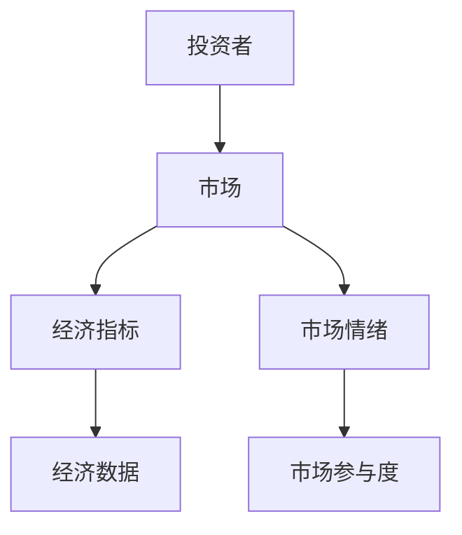
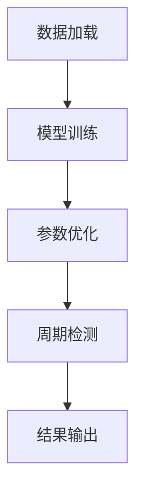
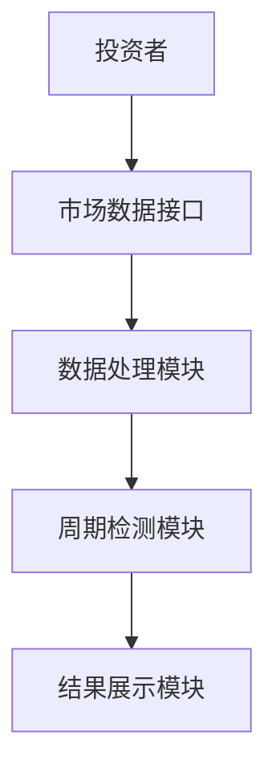

                 


# 霍华德·马克斯的市场周期定位技巧

## 关键词：
霍华德·马克斯，市场周期，投资策略，技术分析，量化方法，算法模型，系统架构，项目实战，市场定位

## 摘要：
霍华德·马克斯的市场周期定位技巧是投资领域的重要理论，本文通过技术博客的形式，系统地分析了该技巧的背景、核心概念、算法原理、系统架构以及项目实战。文章从市场周期的基本概念出发，详细讲解了霍华德·马克斯的投资理念，接着通过量化分析方法和数学模型，深入探讨了市场周期的定位技巧。最后，结合实际项目案例，展示了如何将这些理论应用到实际投资中，并总结了最佳实践和注意事项，为读者提供了全面的指导。

---

# 目录大纲

## 第一部分：市场周期定位的背景与基础

### 第1章：市场周期的基本概念

#### 1.1 市场周期的定义与特征
- 1.1.1 市场周期的定义
- 1.1.2 市场周期的主要特征
- 1.1.3 市场周期与经济波动的关系

#### 1.2 霍华德·马克斯的投资理念
- 1.2.1 马克斯的投资哲学概述
- 1.2.2 市场周期在投资中的重要性
- 1.2.3 马克斯的投资策略与市场周期的关系

### 第2章：市场周期的类型与阶段划分

#### 2.1 经济周期的基本类型
- 2.1.1 膨胀周期
- 2.1.2 衰退周期
- 2.1.3 增长周期

#### 2.2 市场周期的阶段划分
- 2.2.1 繁荣阶段
- 2.2.2 衰退阶段
- 2.2.3 谷底阶段
- 2.2.4 回升阶段

#### 2.3 不同市场周期的特点对比
- 2.3.1 经济指标的对比分析
- 2.3.2 市场情绪的对比分析
- 2.3.3 投资回报的对比分析

---

## 第二部分：市场周期定位的核心概念与联系

### 第3章：市场周期的特征分析

#### 3.1 市场周期的特征属性
- 3.1.1 时间性
- 3.1.2 波动性
- 3.1.3 周期性
- 3.1.4 不可预测性

#### 3.2 市场周期与其他经济概念的对比
- 3.2.1 市场周期与经济周期的对比
- 3.2.2 市场周期与行业周期的对比
- 3.2.3 市场周期与市场情绪周期的对比

### 第4章：市场周期的实体关系分析

#### 4.1 实体关系图（ER图）


---

## 第三部分：市场周期定位的算法原理

### 第5章：量化分析方法

#### 5.1 动态时间序列模型
- 5.1.1 时间序列模型的定义
- 5.1.2 动态时间序列模型的应用

#### 5.2 市场周期检测的数学模型
- 5.2.1 基于ARIMA模型的周期检测
- 5.2.2 模型公式：
  $$ ARIMA(p, d, q) $$
  其中，p为自回归阶数，d为差分阶数，q为移动平均阶数。

#### 5.3 市场周期定位的算法步骤
- 5.3.1 数据采集与预处理
- 5.3.2 模型训练与参数优化
- 5.3.3 周期检测与定位

### 第6章：算法实现与代码示例

#### 6.1 Python代码实现
```python
import pandas as pd
import numpy as np
from statsmodels.tsa.arima_model import ARIMA

# 示例数据加载
data = pd.read_csv('market_data.csv')

# 模型训练
model = ARIMA(data, order=(5, 1, 0))
model_fit = model.fit()

# 周期检测
acf = model_fit.arima_resid.autocorr(lags=20)
print(acf)
```

#### 6.2 算法流程图


---

## 第四部分：系统架构与设计

### 第7章：系统功能设计

#### 7.1 领域模型类图


#### 7.2 系统架构设计


#### 7.3 接口设计与交互
- 7.3.1 数据接口定义
- 7.3.2 模块间交互序列图
  ```mermaid
  sequenceDiagram
      投资者 -> 数据处理模块: 请求数据处理
      数据处理模块 -> 经济指标: 获取经济数据
      数据处理模块 -> 市场数据接口: 获取市场数据
      数据处理模块 -> 周期检测模块: 提供预处理数据
      周期检测模块 -> 结果展示模块: 输出周期定位结果
  ```

---

## 第五部分：项目实战与案例分析

### 第8章：环境安装与项目实现

#### 8.1 环境配置
- 安装Python、Pandas、NumPy、statsmodels

#### 8.2 核心代码实现
```python
# 市场周期定位代码
def detect_cycle(data):
    # 数据预处理
    diff_data = data.diff().dropna()
    # 模型训练
    model = ARIMA(diff_data, order=(5, 1, 0))
    model_fit = model.fit()
    # 周期检测
    acf = model_fit.arima_resid.autocorr(lags=20)
    return acf

# 示例运行
data = pd.read_csv('market_data.csv')
result = detect_cycle(data['index'])
print(result)
```

#### 8.3 案例分析与解读
- 数据来源：市场指数数据
- 数据预处理：差分处理
- 模型训练：ARIMA模型
- 结果分析：自相关函数图

---

## 第六部分：最佳实践与总结

### 第9章：总结与注意事项

#### 9.1 小结
- 霍华德·马克斯的市场周期定位技巧在投资中的重要性
- 技术手段在市场周期分析中的应用

#### 9.2 注意事项
- 数据质量的重要性
- 模型选择的合理性
- 结果解释的准确性

#### 9.3 拓展阅读
- 推荐书籍：《投资学》
- 推荐文章：《时间序列分析在金融中的应用》

---

通过以上目录结构，文章系统地介绍了霍华德·马克斯的市场周期定位技巧，从理论到实践，从算法到系统设计，为读者提供了全面的知识和实践指导。

