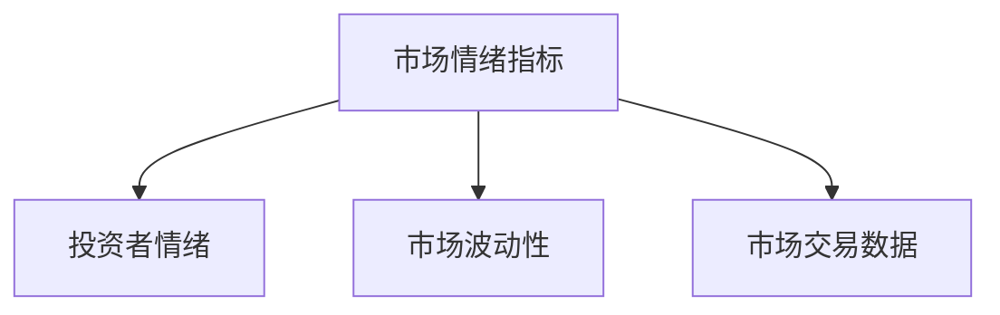
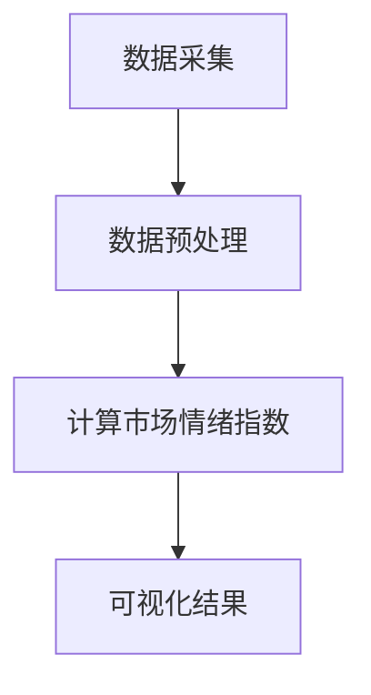
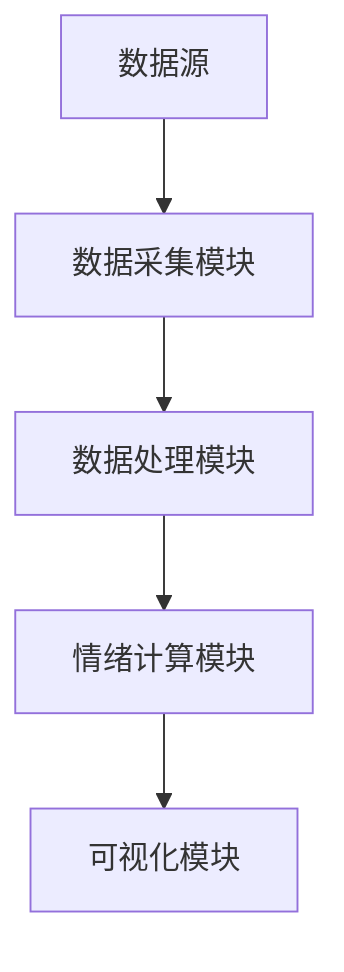

                 


# 霍华德·马克斯的市场情绪指标

## 关键词：市场情绪指标，霍华德·马克斯，投资决策，量化分析，算法实现，系统架构

## 摘要：  
霍华德·马克斯的市场情绪指标是一种通过量化市场情绪来辅助投资决策的方法。本文将详细探讨市场情绪指标的核心概念、量化方法、算法原理、系统架构设计、项目实战以及最佳实践。通过逐步分析，帮助读者理解市场情绪指标在投资中的应用，并提供实际的代码实现和案例分析。

---

# 第1章: 市场情绪指标的背景介绍

## 1.1 市场情绪指标的核心概念  
### 1.1.1 市场情绪指标的定义与内涵  
市场情绪指标是用于量化市场参与者情绪状态的工具，能够反映市场乐观或悲观的程度。  

### 1.1.2 市场情绪指标的背景与问题背景  
市场的波动性受投资者情绪影响，而情绪指标能够帮助投资者识别市场的过度乐观或悲观，从而做出更明智的投资决策。  

### 1.1.3 市场情绪指标的核心要素与组成  
市场情绪指标通常包括以下几个要素：  
1. 数据来源：市场交易数据、新闻 sentiment、社交媒体情绪等。  
2. 指标计算：通过数学模型量化情绪状态。  
3. 可视化：将情绪指标转化为图表或指标数值。  

---

## 1.2 霍华德·马克斯的投资理念  
### 1.2.1 霍华德·马克斯的市场情绪理论  
霍华德·马克斯强调，市场情绪是投资决策的重要因素，市场情绪的极端值往往预示着市场的反转点。  

### 1.2.2 市场情绪与投资决策的关系  
市场情绪指标能够帮助投资者识别市场的非理性波动，从而抓住投资机会或规避风险。  

### 1.2.3 市场情绪指标的动态变化特征  
市场情绪指标具有动态变化特征，能够反映市场的短期波动和长期趋势。  

---

## 1.3 市场情绪指标的边界与外延  
### 1.3.1 市场情绪指标的适用范围  
适用于股票、债券、基金等金融市场的投资分析。  

### 1.3.2 市场情绪指标的局限性  
市场情绪指标仅能反映市场情绪，不能直接预测市场走势。  

### 1.3.3 市场情绪指标与其他市场分析工具的对比  
市场情绪指标与技术分析、基本面分析等工具结合使用，能够提高投资决策的准确性。  

---

# 第2章: 市场情绪指标的核心概念与联系  

## 2.1 市场情绪指标的核心原理  
### 2.1.1 市场情绪指标的数学模型  
$$ 情绪指数 = \sum_{i=1}^{n} (权重_i \times 情绪特征_i) $$  

### 2.1.2 市场情绪指标的计算方法  
1. 收集市场情绪数据。  
2. 对数据进行预处理。  
3. 计算情绪指数。  

### 2.1.3 市场情绪指标的动态变化特征  
情绪指数随着时间变化，呈现周期性波动特征。  

---

## 2.2 市场情绪指标的核心属性特征对比  
### 2.2.1 不同市场情绪指标的属性对比  
| 指标名称 | 数据来源 | 计算方法 | 计算周期 | 应用场景 |  
|----------|----------|----------|----------|----------|  
| VIX指数 | 市场波动性 | 标准差计算 | 每日 | 风险评估 |  

### 2.2.2 市场情绪指标的特征表格  
| 情绪特征 | 权重 | 计算公式 |  
|----------|------|----------|  
| 投资者信心 | 0.3 | 加权平均值 |  

### 2.2.3 市场情绪指标的ER实体关系图  


---

# 第3章: 市场情绪指标的算法原理  

## 3.1 市场情绪指标的算法流程  
### 3.1.1 数据采集与预处理  
1. 从股票市场数据中提取开盘价、收盘价、成交量等指标。  
2. 清洗数据，处理缺失值和异常值。  

### 3.1.2 市场情绪指标的计算  
1. 使用均值、标准差等统计方法计算市场情绪指数。  
2. 通过机器学习算法（如聚类分析）进一步优化情绪指数。  

### 3.1.3 市场情绪指标的可视化  
1. 将情绪指数绘制成图表，展示市场情绪的变化趋势。  

## 3.2 市场情绪指标的数学模型与公式  
### 3.2.1 市场情绪指标的数学表达式  
$$ 情绪指数 = \alpha \times 收益率 + \beta \times 成交量 $$  

### 3.2.2 市场情绪指标的动态变化公式  
$$ \Delta 情绪指数 = \gamma \times (当前情绪指数 - 前期情绪指数) $$  

---

## 3.3 市场情绪指标的算法实现  
### 3.3.1 算法流程图  


### 3.3.2 算法实现的Python代码示例  
```python
import pandas as pd
import numpy as np

def calculate_market_mood(data):
    # 示例计算市场情绪指数
    mood = data['收盘价'].pct_change().mean()
    return mood

data = pd.read_csv('market_data.csv')
mood_index = calculate_market_mood(data)
print(mood_index)
```

---

# 第4章: 市场情绪指标的系统分析与架构设计  

## 4.1 系统分析  
### 4.1.1 问题场景介绍  
投资者需要一个实时的市场情绪分析系统，帮助其做出投资决策。  

### 4.1.2 项目介绍  
本系统旨在通过量化市场情绪指标，为投资者提供实时的市场情绪分析。  

## 4.2 系统架构设计  
### 4.2.1 系统功能设计  
1. 数据采集模块：从股票市场数据中提取相关指标。  
2. 数据处理模块：清洗数据，处理缺失值和异常值。  
3. 情绪计算模块：计算市场情绪指数。  
4. 可视化模块：将情绪指数绘制成图表。  

### 4.2.2 系统架构图  


---

# 第5章: 市场情绪指标的项目实战  

## 5.1 环境安装  
1. 安装Python和相关库（pandas, numpy, matplotlib）。  

## 5.2 系统核心实现源代码  
```python
import pandas as pd
import numpy as np

def calculate_market_mood(data):
    # 示例计算市场情绪指数
    mood = data['收盘价'].pct_change().mean()
    return mood

data = pd.read_csv('market_data.csv')
mood_index = calculate_market_mood(data)
print(mood_index)
```

## 5.3 代码应用解读与分析  
1. 代码功能：计算市场情绪指数。  
2. 结果分析：根据情绪指数判断市场情绪状态。  

## 5.4 实际案例分析  
1. 案例背景：2020年新冠疫情对市场情绪的影响。  
2. 数据分析：情绪指数的变化趋势。  

---

# 第6章: 最佳实践与小结  

## 6.1 最佳实践 tips  
1. 结合技术分析和基本面分析，提高投资决策的准确性。  
2. 定期更新数据，保持情绪指数的实时性。  

## 6.2 小结  
市场情绪指标是投资决策的重要工具，能够帮助投资者识别市场的非理性波动，抓住投资机会或规避风险。  

## 6.3 注意事项  
1. 市场情绪指标仅能反映市场情绪，不能直接预测市场走势。  
2. 需要结合其他分析工具，提高投资决策的准确性。  

## 6.4 拓展阅读  
1. 《投资学基础》  
2. 《算法交易：机智的投资者》  

---

# 附录  

## 附录A: 数据源与工具推荐  
1. 数据源：Yahoo Finance、Quandl。  
2. 工具推荐：Python、Pandas、Matplotlib。  

## 附录B: 参考文献  
1. 霍华德·马克斯，《投资最重要的事》。  
2. 市场情绪分析相关学术论文。  

--- 

通过以上目录结构，文章将详细讲解霍华德·马克斯的市场情绪指标的核心概念、量化方法、算法实现、系统设计和项目实战，帮助读者全面掌握市场情绪指标的应用。

