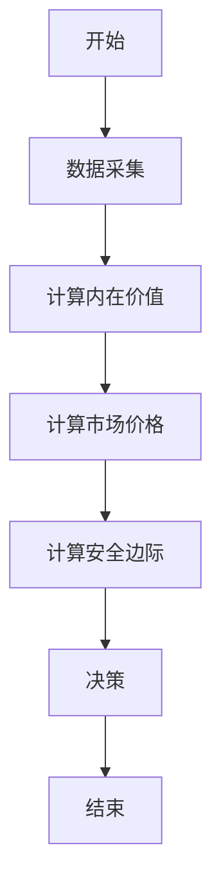
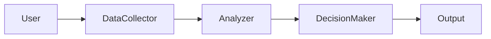

                 


# 霍华德·马克斯的逆向投资哲学

## 关键词：逆向投资，霍华德·马克斯，价值投资，安全边际，市场情绪，投资哲学

## 摘要：霍华德·马克斯的逆向投资哲学是一种基于价值投资和市场逆向思维的投资策略，强调在市场低谷时寻找被低估的投资机会。本文将从逆向投资的背景、核心概念、算法原理、数学模型、系统架构到项目实战，全面解析霍华德·马克斯的投资哲学，并通过实际案例和代码实现，帮助读者深入理解逆向投资的原理和实践方法。

---

## 第一部分: 逆向投资的背景与发展

### 第1章: 逆向投资的起源与发展

#### 1.1 逆向投资的定义与核心理念
逆向投资是一种反向市场趋势的投资策略，强调在市场低谷时买入，在市场高点时卖出。其核心理念是寻找市场价格与内在价值的偏离，利用市场的非理性波动获取超额收益。

#### 1.2 霍华德·马克斯的投资理念
霍华德·马克斯是逆向投资的代表人物，他的投资哲学强调：
1. **价值投资**：买入低于内在价值的资产。
2. **市场情绪**：关注市场参与者的情绪波动，避免随波逐流。
3. **安全边际**：在投资决策中留有安全边际，降低风险。

---

## 第二部分: 逆向投资的核心概念

### 第2章: 核心概念与原理

#### 2.1 核心概念原理
1. **价值与价格的动态关系**：市场价格围绕内在价值波动，逆向投资的核心是寻找价格低于价值的资产。
2. **市场周期与投资机会**：市场周期性波动为逆向投资者提供了买入低点的机会。
3. **安全边际**：通过计算安全边际（内在价值与市场价格的差额），确定投资的安全性。

#### 2.2 核心概念对比表格
| 概念         | 价值投资       | 趋势投资       |
|--------------|----------------|----------------|
| 核心思想     | 价格 < 内在价值 | 价格 > 内在价值 |
| 时机选择     | 市场低谷时买入  | 市场高点时买入  |
| 风险控制     | 强调安全边际    | 依赖趋势延续性  |

#### 2.3 ER实体关系图
```mermaid
erd
  投资者 --> 市场价格: 购买/卖出资产
  投资者 --> 内在价值: 评估资产价值
  内在价值 --> 安全边际: 计算安全空间
```

---

## 第三部分: 逆向投资的算法原理与数学模型

### 第3章: 算法原理与实现

#### 3.1 算法原理
1. **股票筛选算法**：通过计算市盈率（P/E）和市净率（P/B）等指标，筛选出价格低于内在价值的股票。
2. **市场情绪分析**：利用市场情绪指数（如恐慌指数）判断市场是否处于低谷。

#### 3.2 数学模型与公式
1. **内在价值公式**：
$$ V = \frac{E}{P} $$
其中，\( V \) 表示内在价值，\( E \) 表示企业价值，\( P \) 表示市场价格。

2. **安全边际计算公式**：
$$ S = \frac{V - P}{P} $$
其中，\( S \) 表示安全边际比例。

#### 3.3 算法流程图


---

## 第四部分: 投资系统的架构设计

### 第4章: 系统架构与实现

#### 4.1 系统功能设计
1. **数据采集模块**：获取股票的市场数据（如价格、市盈率、市净率）。
2. **分析模块**：计算内在价值和安全边际。
3. **决策模块**：根据安全边际和市场情绪，生成投资信号。

#### 4.2 系统架构图


---

## 第五部分: 项目实战

### 第5章: 项目实战与代码实现

#### 5.1 环境安装
安装必要的Python库：
```bash
pip install pandas numpy
```

#### 5.2 核心代码实现
```python
import pandas as pd
import numpy as np

# 数据采集模块
def get_data(tickers):
    # 假设tickers为股票代码列表
    data = pd.DataFrame()
    for ticker in tickers:
        # 获取股票数据
        df = pd.read_csv(f'{ticker}.csv')
        data = data.append(df)
    return data

# 分析模块
def calculate_value(data):
    data['内在价值'] = data['企业价值'] / data['市场价格']
    data['安全边际'] = (data['内在价值'] - data['市场价格']) / data['市场价格']
    return data

# 决策模块
def generate_signals(data):
    signals = []
    for index, row in data.iterrows():
        if row['安全边际'] > 0.2:
            signals.append(f'买入 {index}')
        elif row['安全边际'] < -0.2:
            signals.append(f'卖出 {index}')
        else:
            signals.append('观望')
    return signals

# 主函数
def main():
    tickers = ['AAPL', 'GOOG', 'MSFT']
    data = get_data(tickers)
    value_data = calculate_value(data)
    signals = generate_signals(value_data)
    print(signals)

if __name__ == "__main__":
    main()
```

#### 5.3 代码解读与分析
1. **数据采集模块**：从指定股票代码中读取数据，构建数据框。
2. **分析模块**：计算内在价值和安全边际，判断投资机会。
3. **决策模块**：根据安全边际生成买入、卖出或观望信号。

---

## 第六部分: 最佳实践与总结

### 第6章: 投资哲学的实践总结

#### 6.1 小结
霍华德·马克斯的逆向投资哲学强调在市场低谷时寻找低估资产，通过安全边际和市场情绪分析降低投资风险。

#### 6.2 注意事项
1. **数据质量**：确保数据的准确性和完整性。
2. **模型优化**：根据市场变化不断优化投资模型。
3. **风险管理**：设置止损点，控制投资风险。

#### 6.3 扩展阅读
1. 《投资最重要的事情》——霍华德·马克斯
2. 《逆向投资的艺术》——其他逆向投资的经典书籍

---

通过本文的系统分析和实战指导，读者可以深入了解霍华德·马克斯的逆向投资哲学，并将其应用于实际投资中，从而在市场波动中把握机会，实现稳健收益。

