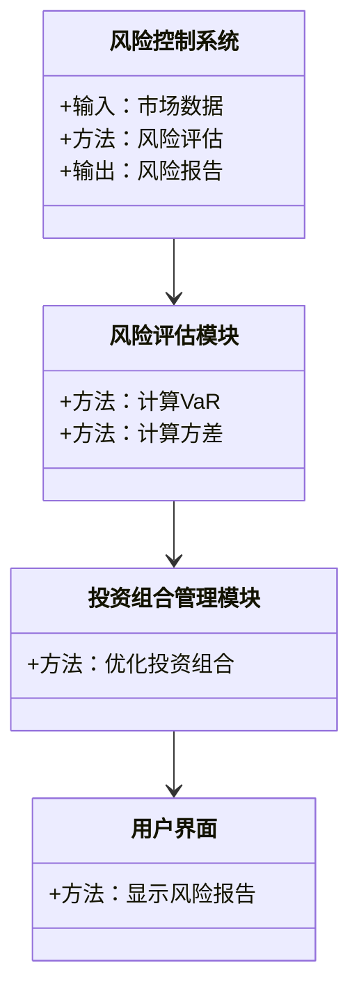
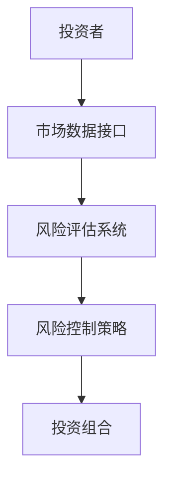

                 


# 霍华德马克斯的风险控制策略

> 关键词：霍华德马克斯，风险控制，投资策略，风险管理，风险评估，第二层思维

> 摘要：本文深入分析了霍华德马克斯的风险控制策略，从其投资哲学、风险评估方法到具体的风险管理措施进行了详细阐述。文章结合技术视角，通过数学模型和算法原理，解释了马克斯如何在投资决策中实现风险控制，并通过实际案例分析，展示了其策略的实践应用。

---

## 第一部分: 风险控制的背景与核心概念

### 第1章: 风险控制的背景与问题背景

#### 1.1 风险控制的核心概念
- **风险的定义与特征**  
  风险是指在投资活动中，由于不确定因素导致投资收益偏离预期的可能性。风险具有不确定性、可测性和可控性三大特征。

- **投资中的风险来源**  
  投资风险主要来源于市场波动、资产质量、流动性风险以及宏观经济环境等因素。马克斯特别强调市场情绪和投资者心理在风险中的作用。

- **风险控制的必要性**  
  风险控制是确保投资组合稳健增长的关键。通过科学的风险管理，投资者可以在不确定的市场中降低损失，提高收益的可持续性。

#### 1.2 霍华德马克斯的投资哲学
- **马克斯的投资理念**  
  马克斯认为，投资的本质是寻找市场的非理性机会。他强调“第二层思维”，即在市场中寻找那些尚未被广泛认知的投资机会。

- **“第二层思维”概念**  
  “第二层思维”是指投资者不仅要考虑市场的表面信息，还要深入分析市场的潜在情绪和行为。这种思维方式帮助马克斯在市场波动中找到低估资产。

- **风险控制策略**  
  马克斯的风险控制策略注重资产配置、分散投资和严格的风险评估。他强调在市场恐慌时买入低估资产，在市场狂热时卖出高估资产。

#### 1.3 风险控制的边界与外延
- **风险控制的边界**  
  风险控制的边界在于投资者的风险承受能力和投资目标。马克斯的策略强调在可控范围内优化风险与收益的平衡。

- **风险控制的外延**  
  风险控制不仅包括对市场的风险评估，还包括对自身投资策略的不断优化。马克斯的策略强调动态调整投资组合，以应对市场变化。

- **风险控制与收益的关系**  
  风险控制不是为了消除风险，而是为了在风险可控的范围内实现最大化的收益。马克斯通过严格的风险评估和资产筛选，实现了收益与风险的最佳匹配。

---

## 第二部分: 风险控制的核心概念与联系

### 第2章: 风险控制的核心概念原理

#### 2.1 风险的属性特征对比

| 风险属性 | 特征描述 |
|----------|----------|
| 可测性   | 风险可以通过历史数据分析和概率模型进行量化 |
| 可变性   | 风险会随市场环境和投资策略的变化而变化 |
| 可控性   | 风险可以通过分散投资和严格的风险评估进行控制 |

#### 2.2 风险控制的ER实体关系图
```mermaid
er
  actor 投资者
  actor 市场
  actor 风险评估系统
  actor 风险控制策略
  actor 投资组合
```

---

## 第三部分: 风险控制的算法原理

### 第3章: 风险控制算法的数学模型

#### 3.1 风险评估的数学公式

- **方差和标准差的计算**
  方差衡量资产收益的波动性，标准差是方差的平方根。计算公式如下：
  $$\sigma = \sqrt{\frac{1}{n}\sum_{i=1}^{n}(x_i - \mu)^2}$$
  其中，$\mu$ 是收益的平均值，$\sigma$ 是标准差。

- **风险调整后的收益计算**
  风险调整后的收益公式为：
  $$R_a = R - \lambda \times \sigma$$
  其中，$R$ 是未调整的收益，$\lambda$ 是风险溢价系数，$\sigma$ 是标准差。

- **风险价值（VaR）的计算公式**
  VaR 是在给定置信水平下，资产可能的最大损失。计算公式为：
  $$VaR = \alpha \times \sigma$$
  其中，$\alpha$ 是置信水平对应的分位数。

#### 3.2 通俗易懂的举例说明
假设一个资产的收益率分布如下：
- 70%的概率获得10%的收益
- 20%的概率获得5%的收益
- 10%的概率获得-5%的收益

计算其期望收益和标准差：
- 期望收益：$E[R] = 0.7 \times 10\% + 0.2 \times 5\% + 0.1 \times (-5\%) = 7.5\%$
- 方差：$\sigma^2 = 0.7 \times (10\% - 7.5\%)^2 + 0.2 \times (5\% - 7.5\%)^2 + 0.1 \times (-5\% - 7.5\%)^2 = 0.0007$
- 标准差：$\sigma = \sqrt{0.0007} \approx 28.3\%$

---

## 第四部分: 系统分析与架构设计方案

### 第4章: 风险控制系统的架构设计

#### 4.1 系统功能设计


#### 4.2 系统架构设计


---

## 第五部分: 项目实战

### 第5章: 风险控制策略的实现

#### 5.1 Python实现
```python
import numpy as np

def calculate_variance(returns):
    return np.var(returns)

def calculate_v VaR(returns, confidence_level=0.95):
    sorted_returns = np.sort(returns)
    index = int(len(sorted_returns) * confidence_level)
    VaR = -sorted_returns[index]
    return VaR

# 示例数据
returns = np.array([0.1, 0.05, -0.05, 0.1, 0.05, -0.05])

# 计算方差和VaR
variance = calculate_variance(returns)
VaR = calculate_VaR(returns)

print(f"方差: {variance}")
print(f"VaR: {VaR}")
```

#### 5.2 伯克希尔 Hathaway案例分析
伯克希尔 Hathaway 的投资组合通过分散投资和严格的风险评估，实现了长期稳健的收益。马克斯的风险控制策略在伯克希尔的投资决策中发挥了关键作用，尤其是在市场波动期间。

---

## 第六部分: 最佳实践与小结

### 第6章: 最佳实践与小结

#### 6.1 最佳实践
- **定期评估风险**：市场环境不断变化，投资者需要定期重新评估投资组合的风险。
- **分散投资**：通过分散投资降低特定资产的风险。
- **关注市场情绪**：马克斯的“第二层思维”强调了市场情绪在风险评估中的重要性。

#### 6.2 小结
霍华德马克斯的风险控制策略通过科学的分析和严格的纪律，帮助投资者在不确定的市场中实现稳健的投资收益。本文从理论到实践，详细阐述了其风险控制策略的核心思想和具体实施方法。

---

## 参考文献
1. 霍华德·马克斯《投资的艺术》
2. 马克斯投资哲学相关论文
3. 伯克希尔 Hathaway 投资策略分析

