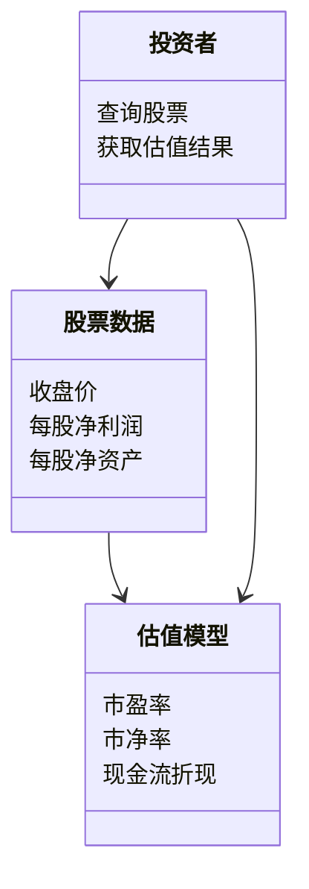

                 


# 韩国股市估值:科技强国的市场吸引力

## 关键词
韩国股市，估值，科技产业，市场吸引力，投资策略，市盈率，市净率

## 摘要
本文探讨韩国股市的估值方法及其作为科技强国的市场吸引力。通过分析科技产业对股市的影响，结合具体的估值模型和投资策略，帮助投资者理解韩国股市的独特优势。

---

# 第一部分：背景介绍

## 第1章：韩国股市的现状与科技产业的崛起

### 1.1 韩国股市的现状
1.1.1 韩国股市的发展历程  
从1950年代的起步到现在的全球化市场，韩国股市经历了快速增长，成为亚洲重要的金融中心之一。

1.1.2 当前韩国股市的主要特点  
- 多家全球知名科技企业上市，如三星、现代。
- 市场波动性较大，受政策和国际环境影响显著。

1.1.3 韩国股市在全球市场中的地位  
作为新兴市场代表，韩国股市在科技领域具有重要影响力，吸引全球投资者。

### 1.2 科技产业在韩国经济中的重要性
1.2.1 韩国科技产业的现状  
- 三星、LG等企业在全球半导体和电子产品市场占据重要地位。
- 研发投入占GDP比重较高，推动技术创新。

1.2.2 韩国科技企业的全球影响力  
- 半导体、智能手机、显示面板等领域全球领先。
- 科技企业对韩国股市的推动作用显著。

1.2.3 科技产业对韩国股市的推动作用  
- 提供高增长投资机会。
- 带动整体市场表现，提升投资者信心。

### 1.3 韩国经济的宏观背景
1.3.1 韩国经济的基本情况  
- 出口导向型经济，制造业和科技产业是主要驱动力。
- 政府政策对股市有直接影响。

1.3.2 韩国政府的经济政策与股市的关系  
- 财政刺激政策促进经济增长。
- 货币政策影响市场流动性。

1.3.3 韩国股市与国际市场的互动  
- 全球化背景下，韩国股市与国际市场的联动性增强。
- 科技股成为吸引外资的关键因素。

---

# 第二部分：核心概念与联系

## 第2章：股市估值的基本原理

### 2.1 股市估值的核心概念
2.1.1 估值方法的分类  
- 相对估值法：市盈率（P/E）、市净率（P/B）。
- 绝对估值法：现金流折现法（DCF）。

### 2.2 科技企业与传统企业的估值差异
2.2.1 科技企业的特点  
- 高研发投入，轻资产。
- 收益波动大，成长性强。

2.2.2 估值方法的适用性对比  
| 估值方法 | 传统企业 | 科技企业 |
|----------|----------|----------|
| 市盈率   | 稳定     | 波动性高  |
| 市净率   | 适用     | 可能不适用 |
| DCF      | 适用     | 更适用    |

### 2.3 韩国科技企业的估值案例分析
2.3.1 选择具有代表性的科技企业，如三星电子。
2.3.2 应用市盈率和市净率进行估值。

---

# 第三部分：算法原理

## 第3章：常用估值模型的数学解析

### 3.1 市盈率模型
$$ P/E = \frac{\text{股价}}{\text{每股净利润}} $$

### 3.2 市净率模型
$$ P/B = \frac{\text{股价}}{\text{每股净资产}} $$

### 3.3 现金流折现模型（DCF）
- 基本步骤：预测现金流，计算现值，确定目标股价。

---

# 第四部分：系统分析与架构设计

## 第4章：系统分析与架构设计方案

### 4.1 问题场景介绍
- 分析韩国股市数据，构建估值模型，为投资者提供参考。

### 4.2 项目介绍
- 开发一个基于Python的韩国股市估值系统。

### 4.3 系统功能设计（领域模型）


### 4.4 系统架构设计


---

# 第五部分：项目实战

## 第5章：基于Python的韩国股市估值系统实现

### 5.1 环境安装与数据获取
- 安装Python和相关库（pandas, numpy, matplotlib）。
- 获取韩国股市数据（如三星电子）。

### 5.2 核心代码实现
```python
import pandas as pd
import numpy as np

# 数据获取与处理
data = pd.read_csv('KRX_data.csv')
data['PE'] = data['收盘价'] / data['每股净利润']
data['PB'] = data['收盘价'] / data['每股净资产']

# 市盈率分析
mean_pe = data['PE'].mean()
data['PE'].plot.hist(bins=20)
```

### 5.3 案例分析与结果解读
- 分析三星电子的市盈率和市净率。
- 对比市场平均值，判断其估值是否合理。

---

# 第六部分：最佳实践与总结

## 第6章：投资策略与风险提示

### 6.1 投资策略建议
- 分散投资，避免过度集中。
- 关注企业基本面，结合技术分析。

### 6.2 风险提示
- 市场波动风险。
- 政治经济环境变化的影响。

### 6.3 拓展阅读
- 推荐书籍：《投资学基础》、《股市投资策略》。
- 在线资源：韩国交易所官网，金融数据平台。

---

通过以上结构，文章系统地介绍了韩国股市估值的方法及其作为科技强国的市场吸引力，为投资者提供了实用的分析工具和策略建议。

