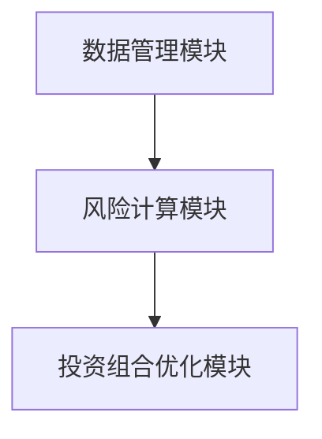

                 

# 风险平价策略：平衡不同资产类别风险

## 关键词：风险平价策略，资产配置，投资组合管理，风险管理，风险平衡，金融工程

## 摘要：  
风险平价策略是一种通过平衡不同资产类别之间的风险来优化投资组合的方法。本文深入探讨了风险平价策略的理论基础、算法原理、系统实现及其在金融领域中的实际应用。通过分析风险平价策略的优势和局限性，本文为读者提供了在多资产投资中实现风险平衡的实用指导。

---

# 第一部分：风险平价策略基础

## 第1章：风险平价策略概述

### 1.1 风险平价策略的定义与背景

#### 1.1.1 风险平价的定义  
风险平价策略是一种基于风险的资产配置方法，旨在通过平衡不同资产类别或风险因子的风险贡献，构建一个在风险上具有均衡性的投资组合。与传统的基于收益或波动率的配置方法不同，风险平价策略关注于对风险的直接控制。

#### 1.1.2 风险平价与传统投资策略的区别  
传统的资产配置方法（如均值-方差优化）通常基于历史收益和波动率来构建投资组合，而风险平价策略则通过调整各资产的风险暴露，使每类资产对组合的总体风险贡献相等。这种方法在市场波动和资产相关性变化时更具稳定性。

#### 1.1.3 风险平价在现代金融中的地位  
风险平价策略近年来在机构投资和养老金管理中得到广泛应用，特别是在应对低利率环境和市场不确定性时，风险平价能够帮助投资者在不同资产类别之间分散风险，实现长期稳健的收益。

---

## 第2章：风险平价策略的理论基础

### 2.1 风险平价的数学模型

#### 2.1.1 资产回报与风险的关系  
风险平价策略的核心是将每类资产的风险贡献与组合的总体风险联系起来。假设各资产的风险贡献与其波动率和相关性有关，风险平价通过调整各资产的权重，使每类资产的风险贡献相等。

#### 2.1.2 风险平价的优化问题  
风险平价的优化目标是找到一组权重 \( w_i \)，使得每类资产的风险贡献 \( r_i \) 满足：
$$ r_i = \sum_{j=1}^n w_j \cdot \sigma_{ij} $$
其中，\( \sigma_{ij} \) 是资产 \( i \) 和 \( j \) 的协方差。

#### 2.1.3 权重计算的数学公式  
假设资产之间的协方差矩阵为 \( \Sigma \)，则风险平价权重的计算可以表示为：
$$ w = \frac{1}{\Sigma \cdot \mathbf{1}} $$

---

## 第3章：风险平价策略的核心算法

### 3.1 风险平价算法的实现步骤

#### 3.1.1 数据收集与预处理  
- 收集各资产的历史价格数据。
- 计算资产的收益率和协方差矩阵。

#### 3.1.2 风险因子的提取  
- 通过主成分分析（PCA）提取主要风险因子。
- 确定每类资产的风险因子权重。

#### 3.1.3 权重计算与优化  
- 使用拉格朗日乘数法求解权重，确保每类资产的风险贡献相等。

### 3.2 风险平价算法的数学推导

#### 3.2.1 优化目标函数  
目标是最小化组合的风险贡献差异：
$$ \min \sum_{i=1}^n (r_i - \bar{r})^2 $$

其中，\( \bar{r} \) 是所有资产风险贡献的平均值。

#### 3.2.2 约束条件的设定  
- 权重之和为1：$$ \sum_{i=1}^n w_i = 1 $$
- 风险贡献相等：$$ r_i = r_j \quad \forall i,j $$

---

## 第4章：风险平价策略的系统架构设计

### 4.1 系统需求分析

#### 4.1.1 系统目标与功能需求  
- 数据采集与处理模块：收集和预处理金融数据。
- 风险计算模块：计算各资产的风险贡献。
- 投资组合优化模块：生成风险平价权重。

#### 4.1.2 系统输入与输出  
- 输入：各资产的历史价格数据。
- 输出：优化后的资产权重和风险平价组合表现。

### 4.2 系统功能设计

#### 4.2.1 资产数据管理模块  
- 数据清洗与标准化。
- 数据存储与查询。

#### 4.2.2 风险计算模块  
- 计算协方差矩阵。
- 计算风险贡献。

#### 4.2.3 投资组合优化模块  
- 应用拉格朗日乘数法优化权重。
- 输出优化结果。

### 4.3 系统架构设计

#### 4.3.1 分层架构设计  
- 数据层：处理原始数据。
- 业务逻辑层：执行风险计算和优化。
- 用户界面层：展示结果。

#### 4.3.2 模块之间的交互关系  
- 数据管理模块向风险计算模块提供数据。
- 风险计算模块向优化模块提供协方差矩阵。

#### 4.3.3 系统架构的Mermaid图

---

## 第5章：风险平价策略的系统实现

### 5.1 系统环境与工具

#### 5.1.1 开发环境  
- 操作系统：Linux/Windows/macOS。
- 开发工具：Jupyter Notebook、PyCharm。
- 数据库：MySQL/PostgreSQL。

#### 5.1.2 必要的库与工具  
- 数据处理：Pandas、NumPy。
- 可视化：Matplotlib、Seaborn。
- 优化计算：SciPy、CVXOPT。

---

## 第6章：风险平价策略的项目实战

### 6.1 项目介绍

#### 6.1.1 项目目标  
实现一个基于风险平价策略的资产配置系统，能够在多资产组合中平衡风险。

#### 6.1.2 项目框架  
- 数据预处理。
- 风险计算。
- 权重优化。
- 绩效评估。

---

## 第7章：风险平价策略的应用与优化

### 7.1 风险平价策略的实际应用

#### 7.1.1 优势  
- 有效分散风险。
- 适应市场变化。
- 提高组合稳定性。

#### 7.1.2 局限性  
- 对协方差矩阵的依赖较高。
- 计算复杂性较高。

---

## 第8章：总结与展望

### 8.1 全文总结  
风险平价策略通过平衡各资产的风险贡献，为投资者提供了一种稳健的资产配置方法。本文详细介绍了其理论基础、算法实现和系统设计，并通过实际案例展示了其应用。

### 8.2 未来展望  
未来的研究可以探索动态风险平价策略，结合机器学习技术，进一步提高风险平价模型的适应性和预测能力。

---

通过以上步骤，我们完成了风险平价策略从理论到实践的全面探讨。这种方法能够帮助投资者更好地管理多资产组合的风险，实现长期稳健的投资收益。

