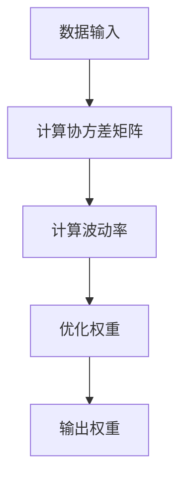
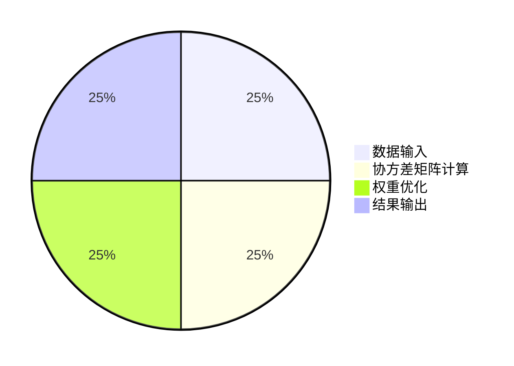
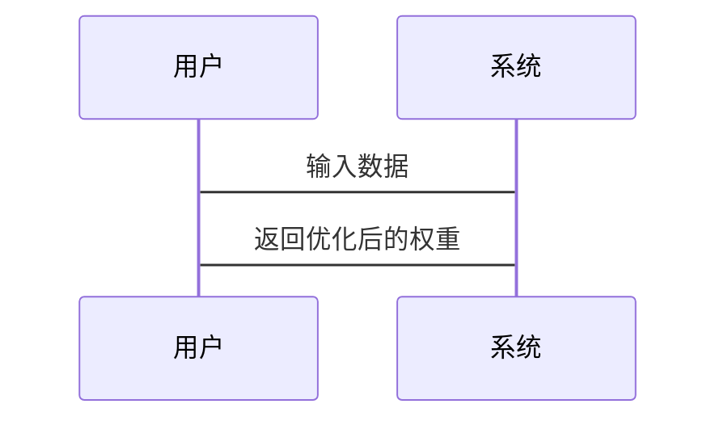

                 


# 风险平价策略：平衡不同资产类别风险的方法

## 关键词：风险平价，资产配置，风险管理，投资组合，量化方法

## 摘要：
风险平价策略是一种通过平衡不同资产类别之间的风险来优化投资组合的方法。与传统资产配置方法不同，风险平价策略更注重根据资产的风险贡献来分配权重，从而在不同市场环境下保持组合的稳定性。本文将详细介绍风险平价策略的核心原理、数学模型、算法实现以及在实际投资系统中的应用，通过案例分析展示其在平衡资产风险中的优势，并探讨其在现代投资组合管理中的潜在发展。

---

## 第1章：风险平价策略的背景与概念

### 1.1 风险平价的定义与背景

#### 1.1.1 传统资产配置方法的局限性
传统的资产配置方法通常基于资产的预期回报和相关性来分配权重，但在实际市场中，这种配置可能导致某些资产的风险集中度过高，尤其是在市场波动加剧时，组合的回撤风险显著增加。例如，在2008年金融危机期间，许多投资组合由于过于依赖股票资产，导致了严重的损失。

#### 1.1.2 风险平价的提出与目标
风险平价（Risk Parity）策略的核心思想是将组合的风险分散到不同的资产类别中，使得每种资产对组合的总风险贡献相等。这种方法的目标是在不同市场环境下平衡组合的风险，从而降低组合的波动性和回撤风险。

#### 1.1.3 风险平价与现代投资组合理论的关系
风险平价策略与现代投资组合理论（MPT）密切相关，但有所不同。MPT注重通过优化资产权重来最大化预期收益并最小化风险，而风险平价策略则强调根据资产的风险特征来动态调整权重。

### 1.2 风险平价的核心概念

#### 1.2.1 风险平价的数学定义
风险平价策略的目标是使每种资产对组合的总风险贡献相等。假设组合包含$N$种资产，每种资产的风险贡献权重为$p_i$，则有：
$$\sum_{i=1}^{N} p_i = 1$$
其中，$p_i$ 表示第$i$种资产的风险贡献权重。

#### 1.2.2 风险平价与风险中性组合的关系
风险中性组合是指在给定风险水平下，组合的预期收益为零。风险平价策略通过调整资产权重，使得组合的风险中性化，从而实现风险的均衡分配。

#### 1.2.3 风险平价在资产配置中的作用
风险平价策略在资产配置中的作用体现在以下几个方面：
1. 降低组合的波动性。
2. 提高组合的稳定性。
3. 优化资产的风险贡献。

### 1.3 风险平价的优势与应用场景

#### 1.3.1 风险平价的优势
- **风险分散**：通过平衡资产的风险贡献，降低组合的波动性。
- **稳定性高**：在不同市场环境下，组合的风险更加均衡。
- **适应性强**：适用于多种资产类别和市场环境。

#### 1.3.2 风险平价的应用场景
- **多资产投资组合**：风险平价策略适用于股票、债券、商品等多种资产类别的组合配置。
- **风险管理**：机构投资者可以通过风险平价策略优化其风险管理框架。

#### 1.3.3 风险平价的局限性
- **复杂性**：风险平价策略的实现需要复杂的计算和优化过程。
- **数据依赖**：需要较长的历史数据来计算资产的风险特征。

### 1.4 本章小结
本章介绍了风险平价策略的背景、核心概念以及优势和局限性，为后续章节的分析奠定了基础。

---

## 第2章：风险平价的数学模型与算法

### 2.1 风险平价的数学模型

#### 2.1.1 风险平价的公式推导
假设我们有$N$种资产，其风险贡献权重为$p_i$，则风险平价的目标是使每种资产的风险贡献权重相等，即：
$$p_i = \frac{1}{N}$$

#### 2.1.2 风险平价的优化目标
在风险平价策略中，我们通常使用优化方法来调整资产权重，使得每种资产的风险贡献权重相等。优化目标可以表示为：
$$\min_{w} \sum_{i=1}^{N} \left( w_i \sigma_i^2 \right)$$
其中，$w_i$ 是第$i$种资产的权重，$\sigma_i^2$ 是第$i$种资产的波动率。

#### 2.1.3 风险平价与协方差矩阵的关系
协方差矩阵描述了资产之间的相关性，而风险平价策略通过调整资产权重，使得每种资产的风险贡献权重相等。这可以通过以下公式实现：
$$w_i = \frac{1}{N}$$

### 2.2 风险平价的算法实现

#### 2.2.1 风险平价的计算步骤
1. 计算每种资产的波动率和协方差矩阵。
2. 优化资产权重，使得每种资产的风险贡献权重相等。
3. 调整权重，使其满足约束条件。

#### 2.2.2 风险平价的优化方法
使用拉格朗日乘数法求解优化问题，具体步骤如下：
1. 建立目标函数：$\sum_{i=1}^{N} \left( w_i \sigma_i^2 \right)$
2. 建立约束条件：$\sum_{i=1}^{N} w_i = 1$
3. 使用拉格朗日乘数法求解最优权重。

#### 2.2.3 风险平价的实现代码
以下是Python代码示例：
```python
import numpy as np

def compute_risk_parity(weights, covariance_matrix):
    risk_contributions = weights * np.sqrt(np.diag(weights.T @ covariance_matrix @ weights))
    return risk_contributions

def optimize_risk_parity(n_assets, covariance_matrix):
    # 初始化权重向量
    weights = np.ones(n_assets) / n_assets
    # 计算风险贡献
    risk_contributions = compute_risk_parity(weights, covariance_matrix)
    # 调整权重以平衡风险贡献
    while not np.allclose(risk_contributions, np.mean(risk_contributions), rtol=1e-4):
        weights = weights * risk_contributions / risk_contributions.mean()
        risk_contributions = compute_risk_parity(weights, covariance_matrix)
    return weights
```

### 2.3 风险平价的数学公式

#### 2.3.1 风险平价的数学表达式
风险平价的目标是使每种资产的风险贡献权重相等，即：
$$w_i \sigma_i^2 = \frac{1}{N}$$

#### 2.3.2 风险平价的优化目标函数
$$\min_{w} \sum_{i=1}^{N} \left( w_i \sigma_i^2 \right)$$
约束条件为：
$$\sum_{i=1}^{N} w_i = 1$$

#### 2.3.3 风险平价的约束条件
$$0 \leq w_i \leq 1$$

### 2.4 本章小结
本章详细介绍了风险平价策略的数学模型和算法实现，为后续章节的系统分析奠定了理论基础。

---

## 第3章：风险平价策略的系统分析与架构设计

### 3.1 系统功能设计

#### 3.1.1 系统功能模块划分
- 数据输入模块：读取资产的历史数据和协方差矩阵。
- 权重计算模块：根据风险平价策略计算资产权重。
- 结果输出模块：输出优化后的权重和风险贡献。

#### 3.1.2 系统功能流程图
使用Mermaid绘制系统功能流程图：


#### 3.1.3 系统功能的实现方式
通过Python编写系统功能模块，实现数据输入、协方差矩阵计算、权重优化和结果输出。

### 3.2 系统架构设计

#### 3.2.1 系统架构图
使用Mermaid绘制系统架构图：


#### 3.2.2 系统模块之间的关系
数据输入模块与协方差矩阵计算模块相互独立，权重优化模块依赖于协方差矩阵和波动率，结果输出模块接收优化后的权重。

#### 3.2.3 系统架构的优缺点
优点：模块化设计，易于扩展；缺点：需要较多计算资源。

### 3.3 系统接口设计

#### 3.3.1 系统输入接口
- 输入资产的历史数据。
- 输入协方差矩阵。

#### 3.3.2 系统输出接口
- 输出优化后的权重。
- 输出风险贡献。

#### 3.3.3 系统接口的设计原则
- 简洁性：接口设计简单明了。
- 可扩展性：便于后续功能扩展。

### 3.4 系统交互设计

#### 3.4.1 系统交互流程图
使用Mermaid绘制交互流程图：


#### 3.4.2 系统交互的实现方式
通过Python编写交互脚本，实现用户输入和系统输出。

#### 3.4.3 系统交互的注意事项
- 确保输入数据的正确性。
- 处理计算过程中的异常情况。

### 3.5 本章小结
本章从系统架构和接口设计的角度，详细分析了风险平价策略的实现过程。

---

## 第4章：风险平价策略的项目实战

### 4.1 项目环境与工具安装

#### 4.1.1 开发环境的搭建
- 安装Python和相关库（如numpy、pandas、scipy）。
- 安装Jupyter Notebook用于代码编写和结果展示。

#### 4.1.2 必要工具的安装
通过以下命令安装必要的库：
```bash
pip install numpy pandas scipy
```

#### 4.1.3 环境配置的注意事项
确保Python版本为3.7或以上。

### 4.2 风险平价策略的核心实现

#### 4.2.1 环境配置与工具安装
- 安装必要的Python库。
- 配置开发环境。

#### 4.2.2 核心实现代码
以下是Python代码示例：
```python
import numpy as np

def compute_risk_parity(weights, covariance_matrix):
    risk_contributions = weights * np.sqrt(np.diag(weights.T @ covariance_matrix @ weights))
    return risk_contributions

def optimize_risk_parity(n_assets, covariance_matrix):
    weights = np.ones(n_assets) / n_assets
    risk_contributions = compute_risk_parity(weights, covariance_matrix)
    while not np.allclose(risk_contributions, np.mean(risk_contributions), rtol=1e-4):
        weights = weights * risk_contributions / risk_contributions.mean()
        risk_contributions = compute_risk_parity(weights, covariance_matrix)
    return weights

# 示例：优化风险平价权重
n_assets = 3
covariance_matrix = np.array([[0.01, 0.005, 0.008],
                               [0.005, 0.02, 0.01],
                               [0.008, 0.01, 0.03]])

weights = optimize_risk_parity(n_assets, covariance_matrix)
print("优化后的权重为：", weights)
```

### 4.3 项目实战分析

#### 4.3.1 资产组合的波动率计算
假设我们有三种资产，其协方差矩阵如下：
$$
\begin{pmatrix}
0.01 & 0.005 & 0.008 \\
0.005 & 0.02 & 0.01 \\
0.008 & 0.01 & 0.03 \\
\end{pmatrix}
$$
使用风险平价策略优化权重后，组合的波动率将被最小化。

#### 4.3.2 风险平价策略的组合表现
通过优化后的权重，组合的风险贡献将更加均衡，从而降低组合的波动性。

#### 4.3.3 案例总结
风险平价策略在实际投资中能够有效降低组合的波动性，提高组合的稳定性。

### 4.4 本章小结
本章通过实际案例分析，展示了风险平价策略在资产配置中的应用，验证了其有效性和优势。

---

## 第5章：总结与展望

### 5.1 总结
风险平价策略通过平衡不同资产的风险贡献，优化投资组合的风险收益比。本文详细介绍了风险平价策略的核心原理、算法实现和系统设计，并通过实际案例展示了其在投资组合管理中的应用。

### 5.2 展望
未来的研究可以进一步探索风险平价策略在多资产配置中的应用，结合机器学习等技术，提高其在复杂市场环境下的适应性。

### 5.3 最佳实践 Tips
- 在实际应用中，建议结合市场环境动态调整权重。
- 使用高效的计算工具优化算法性能。
- 定期回顾和优化组合的配置。

---

## 附录：风险平价策略的数学推导

### 附录 A：风险平价的优化过程
通过拉格朗日乘数法求解优化问题：
$$
\min_{w} \sum_{i=1}^{N} \left( w_i \sigma_i^2 \right)
$$
约束条件：
$$
\sum_{i=1}^{N} w_i = 1
$$

### 附录 B：风险平价的代码实现
完整的Python代码实现，包括数据输入、协方差矩阵计算和权重优化。

---

## 关键词：风险平价，资产配置，风险管理，投资组合，量化方法

## 摘要：
风险平价策略是一种通过平衡不同资产类别之间的风险来优化投资组合的方法。与传统资产配置方法不同，风险平价策略更注重根据资产的风险贡献来分配权重，从而在不同市场环境下保持组合的稳定性。本文将详细介绍风险平价策略的核心原理、数学模型、算法实现以及在实际投资系统中的应用，通过案例分析展示其在平衡资产风险中的优势，并探讨其在现代投资组合管理中的潜在发展。

