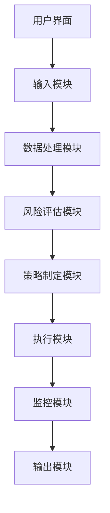

                 


```markdown
# 风险管理技术：保护投资组合的工具和策略

---

## 关键词
风险管理，投资组合，风险对冲，VaR，现代投资组合理论，系统性风险，非系统性风险

---

## 摘要
本文深入探讨了风险管理技术在保护投资组合中的应用，从基本概念到具体策略，结合工具、算法、系统架构和实战案例，全面解析如何有效管理和优化投资组合中的风险。文章内容涵盖风险管理的核心工具、数学模型、系统设计以及实际应用，旨在为读者提供一套完整的风险管理解决方案。

---

## 第一章: 风险管理概述

### 1.1 风险管理的基本概念
#### 1.1.1 风险的定义与特征
- 风险的定义：不确定性对目标的影响。
- 风险的特征：普遍性、客观性、可测性、可转换性。
- 风险的分类：系统性风险和非系统性风险。

#### 1.1.2 风险管理的重要性
- 投资者的目标：在风险可控的前提下实现收益最大化。
- 风险管理的核心作用：降低投资组合的波动性，保护资金安全。

#### 1.1.3 投资组合与风险管理的关系
- 投资组合的基本属性：预期收益与风险的权衡。
- 风险管理的目标：优化投资组合的收益-风险比。

### 1.2 风险管理的目标与原则
#### 1.2.1 风险管理的目标
- 短期目标：降低投资组合的波动性。
- 长期目标：实现投资组合的稳定增长。

#### 1.2.2 风险管理的基本原则
- 本金优先原则：保护投资者的初始资金。
- 分散化原则：通过多样化投资降低风险。
- 成本效益原则：合理控制风险管理成本。

#### 1.2.3 投资组合风险管理的核心要素
- 资产配置：决定投资组合风险的核心因素。
- 风险对冲：降低系统性风险的有效手段。
- 定期再平衡：保持投资组合的风险暴露在可控范围内。

### 1.3 风险管理的框架与流程
#### 1.3.1 风险管理的框架
- 确定目标：明确投资组合的风险承受能力。
- 识别风险：分析可能影响投资组合的各种风险因素。
- 评估风险：量化不同类型风险的影响程度。
- 制定策略：选择合适的风险管理工具和策略。
- 实施监控：动态调整风险管理措施。

#### 1.3.2 风险管理的流程
1. **目标设定**：根据投资者的风险承受能力和收益目标，确定投资组合的风险管理目标。
2. **风险识别**：通过市场分析和数据收集，识别影响投资组合的主要风险因素。
3. **风险评估**：使用数学模型和统计方法，量化不同类型风险的影响程度。
4. **策略制定**：根据风险评估结果，选择合适的风险管理工具和策略。
5. **实施监控**：定期监控投资组合的风险暴露情况，及时调整风险管理措施。

#### 1.3.3 投资组合风险管理的实施步骤
1. **资产配置**：根据风险承受能力和收益目标，确定投资组合的资产配置。
2. **风险对冲**：通过金融衍生品等工具，对冲系统性风险。
3. **分散化投资**：通过投资不同资产类别、行业和地域，降低非系统性风险。
4. **定期再平衡**：根据市场变化和个人目标，定期调整投资组合的配置。

### 1.4 本章小结
- 风险管理的核心概念回顾：风险的定义、分类及其对投资组合的影响。
- 投资组合风险管理的关键点：资产配置、风险对冲和分散化投资。
- 本书内容的框架概述：从理论到实践，系统讲解风险管理技术。

---

## 第二章: 风险的分类与度量

### 2.1 风险的分类
#### 2.1.1 系统性风险与非系统性风险
- 系统性风险：影响整个市场的风险因素，如市场波动、经济衰退、政策变化等。
- 非系统性风险：特定于个别资产或行业的风险因素，如公司经营风险、行业风险等。

#### 2.1.2 其他风险类型
- 市场风险：资产价格波动对投资组合的影响。
- 信用风险：债券发行人违约的风险。
- 流动性风险：资产难以快速变现的风险。

#### 2.1.3 不同类型风险的特征与影响
- 系统性风险：影响所有资产，无法通过分散化消除。
- 非系统性风险：影响特定资产，可以通过分散化降低。

### 2.2 风险的度量方法
#### 2.2.1 风险度量的基本方法
- 标准差：衡量资产收益的波动性。
- 方差：衡量资产收益的离散程度。

#### 2.2.2 方差、标准差与风险的关系
- 方差是标准差的平方，表示资产收益的波动程度。
- 标准差是方差的平方根，更直观地反映资产的波动性。

#### 2.2.3 风险价值（VaR）的计算
- VaR的定义：在一定置信水平下，投资组合可能遭受的最大损失。
- VaR的计算方法：
  - 历史模拟法：基于历史数据，计算投资组合在不同市场情况下的损失。
  - 方差-协方差法：基于资产的波动性和相关性，计算投资组合的VaR。
  - 蒙特卡洛模拟法：通过模拟市场情景，计算投资组合的VaR。

#### 2.2.4 系统性风险度量的指标
- Beta系数：衡量资产收益对市场波动的敏感程度。
- Alpha系数：衡量资产收益相对于市场指数的超额收益。

### 2.3 投资组合风险的综合度量
#### 2.3.1 投资组合风险的分散化效应
- 分散化的基本原理：通过投资不同资产，降低非系统性风险。
- 分散化的效果：随着资产数量的增加，投资组合的总体风险逐渐趋近于系统性风险。

#### 2.3.2 投资组合VaR的计算方法
- 基于方差-协方差矩阵的VaR计算：
  1. 计算各资产的收益波动性和相关性。
  2. 构建投资组合的方差-协方差矩阵。
  3. 计算投资组合的VaR。

#### 2.3.3 风险调整后的收益指标
- 夏普比率：衡量投资组合的风险调整后收益。
  - 公式：夏普比率 = (投资组合收益 - 无风险利率) / 投资组合的标准差。

### 2.4 本章小结
- 风险分类与度量方法总结：系统性风险与非系统性风险的区别及其度量方法。
- 投资组合风险管理的关键指标：VaR、Beta系数和夏普比率。
- 下一章内容的预告：介绍风险管理的核心工具。

---

## 第三章: 风险管理的核心工具

### 3.1 风险对冲工具
#### 3.1.1 金融衍生品的种类与功能
- 期权：买方有权在特定时间内以特定价格买入或卖出资产。
- 期货：双方约定在未来特定时间以特定价格买卖资产。
- 互换：双方约定在未来特定时间交换现金流。

#### 3.1.2 期权、期货与互换的对冲原理
- 期权对冲：通过卖出期权，获得权利金，对冲标的资产的价格波动风险。
- 期货对冲：通过建立相反头寸，对冲价格波动风险。
- 互换对冲：通过交换现金流，对冲利率或汇率风险。

#### 3.1.3 风险对冲的实际操作步骤
1. **确定风险敞口**：识别投资组合中需要对冲的风险类型。
2. **选择合适的衍生品**：根据风险敞口，选择适合的期权、期货或互换。
3. **建立对冲头寸**：通过衍生品交易，对冲投资组合的风险敞口。
4. **监控对冲效果**：定期评估对冲效果，根据市场变化调整对冲头寸。

### 3.2 风险分散工具
#### 3.2.1 投资组合分散化的基本原理
- 分散化的作用：通过投资不同资产，降低非系统性风险。
- 分散化的实现：将资金分配到不同资产类别、行业和地域。

#### 3.2.2 不同资产类别之间的分散效应
- 股票、债券、 commodities、房地产等不同资产类别的风险和收益特征。
- 通过资产类别分散化，降低非系统性风险。

#### 3.2.3 行业与地域分散的风险管理策略
- 行业分散：投资不同行业的资产，降低行业特定风险。
- 地域分散：投资不同国家和地区的资产，降低地域特定风险。

### 3.3 风险转移工具
#### 3.3.1 保险在风险管理中的应用
- 保险的种类：财产保险、责任保险、信用保险等。
- 保险的原理：通过支付保费，转移特定风险到保险公司。

#### 3.3.2 再保险的作用与机制
- 再保险：保险公司将其承保的风险转移给其他保险公司。
- 再保险的机制：通过分保安排，分散保险公司的风险。

#### 3.3.3 风险转移的优缺点分析
- 优点：将特定风险转移给其他方，降低自身风险敞口。
- 缺点：需要支付保费，可能增加整体成本。

### 3.4 本章小结
- 风险管理工具的分类与特点：对冲工具、分散工具和转移工具的区别与联系。
- 各种工具在投资组合中的应用：根据具体情况选择合适的工具和策略。
- 工具选择的关键因素：风险类型、成本和效果。

---

## 第四章: 风险管理策略与优化

### 4.1 风险管理策略的选择
#### 4.1.1 风险规避、降低、转移与接受的策略
- 风险规避：通过避免投资某些资产或市场，完全消除风险。
- 风险降低：通过风险对冲和分散化，降低投资组合的整体风险。
- 风险转移：通过保险和再保险，将风险转移给其他方。
- 风险接受：在可接受的范围内，承担一定的风险。

#### 4.1.2 不同策略的适用场景与优缺点
- 风险规避：适用于风险承受能力较低的投资者，但可能错过市场机会。
- 风险降低：适用于大多数投资者，可以在不完全消除风险的情况下，实现风险与收益的平衡。
- 风险转移：适用于特定风险的转移，但需要支付额外成本。
- 风险接受：适用于风险承受能力较高的投资者，可以在承担一定风险的同时，追求更高收益。

#### 4.1.3 投资组合风险管理策略的综合运用
- 根据市场环境和投资者目标，灵活调整风险管理策略。
- 综合运用多种策略，实现风险与收益的最佳平衡。

### 4.2 投资组合优化的基本原理
#### 4.2.1 投资组合优化的目标
- 在给定风险水平下，实现收益最大化。
- 在给定收益水平下，实现风险最小化。

#### 4.2.2 现代投资组合理论（MPT）的核心思想
- 有效投资组合：在给定风险水平下，收益最高的投资组合。
- 无差异曲线：投资者对收益和风险的偏好曲线。
- 最优投资组合：根据投资者的偏好，找到最优的风险-收益平衡点。

#### 4.2.3 现金流分析与风险调整
- 现金流的时间价值：考虑资金的时间价值，评估投资组合的未来收益和风险。
- 风险调整后的现金流：根据风险因素，调整现金流的预期值。

### 4.3 投资组合优化的数学模型
#### 4.3.1 均值-方差优化模型
- 目标函数：最大化收益，最小化风险（方差）。
- 约束条件：投资组合的总权重为1，投资比例非负。

#### 4.3.2 使用Python进行投资组合优化
```python
import numpy as np
from scipy.optimize import minimize

# 示例：简单投资组合优化问题
def portfolio_variance(weights, covariance_matrix):
    return np.dot(weights.T, np.dot(covariance_matrix, weights))

# 定义优化目标函数
def objective(weights):
    return portfolio_variance(weights, covariance_matrix)

# 定义约束条件
def constraint(weights):
    return np.sum(weights) - 1  # 权重之和为1

# 初始猜测权重
initial_weights = np.array([1.0/3, 1.0/3, 1.0/3])

# 调用优化函数
result = minimize(objective, initial_weights, constraints={'type': 'eq', 'fun': constraint})

# 最优权重
optimal_weights = result.x
```

#### 4.3.3 算法原理与优化步骤
1. **确定优化目标**：根据投资者的目标，选择收益最大化或风险最小化的目标函数。
2. **设定约束条件**：根据投资组合的限制，设定权重之和为1，投资比例非负等约束条件。
3. **选择优化方法**：使用数值优化方法，如最速下降法、牛顿法等，求解优化问题。
4. **实现优化算法**：编写代码，实现优化算法，并计算出最优投资组合。

### 4.4 本章小结
- 风险管理策略的选择：根据市场环境和投资者目标，灵活调整策略。
- 投资组合优化的核心思想：在风险与收益之间找到最佳平衡点。
- 优化算法的应用：通过数学模型和代码实现投资组合优化。

---

## 第五章: 风险管理的数学模型与算法

### 5.1 风险度量的数学模型
#### 5.1.1 风险价值（VaR）的数学表达
- VaR的计算公式：
  $$ VaR = \mu + z \cdot \sigma $$
  其中，$\mu$ 是平均收益，$z$ 是对应于置信水平的正态分布分位数，$\sigma$ 是收益的标准差。

#### 5.1.2 方差-协方差矩阵的构建
- 方差-协方差矩阵的元素：
  $$ \sigma_{i,j} = \text{Cov}(r_i, r_j) $$
  其中，$r_i$ 和 $r_j$ 分别是资产$i$和资产$j$的收益。

#### 5.1.3 投资组合风险的矩阵表示
- 投资组合的方差：
  $$ \sigma_p^2 = \mathbf{w}^T \Sigma \mathbf{w} $$
  其中，$\mathbf{w}$ 是投资组合权重向量，$\Sigma$ 是方差-协方差矩阵。

### 5.2 风险对冲的算法原理
#### 5.2.1 期权定价模型
- Black-Scholes模型：
  $$ C = S_0 N(d_1) - K e^{-rT} N(d_2) $$
  其中，$C$ 是期权的价格，$S_0$ 是标的资产的价格，$K$ 是行权价，$r$ 是无风险利率，$T$ 是到期时间，$N(d)$ 是标准正态分布的累积分布函数，$d_1$ 和 $d_2$ 是模型中的参数。

#### 5.2.2 期货对冲的算法
- 期货头寸的计算：
  $$ \text{对冲头寸} = \frac{\text{风险敞口}}{\text{合约乘数}} $$
  其中，风险敞口是投资组合对标的资产价格波动的敏感程度，合约乘数是期货合约的面值。

#### 5.2.3 互换对冲的算法
- 互换现金流的计算：
  $$ \text{现金流} = \text{固定利率} - \text{浮动利率} $$
  其中，固定利率是互换中约定的固定利率，浮动利率是根据市场利率确定的浮动利率。

### 5.3 风险管理的系统架构
#### 5.3.1 系统功能模块设计
1. **数据采集模块**：收集市场数据、资产价格、收益率等信息。
2. **风险评估模块**：计算VaR、夏普比率等风险指标。
3. **策略制定模块**：根据风险评估结果，制定风险管理策略。
4. **执行模块**：根据策略，执行风险对冲操作。
5. **监控模块**：实时监控投资组合的风险暴露情况。

#### 5.3.2 系统架构设计


#### 5.3.3 系统接口设计
- 输入接口：接收市场数据和用户指令。
- 输出接口：显示风险评估结果和风险管理策略。
- 内部接口：模块之间的数据传递和通信。

### 5.4 本章小结
- 风险管理的数学模型与算法：VaR、方差-协方差矩阵、Black-Scholes模型等。
- 系统架构设计：从数据采集到策略执行的完整流程。
- 算法实现的关键步骤：数据处理、模型计算、策略制定和执行监控。

---

## 第六章: 风险管理系统的实战案例

### 6.1 环境安装与配置
#### 6.1.1 安装Python环境
- 使用Anaconda安装Python 3.8或更高版本。
- 安装必要的库：numpy、pandas、scipy、matplotlib、plotly。

#### 6.1.2 数据获取
- 使用Yahoo Finance获取股票数据。
- 使用Pandas进行数据清洗和处理。

### 6.2 系统核心实现
#### 6.2.1 风险评估模块的实现
```python
import numpy as np
import pandas as pd
from scipy.stats import norm

# 计算VaR
def calculate_var(returns, confidence_level=0.95):
    mu = np.mean(returns)
    sigma = np.std(returns)
    z = norm.ppf(confidence_level)
    var = mu + z * sigma
    return var

# 示例数据
data = pd.read_csv('stock_returns.csv')
returns = data['return'].values

# 计算VaR
var_95 = calculate_var(returns, 0.95)
print(f'95% VaR: {var_95}')
```

#### 6.2.2 风险对冲模块的实现
```python
import numpy as np
from scipy.optimize import minimize

# 定义优化目标函数
def objective(weights, covariance_matrix):
    return np.dot(weights.T, np.dot(covariance_matrix, weights))

# 定义约束条件
def constraint(weights):
    return np.sum(weights) - 1  # 权重之和为1

# 初始猜测权重
initial_weights = np.array([1.0/3, 1.0/3, 1.0/3])

# 调用优化函数
result = minimize(objective, initial_weights, constraints={'type': 'eq', 'fun': constraint})

# 最优权重
optimal_weights = result.x
print(f'最优权重: {optimal_weights}')
```

### 6.3 实际案例分析
#### 6.3.1 投资组合风险评估与优化
- 数据来源：假设我们有一个包含3只股票的投资组合，收益率数据存储在CSV文件中。
- 计算VaR：使用95%的置信水平，计算投资组合的VaR。
- 投资组合优化：使用方差-协方差矩阵，优化投资组合的权重，使风险最小化。

#### 6.3.2 风险对冲策略的实施
- 选择合适的金融衍生品：根据市场情况，选择期权、期货或互换进行对冲。
- 对冲效果评估：计算对冲后的VaR，评估对冲策略的有效性。

### 6.4 本章小结
- 项目实战的核心步骤：环境安装、数据获取、系统实现和案例分析。
- 投资组合风险管理的关键点：数据处理、模型计算和策略制定。
- 风险对冲策略的有效性：通过实际案例分析，验证对冲策略的效果。

---

## 第七章: 最佳实践与注意事项

### 7.1 最佳实践
#### 7.1.1 定期再平衡投资组合
- 定期检查投资组合的权重，根据市场变化和个人目标，进行再平衡。
- 再平衡的频率： quarterly 或年度。

#### 7.1.2 保持分散化投资
- 避免过度集中于某一种资产或行业，降低非系统性风险。
- 通过投资不同资产类别和地域，实现分散化。

#### 7.1.3 定期评估风险管理策略
- 根据市场环境和个人目标的变化，及时调整风险管理策略。
- 定期评估VaR、夏普比率等指标，监控投资组合的风险暴露。

### 7.2 小结
- 风险管理的核心思想：分散化、对冲和定期再平衡。
- 投资组合风险管理的关键点：资产配置、风险对冲和策略调整。

### 7.3 注意事项
- 风险管理工具的选择：根据具体市场环境和投资目标，选择合适的工具和策略。
- 风险对冲的成本：考虑对冲工具的交易成本和资金成本，合理控制整体成本。
- 风险管理的动态性：市场环境和投资目标可能发生变化，需要及时调整风险管理策略。

### 7.4 拓展阅读
- 阅读现代投资组合理论（MPT）的经典文献。
- 学习VaR和其他风险度量方法的详细内容。
- 研究金融衍生品的定价和应用。

---

## 第八章: 附录

### 8.1 术语表
- VaR：风险价值（Value at Risk）。
- Beta系数：衡量资产收益对市场波动的敏感程度。
- 方差-协方差矩阵：描述资产收益的波动性和相关性的矩阵。

### 8.2 参考文献
1. [1] Harry M. Markowitz, "Portfolio Selection", Journal of Finance, 1952.
2. [2] John C. Hull, "Options, Futures, and Other Derivatives", Pearson Education, 2020.
3. [3] Martin S. Hibba, "Financial Risk Management", McGraw-Hill Education, 2019.

### 8.3 索引
- 术语索引：按字母顺序排列的术语列表。
- 图表索引：图表和流程图的编号列表。

---

## 本书的结束语
风险管理是投资组合管理的核心内容，通过科学的风险管理技术，投资者可以在不确定的市场环境中，实现投资目标的稳健达成。本书从理论到实践，系统地介绍了风险管理的工具、策略、数学模型和系统架构，为投资者提供了一套完整的风险管理解决方案。希望读者能够通过本书，掌握风险管理的核心技术，优化投资组合的表现，实现财富的稳定增长。
```

