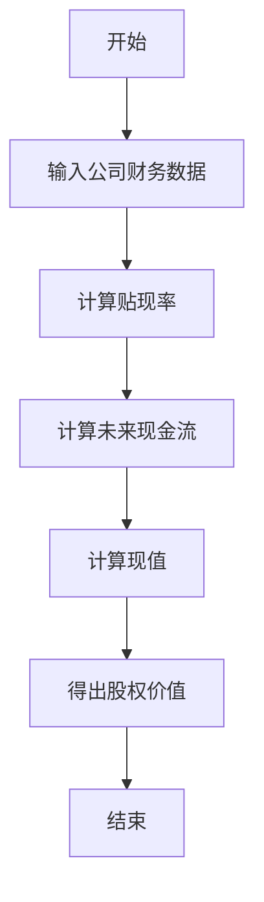
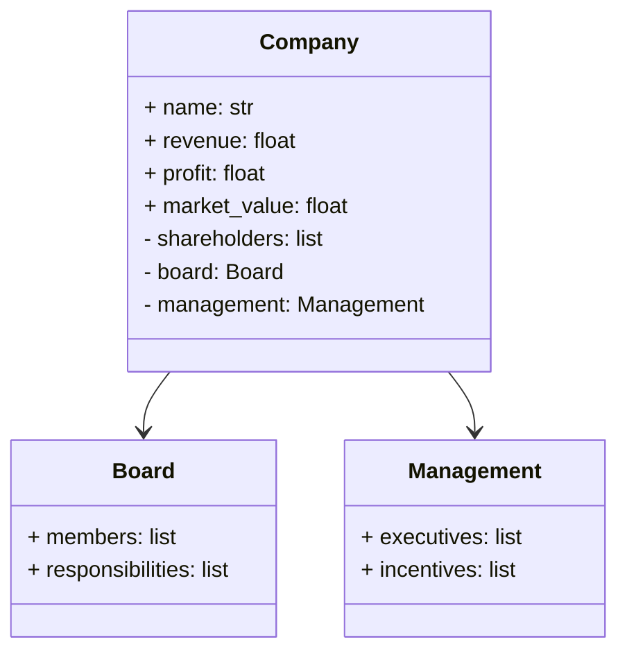
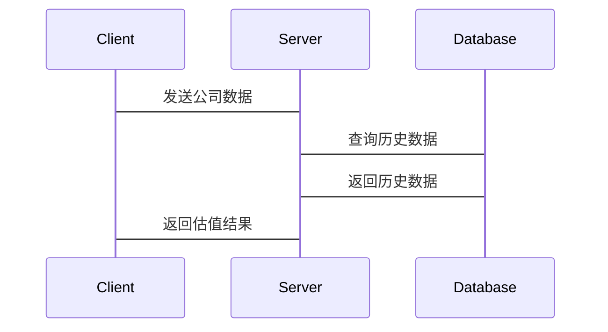

                 


# 马丁·惠特曼的公司治理价值投资：推动变革创造价值

**关键词**：公司治理，价值投资，马丁·惠特曼，投资策略，企业价值

**摘要**：  
本文深入探讨了马丁·惠特曼的公司治理与价值投资理念，分析了其投资哲学的核心要素，以及如何通过有效的公司治理框架和价值投资策略推动企业变革与价值创造。文章结合实际案例，详细解析了公司治理与价值投资的内在联系，并通过数学模型和系统架构设计，展示了如何将理论应用于实践。最后，文章总结了马丁·惠特曼的成功经验，并提出了对未来投资实践的启示。

---

# 第一部分：公司治理与价值投资的背景与核心概念

## 第1章：公司治理与价值投资概述

### 1.1 公司治理的基本概念

#### 1.1.1 公司治理的定义  
公司治理是指通过合理的组织结构、决策机制和监督机制，确保公司管理层和股东之间的利益协调，实现公司长期价值最大化的过程。  

#### 1.1.2 公司治理的核心要素  
- **股东权利**：股东作为公司所有者，享有收益权、投票权和监督权。  
- **董事会结构**：董事会是公司治理的核心，负责制定战略、监督管理层和评估公司绩效。  
- **管理层责任**：管理层负责执行董事会的决策，确保公司高效运营。  
- **利益相关者关系**：公司需平衡股东、债权人、员工、客户和公众的利益。  

#### 1.1.3 公司治理与企业价值的关系  
良好的公司治理能够提升企业透明度、降低风险、优化资源配置，从而提高企业价值。  

---

### 1.2 价值投资的基本原理

#### 1.2.1 价值投资的定义  
价值投资是一种投资策略，通过分析公司的基本面（如财务状况、盈利能力、行业地位等），寻找被市场低估的投资标的。  

#### 1.2.2 价值投资的核心理念  
- **长期视角**：关注企业的长期价值，而非短期市场波动。  
- **安全边际**：买入价格低于内在价值，以降低投资风险。  
- **基本面分析**：通过财务数据、行业趋势和管理层能力评估企业的价值。  

#### 1.2.3 价值投资与公司治理的联系  
公司治理的优劣直接影响企业的价值，良好的公司治理是价值投资成功的重要保障。  

---

### 1.3 马丁·惠特曼的投资哲学

#### 1.3.1 马丁·惠特曼的生平简介  
马丁·惠特曼（Martin Whitman）是美国著名的价值投资者，以投资于困境企业、重组企业闻名。他注重企业的基本面分析，尤其是企业的财务状况和治理结构。  

#### 1.3.2 马丁·惠特曼的投资理念  
- **逆向投资**：在市场恐慌时买入优质资产。  
- **安全边际**：买入价格低于企业清算价值。  
- **管理层评估**：关注管理层的诚信和能力。  

#### 1.3.3 马丁·惠特曼的公司治理实践  
惠特曼的投资策略中，公司治理是关键因素。他倾向于投资那些治理结构完善、管理层透明的企业。  

---

### 1.4 本章小结  
本章介绍了公司治理和价值投资的核心概念，并通过马丁·惠特曼的投资哲学，展示了公司治理与价值投资的内在联系。

---

# 第二部分：公司治理的框架与价值投资策略

## 第2章：公司治理的框架体系

### 2.1 公司治理的结构与功能

#### 2.1.1 股东、董事会、管理层的关系  
- 股东是所有者，董事会是决策者，管理层是执行者。  
- 三者之间的制衡关系是公司治理的核心。  

#### 2.1.2 公司治理的三大支柱  
- **股权结构**：股东的权益分配和制衡机制。  
- **董事会结构**：董事会的组成和职责。  
- **管理层激励**：通过股权激励绑定管理层利益。  

#### 2.1.3 公司治理的外部环境影响  
- 法律法规：如《公司法》《证券法》等。  
- 市场环境：如市场竞争、行业趋势。  

---

### 2.2 价值投资的核心策略

#### 2.2.1 价值投资的选股标准  
- 低市盈率（P/E）：市盈率低于行业平均水平。  
- 低市净率（P/B）：市净率低于行业平均水平。  
- 高股息率：股息收益率较高。  

#### 2.2.2 价值投资的长期视角  
- 长期持有：避免频繁交易，降低交易成本。  
- 耐心等待：等待市场回归企业真实价值。  

#### 2.2.3 价值投资的风险控制  
- 分散投资：降低单一投资的风险。  
- 安全边际：确保买入价格低于内在价值。  

---

### 2.3 马丁·惠特曼的公司治理实践

#### 2.3.1 马丁·惠特曼的投资案例分析  
- **案例一**：某困境企业的投资与重组。  
- **案例二**：某低市盈率企业的投资与价值发现。  

#### 2.3.2 马丁·惠特曼的公司治理创新  
- 引入独立董事：提高董事会的独立性和透明度。  
- 改善管理层激励：通过股权激励绑定管理层利益。  

#### 2.3.3 马丁·惠特曼的成功经验总结  
- 注重企业基本面：尤其是财务状况和治理结构。  
- 逆向投资：在市场低谷时寻找低估企业。  

---

### 2.4 本章小结  
本章详细分析了公司治理的框架体系，并结合马丁·惠特曼的投资策略，展示了如何通过良好的公司治理框架实现价值投资的目标。

---

# 第三部分：价值投资的数学模型与算法原理

## 第3章：价值投资的数学模型

### 3.1 贴现现金流模型（DCF）

#### 3.1.1 DCF模型的基本原理  
贴现现金流模型通过将未来现金流折现到现值，评估企业的内在价值。  

#### 3.1.2 DCF模型的公式推导  
$$ 内在价值 = \sum_{t=1}^{n} \frac{CF_t}{(1+r)^t} + \frac{TV}{(1+r)^n} $$  
其中，\( CF_t \) 是第 \( t \) 年的现金流，\( r \) 是折现率，\( TV \) 是终值。  

#### 3.1.3 DCF模型的优缺点分析  
- **优点**：能够准确评估企业的内在价值。  
- **缺点**：假设未来现金流可预测，实际中可能存在不确定性。  

---

### 3.2 股权价值评估模型

#### 3.2.1 股权价值的定义  
股权价值是企业未来现金流的折现值减去债务价值。  

#### 3.2.2 股权价值的评估方法  
- **绝对估值法**：DCF模型。  
- **相对估值法**：市盈率、市净率等指标。  

---

### 3.3 价值投资的算法实现

#### 3.3.1 算法流程图（使用 mermaid）  


#### 3.3.2 Python代码实现  
```python
def discounted_cash_flow(cash_flows, discount_rate):
    return sum(flow / (1 + discount_rate) ** t for t, flow in enumerate(cash_flows))

# 示例数据
cash_flows = [100, 150, 200]
discount_rate = 0.08

value = discounted_cash_flow(cash_flows, discount_rate)
print(f"股权价值：{value}")
```

---

## 第4章：系统分析与架构设计

### 4.1 系统功能设计

#### 4.1.1 领域模型（使用 mermaid 类图）  


---

### 4.2 系统架构设计

#### 4.2.1 架构图（使用 mermaid）  


---

### 4.3 系统接口设计

#### 4.3.1 HTTP接口  
- **GET /company/{id}**: 获取公司信息。  
- **POST /valuation**: 估值请求。  

---

### 4.4 系统交互设计

#### 4.4.1 序列图（使用 mermaid）  


---

## 第5章：项目实战

### 5.1 环境安装

#### 5.1.1 安装Python  
```bash
python --version
pip install --upgrade pip
```

---

### 5.2 核心实现

#### 5.2.1 代码实现  
```python
def calculate_intrinsic_value(revenue, profit, growth_rate, discount_rate):
    # 计算未来现金流
    cash_flows = []
    for _ in range(5):
        cash_flows.append(revenue * (1 + growth_rate))
    # 计算现值
    present_value = sum(flow / (1 + discount_rate) ** t for t, flow in enumerate(cash_flows))
    return present_value

# 示例
revenue = 1000
profit = 200
growth_rate = 0.1
discount_rate = 0.08

value = calculate_intrinsic_value(revenue, profit, growth_rate, discount_rate)
print(f"内值：{value}")
```

---

### 5.3 实际案例分析

#### 5.3.1 案例分析  
以某制造企业为例，分析其财务数据和治理结构，评估其内值。  

---

## 第6章：最佳实践与小结

### 6.1 小结  
本文通过理论分析、数学建模和系统设计，全面探讨了马丁·惠特曼的公司治理与价值投资理念，并通过实际案例展示了其投资策略的应用。  

---

### 6.2 注意事项  
- 投资需谨慎，市场波动不可预测。  
- 公司治理和价值投资需结合企业实际。  

---

### 6.3 拓展阅读  
- 《价值投资实战》  
- 《公司治理与企业价值》  

--- 

**附录**：  
- 附录A：DCF模型的详细公式  
- 附录B：系统架构设计图

