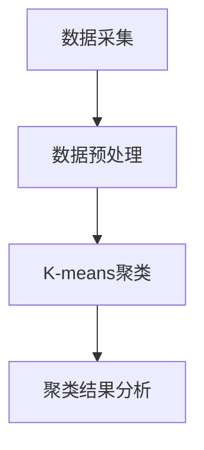
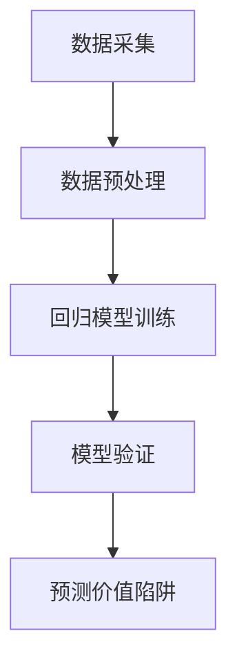
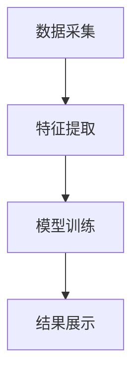
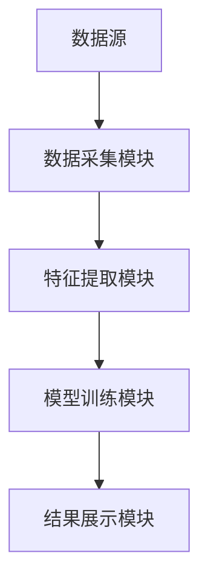

                 


# 马丁惠特曼的价值陷阱识别

> **关键词**：价值陷阱、财务指标、统计分析、回归分析、聚类分析  
> **摘要**：本文详细探讨了马丁·惠特曼的价值陷阱识别方法，结合统计分析和算法模型，深入分析了价值陷阱的定义、特征及其识别策略。通过聚类分析和回归分析，本文提出了一套完整的价值陷阱识别系统架构，并通过实际案例展示了如何利用这些方法在投资决策中规避价值陷阱。

---

## 第一部分：价值陷阱识别的背景与概念

### 第1章：价值陷阱识别的背景与重要性

#### 1.1 价值陷阱的定义与特征

**1.1.1 价值陷阱的定义**  
价值陷阱是指那些看似估值较低、具有吸引力的股票或企业，但实际上存在隐藏的问题（如财务状况恶化、行业周期性风险或管理问题），导致其估值不可靠，长期表现不佳甚至亏损的现象。

**1.1.2 价值陷阱的核心特征**  
价值陷阱的核心特征包括：  
1. **低市盈率（P/E）**：市盈率低于行业平均水平，但实际盈利能力下降。  
2. **高市净率（P/B）**：市净率远高于行业平均水平，但资产质量恶化。  
3. **财务指标异常**：如ROE（净资产收益率）持续下滑、现金流不稳定等。  
4. **行业周期性风险**：处于下行周期的行业更容易出现价值陷阱。  

**1.1.3 价值陷阱与投资决策的关系**  
价值陷阱常出现在投资者追求短期收益时，忽视了企业基本面的变化。识别价值陷阱可以帮助投资者避免盲目投资于看似便宜但实际风险较高的标的。

#### 1.2 价值陷阱识别的必要性

**1.2.1 投资中的常见误区**  
许多投资者倾向于寻找低估值的股票，但忽略了企业的盈利能力、行业风险和管理能力。这种“捡烟头”策略在某些情况下可能成功，但在市场低迷或行业周期性变化时，容易陷入价值陷阱。

**1.2.2 价值陷阱对企业估值的影响**  
价值陷阱会导致企业估值严重偏离其实际价值，投资者可能在低位买入，但长期持有却无法获得收益，甚至出现亏损。

**1.2.3 识别价值陷阱对投资决策的意义**  
识别价值陷阱可以帮助投资者更理性地进行投资决策，避免因短期估值波动而忽视长期风险。

---

## 第二部分：价值陷阱识别的核心概念与原理

### 第2章：价值陷阱识别的核心概念

#### 2.1 价值陷阱的识别标准

**2.1.1 低市盈率与高市净率的矛盾**  
市盈率和市净率是衡量企业估值的重要指标，但单独使用这两个指标可能会误导投资者。例如，低市盈率可能掩盖了企业盈利能力的下滑，而高市净率可能反映了资产质量的恶化。

**2.1.2 财务指标异常的特征**  
通过分析企业的财务报表，可以发现一些异常指标：  
- **ROE持续下滑**：净资产收益率连续下降，反映企业盈利能力减弱。  
- **现金流不稳定**：经营活动现金流波动大或持续为负，说明企业造血能力不足。  
- **负债率过高**：资产负债率远高于行业平均水平，存在偿债风险。  

**2.1.3 行业周期性与企业基本面的结合**  
行业周期性对价值陷阱的影响不可忽视。例如，在经济下行周期，某些行业可能面临需求萎缩、产能过剩等问题，导致企业估值下降，但实际经营状况恶化，成为价值陷阱。

#### 2.2 价值陷阱与成长陷阱的对比

**2.2.1 成长陷阱的定义与特征**  
成长陷阱是指那些表面上高增长但实际缺乏盈利能力的企业。这类企业可能通过过度投资或激进的财务杠杆实现短期增长，但长期来看，其增长不可持续，最终可能导致价值下降。

**2.2.2 价值陷阱与成长陷阱的区别**  
- **价值陷阱**：估值低但实际盈利能力差，主要体现在财务指标异常和行业周期性风险。  
- **成长陷阱**：估值高但实际增长不可持续，主要体现在高市盈率和高负债率。  

**2.2.3 如何区分价值陷阱与成长陷阱**  
- 通过分析企业的财务指标（如ROE、现金流）判断盈利能力。  
- 结合行业周期和企业增长模式进行综合评估。  

---

## 第三部分：价值陷阱识别的算法与数学模型

### 第3章：基于统计分析的价值陷阱识别算法

#### 3.1 聚类分析在价值陷阱识别中的应用

**3.1.1 聚类分析的基本原理**  
聚类分析是一种无监督学习算法，通过将数据点按照相似性自动分组，识别出具有相似特征的股票。

**3.1.2 聚类分析在股票分类中的应用**  
通过聚类分析，可以将股票按照市盈率、市净率等财务指标进行分组，识别出低估值但盈利能力下降的股票。

**3.1.3 通过聚类分析识别价值陷阱的步骤**  
1. 数据采集：收集企业的财务数据（如ROE、现金流）和市场数据（如市盈率、市净率）。  
2. 数据预处理：标准化财务指标，去除异常值。  
3. 聚类算法：使用K-means算法将股票分为若干组。  
4. 聚类结果分析：识别出低估值但财务指标异常的股票组。  

**3.1.4 聚类分析的流程图（Mermaid）**  


#### 3.2 回归分析在价值陷阱识别中的应用

**3.2.1 回归分析的基本原理**  
回归分析是一种监督学习算法，通过建立自变量（如市盈率）与因变量（如ROE）之间的关系模型，预测股票的盈利能力。

**3.2.2 回归分析在股票估值中的应用**  
通过回归分析，可以识别出市盈率与ROE之间的非线性关系，进而发现那些看似估值低但实际盈利能力下降的股票。

**3.2.3 通过回归分析预测价值陷阱的可能性**  
1. 数据采集：收集企业的市盈率、ROE等财务指标。  
2. 数据预处理：去除异常值，标准化数据。  
3. 回归模型训练：建立市盈率与ROE的线性回归模型。  
4. 模型验证：通过R²值评估模型的拟合优度。  
5. 预测价值陷阱：根据模型预测，识别出市盈率低但ROE预测值低的股票。  

**3.2.4 回归分析的流程图（Mermaid）**  


#### 3.3 数学模型与公式

**3.3.1 聚类分析的数学模型**  
- **K-means聚类算法公式**：  
  $$ \text{距离} = \sqrt{(x_i - x_j)^2 + (y_i - y_j)^2} $$  
  其中，\(x_i\) 和 \(y_i\) 分别表示第 \(i\) 个股票的市盈率和市净率。  

- **聚类中心的计算公式**：  
  $$ \text{中心点} = \left( \frac{1}{k} \sum_{i=1}^{k} x_i, \frac{1}{k} \sum_{i=1}^{k} y_i \right) $$  

**3.3.2 回归分析的数学模型**  
- **线性回归模型公式**：  
  $$ \text{ROE} = \beta_0 + \beta_1 \times \text{市盈率} + \epsilon $$  
  其中，\(\beta_0\) 是截距，\(\beta_1\) 是回归系数，\(\epsilon\) 是误差项。  

- **回归系数的计算公式**：  
  $$ \hat{\beta}_1 = \frac{\sum (x_i - \bar{x})(y_i - \bar{y})}{\sum (x_i - \bar{x})^2} $$  

---

## 第四部分：价值陷阱识别的系统架构与设计

### 第4章：价值陷阱识别系统的架构设计

#### 4.1 系统功能模块设计

**4.1.1 数据采集模块**  
- 从金融数据库中采集企业的财务数据（如ROE、现金流）和市场数据（如市盈率、市净率）。  

**4.1.2 特征提取模块**  
- 对采集到的数据进行预处理，提取关键特征（如ROE、市盈率）。  

**4.1.3 模型训练模块**  
- 使用聚类分析和回归分析模型进行训练，识别价值陷阱。  

**4.1.4 结果展示模块**  
- 将识别结果可视化，生成报告或警报信号。  

**4.1.5 系统功能模块图（Mermaid）**  


#### 4.2 系统架构设计

**4.2.1 系统架构图（Mermaid）**  


**4.2.2 数据流设计（Mermaid）**  


---

## 第五部分：价值陷阱识别的项目实战

### 第5章：价值陷阱识别的项目实战

#### 5.1 项目环境与工具安装

**5.1.1 环境配置**  
- 操作系统：Windows 10 或 macOS 10.15  
- Python版本：3.8 或更高  
- 依赖库：pandas、numpy、scikit-learn、matplotlib  

**5.1.2 工具安装**  
- 安装Python环境：使用Anaconda或virtualenv。  
- 安装依赖库：  
  ```bash
  pip install pandas numpy scikit-learn matplotlib
  ```

#### 5.2 系统核心实现源代码

**5.2.1 数据采集与预处理**  
```python
import pandas as pd
import numpy as np

# 数据采集
data = pd.read_csv('stock_data.csv')

# 数据预处理
data = data.dropna()
data = (data - data.mean()) / data.std()  # 标准化
```

**5.2.2 聚类分析实现**  
```python
from sklearn.cluster import KMeans

# 聚类分析
model = KMeans(n_clusters=3, random_state=42)
model.fit(data[['市盈率', '市净率']])

# 获取聚类结果
clusters = model.predict(data[['市盈率', '市净率']])
data['聚类结果'] = clusters
```

**5.2.3 回归分析实现**  
```python
from sklearn.linear_model import LinearRegression

# 回归分析
model = LinearRegression()
model.fit(data[['市盈率']], data['ROE'])

# 预测价值陷阱
predicted_roe = model.predict(data[['市盈率']])
data['预测ROE'] = predicted_roe
```

**5.2.4 结果可视化**  
```python
import matplotlib.pyplot as plt

# 聚类结果可视化
plt.scatter(data['市盈率'], data['市净率'], c=data['聚类结果'])
plt.xlabel('市盈率')
plt.ylabel('市净率')
plt.show()

# 回归结果可视化
plt.scatter(data['市盈率'], data['ROE'], label='实际值')
plt.plot(data['市盈率'], predicted_roe, 'r', label='预测值')
plt.xlabel('市盈率')
plt.ylabel('ROE')
plt.legend()
plt.show()
```

#### 5.3 代码应用解读与分析

**5.3.1 数据采集与预处理**  
通过读取CSV文件获取股票数据，并对数据进行标准化处理，去除异常值。

**5.3.2 聚类分析**  
使用K-means算法将股票分为3组，分别对应低市盈率、中市盈率和高市盈率。通过可视化可以发现，低市盈率组中部分股票的ROE较低，可能存在价值陷阱。

**5.3.3 回归分析**  
通过线性回归模型，发现市盈率与ROE之间的关系。预测结果表明，部分低市盈率股票的ROE预测值低于实际值，说明这些股票可能存在价值陷阱。

#### 5.4 实际案例分析和详细讲解剖析

**5.4.1 案例分析**  
假设我们分析了某行业的100家上市公司，通过聚类分析和回归分析识别出10家可能存在价值陷阱的公司。这些公司的市盈率较低，但ROE持续下滑，现金流不稳定，且行业处于下行周期。

**5.4.2 结果解读**  
- **聚类分析**：将股票分为3组，识别出低市盈率组中ROE较低的股票。  
- **回归分析**：通过模型预测，发现部分低市盈率股票的ROE预测值低于实际值，表明这些股票可能存在价值陷阱。  

#### 5.5 项目小结

通过本项目，我们成功地利用聚类分析和回归分析识别了潜在的价值陷阱。这种方法可以帮助投资者在投资决策中规避低估值但实际盈利能力下降的股票。

---

## 第六部分：最佳实践、小结、注意事项与拓展阅读

### 第6章：最佳实践与小结

**6.1 小结**  
本文详细探讨了马丁·惠特曼的价值陷阱识别方法，结合统计分析和算法模型，提出了一个完整的识别系统架构。通过聚类分析和回归分析，我们可以有效地识别出那些看似估值低但实际盈利能力下降的股票，从而避免陷入价值陷阱。

**6.2 投资建议**  
- **避免盲目追求低估值**：在投资决策中，不仅要关注市盈率和市净率，还要结合企业的财务指标和行业周期进行综合评估。  
- **长期关注企业基本面**：定期跟踪企业的财务报表，及时发现盈利能力下降的信号。  
- **分散投资**：通过分散投资降低单一股票的风险，避免因个别股票的价值陷阱导致的重大损失。  

**6.3 注意事项**  
- 价值陷阱识别模型仅供参考，实际投资需结合市场环境和行业趋势。  
- 模型的准确性依赖于数据的完整性和模型的训练样本。  
- 需要定期更新模型，以适应市场变化。  

**6.4 拓展阅读**  
- 马丁·惠特曼的《价值投资入门》  
- 《统计学习回归分析》  
- 《聚类分析与金融应用》  

---

## 结语

通过本文的探讨，我们不仅掌握了马丁·惠特曼的价值陷阱识别方法，还通过实际案例展示了如何利用统计分析和算法模型进行投资决策。希望本文能为投资者提供有价值的参考，帮助他们在复杂的市场环境中规避价值陷阱，实现稳健投资。

