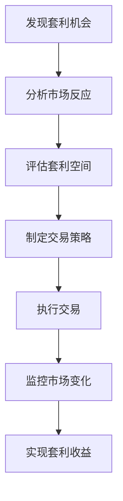
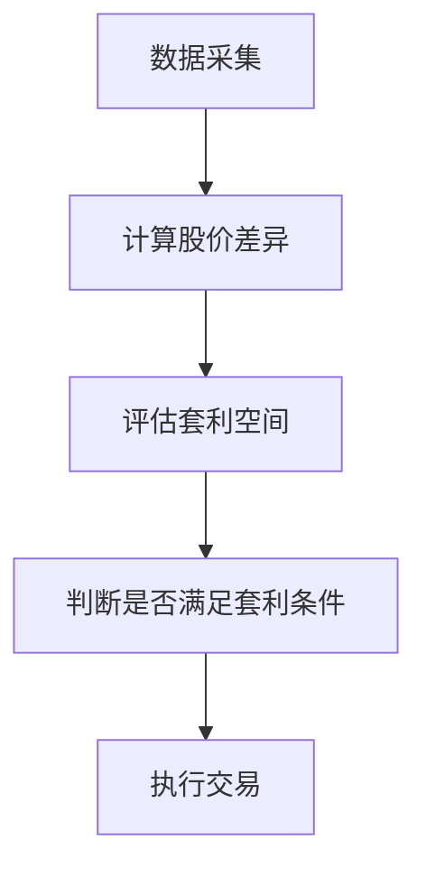
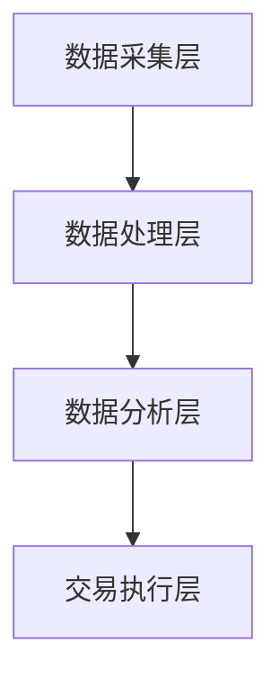
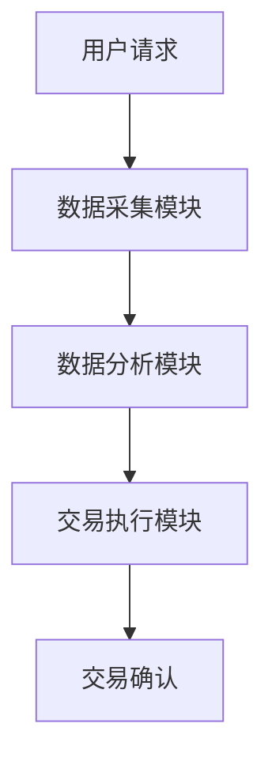

                 


#马丁惠特曼的并购套利策略

##关键词：并购套利、马丁惠特曼、金融策略、数学模型、系统架构

##摘要：本文详细介绍了马丁惠特曼的并购套利策略，从基本概念到数学模型，从系统架构到项目实战，全面解析了这一策略的实施方法和应用场景。文章通过详细的分析和实际案例，帮助读者理解如何利用并购套利策略在金融市场中获利。

---

# 第1章: 并购套利策略概述

##1.1 并购套利的基本概念

###1.1.1 并购套利的定义

并购套利是一种通过利用公司并购过程中产生的股价差异来获利的投资策略。它基于市场对并购信息的反应不完全或不对称的特点，寻找套利机会。

###1.1.2 并购套利的历史发展

并购套利的历史可以追溯到20世纪60年代，随着公司并购活动的增加，套利机会逐渐被投资者发现。随着金融市场的成熟和信息技术的发展，套利策略逐渐系统化和专业化。

###1.1.3 并购套利与传统投资策略的区别

传统投资策略通常基于基本面分析或技术分析，而并购套利则专注于公司并购事件中的股价差异。并购套利的风险和回报通常在较短时间内实现，具有较高的流动性。

###1.1.4 并购套利的核心要素

- **套利机会**：公司并购事件中的股价差异。
- **市场参与者**：包括并购方、目标公司、投资者、做市商等。
- **实施条件**：市场信息不对称、交易成本低、套利机会窗口期短。

###1.1.5 并购套利的分类

- **一级市场套利**：参与公司私募股权融资，利用信息不对称获利。
- **二级市场套利**：在公开市场上利用并购股价差异进行套利。
- **跨市场套利**：在不同市场间利用价格差异进行套利。

---

##1.2 并购套利的核心概念与联系

###1.2.1 套利机会的识别

套利机会通常出现在以下情况：
- 并购 announcement 的市场反应不完全。
- 市场对并购双方的股价反应存在差异。
- 并购后的整合效应未被市场充分定价。

###1.2.2 套利参与者的分析

- **并购方**：发起并购的一方，通常为收购方。
- **目标公司**：被收购的一方。
- **投资者**：套利者，通过买卖股票获利。
- **做市商**：提供流动性的机构。

###1.2.3 套利策略的分类

- **短期套利**：利用并购 announcement 后的股价波动，在短期内获利。
- **长期套利**：基于对并购整合效应的长期判断，持有相关股票至目标股价实现。

###1.2.4 套利机会的流程图



---

##1.3 本章小结

本章介绍了并购套利的基本概念、历史发展、核心要素和分类。通过分析套利机会的识别和参与者的关系，帮助读者理解并购套利的基本原理和实施条件。

---

# 第2章: 并购套利的数学模型与算法原理

##2.1 并购套利的核心数学模型

###2.1.1 套利空间评估模型

套利空间是套利者能够从中获利的潜力。计算公式如下：

$$\text{套利空间} = \frac{\text{目标股价} - \text{当前股价}}{\text{波动率}}$$

其中，目标股价是并购完成后的预期股价，当前股价是并购 announcement 前的股价，波动率是股票的市场价格波动程度。

###2.1.2 股价波动预测模型

股价波动预测模型用于评估套利机会的可行性。常用模型包括：

$$P(\text{波动}) = \alpha \times \text{市场波动} + \beta \times \text{公司特有风险}$$

其中，α和β是模型参数，通常通过历史数据回归得到。

###2.1.3 并购概率计算公式

$$P(\text{并购}) = \frac{\text{历史并购案例数}}{\text{总案例数}} \times \text{当前市场环境因素}$$

---

##2.2 并购套利的算法流程

###2.2.1 数据采集与预处理

- 数据来源：股票市场数据、并购公告、财务报表。
- 数据清洗：处理缺失值、异常值。

###2.2.2 套利机会识别算法



###2.2.3 风险评估与优化算法

- 风险评估：计算套利交易的风险敞口。
- 优化算法：调整投资组合，降低风险。

---

##2.3 本章小结

本章通过数学模型和算法流程图，详细讲解了并购套利的计算方法和实施步骤。套利空间评估模型和并购概率计算公式为套利者提供了科学的决策依据。

---

# 第3章: 并购套利的系统架构与实现

##3.1 系统功能设计

###3.1.1 数据采集模块

- 功能：从市场获取实时数据。
- 输入：并购 announcement、股价数据。
- 输出：股价差异、套利空间。

###3.1.2 数据分析模块

- 功能：计算套利空间、评估风险。
- 输入：股价数据、市场数据。
- 输出：套利机会报告。

###3.1.3 交易执行模块

- 功能：执行买卖指令。
- 输入：交易信号。
- 输出：交易确认。

---

##3.2 系统架构设计

###3.2.1 分层架构图



###3.2.2 模块交互流程图



---

##3.3 系统接口设计

###3.3.1 数据接口规范

- 输入：并购 announcement。
- 输出：股价差异。

###3.3.2 交易接口规范

- 输入：交易信号。
- 输出：交易确认。

---

##3.4 本章小结

本章设计了并购套利系统的功能模块和架构图，展示了系统的整体结构和各模块的交互流程。

---

# 第4章: 并购套利的项目实战

##4.1 环境安装与配置

###4.1.1 Python环境安装

安装Python和必要的库（如pandas、numpy）。

###4.1.2 数据库安装与配置

安装MySQL或MongoDB，用于存储数据。

###4.1.3 第三方库安装

安装requests、pandas、numpy。

---

##4.2 核心代码实现

###4.2.1 数据采集代码

```python
import requests
import pandas as pd

def get_stock_data(ticker):
    url = f"https://api.example.com/stock/{ticker}"
    response = requests.get(url)
    data = response.json()
    df = pd.DataFrame(data)
    return df
```

###4.2.2 数据分析代码

```python
def calculate_arbitrage_space(bid_price, ask_price):
    space = bid_price - ask_price
    return space
```

###4.2.3 交易执行代码

```python
def execute_trade(ticker, quantity):
    # 连接到交易系统并执行交易
    pass
```

---

##4.3 代码解读与分析

###4.3.1 数据采集模块解读

从API获取股票数据，并转换为DataFrame格式。

###4.3.2 数据分析模块解读

计算套利空间，评估是否满足套利条件。

###4.3.3 交易执行模块解读

根据分析结果，执行买卖指令。

---

##4.4 实际案例分析

以某次并购事件为例，展示套利策略的实施过程和结果。

---

##4.5 本章小结

本章通过实际案例，展示了并购套利策略的实施过程，从环境配置到代码实现，再到交易执行，帮助读者理解套利策略的实际应用。

---

# 第5章: 并购套利的最佳实践与注意事项

##5.1 最佳实践

- **信息获取**：及时获取并购 announcement。
- **风险控制**：设置止损点。
- **交易执行**：选择可靠的交易系统。

##5.2 注意事项

- **市场风险**：市场波动可能影响套利空间。
- **法律风险**：遵守相关法律法规。
- **道德风险**：避免操纵市场。

##5.3 拓展阅读

建议阅读相关书籍和论文，深入理解并购套利的理论和实践。

---

# 第6章: 总结与展望

##6.1 总结

本文详细介绍了马丁惠特曼的并购套利策略，从理论到实践，全面解析了套利策略的实施方法。

##6.2 展望

未来，随着人工智能和大数据技术的发展，并购套利策略将更加精准和高效。

---

# 附录

##附录A: 常见问题解答

- **Q1: 并购套利的风险如何控制？**
- **A1: 设置止损点、分散投资。**

---

##附录B: 进一步学习资源

- 推荐书籍：《并购套利实战指南》
- 推荐网站：金融数据分析平台。

---

##附录C: 代码库地址

提供代码仓库地址，方便读者下载和学习。

---

通过以上目录和内容，读者可以系统地学习马丁惠特曼的并购套利策略，从理论到实践，全面掌握套利策略的实施方法和注意事项。

