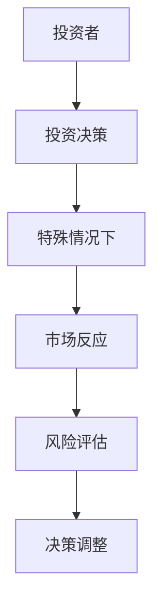
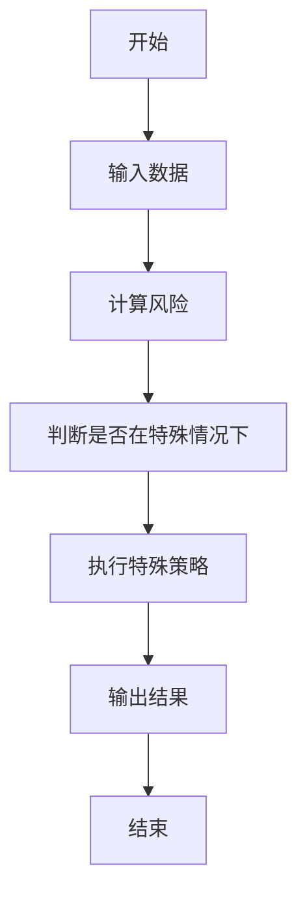
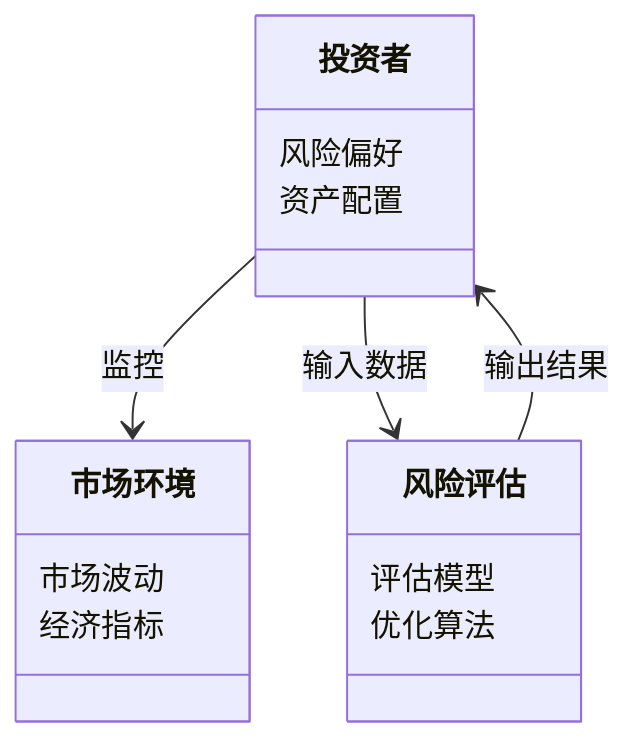
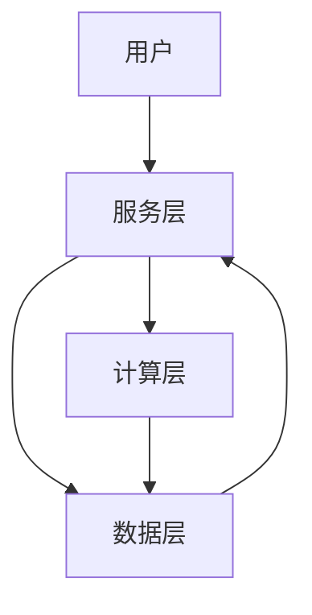
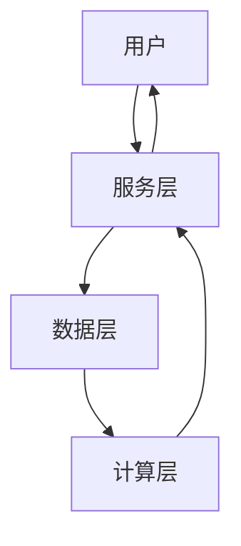

                 


# 《马丁惠特曼的特殊情况投资》

## 关键词：
- 特殊情况投资、风险管理、投资策略、算法原理、系统架构、项目实战、最佳实践

## 摘要：
本文深入分析了马丁惠特曼的特殊情况投资策略，探讨了其在投资领域的独特地位和核心概念。通过详细阐述投资背景、核心概念、算法原理、系统架构、项目实战和最佳实践，为读者提供全面的技术解读。文章结合理论与实践，帮助读者理解如何在特殊情况下制定有效的投资策略，优化投资组合，降低风险。

---

## 第一部分：特殊情况投资的背景与概念

### 第1章：特殊情况投资的背景介绍

#### 1.1 特殊情况投资的定义与背景
特殊情况投资是指在特定市场环境下，投资者采取不同于常规策略的投资行为。这种策略通常在市场出现极端波动、经济危机或政策变化时启用。马丁惠特曼作为投资领域的权威，提出了许多创新的特殊情况投资策略，为投资者提供了新的视角。

#### 1.2 特殊情况投资的核心问题
在特殊情况下，投资者面临的主要问题包括：
- **市场不确定性**：市场波动剧烈，难以预测。
- **资产流动性**：部分资产流动性下降，难以快速变现。
- **风险偏好**：投资者风险承受能力下降，需调整投资策略。

#### 1.3 特殊情况投资的解决思路
马丁惠特曼的策略主要集中在以下几点：
1. **风险控制**：优先考虑资产的流动性与安全性。
2. **逆向投资**：在市场恐慌时寻找被低估的资产。
3. **动态调整**：根据市场变化实时优化投资组合。

#### 1.4 特殊情况投资的概念结构
特殊情况投资的核心概念包括：
- **投资者**：主体，采取特殊策略。
- **市场环境**：外部条件，影响投资决策。
- **风险评估**：关键环节，决定投资策略。
- **投资组合**：最终目标，优化配置。

---

### 第2章：特殊情况投资的核心概念与联系

#### 2.1 核心概念的原理分析
- **投资决策**：投资者基于市场信息做出选择。
- **特殊情况下**：市场环境异常，需调整策略。
- **市场反应**：市场对特殊策略的反馈。

#### 2.2 核心概念的属性特征对比
| 概念         | 特点                     |
|--------------|--------------------------|
| 投资者       | 风险偏好低，追求安全    |
| 市场环境     | 波动性高，不确定性大      |
| 风险评估     | 方法复杂，依赖模型       |
| 投资组合     | 资产配置灵活，注重分散    |

#### 2.3 实体关系图（ER图）


---

## 第二部分：特殊情况投资的算法原理

### 第3章：特殊情况投资的算法原理

#### 3.1 算法原理的数学模型
- **风险评估模型**：计算资产的风险值。
  $$ \text{风险值} = \sqrt{\sum_{i=1}^{n} (r_i - \mu)^2} $$
- **投资组合优化**：在特殊情况下，优化投资组合的目标函数。
  $$ \text{目标函数} = \min \sum_{i=1}^{n} w_i r_i $$

#### 3.2 算法流程图


#### 3.3 算法实现的Python代码
```python
def special_investment_case(data):
    risk = calculate_risk(data)
    if is_special_case(data):
        return apply_special_strategy(risk)
    else:
        return apply_general_strategy(risk)
```

---

## 第三部分：特殊情况投资的系统架构与设计

### 第4章：系统架构与设计方案

#### 4.1 问题场景介绍
- **投资者面临的特殊问题**：市场波动剧烈，需实时调整策略。
- **系统功能需求**：实时监控市场、评估风险、优化投资组合。

#### 4.2 系统功能设计（领域模型）


#### 4.3 系统架构设计


#### 4.4 系统接口设计
- **输入接口**：接收市场数据。
- **输出接口**：提供风险评估结果和优化建议。

#### 4.5 系统交互流程图


---

## 第四部分：特殊情况投资的项目实战

### 第5章：项目实战

#### 5.1 环境安装
- **工具安装**：安装Python、Jupyter Notebook、Mermaid。
- **数据获取**：从金融数据库获取市场数据。

#### 5.2 系统核心实现源代码
```python
def calculate_risk(data):
    # 计算资产风险
    return data.std()

def is_special_case(data):
    # 判断是否为特殊情况
    return data.mean() < -2
```

#### 5.3 代码应用解读
- **数据输入**：读取市场数据。
- **风险评估**：计算资产风险。
- **决策调整**：根据是否为特殊情况，选择投资策略。

#### 5.4 实际案例分析
- **案例背景**：2020年新冠疫情。
- **策略实施**：马丁惠特曼采取了逆向投资策略，成功规避了市场风险。

---

## 第五部分：特殊情况投资的最佳实践

### 第6章：最佳实践

#### 6.1 投资者注意事项
- **风险控制**：优先考虑资产的安全性。
- **动态调整**：根据市场变化及时调整策略。

#### 6.2 小结
马丁惠特曼的特殊情况投资策略为投资者提供了重要的参考，尤其是在市场波动剧烈的情况下。

#### 6.3 注意事项
- **避免过度冒险**：在特殊情况下，投资者应保持谨慎。
- **持续学习**：关注市场动态，优化投资策略。

#### 6.4 拓展阅读
- 推荐阅读马丁惠特曼的相关著作，深入理解其投资理念。

---

## 总结
马丁惠特曼的特殊情况投资策略在投资领域具有重要的地位，本文通过背景分析、算法原理、系统设计和项目实战，为读者提供了全面的解读。希望本文能为投资者在特殊情况下制定有效的投资策略提供帮助。

