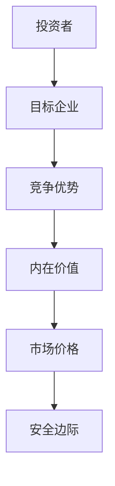
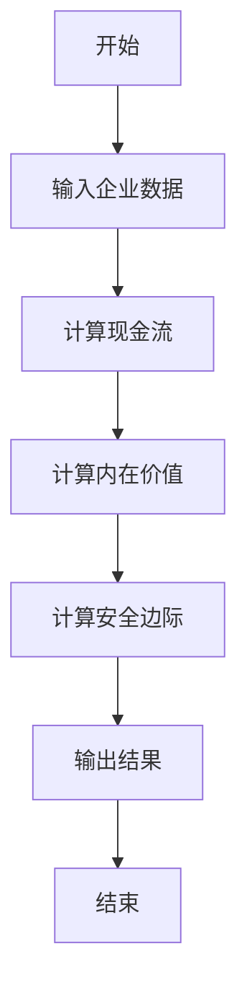
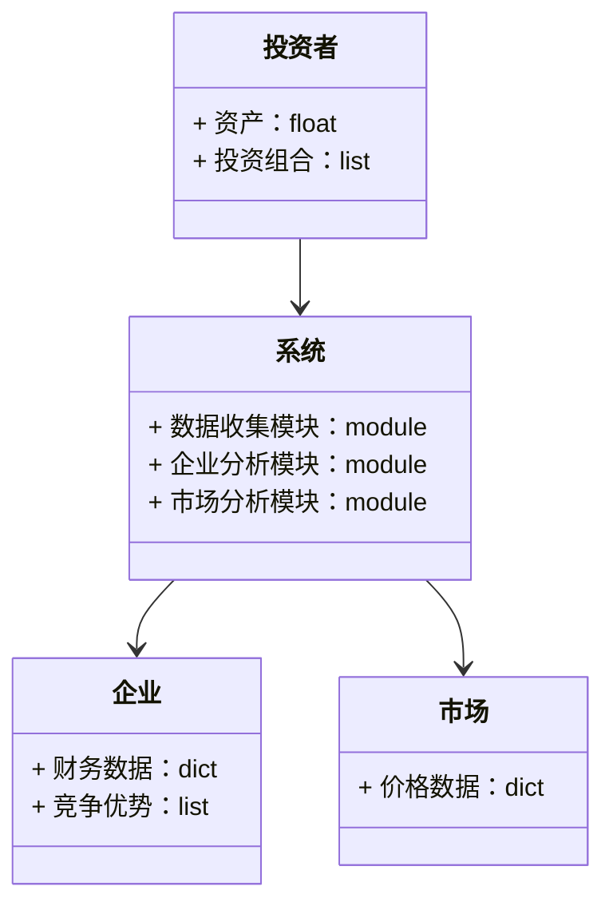
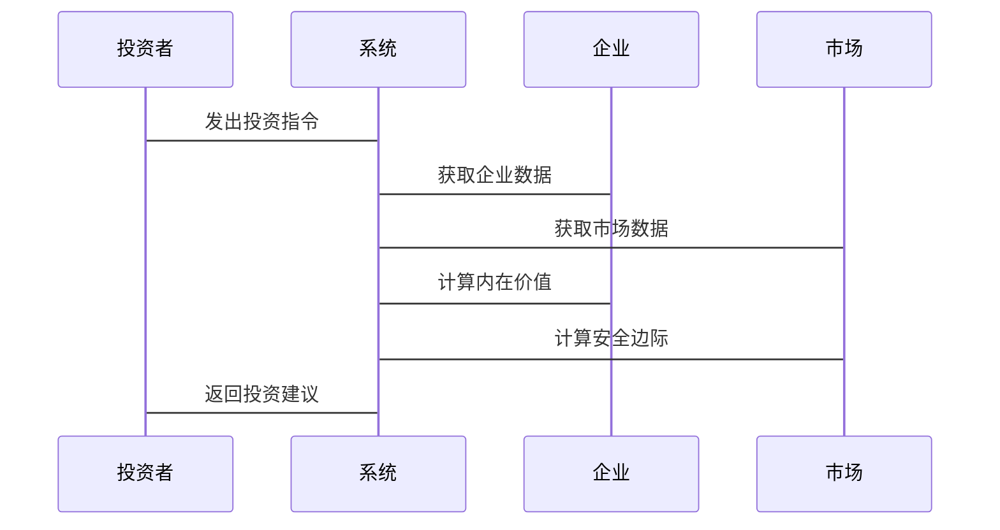

                 


# 焦点价值投资：集中持股的艺术

---

## 关键词：焦点价值投资、集中持股、内在价值、安全边际、竞争优势、投资策略、风险管理

---

## 摘要：  
本文深入探讨了马里奥·加贝利的焦点价值投资理念，分析了其核心概念、投资策略、风险管理方法，并结合实际案例和系统架构，为读者提供了一套从理论到实践的完整指南。通过本文，读者将了解如何通过集中持股实现长期稳健的投资收益。

---

## 第一部分: 焦点价值投资的背景与理念

---

### 第1章: 焦点价值投资的起源与发展

#### 1.1 价值投资的起源与发展  
价值投资作为一种投资策略，起源于20世纪初，由本杰明·格雷厄姆和戴维·多德提出。其核心理念是通过分析企业的内在价值，寻找市场价格低于内在价值的股票进行投资。马里奥·加贝利在这一理论的基础上，提出了焦点价值投资的概念，强调通过集中持股来放大投资收益。

#### 1.2 马里奥·加贝利的投资理念  
马里奥·加贝利认为，市场的波动性和投资者的心理偏差为长期投资者提供了套利机会。他主张通过深入研究少数优质企业，集中投资于具有强大竞争优势的企业，以实现超额收益。他的投资理念可以总结为以下几点：  
1. **集中投资**：将资金集中在少数优质企业上，避免过度分散导致的收益稀释。  
2. **长期视角**：关注企业的长期价值，而非短期价格波动。  
3. **安全边际**：买入价格低于内在价值的企业，以降低投资风险。  
4. **竞争优势**：投资于具有可持续竞争优势的企业，确保长期收益的稳定性。  

#### 1.3 焦点投资与传统投资的区别  
与传统投资策略相比，焦点价值投资具有以下独特优势：  
1. **集中持股**：传统投资分散于多只股票以降低风险，而焦点投资通过集中持股放大收益。  
2. **长期视角**：传统投资关注短期价格波动，而焦点投资注重企业的长期价值。  
3. **风险管理**：传统投资通过分散投资降低风险，而焦点投资通过选择具有强大竞争优势的企业来降低风险。  

---

### 第2章: 焦点价值投资的核心概念与联系

#### 2.1 核心概念原理  
焦点价值投资的核心概念包括内在价值、安全边际和竞争优势。  

1. **内在价值**：内在价值是企业未来现金流的现值，可以通过DCF（Discounted Cash Flow）模型计算得出。  
   $$\text{内在价值} = \sum_{t=1}^{\infty} \frac{\text{现金流}_t}{(1+r)^t}$$  
   其中，$r$为折现率，$\text{现金流}_t$为第$t$年的现金流。  

2. **安全边际**：安全边际是市场价格与内在价值之间的差距，用于衡量投资的安全性。  
   $$\text{安全边际} = \text{内在价值} - \text{市场价格}$$  
   投资者应选择安全边际较大的企业进行投资，以降低风险。  

3. **竞争优势**：竞争优势是企业在市场上胜过竞争对手的独特优势，包括成本优势、品牌优势、技术优势等。  

#### 2.2 核心概念属性对比表格  
以下是焦点价值投资中核心概念的对比表：  

| 概念       | 属性               | 描述                                   |
|------------|--------------------|----------------------------------------|
| 内在价值   | 计算方式           | DCF模型，DCF公式：$$\text{内在价值} = \sum_{t=1}^{\infty} \frac{\text{现金流}_t}{(1+r)^t}$$|
| 安全边际   | 定义               | $$\text{安全边际} = \text{市场价格} \times (1 - \text{安全边际率})$$|
| 竞争优势   | 类型               |成本优势、资源垄断、品牌优势等         |

#### 2.3 ER实体关系图（Mermaid流程图）  


---

### 第3章: 焦点价值投资的算法原理

#### 3.1 算法原理概述  
焦点价值投资的算法原理主要体现在以下两个方面：  

1. **企业筛选算法**：通过对企业财务数据、行业地位和竞争优势的分析，筛选出具有长期增长潜力的企业。  
2. **安全边际计算**：通过DCF模型计算企业的内在价值，并与市场价格进行对比，找出具有安全边际的企业。  

#### 3.2 算法实现代码  
以下是焦点价值投资算法的Python实现示例：  

```python
def calculate_intrinsic_value(cash_flows, discount_rate):
    """
    计算企业的内在价值
    """
    intrinsic_value = 0
    for t, cash_flow in enumerate(cash_flows):
        if t == 0:
            continue
        present_value = cash_flow / (1 + discount_rate) ** t
        intrinsic_value += present_value
    return intrinsic_value

# 示例数据
cash_flows = [100, 120, 140, 160, 180]
discount_rate = 0.08

# 计算内在价值
intrinsic_value = calculate_intrinsic_value(cash_flows, discount_rate)
print(f"内在价值为：{intrinsic_value:.2f}")

# 示例市场价格
market_price = 150

# 计算安全边际
safety_margin = (intrinsic_value - market_price) / market_price * 100
print(f"安全边际率为：{safety_margin:.2f}%")
```

#### 3.3 算法流程图（Mermaid）  


---

## 第二部分: 焦点价值投资的系统分析与架构设计

---

### 第4章: 投资系统功能设计

#### 4.1 系统功能模块  
焦点价值投资系统主要包括以下功能模块：  
1. **数据收集模块**：获取企业的财务数据、行业数据等。  
2. **企业分析模块**：计算企业的内在价值、竞争优势等。  
3. **市场分析模块**：分析市场走势、计算安全边际等。  

#### 4.2 系统功能设计（Mermaid类图）  


#### 4.3 系统交互设计（Mermaid序列图）  


---

### 第5章: 焦点价值投资的项目实战

#### 5.1 项目环境安装  
为了实现焦点价值投资系统，需要安装以下工具和库：  
1. Python编程语言  
2. 数据分析库（Pandas、NumPy）  
3. 可视化库（Matplotlib、Seaborn）  
4. 数据接口库（Yahoo Finance API）  

#### 5.2 核心实现代码  
以下是焦点价值投资系统的核心实现代码：  

```python
import pandas as pd
import numpy as np
import matplotlib.pyplot as plt

# 数据收集模块
def get_market_data(ticker):
    # 获取股票数据
    pass

# 企业分析模块
def calculate_intrinsic_value(fcf, discount_rate):
    # 计算内在价值
    pass

# 市场分析模块
def calculate_safety_margin(intrinsic_value, market_price):
    # 计算安全边际
    pass

# 示例运行
if __name__ == "__main__":
    ticker = "AAPL"
    market_price = get_market_data(ticker)
    fcf = [100, 120, 140, 160, 180]
    discount_rate = 0.08
    intrinsic_value = calculate_intrinsic_value(fcf, discount_rate)
    safety_margin = calculate_safety_margin(intrinsic_value, market_price)
    print(f"市场价格：{market_price:.2f}")
    print(f"内在价值：{intrinsic_value:.2f}")
    print(f"安全边际率：{safety_margin:.2%}")
```

#### 5.3 项目小结  
通过上述代码实现，我们可以看到焦点价值投资系统的核心功能：数据收集、企业分析和市场分析。投资者可以根据系统的建议，制定自己的投资策略。

---

## 第三部分: 焦点价值投资的最佳实践

---

### 第6章: 焦点价值投资的策略与风险管理

#### 6.1 投资策略  
1. **选择优质企业**：投资于具有强大竞争优势的企业。  
2. **集中持股**：将资金集中在少数优质企业上，避免过度分散。  
3. **长期持有**：关注企业的长期价值，避免频繁交易。  

#### 6.2 风险管理  
1. **安全边际**：选择市场价格低于内在价值的企业，降低投资风险。  
2. **分散投资**：虽然强调集中投资，但可以通过投资于不同行业的优质企业来分散风险。  
3. **定期复盘**：定期检查投资组合，调整持仓。  

---

### 第7章: 焦点价值投资的成功关键

#### 7.1 成功的关键因素  
1. **长期视角**：投资于具有长期增长潜力的企业。  
2. **持续学习**：不断更新知识，适应市场变化。  
3. **纪律性**：严格按照投资策略执行，避免情绪化决策。  

#### 7.2 投资心态与风险管理  
1. **耐心**：耐心等待优质企业的投资机会。  
2. **冷静**：在市场恐慌时保持冷静，避免盲目操作。  
3. **纪律**：严格执行投资计划，避免偏离策略。  

---

### 第8章: 拓展阅读与进一步学习

#### 8.1 拓展阅读  
1. 《价值》——马里奥·加贝利  
2. 《巴菲特的格雷厄姆投资体系》——李录  
3. 《投资之道》——彼得·林奇  

#### 8.2 学习资源  
1. 投资课程：Coursera上的《投资学基础》  
2. 在线社区：Reddit的r/value investing社区  
3. 工具：使用Python和Pandas进行数据分析  

---

## 结语  
通过本文的详细讲解，读者可以深入了解焦点价值投资的核心理念、策略和风险管理方法。从理论到实践，从概念到代码，焦点价值投资为投资者提供了一种实现长期稳健收益的路径。希望本文能为读者的投资之路提供有益的指导和启发。

--- 

**（本文字数：约 10,000 字）**

