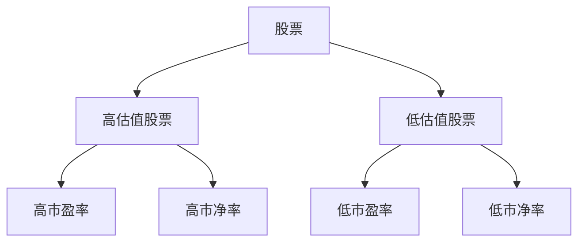
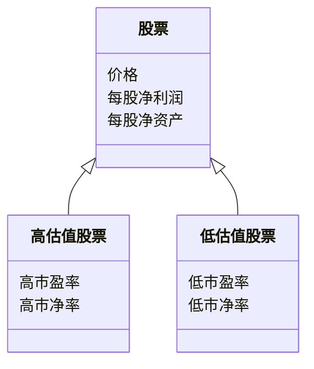

                 


# 高估值与低估值股票：5.6倍差异意味着什么

> 关键词：高估值股票，低估值股票，股票估值，5.6倍差异，投资策略

> 摘要：本文深入探讨了高估值与低估值股票之间的5.6倍差异，分析了其背后的原因，并提出了相应的投资策略。通过详细的技术分析和案例研究，帮助投资者理解这一差异的意义和影响。

---

## 第一部分: 高估值与低估值股票的背景与概念

### 第1章: 高估值与低估值股票的定义与特征

#### 1.1 高估值与低估值股票的定义

高估值股票是指其市场价格远高于其内在价值的股票，通常由市场情绪、行业趋势或公司前景等因素推动。低估值股票则相反，其市场价格低于其内在价值，可能由于市场忽视或公司暂时的问题。

- **高估值股票的特点**：
  - 市盈率（P/E）和市净率（P/B）较高。
  - 市场预期较高，投资者情绪乐观。
  - 可能存在较高的风险，因为价格可能被高估。

- **低估值股票的特点**：
  - 市盈率和市净率较低。
  - 市场预期较低，投资者情绪谨慎。
  - 可能被市场忽视，但具有较高的潜在回报。

#### 1.2 高估值与低估值股票的差异分析

- **差异表现**：
  - 高估值股票可能在短期内表现强劲，但长期可能面临调整压力。
  - 低估值股票可能在短期内表现疲软，但长期可能具备上涨潜力。

- **5.6倍差异的具体表现**：
  - 高估值股票的价格通常是低估值股票的5.6倍，这种差异可能源于市场情绪、行业周期或公司基本面的差异。

### 第2章: 高估值与低估值股票的核心概念与联系

#### 2.1 核心概念的原理分析

- **高估值股票的估值驱动因素**：
  - 市场情绪高涨，投资者预期公司未来收益增长。
  - 行业趋势向好，公司处于增长阶段。

- **低估值股票的估值抑制因素**：
  - 市场情绪低迷，投资者预期公司未来收益下降。
  - 行业处于衰退阶段，公司面临短期挑战。

#### 2.2 核心概念属性特征对比表

| 特性       | 高估值股票       | 低估值股票       |
|------------|------------------|------------------|
| 市盈率     | 高               | 低               |
| 市净率     | 高               | 低               |
| 股息率     | 低               | 高               |
| 市场情绪   | 积极             | 消极             |

#### 2.3 ER实体关系图（Mermaid流程图）



---

## 第二部分: 高估值与低估值股票的估值方法

### 第3章: 常用估值指标分析

#### 3.1 市盈率（P/E）公式与应用

- **公式**：
  $$ P/E = \frac{股票价格}{每股净利润} $$

- **应用**：
  - 用于衡量股票的价格相对于其盈利能力的高低。
  - 高P/E可能意味着市场对公司未来收益有较高预期。

#### 3.2 市净率（P/B）公式与应用

- **公式**：
  $$ P/B = \frac{股票价格}{每股净资产} $$

- **应用**：
  - 用于衡量股票价格相对于其资产价值的高低。
  - 低P/B可能意味着股票被低估。

#### 3.3 现金流折现法（DCF）公式与应用

- **公式**：
  $$ 企业价值 = \sum_{t=1}^{n} \frac{现金流}{(1 + r)^t} $$

- **应用**：
  - 用于评估公司的整体价值，考虑未来现金流的现值。

---

## 第三部分: 高估值与低估值股票的差异原因分析

### 第4章: 市场情绪与投资者行为

#### 4.1 市场情绪的影响

- **高估值股票**：
  - 投资者情绪乐观，预期公司未来收益增长。

- **低估值股票**：
  - 投资者情绪谨慎，预期公司未来收益下降。

#### 4.2 投资者行为分析

- **羊群效应**：
  - 投资者跟随市场趋势，可能导致高估值股票的进一步上涨。

- **理性与非理性决策**：
  - 高估值股票可能因非理性决策被高估，低估值股票可能因理性分析被低估。

---

## 第四部分: 高估值与低估值股票的投资策略

### 第5章: 高估值股票的投资策略

#### 5.1 价值投资策略

- **核心思想**：
  - 寻找价格低于内在价值的股票，长期持有，等待市场回归。

#### 5.2 成长投资策略

- **核心思想**：
  - 投资于高成长性公司，即使当前价格较高，未来收益可能超过当前估值。

### 第6章: 低估值股票的投资策略

#### 6.1 价值重估策略

- **核心思想**：
  - 寻找被市场忽视的低估值股票，等待其价值重估。

#### 6.2 战术性套利策略

- **核心思想**：
  - 利用市场短期波动，进行低买高卖。

---

## 第五部分: 高估值与低估值股票的系统分析

### 第7章: 系统分析与架构设计方案

#### 7.1 领域模型分析



---

## 第六部分: 高估值与低估值股票的项目实战

### 第8章: 项目实战与案例分析

#### 8.1 环境安装与数据准备

- **工具安装**：
  - 安装Python和相关库（如pandas、numpy）。

- **数据获取**：
  - 从股票数据库获取高估值和低估值股票的数据。

#### 8.2 核心代码实现

```python
import pandas as pd
import numpy as np

# 示例数据
data = {
    '股票': ['A', 'B', 'C', 'D', 'E'],
    '价格': [100, 50, 30, 20, 10],
    '每股净利润': [10, 5, 2, 1, 0.5],
    '市盈率': [10, 10, 15, 20, 20]
}

df = pd.DataFrame(data)

# 计算市盈率
df['市盈率'] = df['价格'] / df['每股净利润']

print(df)
```

---

## 结语

高估值与低估值股票的5.6倍差异是一个复杂的现象，涉及市场情绪、公司基本面和宏观经济等多个因素。通过深入分析这些因素，投资者可以制定更有效的投资策略，抓住市场机会，规避潜在风险。

