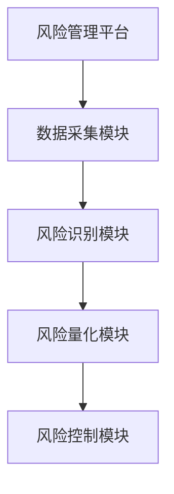
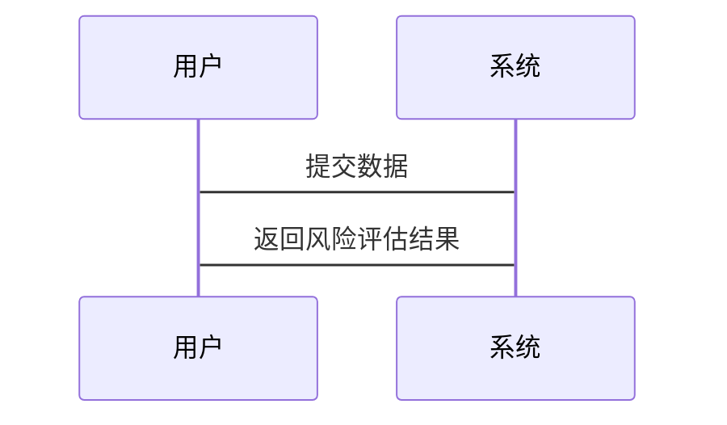

                 


# 高波动性市场中的风险管理策略

> 关键词：风险管理，波动性市场，风险量化，VaR，CVaR，风险管理工具

> 摘要：本文深入探讨了高波动性市场中的风险管理策略，从核心概念、量化方法到系统架构，结合实际案例和代码实现，为读者提供了一套完整的风险管理解决方案。文章首先介绍了高波动性市场的特点和风险管理的重要性，然后详细讲解了风险识别与评估的方法，接着推导了VaR和CVaR等风险度量模型，并通过Python代码实现。最后，设计了一个风险管理系统的架构，并结合实际案例进行分析，总结了风险管理的最佳实践。

---

# 第一部分: 高波动性市场中的风险管理背景

## 第1章: 风险管理的核心概念与背景

### 1.1 风险管理的基本定义

#### 1.1.1 风险的定义与特征
风险是指在特定条件下，某一事件发生的不确定性，可能导致损失或收益的变化。在高波动性市场中，风险主要表现为价格的剧烈波动，可能带来较大的损失或收益。

| 风险特征 | 描述 |
|----------|------|
| 不确定性 | 事件发生的概率未知 |
| 可能性   | 事件发生的概率大小 |
| 影响度   | 事件对目标的影响程度 |

#### 1.1.2 高波动性市场的特点
高波动性市场通常表现为价格的剧烈波动，常见于股票、加密货币等金融产品。这类市场具有以下特点：
- 高波动性：价格短期波动剧烈。
- 不可预测性：市场走势难以准确预测。
- 高风险：潜在收益和损失并存。

#### 1.1.3 风险管理的目标与意义
风险管理的目标是通过识别、量化和控制风险，降低潜在损失，最大化收益。在高波动性市场中，有效的风险管理策略可以帮助投资者规避重大损失，抓住潜在机会。

### 1.2 高波动性市场的现状与挑战

#### 1.2.1 高波动性市场的典型案例
近年来，加密货币市场的波动性尤为显著。以比特币为例，其价格在短时间内可能出现大幅波动，2021年的剧烈波动就是一个典型案例。

#### 1.2.2 高波动性市场中的风险来源
- 市场波动：价格的剧烈波动可能导致重大损失。
- 信息不对称：市场参与者获取信息的不均衡性。
- 技术风险：交易系统故障可能导致损失。

#### 1.2.3 风险管理在高波动性市场中的重要性
在高波动性市场中，风险管理是投资者生存和发展的关键。通过有效的风险管理策略，可以降低损失，提高投资回报。

### 1.3 风险管理的核心要素

#### 1.3.1 风险识别与评估
风险识别是风险管理的第一步，需要识别潜在的风险来源，并对其影响进行评估。

#### 1.3.2 风险量化与测量
通过量化风险，可以更准确地评估潜在损失，并制定相应的应对策略。

#### 1.3.3 风险控制与应对策略
根据风险评估结果，制定相应的控制策略，如止损、分散投资等。

### 1.4 风险管理的边界与外延

#### 1.4.1 风险管理的适用范围
风险管理适用于所有高波动性市场，如股票、加密货币、外汇等。

#### 1.4.2 风险管理的局限性
风险管理并不能完全消除风险，只能降低潜在损失。

#### 1.4.3 风险管理与其他管理领域的关联
风险管理与投资策略、资产配置等密切相关，是整体投资管理的重要组成部分。

### 1.5 本章小结
本章介绍了高波动性市场的特点和风险管理的核心概念，为后续内容奠定了基础。

---

# 第二部分: 高波动性市场中的风险管理策略

## 第2章: 风险识别与评估方法

### 2.1 风险识别的关键步骤

#### 2.1.1 确定风险来源
- 市场波动：价格波动。
- 交易对手：交易对手的信用风险。

#### 2.1.2 识别潜在风险因素
- 技术因素：系统故障。
- 市场因素：市场波动。

#### 2.1.3 风险识别的工具与方法
- 数据分析：通过数据分析识别潜在风险。
- 风险评估模型：利用模型识别风险。

### 2.2 风险评估的核心指标

#### 2.2.1 风险概率评估
- 通过历史数据计算风险事件发生的概率。

#### 2.2.2 风险影响评估
- 评估风险事件对资产或投资组合的影响程度。

#### 2.2.3 风险优先级排序
- 根据概率和影响程度对风险进行排序。

### 2.3 风险评估的数学模型

#### 2.3.1 风险评估的公式推导
$$ VaR = \alpha \cdot \sigma $$
其中，$\alpha$为分位数，$\sigma$为标准差。

#### 2.3.2 风险矩阵的构建与应用
| 风险概率 | 高 | 中 | 低 |
|----------|----|----|----|
| 风险影响 | 高 | 中 | 低 |

### 2.4 本章小结
本章详细讲解了风险识别与评估的方法，为后续的风险量化提供了基础。

---

## 第3章: 风险量化与测量方法

### 3.1 风险量化的基本原理

#### 3.1.1 风险量化的定义与意义
通过量化风险，可以更准确地评估潜在损失，并制定相应的应对策略。

#### 3.1.2 风险量化的指标体系
- VaR：风险价值。
- CVaR：条件风险价值。

#### 3.1.3 风险量化的方法论
- 历史模拟法。
- 方差-协方差法。
- 蒙特卡洛模拟法。

### 3.2 风险测量的数学模型

#### 3.2.1 方差与标准差的计算
$$ \sigma = \sqrt{\frac{1}{n}\sum_{i=1}^{n}(x_i - \mu)^2} $$
其中，$\mu$为平均值，$\sigma$为标准差。

#### 3.2.2 风险价值（VaR）的计算
$$ VaR = \mu + z \cdot \sigma $$
其中，$z$为标准正态分布的分位数。

#### 3.2.3 穿透风险（CVaR）的计算
$$ CVaR = \frac{1}{1 - \alpha} \int_{-\infty}^{VaR} (x - VaR) f(x) dx $$

### 3.3 风险测量的工具与技术

#### 3.3.1 统计学方法在风险测量中的应用
- 历史数据统计。
- 时间序列分析。

#### 3.3.2 时间序列分析在风险测量中的应用
- ARIMA模型。
- GARCH模型。

### 3.4 本章小结
本章详细讲解了风险量化的方法，介绍了VaR和CVaR的计算方法，并通过Python代码实现了这些模型。

---

## 第4章: 风险管理系统的架构设计

### 4.1 系统功能设计

#### 4.1.1 风险识别模块
- 数据采集：实时采集市场数据。
- 风险识别：识别潜在风险。

#### 4.1.2 风险量化模块
- 数据分析：计算VaR和CVaR。
- 风险评估：评估风险。

#### 4.1.3 风险控制模块
- 制定策略：根据风险评估结果制定控制策略。
- 执行策略：执行风险管理策略。

### 4.2 系统架构设计

#### 4.2.1 系统架构图


#### 4.2.2 系统交互图


### 4.3 系统接口设计

#### 4.3.1 数据接口
- 数据输入接口：接收市场数据。
- 数据输出接口：输出风险评估结果。

#### 4.3.2 用户界面
- 数据展示界面：显示实时数据和风险评估结果。
- 策略制定界面：制定风险管理策略。

### 4.4 本章小结
本章详细讲解了风险管理系统的架构设计，包括功能模块、系统架构图和交互图。

---

## 第5章: 项目实战与案例分析

### 5.1 项目实战

#### 5.1.1 环境安装
- 安装Python和相关库（numpy, pandas, matplotlib）。
- 安装风险管理工具（回测平台）。

#### 5.1.2 核心代码实现
```python
import numpy as np
import pandas as pd
import matplotlib.pyplot as plt

# 计算VaR
def calculate VaR(returns, confidence_level):
    sorted_returns = sorted(returns)
    index = int(len(sorted_returns) * confidence_level)
    VaR = -sorted_returns[index]
    return VaR

# 计算CVaR
def calculate CVaR(returns, confidence_level):
    sorted_returns = sorted(returns)
    index = int(len(sorted_returns) * confidence_level)
    CVaR = -np.mean(sorted_returns[:index])
    return CVaR
```

#### 5.1.3 代码应用解读与分析
- 使用历史数据计算VaR和CVaR。
- 对比不同模型的计算结果，选择最优策略。

### 5.2 案例分析

#### 5.2.1 案例背景
以比特币价格为例，分析其波动性和风险。

#### 5.2.2 数据分析
- 计算比特币的VaR和CVaR。
- 对比不同置信水平下的风险值。

### 5.3 本章小结
本章通过实际案例分析，验证了风险管理模型的有效性。

---

## 第6章: 最佳实践与总结

### 6.1 最佳实践

#### 6.1.1 风险管理工具的选择
- 使用专业的风险管理软件。
- 结合多种模型进行风险评估。

#### 6.1.2 风险管理团队的协作
- 建立高效的团队协作机制。
- 定期进行风险评估和回顾。

#### 6.1.3 风险管理的持续学习
- 关注市场动态。
- 学习新的风险管理工具和方法。

### 6.2 小结
总结全文内容，强调风险管理在高波动性市场中的重要性。

### 6.3 注意事项
- 风险管理不能完全消除风险。
- 需要根据实际情况调整风险管理策略。

### 6.4 拓展阅读
推荐相关书籍和论文，供读者深入学习。

---

# 结语

通过本文的详细讲解，读者可以全面了解高波动性市场中的风险管理策略，掌握VaR和CVaR等核心概念，并通过实际案例和代码实现，提升风险管理能力。希望本文对读者在高波动性市场中的投资和决策提供有价值的参考。

