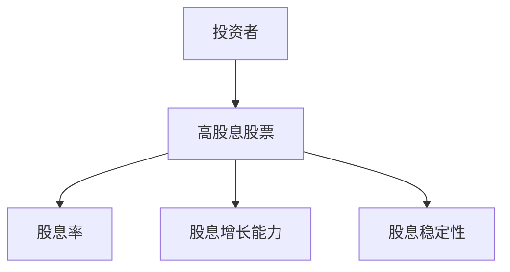
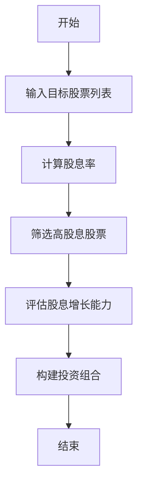
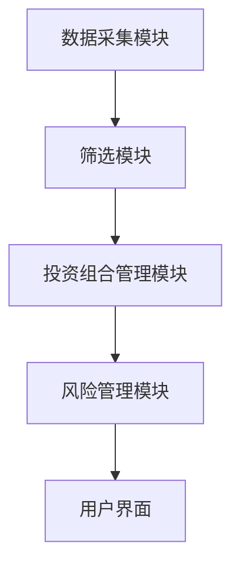
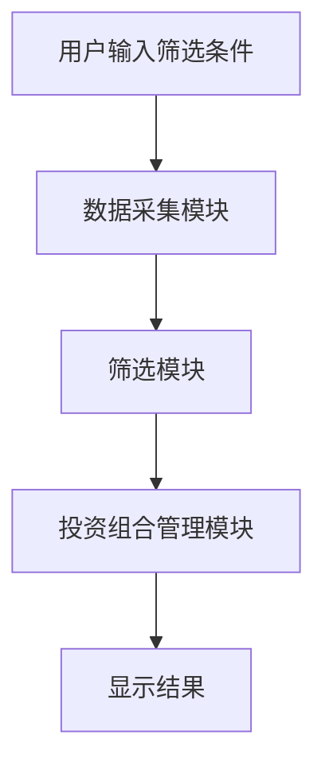

                 


---

# 高股息策略：构建稳定现金流的投资组合

## 关键词：高股息策略、现金流、投资组合、股息率、风险管理

## 摘要：  
本文详细探讨了高股息策略在构建稳定现金流投资组合中的应用。通过分析高股息策略的核心概念、数学模型、系统架构以及实际案例，为投资者提供了一套科学的投资方法。文章首先介绍了高股息策略的基本概念和适用场景，随后详细讲解了高股息策略的核心要素，包括股息率的计算、股息增长能力的评估以及高股息股票的筛选标准。接着，文章通过数学模型和公式，深入分析了高股息策略的理论基础，包括股息贴现模型（DDM）和股息增长模型的应用。最后，文章结合系统架构设计和实际项目案例，展示了如何通过构建高股息投资组合管理系统来实现稳定现金流的目标，并提供了最佳实践建议和风险管理策略。

---

## 第一部分: 高股息策略的背景与核心概念

### 第1章: 高股息策略的背景与基本概念

#### 1.1 高股息策略的定义与特点
##### 1.1.1 高股息策略的定义
高股息策略是一种通过投资高股息率的股票，以获取稳定股息收入的投资策略。这种策略注重股息的持续性和增长性，适合追求稳定现金流的投资者。

##### 1.1.2 高股息策略的核心特点
- **高股息率**：高股息策略的核心是选择股息率较高的股票，通常股息率在5%以上。
- **稳定性**：高股息股票通常来自具有稳定盈利和良好现金流的公司。
- **低波动性**：高股息股票在市场波动时往往表现较为稳定，具有防御性。

##### 1.1.3 高股息策略与其它投资策略的对比
- **与成长型投资策略对比**：成长型投资注重公司的成长潜力，而高股息策略注重稳定的股息收入。
- **与价值型投资策略对比**：价值型投资寻找被低估的股票，而高股息策略关注股息收益率。

#### 1.2 高股息策略的适用场景
##### 1.2.1 高股息策略的适用人群
- **追求稳定收益的投资者**：如退休人士、保守型投资者。
- **对冲市场波动的投资者**：高股息股票在市场下跌时往往表现较好。

##### 1.2.2 高股息策略在不同市场环境下的表现
- **牛市**：高股息股票表现相对平淡，但股息收入稳定。
- **熊市**：高股息股票通常表现优于市场，因防御性强。

##### 1.2.3 高股息策略的优缺点分析
- **优点**：稳定的股息收入、较低的市场波动性。
- **缺点**：股息率过高的股票可能存在流动性风险，且公司盈利增长有限。

#### 1.3 高股息策略的核心要素
##### 1.3.1 股息率的计算与影响因素
股息率计算公式：
$$ \text{股息率} = \frac{\text{每股股息}}{\text{股价}} $$

影响股息率的因素包括：
- **盈利能力**：公司利润是股息的基础。
- **股息支付率**：公司支付股息的能力。
- **行业特性**：公用事业、房地产等行业通常股息率较高。

##### 1.3.2 股息增长能力的评估
股息增长能力是高股息策略的重要评估因素，通常可以通过历史股息增长率和未来盈利预期来判断。

##### 1.3.3 高股息股票的筛选标准
高股息股票筛选标准：
- **股息率高**：通常在5%以上。
- **股息增长稳定**：历史股息增长率较高且稳定。
- **财务健康**：公司盈利良好，现金流充足。

#### 1.4 高股息策略的理论基础
##### 1.4.1 股息贴现模型（DDM）的介绍
股息贴现模型（DDM）假设股票的内在价值是未来股息的现值之和。公式为：
$$ V = \frac{D}{r - g} $$
其中：
- \( D \)：未来股息的现值。
- \( r \)：折现率。
- \( g \)：股息增长率。

##### 1.4.2 股息增长模型的应用
股息增长模型假设股息以固定速率增长，公式为：
$$ P = \frac{D_1}{r - g} $$
其中：
- \( D_1 \)：第一期股息。
- \( r \)：折现率。
- \( g \)：股息增长率。

##### 1.4.3 高股息策略与价值投资的关系
高股息策略与价值投资有交集，但更注重股息收益率，而价值投资更注重低估值。

#### 1.5 本章小结
本章介绍了高股息策略的定义、特点、适用场景和核心要素，为后续分析奠定了基础。

---

### 第2章: 高股息策略的核心概念

#### 2.1 高股息策略的核心要素分析
##### 2.1.1 股息率的计算公式
股息率计算公式：
$$ \text{股息率} = \frac{\text{每股股息}}{\text{股价}} $$

##### 2.1.2 股息增长能力的评估方法
股息增长能力可以通过历史股息增长率和未来盈利预期来评估。

##### 2.1.3 高股息股票的筛选标准
高股息股票筛选标准包括股息率高、股息增长稳定、财务健康等。

#### 2.2 高股息策略的数学模型与公式
##### 2.2.1 股息贴现模型（DDM）的公式
$$ D = \frac{D_1}{r - g} $$

##### 2.2.2 股息增长模型的应用
$$ P = \frac{D_1}{r - g} $$

#### 2.3 高股息策略的核心概念对比表
| 概念 | 定义 | 重要性 |
|------|------|--------|
| 股息率 | 每股股息/股价 | 高股息策略的核心指标 |
| 股息增长能力 | 股息增长的可持续性 | 高股息策略的重要评估因素 |
| 股息稳定性 | 股息发放的稳定性 | 高股息策略的风险控制指标 |

#### 2.4 高股息策略的ER实体关系图


#### 2.5 本章小结
本章通过对比和图表分析，进一步明确了高股息策略的核心概念和要素。

---

## 第二部分: 高股息策略的算法原理

### 第3章: 高股息策略的算法原理

#### 3.1 高股息策略的核心算法
##### 3.1.1 股息率计算算法
1. 收集目标股票的历史股息数据。
2. 计算每股股息。
3. 除以当前股价，得到股息率。

##### 3.1.2 股息增长能力评估算法
1. 计算历史股息增长率。
2. 结合未来盈利预期，评估股息增长潜力。

##### 3.1.3 高股息股票筛选算法
1. 筛选股息率高于市场平均水平的股票。
2. 进一步筛选股息增长稳定的股票。
3. 结合财务指标，选择财务健康的企业。

#### 3.2 高股息策略的数学模型
##### 3.2.1 股息贴现模型（DDM）的公式
$$ D = \frac{D_1}{r - g} $$

##### 3.2.2 股息增长模型的应用
$$ P = \frac{D_1}{r - g} $$

#### 3.3 高股息策略的算法流程图


---

## 第三部分: 高股息策略的系统分析与架构设计

### 第4章: 高股息策略的系统架构设计

#### 4.1 项目介绍
高股息投资组合管理系统用于帮助投资者构建和管理基于高股息策略的投资组合。

#### 4.2 系统功能设计
##### 4.2.1 数据采集模块
- 从金融数据库获取股票数据。
- 数据清洗和预处理。

##### 4.2.2 筛选模块
- 计算股息率。
- 筛选高股息股票。

##### 4.2.3 投资组合管理模块
- 构建投资组合。
- 定期再平衡。

##### 4.2.4 风险管理模块
- 监测市场风险。
- 调整投资组合。

#### 4.3 系统架构设计


#### 4.4 系统接口设计
- 数据接口：与金融数据库对接。
- 用户接口：提供筛选和管理功能。

#### 4.5 系统交互流程图


---

### 第5章: 高股息策略的项目实战

#### 5.1 环境安装
- 安装Python和相关库（pandas、numpy、yfinance）。

#### 5.2 核心实现源代码
```python
import pandas as pd
import numpy as np
import yfinance as yf

# 下载股票数据
def download_data(tickers):
    data = pd.DataFrame()
    for ticker in tickers:
        df = yf.download(ticker, start='2020-01-01', end='2023-12-31')
        data[ticker] = df['Close']
    return data

# 计算股息率
def calculate_dividend_yield(tickers, data):
    dividend_yield = {}
    for ticker in tickers:
        if 'Dividends' in data[ticker].dropna().index:
            dividend = data[ticker]['Dividends']
            price = data[ticker]['Close'].iloc[-1]
            dy = dividend.sum() / price
            dividend_yield[ticker] = dy
    return dividend_yield

# 筛选高股息股票
def screen_high_dividend(tickers, threshold=0.05):
    dividend_yield = calculate_dividend_yield(tickers)
    high_dividend = [t for t in tickers if dividend_yield[t] > threshold]
    return high_dividend

# 构建投资组合
def build_portfolio(tickers, weights=None):
    if weights is None:
        weights = [1/len(tickers)] * len(tickers)
    return weights

# 示例代码
tickers = ['MSFT', 'PEP', 'KO']
data = download_data(tickers)
high_dividend = screen_high_dividend(tickers)
portfolio = build_portfolio(high_dividend)
```

#### 5.3 代码应用解读与分析
- 下载数据：从Yahoo Finance获取股票数据。
- 计算股息率：基于历史股息和当前股价计算股息率。
- 筛选股票：根据设定的股息率阈值筛选高股息股票。
- 构建组合：等权重分配投资组合。

#### 5.4 实际案例分析
- 策略回测：计算过去几年的投资收益。
- 风险分析：评估市场波动对投资组合的影响。

#### 5.5 项目小结
本章通过实际代码展示了高股息策略的应用，帮助读者理解如何通过系统方法构建投资组合。

---

## 第六章: 高股息策略的最佳实践

### 6.1 高股息策略的实践经验总结
- **分散投资**：避免过度集中于某一只股票。
- **定期再平衡**：根据市场变化调整投资组合。

### 6.2 风险管理策略
- **市场风险**：通过多样化降低市场波动影响。
- **流动性风险**：选择流动性较高的股票。

### 6.3 持续优化建议
- 定期评估股息增长能力。
- 关注公司基本面变化。

### 6.4 拓展阅读
推荐书籍：
- 《股市长线思维》
- 《投资之道》

---

## 总结

高股息策略通过投资高股息率股票，为投资者提供了稳定的现金流。本文从背景、核心概念、算法原理到系统设计和项目实战，全面分析了高股息策略的各个方面，为投资者提供了科学的投资方法。通过合理的系统架构和代码实现，投资者可以更高效地构建和管理高股息投资组合，实现长期稳定的收益。

