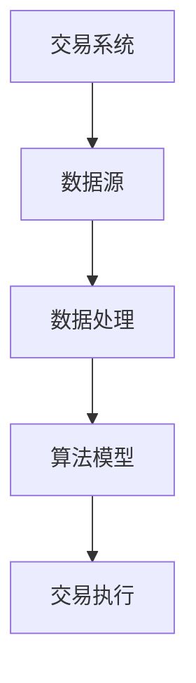
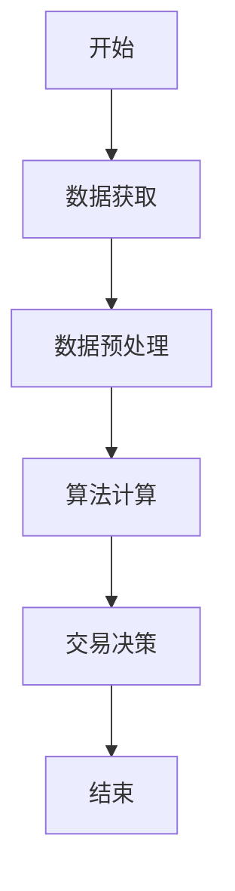
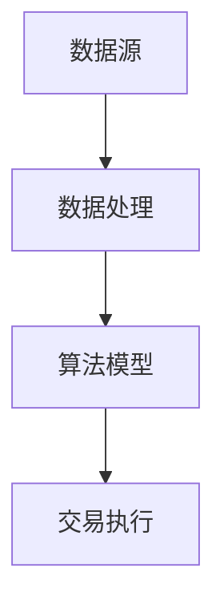
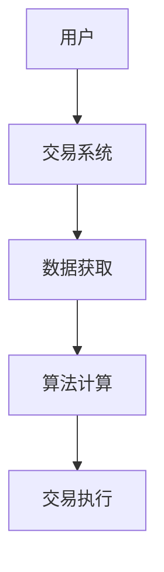

                 


# 高频交易策略：技术创新如何改变市场微观结构

## 关键词：高频交易、市场微观结构、算法交易、技术驱动、系统架构

## 摘要：高频交易是一种依赖于高速计算机算法和复杂技术手段的交易策略，它通过技术创新深刻改变了金融市场的微观结构。本文将从高频交易的定义与背景出发，深入探讨其核心技术原理、系统架构设计以及对市场微观结构的影响。通过具体的算法实现、数学模型和系统设计案例，分析高频交易如何通过技术创新优化市场流动性和定价机制，最终为读者呈现高频交易策略如何在技术驱动下改变金融市场生态。

---

## 第一部分：高频交易策略的背景与基础

### 第1章：高频交易的定义与背景

#### 1.1 高频交易的定义
- **1.1.1 高频交易的定义与特点**  
  高频交易（High-Frequency Trading, HFT）是一种依赖计算机算法，在极短时间内进行大量交易的策略。其特点包括高频性、算法驱动性和低延迟性。高频交易的典型特征是交易速度快、交易次数多、依赖技术系统支持。

- **1.1.2 高频交易的历史发展**  
  高频交易起源于20世纪90年代，随着计算机技术的进步和互联网的普及，高频交易逐渐成为金融市场的重要组成部分。近年来，高频交易在全球各大交易所的交易量占比已超过50%，成为市场的主要驱动力之一。

- **1.1.3 高频交易的市场影响**  
  高频交易的出现改变了金融市场的微观结构，提高了市场的流动性和价格发现效率。然而，高频交易也引发了一些争议，例如加剧市场波动性和潜在的系统性风险。

#### 1.2 市场微观结构概述
- **1.2.1 市场微观结构的定义**  
  市场微观结构是指金融市场的交易机制、参与者行为以及价格形成过程的具体运作方式。它包括订单簿、交易规则、市场参与者的互动等。

- **1.2.2 市场微观结构的关键要素**  
  市场微观结构的关键要素包括订单簿、订单类型、交易规则、市场深度、买卖价差和交易成本等。这些要素共同决定了市场的流动性和价格形成机制。

- **1.2.3 高频交易对市场微观结构的影响**  
  高频交易通过算法和自动化交易系统，显著影响了市场的微观结构。高频交易提高了市场的流动性和订单深度，但也可能导致市场波动性增加和价格不连续性。

#### 1.3 高频交易的技术驱动
- **1.3.1 技术进步对高频交易的推动**  
  技术进步是高频交易发展的核心驱动力。高速计算机、低延迟网络和高效算法的出现，使得高频交易成为可能。

- **1.3.2 数据分析与算法优化**  
  高频交易依赖于对市场数据的实时分析和算法优化。交易者通过分析市场数据，设计出高效的交易算法，以捕捉短期价格波动。

- **1.3.3 网络架构与延迟优化**  
  网络架构的优化是高频交易技术的核心之一。交易者通过优化网络架构，减少交易延迟，从而在竞争激烈的市场中获得优势。

### 第2章：高频交易的核心概念与联系

#### 2.1 高频交易的核心原理
- **2.1.1 高频交易的算法模型**  
  高频交易的核心是算法模型，这些算法模型通过分析市场数据，制定交易决策。典型的算法模型包括统计套利算法、算法交易模型和预测模型。

- **2.1.2 高频交易的数学模型**  
  高频交易的数学模型包括时间序列分析、回归分析和机器学习模型。这些模型帮助交易者预测价格走势和市场波动性。

- **2.1.3 高频交易的系统架构**  
  高频交易系统通常包括数据获取、数据处理、算法计算和交易执行四个模块。每个模块都通过高效的算法和低延迟的网络进行优化。

#### 2.2 核心概念对比与ER图
- **2.2.1 核心概念对比表格**  
  以下是高频交易和传统交易的核心概念对比：

| 比较维度 | 高频交易 | 传统交易 |
|----------|-----------|----------|
| 交易频率 | 极高       | 较低     |
| 交易方式 | 算法驱动   | 手动操作 |
| 响应时间 | 毫秒级     | 秒级     |
| 交易策略 | 统计套利、算法交易 | 基本面分析、技术分析 |

- **2.2.2 ER实体关系图**  
  下图展示了高频交易系统的核心实体及其关系：



### 第3章：高频交易的算法原理

#### 3.1 算法原理概述
- **3.1.1 算法的基本流程**  
  高频交易算法的基本流程包括数据获取、数据预处理、算法计算和交易决策。数据获取是高频交易的核心，交易者需要实时获取市场数据，例如订单簿、交易量和价格信息。

- **3.1.2 算法的核心思想**  
  高频交易算法的核心思想是通过分析市场数据，预测价格走势，制定交易策略。算法通常基于统计套利、算法交易和机器学习模型。

- **3.1.3 算法的优化策略**  
  算法优化是高频交易的核心之一。交易者通过优化算法，提高交易的准确性和效率。常见的算法优化策略包括参数优化、模型选择和交易成本控制。

#### 3.2 算法流程图
- **3.2.1 算法流程图**  
  下图展示了高频交易算法的基本流程：



#### 3.3 算法实现代码
- **3.3.1 算法实现代码**  
  以下是一个简单的高频交易算法实现示例：

```python
def high_frequency_algorithm(data):
    # 数据预处理
    processed_data = preprocess(data)
    # 算法计算
    result = calculate(processed_data)
    return result
```

#### 3.4 数学模型与公式
- **3.4.1 数学模型**  
  高频交易算法通常基于统计套利模型，例如均值回归模型和动量模型。以下是一个简单的统计套利模型：

$$ r_t = \alpha + \beta r_{t-1} + \epsilon_t $$

其中，$r_t$ 表示当前时刻的价格，$r_{t-1}$ 表示上一时刻的价格，$\alpha$ 和 $\beta$ 是模型参数，$\epsilon_t$ 是误差项。

- **3.4.2 公式推导**  
  通过统计套利模型，交易者可以预测价格走势。例如，如果 $\beta < 1$，模型表示当前价格会回归均值，交易者可以卖出高估的资产，买入低估的资产。

### 第4章：数学模型与公式

#### 4.1 数学模型概述
- **4.1.1 线性回归模型**  
  线性回归模型是高频交易中常用的数学模型之一。以下是一个简单的线性回归模型：

$$ y = \beta_0 + \beta_1x + \epsilon $$

其中，$y$ 是目标变量，$x$ 是自变量，$\beta_0$ 和 $\beta_1$ 是回归系数，$\epsilon$ 是误差项。

- **4.1.2 时间序列模型**  
  时间序列模型用于分析随时间变化的变量，例如价格走势。ARIMA模型是一个常用的时间序列模型：

$$ ARIMA(p, d, q) $$

其中，$p$ 是自回归阶数，$d$ 是差分阶数，$q$ 是移动平均阶数。

- **4.1.3 随机过程模型**  
  随机过程模型用于分析价格走势的随机性。布朗运动是一种常用的随机过程模型：

$$ dS_t = \mu S_t dt + \sigma S_t dW_t $$

其中，$S_t$ 是价格，$\mu$ 是漂移系数，$\sigma$ 是波动率，$dW_t$ 是布朗运动。

#### 4.2 公式推导
- **4.2.1 线性回归公式**  
  通过最小二乘法，可以估计线性回归模型的参数：

$$ \hat{\beta}_0 = \bar{y} - \hat{\beta}_1 \bar{x} $$
$$ \hat{\beta}_1 = \frac{\sum_{i=1}^n (x_i - \bar{x})(y_i - \bar{y})}{\sum_{i=1}^n (x_i - \bar{x})^2} $$

其中，$\hat{\beta}_0$ 和 $\hat{\beta}_1$ 是回归系数的估计值，$\bar{x}$ 和 $\bar{y}$ 是自变量和因变量的平均值。

- **4.2.2 时间序列公式**  
  通过ARIMA模型，可以预测未来的价格走势。ARIMA模型的参数估计可以通过极大似然估计法完成。

### 第5章：系统分析与架构设计

#### 5.1 问题场景介绍
- **5.1.1 高频交易的挑战**  
  高频交易需要处理海量数据，对系统的计算能力和响应时间要求极高。此外，高频交易还面临市场风险和技术风险。

- **5.1.2 系统设计的目标**  
  系统设计的目标是优化交易速度和效率，降低交易成本，提高交易准确性和稳定性。

#### 5.2 项目介绍
- **5.2.1 项目目标**  
  本项目旨在设计和实现一个高效的高频交易系统，通过技术创新优化市场微观结构。

- **5.2.2 项目需求**  
  项目需求包括实时数据获取、高效算法计算、低延迟交易执行和系统稳定性保障。

#### 5.3 系统功能设计
- **5.3.1 领域模型**  
  领域模型描述了高频交易系统的功能模块及其交互关系。以下是领域模型的mermaid图：


- **5.3.2 系统架构设计**  
  系统架构设计包括数据获取、数据处理、算法计算和交易执行四个模块。以下是系统架构的mermaid图：



#### 5.4 系统接口设计
- **5.4.1 接口设计**  
  系统接口设计包括数据获取接口、算法计算接口和交易执行接口。以下是接口设计的mermaid图：


#### 5.5 系统交互设计
- **5.5.1 交互设计**  
  系统交互设计包括交易系统的用户界面和交易流程。以下是系统交互的mermaid图：



### 第6章：项目实战

#### 6.1 环境安装
- **6.1.1 环境要求**  
  项目实战需要以下环境：Python 3.8以上版本，Jupyter Notebook，Pandas库，NumPy库，Matplotlib库，Scikit-learn库。

#### 6.2 系统核心实现源代码
- **6.2.1 数据获取代码**  
  数据获取代码如下：

```python
import pandas as pd
import numpy as np
import requests

def get_market_data(ticker):
    url = f"https://api.example.com/{ticker}"
    response = requests.get(url)
    data = response.json()
    return pd.DataFrame(data)
```

- **6.2.2 算法计算代码**  
  算法计算代码如下：

```python
def calculate_algorithm(data):
    # 数据预处理
    processed_data = data[["open", "high", "low", "close"]].pct_change().dropna()
    # 算法计算
    from sklearn.linear_model import LinearRegression
    model = LinearRegression()
    model.fit(processed_data[["open", "high", "low"]], processed_data["close"])
    return model.predict(processed_data[["open", "high", "low"]])
```

#### 6.3 代码应用解读与分析
- **6.3.1 代码解读**  
  数据获取代码通过API获取市场数据，并将其转换为DataFrame格式。算法计算代码使用线性回归模型，对市场数据进行预测。

- **6.3.2 代码分析**  
  数据获取代码依赖于外部API，可能需要处理API响应的错误和异常。算法计算代码使用了Scikit-learn库的线性回归模型，假设数据已经预处理完成。

#### 6.4 实际案例分析
- **6.4.1 案例分析**  
  以下是一个实际案例分析，假设我们使用Google股价数据进行高频交易策略开发：

```python
import pandas as pd
import numpy as np
import requests

def get_stock_data(ticker):
    url = f"https://api.example.com/stock/{ticker}"
    response = requests.get(url)
    data = response.json()
    return pd.DataFrame(data)

def calculate_strategy(data):
    processed_data = data[["open", "high", "low", "close"]].pct_change().dropna()
    from sklearn.linear_model import LinearRegression
    model = LinearRegression()
    model.fit(processed_data[["open", "high", "low"]], processed_data["close"])
    return model.predict(processed_data[["open", "high", "low"]])

# 实际案例分析
data = get_stock_data("GOOG")
predictions = calculate_strategy(data)
print("Predictions:", predictions)
```

#### 6.5 项目小结
- **6.5.1 项目总结**  
  本项目通过Python代码实现了一个简单的高频交易策略，展示了高频交易算法的基本实现和应用。

## 第六部分：总结与展望

### 第7章：总结与展望

#### 7.1 最佳实践
- **7.1.1 最佳实践 tips**  
  高频交易策略的开发需要考虑数据质量、算法优化和交易成本。交易者应注重风险管理，避免过度依赖单一策略。

- **7.1.2 小结**  
  本篇文章详细探讨了高频交易策略的技术创新及其对市场微观结构的影响。通过算法实现和系统设计，展示了高频交易如何通过技术创新优化市场流动性和定价机制。

#### 7.2 未来展望
- **7.2.1 未来发展方向**  
  未来，高频交易将更加依赖人工智能和大数据技术。交易者可以通过机器学习模型优化交易策略，提高交易效率和准确性。

#### 7.3 注意事项
- **7.3.1 风险提示**  
  高频交易存在较高的市场风险和技术风险。交易者应谨慎操作，避免因系统故障或市场波动导致的损失。

#### 7.4 拓展阅读
- **7.4.1 推荐书籍**  
  - 《The Algorithmic Trading》
  - 《High-Frequency Trading: A Practical Guide to Implementing Winning Strategies in Python》

- **7.4.2 推荐论文**  
  - "A Survey of High-Frequency Trading Algorithms"
  - "Machine Learning in Algorithmic Trading"

---

通过以上章节的详细分析，我们展示了高频交易策略如何通过技术创新改变市场微观结构。高频交易不仅提高了市场的流动性和效率，还推动了金融技术的发展。未来，随着人工智能和大数据技术的进一步发展，高频交易将更加智能化和自动化，为金融市场带来更多的创新和变革。

