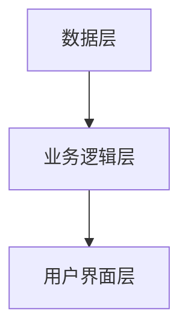
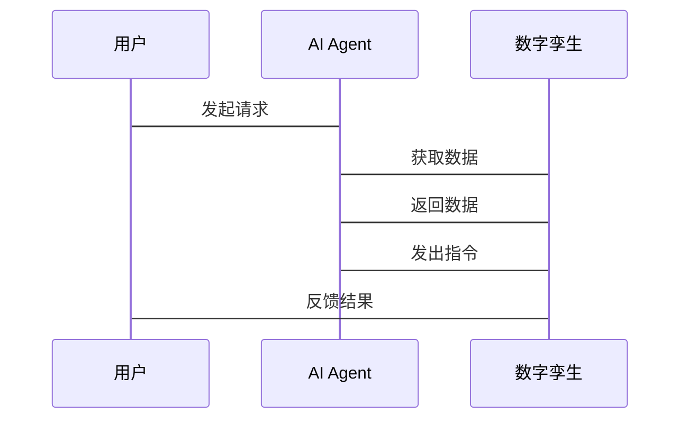

                 


# AI Agent与企业数字孪生技术的融合应用

## 关键词：AI Agent, 企业数字孪生, 融合应用, 系统架构, 项目实战

## 摘要：本文探讨AI Agent与企业数字孪生技术的融合应用，分析其背景、核心概念、算法原理、系统架构，并通过实际案例展示融合效果，总结最佳实践与未来趋势。

---

## 第一部分：AI Agent与企业数字孪生技术的背景介绍

### 第1章：AI Agent的基本概念

#### 1.1 AI Agent的定义
AI Agent是指具备自主决策、问题解决和交互能力的智能体，能够根据环境信息采取行动。

#### 1.2 AI Agent的核心特点
- 自主性：无需外部干预，自主决策。
- 反应性：实时感知环境并作出反应。
- 学习性：通过数据和经验提升性能。

#### 1.3 AI Agent在企业中的应用场景
- 智能客服：通过自然语言处理与用户交互。
- 智能监控：实时监控系统状态并触发警报。
- 供应链优化：协调资源分配，提升效率。

### 第2章：企业数字孪生技术的定义与特点

#### 2.1 数字孪生的定义
数字孪生是物理对象或系统的虚拟镜像，实时同步数据，用于监控、分析和优化。

#### 2.2 数字孪生的核心特点
- 实时性：数据实时同步。
- 交互性：支持用户与虚拟模型互动。
- 可视化：通过图形化界面展示信息。

#### 2.3 数字孪生在企业中的应用领域
- 制造业：优化生产流程，预测设备故障。
- 建筑业：模拟设计，优化能源使用。
- 交通：实时监控交通状况，优化路线。

### 第3章：AI Agent与数字孪生的融合背景

#### 3.1 企业数字化转型的背景
企业面临数据爆炸、业务复杂化，需要智能化解决方案。

#### 3.2 AI Agent与数字孪生融合的必要性
- 提高决策效率：AI Agent利用数字孪生数据优化决策。
- 实时反馈：数字孪生提供实时数据，AI Agent快速响应。

#### 3.3 融合带来的优势与挑战
优势：提升企业效率、降低成本、增强竞争力。
挑战：数据隐私、系统复杂性、技术集成难度。

---

## 第二部分：AI Agent与数字孪生的核心概念与联系

### 第4章：AI Agent的核心原理

#### 4.1 AI Agent的感知与决策机制
- 感知：通过传感器或数据源获取信息。
- 决策：基于感知信息做出最佳选择。

#### 4.2 AI Agent的自主学习能力
- 强化学习：通过奖励机制优化策略。
- 监督学习：基于标注数据进行训练。
- 无监督学习：发现数据中的模式和结构。

#### 4.3 AI Agent与传统自动化系统的区别
| 特性         | AI Agent                     | 传统自动化系统                 |
|--------------|------------------------------|-------------------------------|
| 自主性       | 高                           | 低                           |
| 学习能力     | 强                           | 无或弱                       |
| 适应性       | 强                           | 低                           |

### 第5章：数字孪生的实现原理

#### 5.1 数字孪生的建模过程
- 数据采集：收集物理对象的实时数据。
- 建模：构建虚拟模型，反映物理对象的状态。
- 实时更新：根据最新数据持续更新模型。

#### 5.2 数字孪生的数据驱动特性
- 数据采集：多种传感器获取数据。
- 数据处理：清洗、整合和分析数据。
- 数据可视化：以图表形式展示数据。

#### 5.3 数字孪生的实时性与交互性
- 实时更新：确保虚拟模型与实际对象同步。
- 用户交互：支持用户与模型互动，进行模拟和预测。

### 第6章：AI Agent与数字孪生的融合机制

#### 6.1 融合的基本原理
AI Agent利用数字孪生提供的实时数据，进行分析和决策，数字孪生根据AI Agent的指令优化模型。

#### 6.2 融合的核心要素与关系
| 要素         | 描述                           |
|--------------|--------------------------------|
| 数据流       | AI Agent与数字孪生的数据交互   |
| 决策机制     | AI Agent基于数据做出决策     |
| 反馈机制     | 数字孪生根据决策反馈执行      |

#### 6.3 融合的实现方式与流程
1. 数据采集：获取物理系统的实时数据。
2. 数据传输：将数据传输给AI Agent。
3. 数据分析：AI Agent处理数据，做出决策。
4. 指令执行：数字孪生根据决策执行操作。
5. 反馈循环：实时更新数据，持续优化。

---

## 第三部分：AI Agent与数字孪生的算法原理

### 第7章：AI Agent的算法基础

#### 7.1 基于强化学习的AI Agent算法
- 算法流程：状态-动作-奖励-策略。
- 代码示例：使用Python实现强化学习的AI Agent。

```python
class AI-Agent:
    def __init__(self):
        self.model = DQN()
    
    def perceive(self, state):
        return self.model.predict(state)
    
    def act(self, state):
        action = self.perceive(state)
        return action
```

#### 7.2 基于监督学习的AI Agent算法
- 算法流程：训练数据-模型预测-标签对比-优化模型。
- 代码示例：使用监督学习训练AI Agent。

```python
def train_supervised_agent():
    model = SimpleNet()
    for epoch in epochs:
        for batch in batches:
            outputs = model(batch.inputs)
            loss = loss_function(outputs, batch.labels)
            optimizer.minimize(loss)
    return model
```

#### 7.3 基于无监督学习的AI Agent算法
- 算法流程：数据聚类-异常检测-模式识别。
- 代码示例：使用无监督学习识别数据模式。

```python
def unsupervised_learning():
    model = Autoencoder()
    for epoch in epochs:
        for batch in batches:
            inputs = model(batch.inputs)
            loss = reconstruction_loss(inputs, batch.inputs)
            optimizer.minimize(loss)
    return model
```

### 第8章：数字孪生的算法基础

#### 8.1 数字孪生的建模算法
- 算法流程：数据采集-特征提取-模型构建。
- 代码示例：使用机器学习构建数字孪生模型。

```python
def create_twin_model():
    model = TwinModel()
    for feature in features:
        model.add_layer(feature)
    model.compile(optimizer='adam', loss='mse')
    return model
```

#### 8.2 数字孪生的实时数据处理算法
- 算法流程：数据采集-数据清洗-数据融合。
- 代码示例：处理实时数据流。

```python
def process_realtime_data():
    data_stream = DataStream()
    while True:
        data = data_stream.receive()
        cleaned_data = clean(data)
        processed_data = aggregate(cleaned_data)
        update_twin(processed_data)
```

#### 8.3 数字孪生的优化算法
- 算法流程：模型预测-优化决策-执行调整。
- 代码示例：优化生产流程。

```python
def optimize_process():
    model.predict()
    decision = optimize(model.predictions)
    execute_decision(decision)
```

### 第9章：AI Agent与数字孪生融合的算法实现

#### 9.1 融合算法的总体框架
- 整体流程：数据同步-分析决策-反馈优化。

#### 9.2 融合算法的具体实现步骤
1. 数据同步：AI Agent与数字孪生交换数据。
2. 数据分析：AI Agent处理数据，生成决策。
3. 执行决策：数字孪生根据决策调整模型。
4. 反馈优化：实时更新数据，优化算法。

#### 9.3 融合算法的优化与改进
- 参数调整：优化模型参数，提升性能。
- 算法融合：结合多种算法，提高准确性。
- 并行计算：利用并行处理，提升效率。

---

## 第四部分：AI Agent与数字孪生的系统架构与设计

### 第10章：系统架构设计

#### 10.1 系统的整体架构
- 分层架构：分为数据层、业务逻辑层和用户界面层。



#### 10.2 系统的分层架构
- 数据层：存储和管理数据。
- 业务逻辑层：处理业务逻辑和算法。
- 用户界面层：展示数据和交互界面。

#### 10.3 系统的模块化设计
- 模块划分：数据采集模块、AI Agent模块、数字孪生模块。

### 第11章：系统功能设计

#### 11.1 AI Agent的功能模块
- 感知模块：接收输入数据。
- 决策模块：基于数据做出决策。
- 执行模块：执行决策并反馈。

#### 11.2 数字孪生的功能模块
- 数据采集模块：收集实时数据。
- 模型构建模块：构建虚拟模型。
- 可视化模块：展示数据和模型。

#### 11.3 融合功能模块的设计
- 数据同步模块：确保数据一致。
- 决策优化模块：优化决策过程。
- 反馈调整模块：根据反馈调整模型。

### 第12章：系统接口设计

#### 12.1 AI Agent与数字孪生的交互接口
- 数据接口：数据传输和同步。
- 控制接口：发送指令和接收反馈。

#### 12.2 系统与外部数据源的接口
- 数据采集接口：获取实时数据。
- 数据存储接口：存储和管理数据。

#### 12.3 系统与用户界面的接口
- 用户输入接口：接收用户指令。
- 结果展示接口：显示分析结果。

### 第13章：系统交互设计

#### 13.1 系统交互流程
- 用户发起请求：触发系统响应。
- 系统处理请求：分析数据并做出决策。
- 反馈结果：展示处理结果。

#### 13.2 交互流程图



---

## 第五部分：AI Agent与数字孪生的项目实战

### 第14章：项目环境安装与配置

#### 14.1 开发工具的安装
- 安装Python、TensorFlow、Keras等工具。

#### 14.2 数据集的准备
- 收集相关数据，清洗和预处理。

#### 14.3 环境配置与测试
- 配置开发环境，测试各模块功能。

### 第15章：项目核心代码实现

#### 15.1 核心代码实现

```python
class AI-Agent:
    def __init__(self):
        self.model = load_model('ai_agent.h5')
    
    def perceive(self, state):
        return self.model.predict(state)
    
    def act(self, state):
        action = self.perceive(state)
        return action
```

#### 15.2 代码应用解读与分析
- 代码结构：模型加载、数据处理、决策制定。
- 功能实现：AI Agent与数字孪生的数据交互和决策过程。

### 第16章：实际案例分析和详细讲解剖析

#### 16.1 案例背景
- 某制造企业需要优化生产流程。

#### 16.2 系统设计
- 集成AI Agent和数字孪生，实时监控和优化生产。

#### 16.3 实施步骤
1. 数据采集：收集生产线数据。
2. 数据分析：AI Agent分析数据，优化生产计划。
3. 数字孪生：模拟生产过程，实时调整参数。

#### 16.4 实施效果
- 生产效率提升20%。
- 成本降低15%。
- 故障率减少30%。

### 第17章：项目小结

#### 17.1 项目总结
- 成功实现AI Agent与数字孪生的融合应用。
- 提升企业生产效率和降低成本。

#### 17.2 项目经验
- 数据质量对系统性能影响重大。
- 系统集成需要充分考虑接口兼容性。

#### 17.3 项目改进建议
- 持续优化算法，提升系统性能。
- 加强数据安全，保护企业信息。

---

## 第六部分：AI Agent与数字孪生的总结与展望

### 第18章：总结

#### 18.1 核心观点总结
- AI Agent与数字孪生的融合能够显著提升企业效率。
- 结合实时数据和智能决策，优化企业运营。

#### 18.2 技术优势总结
- 提高决策效率和准确性。
- 实现实时监控和快速响应。
- 降低运营成本，提升竞争力。

### 第19章：未来展望

#### 19.1 技术发展趋势
- 更强的AI Agent自主性。
- 更精准的数字孪生建模能力。
- 更高效的融合算法。

#### 19.2 应用领域拓展
- 智能城市：优化城市管理。
- 智能医疗：提升医疗服务。
- 智能教育：个性化教学。

### 第20章：最佳实践 tips

#### 20.1 开发建议
- 确保数据质量，选择合适的算法。
- 注重系统集成，确保接口兼容。
- 持续优化，提升系统性能。

#### 20.2 使用建议
- 明确需求，选择合适的技术方案。
- 加强培训，提升员工技能。
- 建立反馈机制，持续改进系统。

#### 20.3 注意事项
- 保护数据隐私，遵守相关法律法规。
- 定期维护系统，确保稳定运行。
- 监控系统性能，及时处理异常。

### 第21章：拓展阅读

#### 21.1 推荐书籍
- 《深度学习》
- 《数字孪生技术与应用》

#### 21.2 推荐课程
- AI Agent开发课程
- 数字孪生技术课程

#### 21.3 推荐工具
- TensorFlow
- PyTorch
- Unity

---

## 结语

通过本文的详细讲解，读者可以全面了解AI Agent与企业数字孪生技术的融合应用，从理论到实践，掌握其核心原理和系统设计，为企业的数字化转型提供有力支持。

