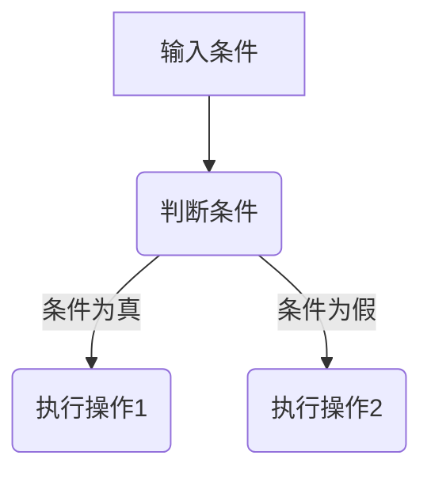
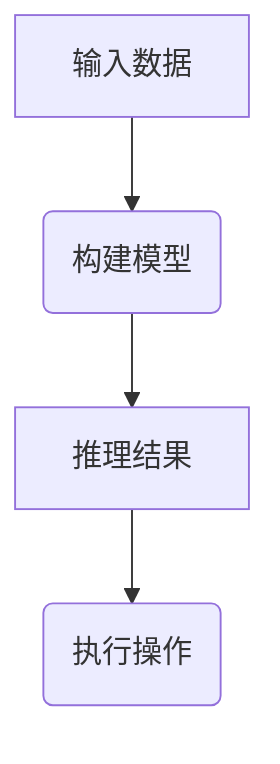
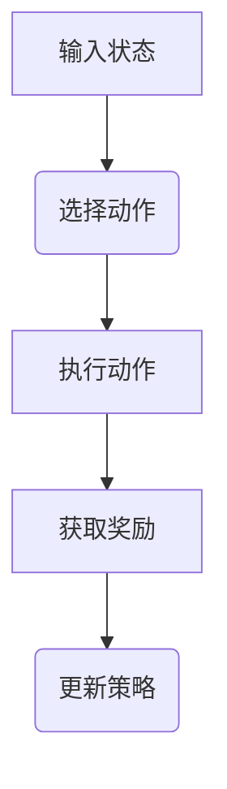
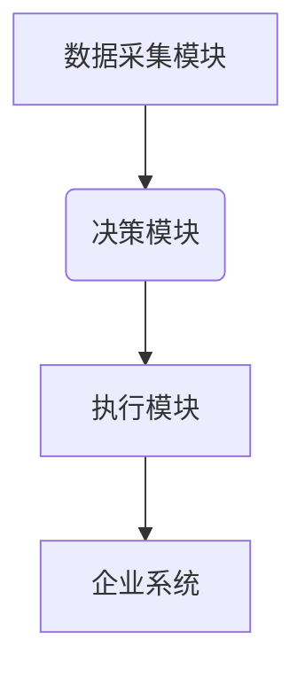
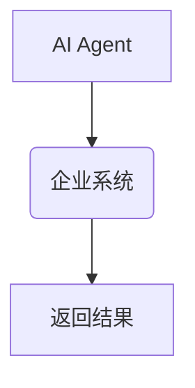

                 


# AI Agent与企业现有系统的无缝集成方案

## 关键词
AI Agent, 企业系统, 系统集成, 算法原理, 系统架构, 最佳实践

## 摘要
本文探讨了AI Agent与企业现有系统的无缝集成方案。首先，介绍了AI Agent的基本概念和企业系统集成的重要性，分析了两者结合的背景和意义。接着，详细讲解了AI Agent的核心算法原理，包括感知、决策和执行阶段，并通过Mermaid流程图和Python代码示例进行了深入剖析。随后，分析了系统架构设计，包括功能模块、架构层次和接口设计，并用Mermaid图展示了系统的交互流程。最后，通过一个具体案例展示了AI Agent在企业系统中的实际应用，总结了最佳实践和注意事项，为读者提供了实用的指导。

---

# 第一部分: AI Agent与企业现有系统集成的背景与核心概念

## 第1章: AI Agent与企业系统集成的背景

### 1.1 AI Agent的基本概念
#### 1.1.1 AI Agent的定义与特点
AI Agent（人工智能代理）是一种能够感知环境、做出决策并执行任务的智能实体。它具备以下特点：
- **自主性**：能够自主决策，无需人工干预。
- **反应性**：能够实时感知环境并做出反应。
- **目标导向**：具备明确的目标，通过行为实现目标。

#### 1.1.2 AI Agent的核心功能与应用场景
AI Agent的核心功能包括：
- **感知环境**：通过传感器或数据接口获取环境信息。
- **决策与推理**：基于感知信息进行推理和决策。
- **执行操作**：根据决策结果执行具体操作。

应用场景包括：
- **智能客服**：通过自然语言处理与用户交互。
- **流程自动化**：自动处理订单、审批等业务流程。
- **智能监控**：实时监控系统运行状态并发出警报。

#### 1.1.3 企业系统集成的必要性与挑战
企业系统集成的必要性：
- 提高企业效率：通过AI Agent自动化处理重复性任务。
- 优化决策：利用AI Agent的数据分析能力提升决策质量。
- 提升客户体验：通过智能化服务增强客户满意度。

集成的挑战：
- **技术复杂性**：现有系统架构可能较为复杂，集成难度大。
- **数据孤岛**：企业系统之间可能存在数据孤岛，难以共享。
- **兼容性问题**：不同系统之间接口不统一，导致兼容性问题。

### 1.2 企业现有系统的概述
#### 1.2.1 企业系统的基本架构
企业系统的基本架构包括：
- **前端层**：用户交互界面，如Web界面。
- **业务逻辑层**：处理业务逻辑，如订单处理。
- **数据存储层**：存储企业数据，如数据库。

#### 1.2.2 企业系统的主要类型与特点
企业系统的主要类型包括：
- **ERP系统**：企业资源计划系统，用于管理企业资源。
- **CRM系统**：客户关系管理系统，用于管理客户关系。
- **OA系统**：办公自动化系统，用于企业日常办公。

#### 1.2.3 系统集成的常见问题与解决方案
常见问题：
- **数据格式不统一**：不同系统之间数据格式不同，导致难以集成。
- **接口不兼容**：系统接口设计不统一，导致集成困难。
- **性能问题**：集成后系统性能下降。

解决方案：
- **数据转换层**：通过数据转换层统一数据格式。
- **API网关**：通过API网关统一接口设计。
- **性能优化**：通过缓存、分布式系统等技术优化性能。

### 1.3 AI Agent与企业系统集成的意义
#### 1.3.1 提升企业效率的潜力
AI Agent可以通过自动化处理任务，减少人工干预，提升企业效率。

#### 1.3.2 优化企业流程的可能性
AI Agent可以通过智能决策优化业务流程，降低流程复杂性。

#### 1.3.3 降低企业成本的前景
AI Agent可以通过自动化处理任务，降低人力成本。

### 1.4 本章小结
本章介绍了AI Agent的基本概念、企业系统的基本架构以及AI Agent与企业系统集成的意义，为后续内容奠定了基础。

---

## 第2章: AI Agent的核心概念与原理

### 2.1 AI Agent的核心原理
#### 2.1.1 AI Agent的感知阶段
感知阶段是AI Agent获取环境信息的过程。常用技术包括：
- **自然语言处理（NLP）**：用于处理文本信息。
- **计算机视觉（CV）**：用于处理图像信息。

#### 2.1.2 AI Agent的决策阶段
决策阶段是AI Agent基于感知信息做出决策的过程。常用技术包括：
- **规则引擎**：基于预定义规则进行决策。
- **机器学习模型**：基于训练数据进行预测和决策。

#### 2.1.3 AI Agent的执行阶段
执行阶段是AI Agent根据决策结果执行操作的过程。常用技术包括：
- **自动化脚本**：用于自动化处理任务。
- **API调用**：用于调用其他系统的API接口。

### 2.2 AI Agent与企业系统的联系
#### 2.2.1 AI Agent在企业系统中的角色
AI Agent在企业系统中的角色包括：
- **数据采集器**：采集企业系统中的数据。
- **决策支持系统**：提供决策支持，优化业务流程。
- **自动化执行者**：自动化执行任务，提升效率。

#### 2.2.2 AI Agent与企业系统的交互流程
AI Agent与企业系统的交互流程包括：
1. **数据采集**：AI Agent从企业系统中获取数据。
2. **决策制定**：AI Agent基于数据做出决策。
3. **任务执行**：AI Agent根据决策结果执行任务。

### 2.3 AI Agent的核心算法
#### 2.3.1 基于规则的条件判断
基于规则的条件判断是一种简单的决策方法，适用于规则明确的场景。

**算法流程图（Mermaid）**：


**Python代码示例**：
```python
def decision_making(condition):
    if condition:
        return "执行操作1"
    else:
        return "执行操作2"
```

#### 2.3.2 基于模型的推理
基于模型的推理是一种复杂的决策方法，适用于规则复杂或动态变化的场景。

**算法流程图（Mermaid）**：


**Python代码示例**：
```python
import numpy as np
from sklearn import linear_model

# 训练模型
model = linear_model.LinearRegression()
model.fit(X, y)

# 推理结果
prediction = model.predict(new_X)
```

#### 2.3.3 基于强化学习的策略优化
基于强化学习的策略优化是一种高级的决策方法，适用于复杂动态环境。

**算法流程图（Mermaid）**：


**Python代码示例**：
```python
import numpy as np
import gym

env = gym.make('CartPole-v0')
env.seed(42)

# 初始化策略
policy = {'theta': np.zeros(4)}

# 策略更新
def update_policy(reward):
    policy['theta'] += reward * policy['theta']
```

### 2.4 本章小结
本章详细讲解了AI Agent的核心原理和算法，为后续的系统集成提供了理论基础。

---

## 第3章: 企业系统集成的挑战与解决方案

### 3.1 企业系统集成的挑战
企业系统集成的主要挑战包括：
- **技术复杂性**：不同系统之间的技术差异大。
- **数据孤岛**：数据分散在不同系统中，难以共享。
- **性能问题**：集成后系统性能可能下降。

### 3.2 企业系统集成的解决方案
企业系统集成的解决方案包括：
- **数据转换层**：统一数据格式，确保数据一致性。
- **API网关**：统一接口设计，简化系统交互。
- **微服务架构**：通过微服务架构提高系统的灵活性和可扩展性。

### 3.3 本章小结
本章分析了企业系统集成的挑战，并提出了相应的解决方案，为后续的系统设计提供了指导。

---

## 第4章: AI Agent与企业系统的无缝集成方案

### 4.1 系统架构设计
#### 4.1.1 功能模块设计
系统功能模块包括：
- **数据采集模块**：负责采集企业系统中的数据。
- **决策模块**：负责基于数据做出决策。
- **执行模块**：负责根据决策结果执行任务。

#### 4.1.2 系统架构图（Mermaid）


### 4.2 接口设计
#### 4.2.1 API接口设计
API接口设计包括：
- **数据接口**：用于数据的传输。
- **控制接口**：用于系统的控制。

#### 4.2.2 接口交互流程（Mermaid）


### 4.3 本章小结
本章详细讲解了AI Agent与企业系统的无缝集成方案，包括系统架构设计和接口设计。

---

## 第5章: 项目实战

### 5.1 项目背景
项目背景是通过AI Agent优化企业的订单处理流程。

### 5.2 核心代码实现
#### 5.2.1 数据采集模块
```python
def get_order_status(order_id):
    # 从数据库中获取订单状态
    return db.get_order_status(order_id)
```

#### 5.2.2 决策模块
```python
def decide_action(order_status):
    # 根据订单状态做出决策
    if order_status == 'pending':
        return 'approve'
    else:
        return 'reject'
```

#### 5.2.3 执行模块
```python
def execute_action(action):
    # 根据决策结果执行操作
    if action == 'approve':
        return '订单已批准'
    else:
        return '订单已拒绝'
```

### 5.3 代码解读与分析
代码解读与分析：
- 数据采集模块从数据库中获取订单状态。
- 决策模块根据订单状态做出决策。
- 执行模块根据决策结果执行操作。

### 5.4 实际案例分析
实际案例分析：
- 通过AI Agent优化企业的订单处理流程，减少人工干预，提高处理效率。

### 5.5 本章小结
本章通过一个具体案例展示了AI Agent在企业系统中的实际应用，验证了方案的有效性。

---

## 第6章: 最佳实践与注意事项

### 6.1 最佳实践
最佳实践包括：
- **模块化设计**：将系统设计成模块化，便于维护和扩展。
- **日志记录**：记录系统运行日志，便于故障排查。
- **性能优化**：通过缓存、分布式系统等技术优化系统性能。

### 6.2 注意事项
注意事项包括：
- **数据安全**：确保数据在传输和存储过程中的安全性。
- **系统兼容性**：确保AI Agent与企业系统兼容，避免接口冲突。
- **系统稳定性**：确保系统运行稳定，避免因故障导致业务中断。

### 6.3 本章小结
本章总结了AI Agent与企业系统集成的最佳实践和注意事项，为读者提供了实用的指导。

---

## 第7章: 总结与展望

### 7.1 总结
总结全文，AI Agent与企业系统的无缝集成能够显著提升企业的效率和客户满意度。

### 7.2 展望
展望未来，随着AI技术的不断发展，AI Agent与企业系统的集成将更加智能化和自动化。

### 7.3 本章小结
本章总结了全文的主要内容，并对未来的AI Agent与企业系统集成的发展进行了展望。

---

## 参考文献
1. Russell, S., & Norvig, P. (2010). Artificial Intelligence: A Modern Approach.
2. McCarthy, J. (1959). Programs with goals.
3. LeCun, Y., Bengio, Y., & Hinton, G. (2015). Deep learning.

---

## 致谢
感谢读者的耐心阅读，感谢编辑的辛勤工作。

