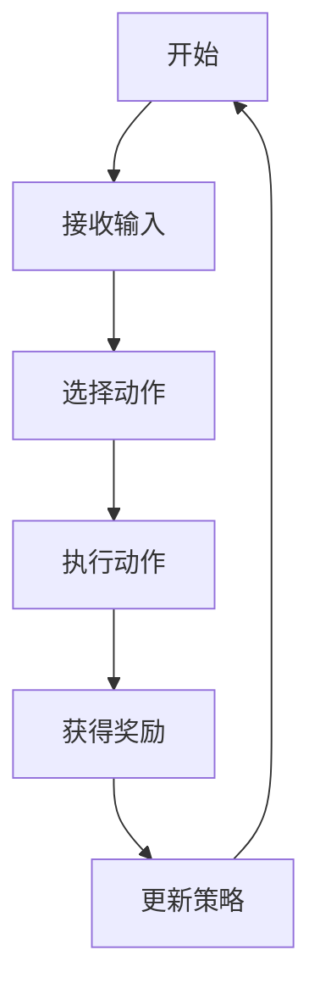
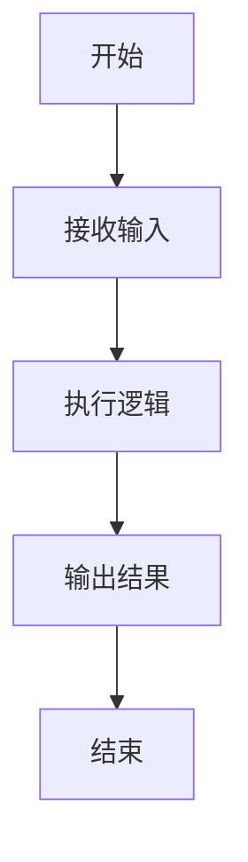
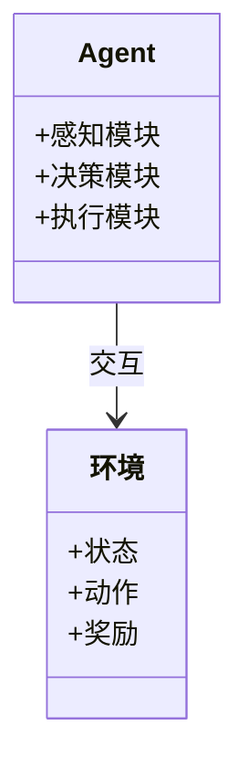

                 


# AI Agent与传统软件开发的区别

## 关键词：AI Agent、传统软件开发、区别对比、技术原理、系统架构、开发流程、开发工具

## 摘要：  
本文系统地探讨了AI Agent与传统软件开发之间的区别，从核心概念、技术原理、系统架构到开发流程等多个维度进行了详细对比和分析。通过实际案例和系统设计，深入剖析了AI Agent的自适应学习能力和传统软件开发的固定性特点，帮助读者更好地理解两者的异同及其应用场景。

---

## 第一部分: AI Agent与传统软件开发的背景与概念

## 第1章: AI Agent与传统软件开发的概述

### 1.1 AI Agent的基本概念

#### 1.1.1 AI Agent的定义与特点  
AI Agent（人工智能代理）是一种能够感知环境、自主决策并执行任务的智能实体。它通过学习和优化算法，能够在动态环境中适应变化，完成复杂任务。AI Agent的核心特点包括：  
1. **自主性**：能够独立执行任务，无需外部干预。  
2. **反应性**：能够实时感知环境并做出反应。  
3. **学习性**：通过数据和反馈不断优化自身行为。  
4. **社交能力**：能够与其他Agent或人类进行交互协作。

#### 1.1.2 传统软件开发的基本概念  
传统软件开发是基于预定义规则和逻辑的程序编写过程。它通过明确的流程和模块化设计，实现特定功能。传统软件开发的特点包括：  
1. **确定性**：基于固定的逻辑和规则运行。  
2. **模块化**：功能通过模块化实现，便于管理和维护。  
3. **可预测性**：结果通常是可以预测的，基于输入和逻辑运算。

#### 1.1.3 两者的异同点对比  
AI Agent与传统软件开发的主要区别在于：  
- AI Agent具备学习和适应能力，能够处理不确定性问题；  
- 传统软件开发依赖于固定的规则和逻辑，适用于确定性问题。  

---

### 1.2 AI Agent与传统软件开发的核心区别

#### 1.2.1 AI Agent的自适应能力  
AI Agent的核心优势在于其自适应能力。它能够根据环境的变化调整自己的行为，例如通过强化学习优化决策策略。这种能力使得AI Agent在处理复杂和动态的问题时表现出色。

#### 1.2.2 传统软件开发的固定性  
传统软件开发基于预定义的规则和逻辑，适用于处理简单且确定性较高的问题。一旦需求发生变化，通常需要重新设计和实现，灵活性较低。

#### 1.2.3 两者的优缺点分析  
| **特性**       | **AI Agent**                | **传统软件开发**            |
|----------------|-----------------------------|-----------------------------|
| 灵活性         | 高度灵活                   | 较低                       |
| 适应性         | 强大                       | 较弱                       |
| 开发复杂度     | 较高                       | 较低                       |

---

## 第2章: AI Agent的核心概念与技术原理

### 2.1 AI Agent的功能特性

#### 2.1.1 智能感知与决策  
AI Agent通过传感器或数据输入感知环境，并基于感知的信息做出决策。例如，自动驾驶汽车通过摄像头和雷达感知环境，然后通过算法决定转向和加速。

#### 2.1.2 自适应学习  
AI Agent能够通过机器学习算法不断优化自身的决策模型。例如，推荐系统根据用户的点击行为不断优化推荐策略。

#### 2.1.3 多目标优化  
AI Agent在多个目标之间进行权衡，例如在自动驾驶中，既要保证安全，又要尽可能提高行驶速度。

### 2.2 传统软件开发的功能特性

#### 2.2.1 确定性逻辑  
传统软件开发依赖于固定的逻辑和规则，例如通过if-else语句实现流程控制。

#### 2.2.2 固定流程  
传统软件开发通常遵循固定的开发流程，例如需求分析、设计、编码、测试。

#### 2.2.3 预定义规则  
传统软件开发基于预定义的规则实现功能，例如通过正则表达式匹配特定的字符串。

### 2.3 AI Agent与传统软件开发的核心区别对比表

| **特性**       | **AI Agent**                | **传统软件开发**            |
|----------------|-----------------------------|-----------------------------|
| 决策方式       | 基于学习和优化             | 基于预定义规则             |
| 灵活性         | 高度灵活                   | 较低                       |
| 适应性         | 强大                       | 较弱                       |
| 开发复杂度     | 较高                       | 较低                       |

---

## 第3章: AI Agent与传统软件开发的技术原理对比

### 3.1 AI Agent的算法原理

#### 3.1.1 强化学习（Reinforcement Learning）  
强化学习是一种通过试错机制优化决策策略的算法。Agent通过与环境交互，获得奖励或惩罚，逐步优化自身的动作选择。  
数学模型：  
$$ R = r_1 + r_2 + \dots + r_n $$  
其中，$R$ 表示总奖励，$r_i$ 表示每一步的奖励。  

#### 3.1.2 监督学习（Supervised Learning）  
监督学习通过标注数据训练模型，使其能够预测新的输入。  
数学模型：  
$$ f(x) = \arg\max_{y} P(y|x) $$  
其中，$x$ 是输入，$y$ 是输出，$P(y|x)$ 是条件概率。  

#### 3.1.3 算法流程图  


### 3.2 传统软件开发的流程

#### 3.2.1 确定性逻辑实现  
传统软件开发通常基于固定的逻辑实现功能，例如通过if-else语句控制流程。  
代码示例：  
```python
def traditional_decision(x):
    if x > 0:
        return "positive"
    elif x < 0:
        return "negative"
    else:
        return "zero"
```

#### 3.2.2 固定流程图  
传统软件开发遵循固定的流程，例如：  
1. 接收输入  
2. 执行预定义的逻辑  
3. 输出结果  

流程图：  


---

## 第4章: AI Agent与传统软件开发的系统架构设计

### 4.1 系统功能设计

#### 4.1.1 AI Agent的功能模块  
AI Agent的系统架构通常包括感知模块、决策模块和执行模块。  
- 感知模块：负责接收环境输入。  
- 决策模块：负责选择最优动作。  
- 执行模块：负责执行决策并输出结果。  

类图：  


#### 4.1.2 传统软件开发的功能模块  
传统软件开发通常包括输入模块、逻辑处理模块和输出模块。  
- 输入模块：接收输入数据。  
- 逻辑处理模块：执行预定义逻辑。  
- 输出模块：输出结果。  

---

## 总结

通过本文的详细对比，我们可以看到AI Agent与传统软件开发在多个维度上的显著差异。AI Agent凭借其自适应学习能力和灵活性，适用于复杂和动态的场景，而传统软件开发则在简单和确定性较高的场景中表现出色。未来，随着技术的发展，两者可能会在更多的领域实现融合，为软件开发带来新的可能性。

