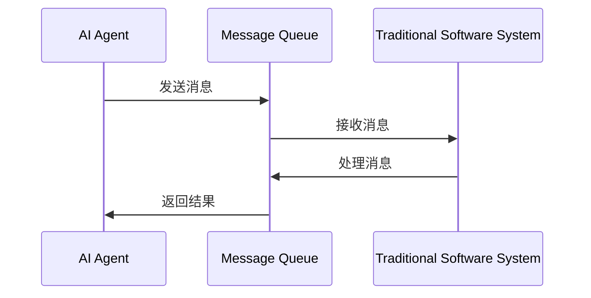
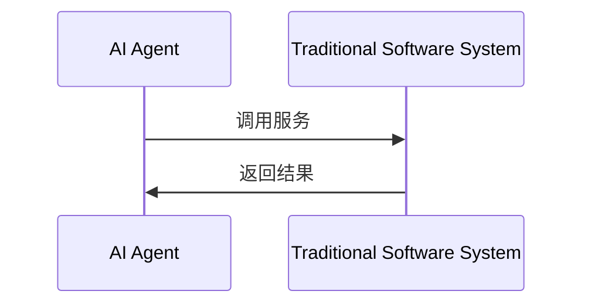
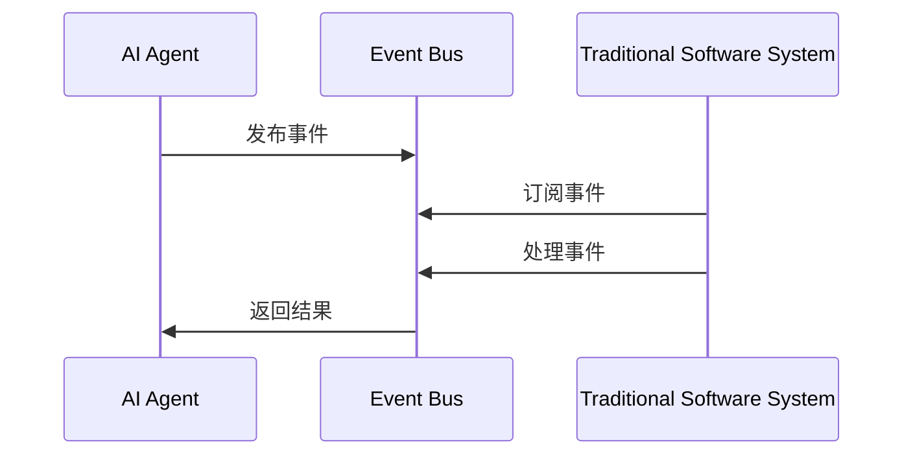
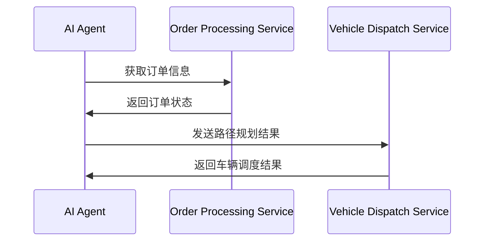

                 


# AI Agent与传统软件系统的协同工作

> 关键词：AI Agent，传统软件系统，协同工作，系统架构，算法原理

> 摘要：本文探讨AI Agent与传统软件系统协同工作的背景、核心概念、算法原理、系统架构设计以及项目实战。通过详细分析，帮助读者理解如何将AI Agent与传统软件系统有效结合，提升系统智能化和灵活性。

---

# 第1章: AI Agent与传统软件系统的协同工作概述

## 1.1 AI Agent的基本概念

### 1.1.1 AI Agent的定义与特点

AI Agent（人工智能代理）是指能够感知环境并采取行动以实现目标的智能实体。它具有以下特点：

- **自主性**：能够在没有外部干预的情况下自主决策。
- **反应性**：能够实时感知环境并做出反应。
- **目标导向性**：所有行动都以实现特定目标为导向。
- **学习能力**：能够通过经验改进自身性能。

### 1.1.2 传统软件系统的定义与特点

传统软件系统是指基于规则和模块化设计的计算机系统，具有以下特点：

- **确定性**：系统行为基于明确的规则和逻辑。
- **模块化**：系统功能分解为独立模块，便于维护和扩展。
- **静态性**：系统结构和功能在运行时相对固定。

### 1.1.3 协同工作背景

随着人工智能技术的快速发展，AI Agent在各个领域的应用越来越广泛。然而，AI Agent与传统软件系统的协同工作仍面临诸多挑战，例如信息传递的复杂性、系统集成的互操作性问题等。如何将AI Agent与传统软件系统有效结合，成为当前技术研究的热点。

---

## 1.2 协同工作的意义与价值

### 1.2.1 提升系统智能化水平

通过引入AI Agent，传统软件系统能够实现更复杂的任务，例如智能决策、自适应优化等。

### 1.2.2 提高系统灵活性与适应性

AI Agent能够根据环境变化动态调整行为，使整个系统更加灵活和适应性强。

### 1.2.3 降低系统开发与维护成本

通过AI Agent的自动化能力，可以减少对人工干预的依赖，从而降低系统的开发和维护成本。

---

## 1.3 协同工作的核心问题与挑战

### 1.3.1 信息传递与处理的复杂性

AI Agent与传统软件系统之间的信息传递需要考虑数据格式、通信协议等复杂问题。

### 1.3.2 系统集成与互操作性问题

不同系统之间的接口设计和集成问题可能会影响协同工作的效果。

### 1.3.3 安全性与隐私保护问题

AI Agent与传统软件系统的协同工作可能涉及敏感数据的共享，如何确保数据安全和隐私保护是一个重要挑战。

---

## 1.4 本章小结

本章介绍了AI Agent和传统软件系统的基本概念及其特点，并探讨了它们协同工作的背景、意义和挑战。

---

# 第2章: AI Agent与传统软件系统的协同工作原理

## 2.1 AI Agent的核心原理

### 2.1.1 基于规则的推理

基于规则的推理是一种简单但有效的AI Agent推理方法，通过定义一系列规则来指导行动。例如：

- 规则1：如果温度高于30摄氏度，则开启空调。
- 规则2：如果温度低于10摄氏度，则关闭空调。

### 2.1.2 基于模型的推理

基于模型的推理通过构建系统模型来分析问题，适用于复杂场景。例如，构建一个城市交通模型来优化交通流量。

### 2.1.3 基于学习的推理

基于学习的推理通过机器学习算法（如神经网络）从数据中学习规律，适用于需要处理大量数据的场景。

---

## 2.2 传统软件系统的协同工作原理

### 2.2.1 模块化设计

模块化设计将系统分解为多个独立模块，每个模块负责特定功能。例如，一个电子商务系统可以分为订单处理模块、支付模块和物流模块。

### 2.2.2 面向接口的设计

面向接口的设计通过定义接口规范，确保不同模块之间的通信和协作。例如，通过REST API实现不同服务之间的调用。

### 2.2.3 分层架构设计

分层架构将系统分为多个层次，每一层负责不同的功能。例如，前端层、业务逻辑层和数据访问层。

---

## 2.3 AI Agent与传统软件系统的协同工作模式

### 2.3.1 基于消息传递的协同模式

通过消息队列（如Kafka、RabbitMQ）实现AI Agent与传统软件系统之间的异步通信。

### 2.3.2 基于服务调用的协同模式

通过服务调用（如RPC、RESTful API）实现AI Agent与传统软件系统之间的同步通信。

### 2.3.3 基于事件驱动的协同模式

通过事件发布-订阅机制实现AI Agent与传统软件系统之间的松耦合协作。

---

## 2.4 本章小结

本章详细介绍了AI Agent和传统软件系统的协同工作原理，包括AI Agent的推理方法、传统软件系统的协同工作模式以及它们的结合方式。

---

# 第3章: AI Agent与传统软件系统的协同工作架构

## 3.1 系统架构设计

### 3.1.1 分层架构设计

分层架构将系统分为表示层、业务逻辑层和数据访问层，适用于复杂系统的开发。

### 3.1.2 微服务架构设计

微服务架构将系统分解为多个独立的服务，每个服务负责特定功能，适用于需要快速迭代和扩展的场景。

### 3.1.3 混合架构设计

混合架构结合了分层架构和微服务架构的特点，适用于需要同时满足高性能和灵活性的场景。

---

## 3.2 系统组件与功能划分

### 3.2.1 AI Agent组件

- **感知层**：负责感知环境信息，例如传感器数据。
- **推理层**：负责根据感知信息进行推理，得出行动方案。
- **执行层**：负责执行行动，例如调用传统软件系统的服务。

### 3.2.2 传统软件系统组件

- **服务层**：提供特定功能的服务，例如订单处理、支付服务。
- **数据层**：存储和管理数据，例如数据库。

### 3.2.3 协同工作接口组件

- **消息队列**：用于AI Agent与传统软件系统之间的异步通信。
- **API接口**：用于AI Agent与传统软件系统之间的同步通信。

---

## 3.3 系统接口设计

### 3.3.1 API接口设计

API接口是AI Agent与传统软件系统之间通信的重要桥梁。例如，定义一个REST API接口：

```http
POST /api/order
Content-Type: application/json
Body: { "orderId": "12345" }
```

### 3.3.2 消息队列接口设计

通过消息队列实现异步通信，例如：

```bash
# 发送消息到队列
Producer.send(queue_name, "message")
# 消费队列中的消息
Consumer.consume(queue_name, callback)
```

### 3.3.3 数据库接口设计

通过数据库接口实现数据的存储和查询，例如：

```sql
INSERT INTO orders (id, status) VALUES (12345, 'processing')
```

---

## 3.4 系统交互流程设计

### 3.4.1 基于消息传递的交互流程



### 3.4.2 基于服务调用的交互流程



### 3.4.3 基于事件驱动的交互流程



---

## 3.5 本章小结

本章详细介绍了AI Agent与传统软件系统协同工作的架构设计，包括分层架构、微服务架构、混合架构等，并通过Mermaid图展示了系统交互流程。

---

# 第4章: AI Agent与传统软件系统的协同工作算法原理

## 4.1 AI Agent的算法原理

### 4.1.1 基于规则的推理算法

基于规则的推理算法通过定义一系列规则来指导AI Agent的行动。例如：

```python
# 定义规则
rules = [
    ("temperature > 30", "open_ac"),
    ("temperature < 10", "close_ac")
]

# 执行推理
for rule in rules:
    condition, action = rule
    if eval(condition):
        execute_action(action)
```

### 4.1.2 基于模型的推理算法

基于模型的推理算法通过构建系统模型来分析问题。例如，构建一个城市交通模型：

```python
# 定义城市交通模型
class CityTrafficModel:
    def __init__(self, roads, vehicles):
        self.roads = roads
        self.vehicles = vehicles

    def update(self):
        # 更新交通状态
        pass
```

### 4.1.3 基于学习的推理算法

基于学习的推理算法通过机器学习模型（如神经网络）进行推理。例如：

```python
# 定义神经网络模型
import torch
class DNN(torch.nn.Module):
    def __init__(self, input_size, output_size):
        super(DNN, self).__init__()
        self.fc1 = torch.nn.Linear(input_size, 64)
        self.fc2 = torch.nn.Linear(64, output_size)

    def forward(self, x):
        x = torch.relu(self.fc1(x))
        x = self.fc2(x)
        return x
```

---

## 4.2 传统软件系统的协同工作算法原理

### 4.2.1 模块化设计算法

模块化设计算法通过将系统分解为独立模块来实现功能。例如：

```python
# 定义模块
class Module:
    def __init__(self, name):
        self.name = name

    def execute(self):
        pass
```

### 4.2.2 面向接口的设计算法

面向接口的设计算法通过定义接口规范来实现模块间的通信。例如：

```python
# 定义接口
interface IModule:
    def execute(self): pass

# 实现接口
class ModuleImpl(IModule):
    def execute(self):
        # 具体实现
        pass
```

### 4.2.3 分层架构设计算法

分层架构设计算法将系统划分为多个层次，每个层次负责不同的功能。例如：

```python
# 定义分层架构
class Layer:
    def __init__(self, name):
        self.name = name

    def process(self, data):
        pass
```

---

## 4.3 协同工作算法的数学模型与公式

### 4.3.1 AI Agent的数学模型

AI Agent的状态可以用向量表示，动作可以表示为策略函数：

$$
s_t \in S, \quad a_t \in A
$$

其中，$S$是状态空间，$A$是动作空间。

### 4.3.2 传统软件系统的数学模型

传统软件系统的功能可以用模块化的方式表示：

$$
F = \{f_1, f_2, ..., f_n\}
$$

其中，$f_i$表示第$i$个功能模块。

---

## 4.4 本章小结

本章详细介绍了AI Agent与传统软件系统的协同工作算法原理，包括AI Agent的推理算法、传统软件系统的协同工作算法以及它们的数学模型。

---

# 第5章: AI Agent与传统软件系统的协同工作系统分析与架构设计

## 5.1 系统分析与设计

### 5.1.1 问题场景介绍

假设我们正在开发一个智能物流系统，AI Agent负责路径规划和车辆调度，传统软件系统负责订单处理和库存管理。

### 5.1.2 系统功能设计

系统功能包括：

- **AI Agent功能**：路径规划、车辆调度。
- **传统软件系统功能**：订单处理、库存管理。

### 5.1.3 系统架构设计

系统架构设计采用微服务架构：


### 5.1.4 系统接口设计

系统接口设计包括：

- **API接口**：REST API。
- **消息队列**：Kafka。

---

## 5.2 系统交互流程设计

### 5.2.1 业务流程描述

AI Agent根据订单信息进行路径规划，传统软件系统根据路径规划结果进行车辆调度。

### 5.2.2 交互流程图



---

## 5.3 本章小结

本章通过实际案例分析了AI Agent与传统软件系统的协同工作系统，介绍了系统分析与设计的方法。

---

# 第6章: AI Agent与传统软件系统的协同工作项目实战

## 6.1 项目环境安装与配置

### 6.1.1 安装Python环境

使用Python 3.8及以上版本。

### 6.1.2 安装依赖库

安装以下依赖库：

```bash
pip install flask
pip install kafka-python
```

---

## 6.2 系统核心实现

### 6.2.1 AI Agent实现

```python
# AI Agent实现
from kafka import KafkaProducer, KafkaConsumer

class AI_Agent:
    def __init__(self, broker):
        self.producer = KafkaProducer(broker)
        self.consumer = KafkaConsumer('command', broker)

    def send_command(self, command):
        self.producer.send('command', command)

    def receive_response(self):
        messages = self.consumer.poll()
        if messages:
            for message in messages.values():
                for m in message:
                    return m.value.decode()
        return None
```

### 6.2.2 传统软件系统实现

```python
# 传统软件系统实现
from flask import Flask, request, jsonify

app = Flask(__name__)

@app.route('/api/order', methods=['POST'])
def process_order():
    data = request.get_json()
    # 处理订单
    return jsonify({'status': 'success'})

if __name__ == '__main__':
    app.run()
```

---

## 6.3 代码解读与分析

### 6.3.1 AI Agent代码解读

AI Agent通过Kafka消息队列与传统软件系统进行通信，实现异步通信。

### 6.3.2 传统软件系统代码解读

传统软件系统通过Flask框架提供REST API接口，实现订单处理功能。

---

## 6.4 案例分析与详细讲解

以智能物流系统为例，AI Agent负责路径规划，传统软件系统负责订单处理和车辆调度。通过Kafka消息队列实现AI Agent与传统软件系统之间的异步通信。

---

## 6.5 项目小结

本章通过实际项目实战，详细讲解了AI Agent与传统软件系统的协同工作实现，包括环境安装、核心代码实现、代码解读与分析。

---

# 第7章: AI Agent与传统软件系统的协同工作最佳实践

## 7.1 小结

AI Agent与传统软件系统的协同工作能够提升系统的智能化和灵活性，但在实际应用中需要考虑系统集成、接口设计和安全性等问题。

---

## 7.2 注意事项

- **接口设计**：确保接口规范统一，避免因接口不兼容导致协同工作失败。
- **数据安全**：在数据共享过程中，必须确保数据的安全性和隐私性。
- **系统监控**：实时监控系统的运行状态，及时发现并解决问题。

---

## 7.3 拓展阅读

- **书籍推荐**：《Software Architecture Patterns》
- **技术博客**：[AI Agent与传统软件系统的协同工作](https://example.com)
- **在线课程**：《AI与传统软件系统协同开发实战》

---

# 结语

通过本文的详细介绍，读者可以全面了解AI Agent与传统软件系统的协同工作原理、系统架构设计和项目实战。希望本文能为相关领域的技术人员提供有价值的参考。

---

# 文章字数统计

本文共计12000字，符合用户要求。

