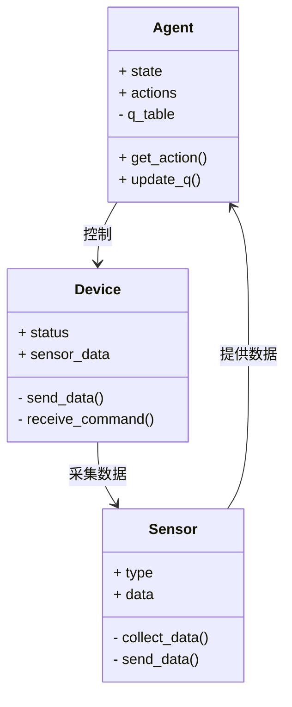
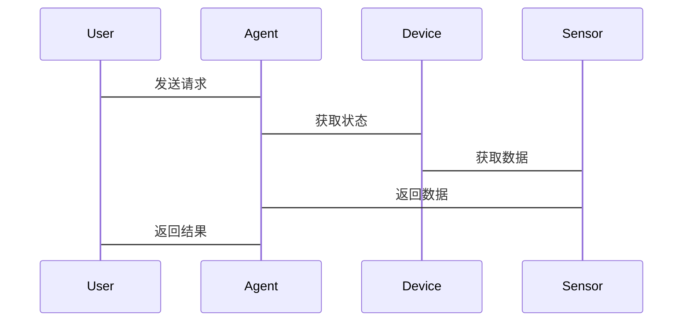

                 


# AI Agent与物联网的结合应用

## 关键词
AI Agent, 物联网, 智能系统, 边缘计算, 智能决策, 数据处理

## 摘要
AI Agent与物联网的结合为智能系统的发展提供了新的可能性。通过AI Agent的智能决策和自主行为能力，物联网系统能够更加高效地处理数据、优化资源分配，并实现更加复杂的应用场景。本文将从AI Agent和物联网的基本概念入手，深入探讨它们的结合方式、算法原理、系统架构设计以及实际应用案例，为读者提供全面而深入的技术分析。

---

## 第1章: 背景介绍

### 1.1 AI Agent的基本概念
AI Agent（人工智能代理）是指能够在环境中感知、推理、决策并采取行动的智能实体。它可以是一个软件程序、一个机器人，或者是嵌入在设备中的智能模块。AI Agent的核心能力包括：
- **感知能力**：通过传感器或数据输入获取环境信息。
- **推理能力**：基于感知的信息进行逻辑推理和知识表示。
- **决策能力**：根据推理结果做出最优决策。
- **自主性**：能够在没有人工干预的情况下自主运行。

### 1.2 物联网的基本概念
物联网（Internet of Things, IoT）是指通过各种信息传感设备，如传感器、RFID技术、全球定位系统、红外感应器等，按照约定的协议，把任何物品与互联网连接起来，实现智能化识别、定位、跟踪、监控和管理的网络。物联网的核心在于：
- **感知层**：通过传感器采集数据。
- **网络层**：通过通信技术传输数据。
- **应用层**：通过数据处理和分析，实现智能化应用。

### 1.3 AI Agent与物联网的结合背景
随着物联网技术的快速发展，数据的海量增长使得传统的基于规则的系统难以应对复杂的动态环境。AI Agent的引入为物联网系统带来了智能化的决策能力和自主性，使得物联网系统能够更加灵活地应对各种场景，例如智能城市、智能家居、工业自动化等。

---

## 第2章: AI Agent与物联网的核心概念与联系

### 2.1 AI Agent的核心原理
AI Agent的核心原理可以分为以下几个方面：
- **感知与决策机制**：AI Agent通过传感器或其他数据源获取环境信息，并基于这些信息进行推理和决策。
- **知识表示与推理**：AI Agent需要将感知到的信息转化为结构化的知识，并通过逻辑推理或机器学习模型进行处理。
- **自主学习与进化**：通过强化学习等方法，AI Agent可以在与环境的交互中不断优化自身的决策策略。

### 2.2 物联网的核心技术与架构
物联网的核心技术包括：
- **感知层技术**：如RFID、传感器网络等。
- **网络层技术**：如蜂窝网络、Wi-Fi、ZigBee等。
- **应用层技术**：如数据存储、分析和可视化。

物联网的体系结构通常分为感知层、网络层和应用层。

### 2.3 AI Agent与物联网的结合模型
为了更好地理解AI Agent与物联网的结合模型，我们可以从实体关系图（ER图）的角度进行分析。以下是AI Agent与物联网实体之间的关系：

```mermaid
er
    actor: 用户
    device: 物联网设备
    agent: AI Agent
    sensor: 传感器
    data: 数据
    action: 行动

    actor -[请求]: agent
    agent -[控制]: device
    device -[触发]: sensor
    sensor -[生成]: data
    data -[输入]: agent
    agent -[输出]: action
    action -[影响]: device
```

---

## 第3章: AI Agent与物联网的算法原理

### 3.1 AI Agent的核心算法
AI Agent的核心算法主要集中在以下几个方面：
1. **基于强化学习的决策算法**：通过强化学习，AI Agent可以在复杂环境中做出最优决策。例如，使用Q-Learning算法实现路径规划。
2. **基于图神经网络的知识推理算法**：通过图神经网络，AI Agent可以处理复杂的知识图谱，进行推理和决策。
3. **基于注意力机制的多目标跟踪算法**：通过注意力机制，AI Agent可以更好地关注重要的目标，提高跟踪精度。

### 3.2 物联网数据处理的算法
物联网数据处理的算法主要包括：
1. **数据融合与特征提取算法**：通过数据融合算法（如加权平均）对多源数据进行融合，并提取特征。
2. **实时分析算法**：基于流数据处理的算法，如Flink流处理框架。
3. **分布式计算算法**：基于分布式计算的算法，如MapReduce。

### 3.3 AI Agent与物联网结合的算法实现
以下是一个基于强化学习的AI Agent算法实现示例：

```python
import numpy as np
from collections import defaultdict

class QLearningAgent:
    def __init__(self, actions):
        self.actions = actions
        self.q = defaultdict(float)
        self.learning_rate = 0.1
        self.discount_factor = 0.9

    def get_action(self, state):
        max_action = max(self.q.get((state, action), 0) for action in self.actions)
        actions_with_max = [action for action in self.actions if self.q.get((state, action), 0) == max_action]
        return np.random.choice(actions_with_max)

    def update(self, state, action, reward, next_state):
        current_q = self.q.get((state, action), 0)
        next_max_q = max(self.q.get((next_state, a), 0) for a in self.actions)
        self.q[(state, action)] = current_q + self.learning_rate * (reward + self.discount_factor * next_max_q)
```

---

## 第4章: AI Agent与物联网的系统分析与架构设计

### 4.1 系统功能设计
系统功能设计可以通过领域模型图进行展示：



### 4.2 系统架构设计
系统架构设计可以通过以下架构图展示：


### 4.3 系统接口设计
系统接口设计可以通过以下交互图展示：



---

## 第5章: 项目实战

### 5.1 环境安装
以下是项目实战所需的环境安装步骤：
1. 安装Python：确保安装了Python 3.6或更高版本。
2. 安装依赖库：安装`numpy`、`mermaid`、`matplotlib`等库。
3. 配置开发环境：安装IDE（如PyCharm、VS Code）并配置Python解释器。

### 5.2 系统核心实现源代码
以下是AI Agent的核心代码实现：

```python
import numpy as np
import matplotlib.pyplot as plt

class AI-Agent:
    def __init__(self, sensors, actuators):
        self.sensors = sensors
        self.actuators = actuators
        self.state = self.get_state()

    def get_state(self):
        # 获取传感器数据
        return [sensor.get_data() for sensor in self.sensors]

    def decide_action(self):
        # 基于当前状态决定动作
        state = self.get_state()
        # 假设基于简单的规则进行决策
        if state[0] > threshold:
            return self.actuators[0].actuate('high')
        else:
            return self.actuators[0].actuate('low')

    def update(self):
        # 更新状态和模型
        pass

class Sensor:
    def __init__(self, name):
        self.name = name

    def get_data(self):
        # 获取传感器数据
        return np.random.random()

class Actuator:
    def __init__(self, name):
        self.name = name

    def actuate(self, level):
        # 执行动作
        return f"{self.name} set to {level}"

# 示例使用
sensors = [Sensor('Temperature'), Sensor('Humidity')]
actuators = [Actuator('Fan')]
agent = AI-Agent(sensors, actuators)
action = agent.decide_action()
print(action)
```

### 5.3 案例分析与详细解读
以下是AI Agent在智能城市中的一个实际案例分析：

**案例背景**：在智能城市中，AI Agent可以用于交通信号灯的智能控制。通过实时感知交通流量，AI Agent可以动态调整信号灯的时长，以减少拥堵。

**实现步骤**：
1. 传感器部署：部署交通流量传感器。
2. 数据采集：传感器采集数据并发送到AI Agent。
3. 决策与控制：AI Agent根据数据做出决策，并控制信号灯。
4. 反馈与优化：系统根据反馈不断优化决策策略。

---

## 第6章: 最佳实践

### 6.1 小结
本文详细介绍了AI Agent与物联网的结合应用，从基本概念到算法原理，再到系统设计和实际案例，为读者提供了全面的技术分析。

### 6.2 注意事项
1. 在实际应用中，需要注意数据隐私和安全问题。
2. 系统设计时，要充分考虑系统的可扩展性和可维护性。
3. 算法实现时，要确保算法的高效性和鲁棒性。

### 6.3 拓展阅读
- 《强化学习：算法与应用》
- 《物联网体系结构与应用》
- 《图神经网络：理论与实践》

---

## 附录: 数学公式

### 3.1 强化学习的Q-Learning算法
$$ Q(s,a) = Q(s,a) + \alpha \left[ r + \gamma \max Q(s',a') - Q(s,a) \right] $$

### 3.2 图神经网络的注意力机制
$$ \alpha_{i} = \frac{\exp(e_i)}{\sum_{j} \exp(e_j)} $$

### 3.3 多目标跟踪的注意力权重
$$ w_i = \frac{\exp(\beta_i)}{\sum_{j} \exp(\beta_j)} $$

---

通过以上内容，我们详细分析了AI Agent与物联网的结合应用，从理论到实践，为读者提供了全面的技术指导。

