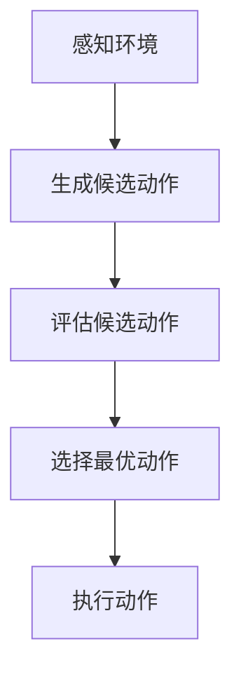
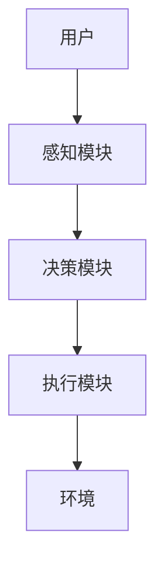

                 


# AI Agent商业化：从原型到产品的转化之路

## 关键词：AI Agent、商业化、算法原理、系统架构、项目实战

## 摘要：本文探讨AI Agent从原型到商业产品的转化过程，涵盖技术背景、核心概念、算法原理、系统架构及项目实战，分析AI Agent在商业环境中的潜力与挑战，提供实际案例和实现方案，助力技术落地。

---

# 第一部分: AI Agent商业化背景与核心概念

## 第1章: AI Agent概述

### 1.1 AI Agent的基本概念

#### 1.1.1 什么是AI Agent
AI Agent（人工智能代理）是指能够感知环境、自主决策并执行任务的智能系统。与传统程序不同，AI Agent具备以下核心特征：
- **自主性**：无需外部干预，自主完成任务。
- **反应性**：能实时感知环境并做出反应。
- **目标导向**：基于目标驱动行动。
- **学习能力**：通过经验优化决策策略。

AI Agent的应用场景广泛，包括智能助手、自动驾驶、智能客服、机器人控制等领域。

#### 1.1.2 AI Agent的核心特征
- **自主性**：AI Agent能够独立运作，无需人工干预。
- **反应性**：实时感知环境变化并做出相应反应。
- **目标导向**：基于预设目标执行任务。
- **学习能力**：通过与环境互动不断优化决策策略。

#### 1.1.3 AI Agent的分类与应用场景
AI Agent可以根据不同标准进行分类，常见的分类方式包括：
1. **按智能水平**：
   - **反应式AI Agent**：基于当前感知做出反应，如PID控制器。
   - **认知式AI Agent**：具备复杂推理能力，如专家系统。
2. **按应用领域**：
   - **软件Agent**：如智能助手、聊天机器人。
   - **硬件Agent**：如自动驾驶汽车、工业机器人。

### 1.2 AI Agent技术的发展历程

#### 1.2.1 从规则引擎到机器学习
- **规则引擎阶段**：基于预设规则进行决策，如简单的If-Else逻辑。
- **机器学习阶段**：引入数据驱动的模型，如决策树、随机森林。
- **强化学习阶段**：通过试错机制优化策略，如Q-learning算法。

#### 1.2.2 大模型时代的AI Agent
随着大模型的兴起，AI Agent的能力得到显著提升，主要体现在：
- **自然语言处理能力**：通过GPT等模型实现更复杂的对话。
- **多模态交互**：结合视觉、听觉等多种感知方式。
- **自适应学习**：基于环境反馈动态调整策略。

#### 1.2.3 当前AI Agent的技术趋势
- **端到端学习**：直接从输入到输出，减少人工特征提取。
- **实时推理**：提升计算效率，实现低延迟响应。
- **人机协作**：增强人与AI Agent的协作能力，如共同完成复杂任务。

### 1.3 AI Agent商业化的机会与挑战

#### 1.3.1 商业化的核心驱动力
- **市场需求**：消费者对智能化产品的需求不断增长。
- **技术进步**：AI技术的成熟为商业化奠定了基础。
- **成本下降**：云计算和AI芯片的普及降低了实现成本。

#### 1.3.2 当前市场的主要机会
- **垂直行业应用**：如金融、医疗、教育等领域。
- **消费级产品**：智能音箱、智能手机中的AI助手。
- **企业级服务**：为企业提供自动化解决方案。

#### 1.3.3 技术与商业化的瓶颈
- **技术瓶颈**：复杂场景下的决策准确性。
- **成本问题**：训练和运行AI Agent需要大量计算资源。
- **用户信任**：数据隐私和决策透明度问题。

### 1.4 本章小结
本章介绍了AI Agent的基本概念、发展历程和商业化潜力，为后续内容奠定了基础。

---

## 第2章: AI Agent的核心概念与技术原理

### 2.1 AI Agent的核心概念

#### 2.1.1 相关概念对比表
| 概念 | 定义 | 特点 |
|------|------|------|
| AI Agent | 具有自主决策能力的智能体 | 可以感知环境并采取行动 |
| 传统规则引擎 | 基于规则的决策系统 | 无法处理复杂场景 |
| 机器学习模型 | 数据驱动的预测系统 | 需要大量数据训练 |

#### 2.1.2 AI Agent的ER实体关系图
```mermaid
er
actor(AI Agent) --> action(执行动作)
actor(environment) --> perception(感知输入)
actor(action) --> reward(反馈奖励)
```

### 2.2 AI Agent的核心原理

#### 2.2.1 AI Agent的决策过程


#### 2.2.2 AI Agent的数学模型
AI Agent的决策过程可以用以下公式表示：
$$ V(s) = \max_{a} Q(s,a) $$
其中：
- \( V(s) \) 表示状态 \( s \) 的价值函数。
- \( Q(s,a) \) 表示状态 \( s \) 下动作 \( a \) 的Q值。

---

## 第3章: AI Agent的算法原理

### 3.1 基于强化学习的AI Agent算法

#### 3.1.1 强化学习的基本原理
强化学习是一种通过试错机制优化决策策略的方法。其核心流程如下：
1. **感知环境**：AI Agent接收环境输入。
2. **选择动作**：基于当前策略选择一个动作。
3. **执行动作**：将动作发送给环境。
4. **获得奖励**：环境返回奖励信号。
5. **更新策略**：基于奖励调整策略。

#### 3.1.2 Q-learning算法
Q-learning是一种经典的强化学习算法，适用于离散状态和动作空间。其更新公式为：
$$ Q(s,a) = Q(s,a) + \alpha (r + \gamma \max Q(s',a') - Q(s,a)) $$
其中：
- \( \alpha \) 是学习率。
- \( \gamma \) 是折扣因子。
- \( r \) 是即时奖励。

#### 3.1.3 实现示例
以下是一个简单的Q-learning实现代码：
```python
import numpy as np

class QLearning:
    def __init__(self, state_space, action_space, alpha=0.1, gamma=0.9):
        self.state_space = state_space
        self.action_space = action_space
        self.alpha = alpha
        self.gamma = gamma
        self.q_table = np.zeros((state_space, action_space))
    
    def choose_action(self, state, epsilon=0.1):
        if np.random.random() < epsilon:
            return np.random.randint(self.action_space)
        else:
            return np.argmax(self.q_table[state])
    
    def update_q(self, state, action, reward, next_state):
        self.q_table[state, action] += self.alpha * (reward + self.gamma * np.max(self.q_table[next_state]) - self.q_table[state, action])
```

---

## 第4章: AI Agent系统分析与架构设计

### 4.1 问题场景介绍
以智能客服为例，AI Agent需要处理用户咨询、问题解答、订单跟踪等任务。

### 4.2 功能设计
AI Agent的功能模块包括：
- **感知模块**：接收用户输入。
- **决策模块**：基于输入生成响应。
- **执行模块**：输出响应并记录日志。

### 4.3 系统架构设计


---

## 第5章: AI Agent项目实战

### 5.1 环境安装
安装必要的库：
```bash
pip install numpy matplotlib
```

### 5.2 核心实现代码
```python
import numpy as np
import matplotlib.pyplot as plt

def train_agent():
    # 初始化Q表
    q_table = np.zeros((4, 2))  # 状态：0-3，动作：0/1
    episodes = 1000
    for episode in range(episodes):
        state = 0  # 初始状态
        for step in range(100):
            # 选择动作
            action = np.argmax(q_table[state])
            # 执行动作
            next_state = state + 1 if action == 1 else 0
            # 计算奖励
            reward = 1 if next_state == 3 else 0
            # 更新Q表
            q_table[state, action] += 0.1 * (reward + 0.9 * np.max(q_table[next_state]) - q_table[state, action])
            state = next_state
            if state == 3:
                break
    return q_table

# 训练AI Agent
q_table = train_agent()
print(q_table)
```

---

## 第6章: 结论与展望

### 6.1 本章总结
本文从AI Agent的基本概念出发，分析了其商业化潜力，探讨了算法原理和系统架构设计，并通过案例展示了AI Agent的实现过程。

### 6.2 未来展望
随着技术进步，AI Agent将在更多领域得到应用，如智能城市、医疗健康等。同时，如何解决技术瓶颈和商业化中的问题仍需进一步探索。

---

## 最佳实践Tips

1. **技术选型**：根据具体需求选择合适的算法和框架。
2. **数据处理**：确保数据质量和多样性，提升模型性能。
3. **系统优化**：通过并行计算和模型压缩优化运行效率。

---

通过以上步骤，我们可以看到AI Agent从原型到产品的转化过程需要综合考虑技术、算法和系统设计等多个方面。希望本文能为读者提供有价值的见解和指导。

