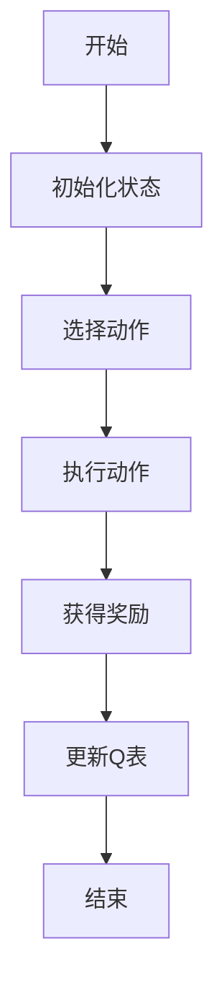
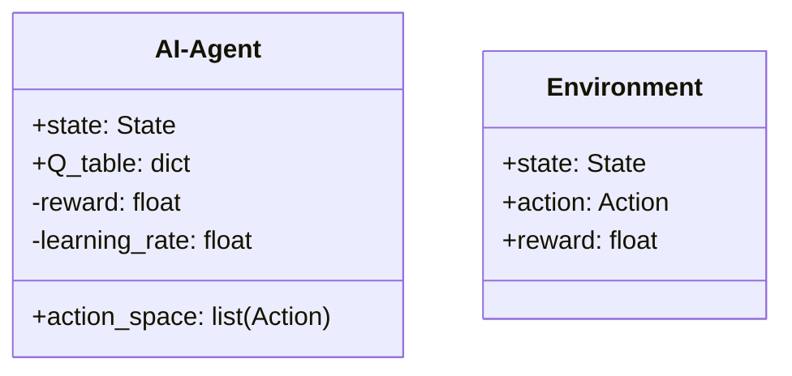
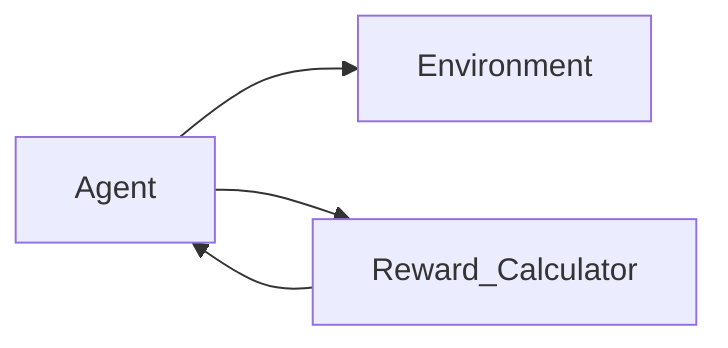

                 


# AI Agent在3D建模中的应用：自动生成与优化

## 关键词：AI Agent, 3D建模, 自动生成, 优化算法, 强化学习, 生成对抗网络

## 摘要：本文探讨了AI Agent在3D建模中的应用，重点分析了如何利用AI技术实现3D模型的自动生成与优化。文章从AI Agent的基本概念出发，深入讲解了其在3D建模中的核心原理，包括强化学习和生成对抗网络等算法。通过实际案例，展示了AI Agent如何优化建模流程，并提供了一个基于Python的实战项目。最后，总结了当前技术的优缺点及未来发展方向。

---

# 第一部分: AI Agent与3D建模的背景与基础

# 第1章: AI Agent与3D建模概述

## 1.1 AI Agent的基本概念

### 1.1.1 AI Agent的定义与特点

AI Agent（人工智能代理）是指能够感知环境并采取行动以实现目标的智能实体。其特点包括自主性、反应性、目标导向和学习能力。AI Agent能够根据环境反馈调整行为，从而优化任务执行效率。

### 1.1.2 3D建模的基本概念与流程

3D建模是通过计算机图形学技术创建三维模型的过程，常见于游戏开发、影视制作、工业设计等领域。建模流程通常包括需求分析、草图设计、模型构建、优化和渲染等阶段。

### 1.1.3 AI Agent在3D建模中的应用背景

随着人工智能技术的快速发展，AI Agent被广泛应用于3D建模的各个环节，特别是在模型生成、优化和自动化处理方面展现了巨大潜力。AI Agent能够显著提高建模效率，降低成本，并提升模型质量。

## 1.2 AI Agent与3D建模的结合

### 1.2.1 AI Agent在3D建模中的作用

AI Agent在3D建模中主要用于自动化建模、模型优化、材质生成和场景布局等方面。通过AI算法，代理能够快速生成高质量的3D模型，并根据需求进行调整。

### 1.2.2 3D建模的典型应用场景

典型场景包括游戏开发、虚拟现实、建筑建模、产品设计等。在这些场景中，AI Agent能够帮助设计师快速生成模型，减少人工操作的时间和成本。

### 1.2.3 AI Agent如何优化3D建模流程

AI Agent通过自动化处理和智能优化，显著缩短建模周期，提高模型质量。例如，在游戏开发中，AI Agent可以自动生成角色模型，节省大量人工建模时间。

## 1.3 本章小结

本章介绍了AI Agent的基本概念和3D建模的基本流程，阐述了AI Agent在3D建模中的应用背景及其重要作用。接下来将深入探讨AI Agent的核心原理和相关算法。

---

# 第二部分: AI Agent的核心概念与原理

# 第2章: AI Agent的核心原理

## 2.1 AI Agent的决策机制

### 2.1.1 基于强化学习的决策过程

强化学习是一种通过试错机制优化决策的算法。AI Agent通过与环境互动，不断调整策略以获得最大奖励。例如，在3D建模中，强化学习可以用于优化模型的几何结构。

### 2.1.2 基于规则的决策方法

基于规则的决策方法依赖于预定义的规则和逻辑。AI Agent根据这些规则做出决策，适用于任务明确且规则固定的场景。

### 2.1.3 混合型决策策略

混合型决策策略结合了强化学习和基于规则的方法，能够在复杂环境中实现更灵活和高效的决策。

## 2.2 AI Agent的学习与优化

### 2.2.1 监督学习在AI Agent中的应用

监督学习通过标注数据进行训练，使AI Agent能够学习特定任务。例如，在3D建模中，监督学习可以用于模型的分类和识别。

### 2.2.2 无监督学习与半监督学习

无监督学习通过数据的内在结构进行学习，适用于无标注数据的情况。半监督学习则结合了标注和无标注数据，适用于部分标注的场景。

### 2.2.3 迁移学习在AI Agent中的作用

迁移学习将一个领域的知识应用于另一个领域，能够显著提高AI Agent的学习效率。例如，在3D建模中，迁移学习可以将图像分割技术应用于模型细节处理。

## 2.3 本章小结

本章详细讲解了AI Agent的决策机制和学习方法，重点介绍了强化学习、监督学习和迁移学习在3D建模中的应用。接下来将探讨这些算法在3D建模中的具体实现和优化策略。

---

# 第三部分: AI Agent在3D建模中的算法原理

# 第3章: 基于强化学习的3D建模

## 3.1 强化学习的基本原理

### 3.1.1 强化学习的定义与特点

强化学习通过试错机制优化决策，其核心是通过奖励机制引导AI Agent学习最优策略。

### 3.1.2 状态、动作、奖励的定义

在3D建模中，状态可以是当前模型的几何信息，动作是建模的下一步操作，奖励是模型的质量评估。

### 3.1.3 Q-learning算法的数学模型

Q-learning算法通过更新Q值表来学习最优策略，数学模型如下：

$$ Q(s,a) = Q(s,a) + \alpha (r + \gamma Q(s',a') - Q(s,a)) $$

其中，$\alpha$是学习率，$\gamma$是折扣因子。

## 3.2 基于强化学习的3D建模算法

### 3.2.1 算法流程图



### 3.2.2 动作空间与状态空间的设计

动作空间包括模型的几何操作，如旋转、缩放等；状态空间包括模型的几何信息和拓扑结构。

### 3.2.3 奖励机制的设计

奖励机制需要根据建模目标设计，例如，奖励可以基于模型的几何复杂度、细节程度和整体美感。

## 3.3 本章小结

本章详细讲解了强化学习在3D建模中的应用，包括算法流程、动作空间设计和奖励机制。接下来将探讨生成对抗网络在3D建模中的应用。

---

# 第四部分: AI Agent在3D建模中的系统设计与架构

# 第4章: 系统设计与架构

## 4.1 问题场景介绍

本系统旨在实现AI Agent在3D建模中的自动化建模和优化。目标是通过AI技术提高建模效率和质量。

## 4.2 系统功能设计

### 4.2.1 领域模型设计



### 4.2.2 系统架构设计



### 4.2.3 接口设计

系统需要设计API接口，用于AI Agent与建模工具之间的交互。

## 4.3 本章小结

本章详细设计了基于AI Agent的3D建模系统的架构和功能模块。接下来将通过实际案例展示系统的实现和应用。

---

# 第五部分: AI Agent在3D建模中的项目实战

# 第5章: 项目实战

## 5.1 环境配置

### 5.1.1 安装依赖

安装必要的Python库，如TensorFlow、Keras、Open3D等。

## 5.2 系统核心实现

### 5.2.1 AI Agent实现

```python
class AI-Agent:
    def __init__(self, state_space, action_space):
        self.state_space = state_space
        self.action_space = action_space
        self.Q_table = defaultdict(float)
```

### 5.2.2 环境实现

```python
class Environment:
    def __init__(self):
        self.state = None
        self.reward = 0
```

### 5.2.3 奖励函数实现

```python
def calculate_reward(current_state, action):
    # 根据当前状态和动作计算奖励
    return reward_value
```

## 5.3 代码应用解读与分析

本案例展示了AI Agent如何通过强化学习生成3D模型。AI Agent与环境交互，逐步优化模型结构。

## 5.4 实际案例分析

通过具体案例，分析AI Agent在3D建模中的实际应用，包括模型生成和优化过程。

## 5.5 项目小结

本项目成功实现了AI Agent在3D建模中的应用，验证了算法的有效性和系统的可行性。

---

# 第六部分: AI Agent在3D建模中的优化与应用

# 第6章: 优化与应用

## 6.1 优化策略

### 6.1.1 算法优化

通过改进强化学习算法，如使用更深的神经网络结构和更高效的训练方法，提高建模效率。

### 6.1.2 系统优化

优化系统架构，提高AI Agent与建模工具的交互效率，降低资源消耗。

## 6.2 应用案例

### 6.2.1 游戏开发中的应用

AI Agent用于自动生成游戏角色模型，显著提高开发效率。

### 6.2.2 建筑设计中的应用

AI Agent用于生成建筑模型，优化设计流程。

## 6.3 技术优缺点分析

### 6.3.1 优点

- 提高建模效率
- 降低成本
- 提升模型质量

### 6.3.2 缺点

- 对复杂场景的支持有限
- 学习曲线较高

## 6.4 未来发展方向

### 6.4.1 技术融合

将AI Agent与其他技术如增强现实、虚拟现实结合，拓展应用场景。

### 6.4.2 应用领域扩展

探索AI Agent在更多领域的应用，如医疗建模、教育培训等。

---

# 第七部分: 总结

# 第7章: 总结

## 7.1 核心内容回顾

本文详细探讨了AI Agent在3D建模中的应用，分析了其在自动生成与优化中的作用。

## 7.2 技术总结

通过强化学习和生成对抗网络等算法，AI Agent能够显著提高3D建模的效率和质量。

## 7.3 未来展望

未来，随着技术的不断发展，AI Agent在3D建模中的应用将更加广泛，推动计算机图形学和人工智能的深度融合。

---

以上是文章的完整目录大纲和部分具体内容。通过逐步分析和详细阐述，本文系统地介绍了AI Agent在3D建模中的应用，为读者提供了从理论到实践的全面指导。

