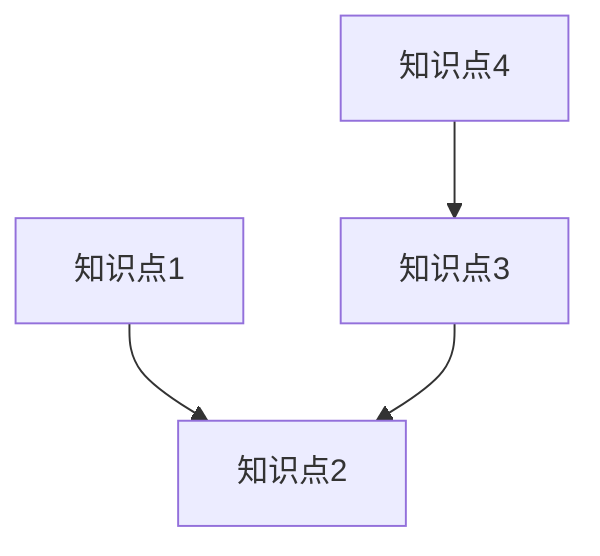
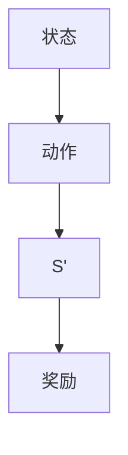
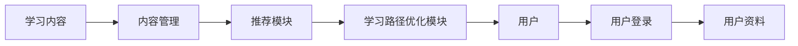

                 


# AI Agent在个性化学习系统中的角色

## 关键词
AI Agent, 个性化学习, 教育技术, 人工智能, 机器学习

## 摘要
随着人工智能技术的快速发展，AI Agent在教育领域的应用逐渐增多，特别是在个性化学习系统中扮演着越来越重要的角色。本文详细探讨了AI Agent在个性化学习系统中的核心原理、技术实现、系统架构以及实际应用，通过案例分析和代码示例，展示了AI Agent如何帮助学生实现高效学习。

---

# 第1章 AI Agent与个性化学习概述

## 1.1 AI Agent的基本概念

### 1.1.1 AI Agent的定义与特点
AI Agent（人工智能代理）是一种能够感知环境并采取行动以实现目标的智能实体。它具有以下特点：
- **自主性**：能够自主决策。
- **反应性**：能够实时感知环境并做出反应。
- **目标导向性**：所有行动都围绕目标展开。
- **社会性**：能够与其他Agent或人类进行交互。

### 1.1.2 AI Agent的核心功能与类型
AI Agent的功能主要分为信息处理、决策制定和执行行动。根据应用场景的不同，AI Agent可以分为以下几种类型：
- **简单反射型Agent**：基于当前输入做出直接反应。
- **基于模型的反射型Agent**：利用内部模型进行推理和决策。
- **目标驱动型Agent**：以实现特定目标为导向。
- **效用驱动型Agent**：通过最大化效用函数来优化决策。

### 1.1.3 AI Agent与传统算法的区别
AI Agent与传统算法的主要区别在于其自主性和目标导向性。传统算法通常需要明确的规则和输入，而AI Agent能够自主感知环境并根据目标动态调整行为。

## 1.2 个性化学习的背景与需求

### 1.2.1 个性化学习的定义与目标
个性化学习是指根据学生的个体差异，提供定制化的学习内容和路径，以满足每个学生的学习需求。其目标是提高学习效率和学生的学习成果。

### 1.2.2 当前教育中的个性化学习挑战
传统教育模式通常采用统一的教学方式，难以满足每个学生的个性化需求。个性化学习的挑战包括：
- **学生需求多样性**：每个学生的学习能力和兴趣点不同。
- **数据获取与处理**：需要大量实时数据来支持个性化决策。
- **技术实现复杂性**：需要结合人工智能和大数据技术。

### 1.2.3 AI Agent在个性化学习中的应用潜力
AI Agent能够通过分析学生的学习数据，提供个性化的学习建议和内容推荐，从而提高学习效率和学生的学习体验。

## 1.3 AI Agent在个性化学习中的角色

### 1.3.1 AI Agent作为学习辅助者的角色
AI Agent可以为学生提供实时的学习指导，帮助他们解决学习中的疑问，并提供学习建议。

### 1.3.2 AI Agent作为学习内容推荐者的角色
AI Agent可以根据学生的学习进度和兴趣，推荐适合的学习资源和内容。

### 1.3.3 AI Agent作为学习过程优化者的角色
AI Agent可以通过分析学生的学习数据，优化学习路径和时间安排，提高学习效率。

## 1.4 本章小结
本章介绍了AI Agent的基本概念及其在个性化学习中的角色，为后续章节的技术实现奠定了基础。

---

# 第2章 AI Agent的核心原理

## 2.1 知识表示与推理机制

### 2.1.1 知识表示方法
知识表示是AI Agent理解和推理的基础。常用的知识表示方法包括：
- **符号表示法**：使用符号和规则表示知识。
- **语义网络**：通过节点和边表示概念及其关系。
- **概率图模型**：利用概率论表示知识的不确定性。

### 2.1.2 知识推理机制
知识推理是AI Agent进行决策的核心过程，常用的推理方法包括：
- **逻辑推理**：基于逻辑规则进行推理。
- **概率推理**：基于概率论进行推理，如贝叶斯推理。
- **类比推理**：通过类比和相似性进行推理。

---

### 2.1.3 实例分析：知识图谱构建
我们可以通过构建知识图谱来表示学习内容，例如数学知识图谱：



通过知识图谱，AI Agent可以理解知识点之间的关系，并根据学生的学习情况推荐相关知识点。

---

## 2.2 学习策略优化

### 2.2.1 基于强化学习的策略优化
强化学习是一种通过试错来优化策略的方法。我们可以使用Q-Learning算法来优化学习策略：



数学模型如下：
$$ Q(s, a) = Q(s, a) + \alpha (r + \max Q(s', a) - Q(s, a)) $$

其中，\( Q(s, a) \) 表示状态 \( s \) 下采取动作 \( a \) 的价值，\( \alpha \) 是学习率，\( r \) 是奖励。

### 2.2.2 基于遗传算法的策略优化
遗传算法是一种通过模拟自然选择来优化策略的方法。我们可以通过以下步骤实现：
1. 初始化种群。
2. 计算适应度。
3. 选择优秀个体。
4. 进行交叉和变异。
5. 重复步骤2-4直到满足条件。

---

### 2.2.3 实例分析：学习路径优化
假设我们有一个包含多个知识点的知识图谱，AI Agent可以通过强化学习算法优化学习路径，选择最优的学习顺序。

---

## 2.3 本章小结
本章详细介绍了AI Agent的核心原理，包括知识表示与推理机制以及学习策略优化方法。

---

# 第3章 AI Agent与机器学习模型结合

## 3.1 基于机器学习的个性化推荐

### 3.1.1 协同过滤推荐
协同过滤是一种基于用户行为相似性的推荐方法。其数学模型如下：
$$ \hat{r}_{u,i} = \bar{r} + \sum_{j \in N(u)} w_{u,j} (r_{j,i} - \bar{r}_j) $$

其中，\( \hat{r}_{u,i} \) 是用户 \( u \) 对物品 \( i \) 的预测评分，\( \bar{r} \) 是全局平均评分，\( N(u) \) 是用户 \( u \) 的邻居集合。

### 3.1.2 基于深度学习的推荐
深度学习模型，如神经网络协同过滤（Neural Collaborative Filtering, NCF），可以通过深度学习技术提高推荐精度。

---

### 3.1.3 实例分析：学习内容推荐
我们可以使用协同过滤算法为学生推荐相似的学习内容。例如，如果学生喜欢数学中的代数部分，AI Agent可以推荐其他与代数相关的知识点。

---

## 3.2 强化学习在个性化学习中的应用

### 3.2.1 基于强化学习的路径规划
我们可以使用强化学习算法优化学习路径。例如，使用Q-Learning算法选择最优的学习顺序。

---

### 3.2.2 实例分析：学习任务调度
假设学生需要学习多个知识点，AI Agent可以通过强化学习算法为学生选择最优的学习任务调度，以提高学习效率。

---

## 3.3 本章小结
本章探讨了AI Agent与机器学习模型的结合，介绍了基于机器学习的个性化推荐和强化学习在个性化学习中的应用。

---

# 第4章 系统架构与实现

## 4.1 系统架构设计

### 4.1.1 系统模块划分
个性化学习系统的模块包括：
- **用户模块**：用户注册与登录。
- **学习内容模块**：管理学习内容。
- **推荐模块**：基于用户数据推荐学习内容。
- **学习路径优化模块**：优化学习路径。

### 4.1.2 系统架构图
以下是系统架构图：



---

## 4.2 系统实现细节

### 4.2.1 前端实现
前端采用React框架，实现用户界面和交互功能。

### 4.2.2 后端实现
后端采用Python的Django框架，实现业务逻辑和数据处理。

### 4.2.3 数据库设计
数据库采用MySQL，设计表结构如下：
- 用户表：存储用户信息。
- 学习内容表：存储知识点信息。
- 学习记录表：存储学生学习记录。

---

## 4.3 本章小结
本章详细设计了个性化学习系统的架构，并介绍了实现细节。

---

# 第5章 项目实战

## 5.1 开发环境搭建

### 5.1.1 安装Python
使用Anaconda安装Python 3.8及以上版本。

### 5.1.2 安装依赖库
安装以下依赖库：
- `numpy`
- `pandas`
- `scikit-learn`
- `tensorflow`

---

## 5.2 核心代码实现

### 5.2.1 推荐系统实现
以下是协同过滤算法的实现代码：

```python
import numpy as np
from sklearn.metrics.pairwise import cosine_similarity

def collaborative_filtering(train_data, test_data, k=5):
    # 计算用户-物品矩阵的余弦相似度
    similarity = cosine_similarity(train_data)
    
    # 对相似度进行排序并选择前k个
    sorted_indices = np.argsort(-similarity, axis=1)[:, :k]
    
    # 对测试数据进行推荐
    recommendations = {}
    for user in test_data.index:
        recommended_items = []
        for item in test_data.loc[user].dropna().index:
            # 获取相似用户的推荐
            similar_users = sorted_indices[user]
            recommended_items.extend(train_data.iloc[similar_users].dropna().columns)
        recommendations[user] = recommended_items
    return recommendations
```

---

### 5.2.2 强化学习实现
以下是Q-Learning算法的实现代码：

```python
class QLearning:
    def __init__(self, state_space, action_space):
        self.state_space = state_space
        self.action_space = action_space
        self.Q = np.zeros((state_space, action_space))
    
    def choose_action(self, state, epsilon=0.1):
        if np.random.random() < epsilon:
            return np.random.randint(self.action_space)
        else:
            return np.argmax(self.Q[state])
    
    def update_Q(self, state, action, reward, next_state, alpha=0.1):
        self.Q[state, action] = self.Q[state, action] + alpha * (reward + np.max(self.Q[next_state]) - self.Q[state, action])
```

---

## 5.3 实例分析
通过实际案例分析，展示AI Agent在个性化学习系统中的应用效果。

---

## 5.4 本章小结
本章通过项目实战，详细介绍了个性化学习系统的实现过程，并提供了核心代码和实例分析。

---

# 第6章 总结与展望

## 6.1 核心内容总结
本文详细探讨了AI Agent在个性化学习系统中的角色和技术实现，介绍了基于机器学习的推荐系统和强化学习的应用。

## 6.2 挑战与建议
个性化学习系统面临数据获取与处理、模型优化等挑战。建议未来进一步研究更高效的算法和模型。

## 6.3 未来发展展望
随着人工智能技术的不断发展，AI Agent在个性化学习中的应用将更加广泛和深入，为教育领域带来更大的变革。

---

# 参考文献
1. Russell, S., & Norvig, P. (2010). Artificial Intelligence: A Modern Approach.
2. Bishop, C. M. (2006). Pattern Recognition and Machine Learning.
3. LeCun, Y., Bengio, Y., & Hinton, G. (2015). Deep learning.
4. Mnih, V., Kavukab垆k, A., & Riedmiller, M. (2016). Asynchronous methods for deep reinforcement learning.

---

# 附录
附录部分包含完整的代码示例和相关数据集的描述。

---

通过以上目录和内容的详细规划，我可以开始撰写完整的文章，确保每个部分都涵盖必要的技术细节和实际应用，帮助读者深入理解AI Agent在个性化学习系统中的角色和实现方法。

