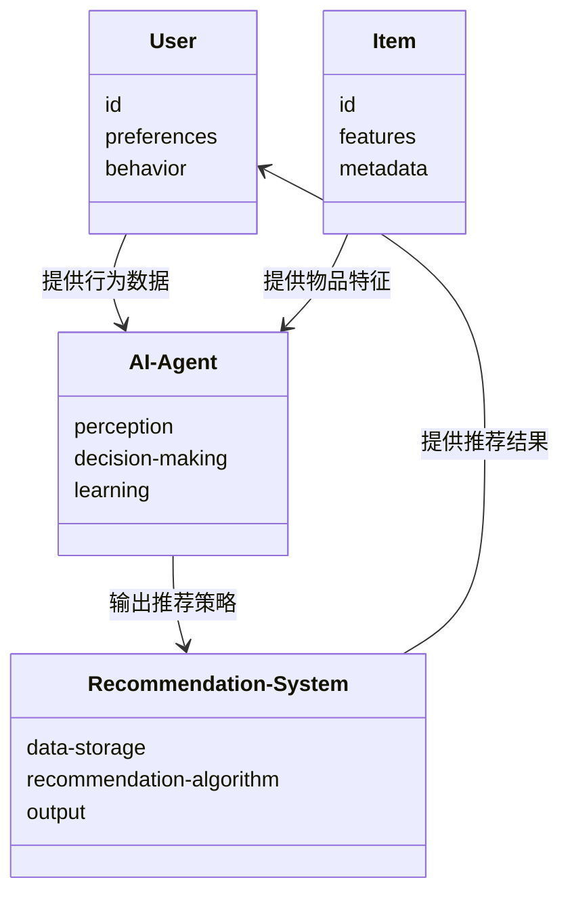
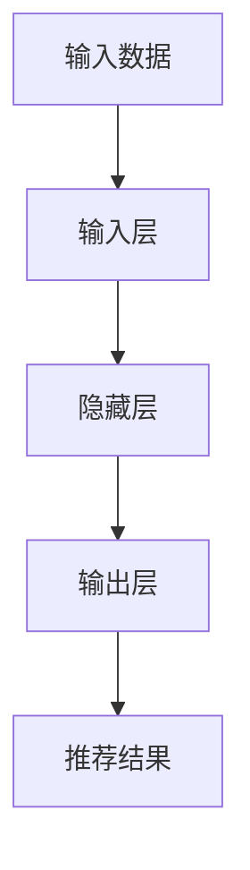
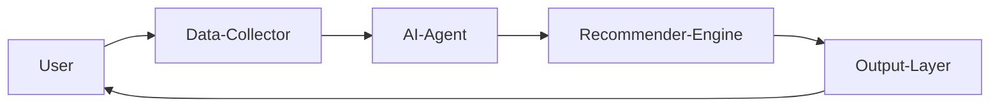
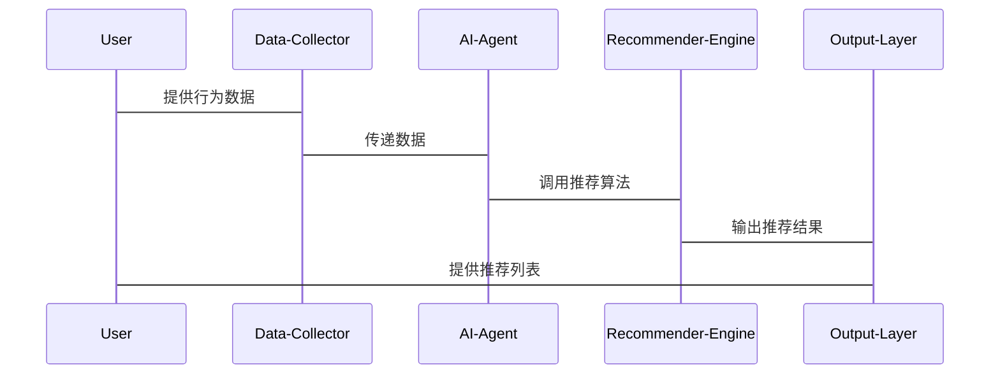

                 


# AI Agent在个性化推荐系统中的应用

> 关键词：AI Agent，个性化推荐，协同过滤，深度学习，推荐系统，用户行为分析

> 摘要：本文深入探讨AI Agent在个性化推荐系统中的应用，从理论基础到实践案例，系统阐述AI Agent如何通过感知、学习和决策机制提升推荐系统的智能化水平。文章结合实际应用场景，分析AI Agent与推荐系统的协同工作原理，并通过具体案例展示其在提高推荐准确性和用户体验方面的优势。

---

# 第1章: AI Agent与个性化推荐系统概述

## 1.1 AI Agent的基本概念

### 1.1.1 AI Agent的定义
AI Agent（人工智能代理）是指能够感知环境、自主决策并执行任务的智能实体。它可以是一个软件程序或系统，通过数据输入和输出与用户或环境交互。AI Agent的核心目标是通过智能算法优化决策过程，实现目标。

### 1.1.2 AI Agent的核心特征
1. **自主性**：能够在没有外部干预的情况下独立运行。
2. **反应性**：能够实时感知环境变化并做出响应。
3. **学习能力**：通过数据和反馈不断优化自身行为。
4. **决策能力**：基于当前状态和目标，选择最优行动方案。

### 1.1.3 AI Agent与传统推荐系统的区别
传统推荐系统通常基于固定的规则或简单的统计方法，而AI Agent能够通过学习和推理动态优化推荐策略，具有更强的适应性和智能化。

## 1.2 个性化推荐系统的背景与现状

### 1.2.1 个性化推荐的定义
个性化推荐是指根据用户的兴趣、偏好和行为，提供定制化的内容或产品推荐。其核心目标是提高用户满意度和系统效率。

### 1.2.2 个性化推荐系统的应用场景
1. **电商推荐**：基于用户的购买历史和浏览行为推荐商品。
2. **视频推荐**：根据用户的观看记录推荐相关内容。
3. **新闻推荐**：基于用户的阅读习惯推荐文章。

### 1.2.3 当前个性化推荐系统的挑战
1. **数据稀疏性**：用户行为数据量不足可能导致推荐准确性降低。
2. **实时性要求**：动态变化的用户需求需要实时响应。
3. **冷启动问题**：新用户或新物品的推荐效果不佳。

## 1.3 AI Agent在个性化推荐中的作用

### 1.3.1 AI Agent如何提升推荐系统的智能性
AI Agent能够通过实时分析用户行为数据，动态调整推荐策略，从而提高推荐的准确性和相关性。

### 1.3.2 AI Agent在推荐系统中的具体应用
1. **实时反馈机制**：通过用户行为反馈优化推荐结果。
2. **个性化模型构建**：利用机器学习算法构建用户画像。
3. **动态推荐策略**：根据用户行为变化调整推荐内容。

### 1.3.3 AI Agent与推荐系统的结合优势
AI Agent通过其强大的学习和决策能力，弥补了传统推荐系统在动态性和个性化方面的不足。

## 1.4 本章小结
本章介绍了AI Agent的基本概念及其在个性化推荐系统中的作用，强调了AI Agent通过智能化和动态性提升推荐系统性能的优势。

---

# 第2章: AI Agent与个性化推荐的核心概念

## 2.1 AI Agent的核心原理

### 2.1.1 AI Agent的感知与决策机制
AI Agent通过传感器或数据输入接口感知环境信息，利用算法处理信息并做出决策。

### 2.1.2 AI Agent的学习与优化算法
AI Agent通常采用强化学习或监督学习方法，通过不断试错优化自身的推荐策略。

### 2.1.3 AI Agent的交互方式
AI Agent可以通过图形界面、API或命令行与用户或系统交互。

## 2.2 个性化推荐系统的实现原理

### 2.2.1 基于协同过滤的推荐算法
协同过滤是一种经典的推荐算法，通过分析用户行为数据发现相似用户或物品，从而进行推荐。

### 2.2.2 基于内容的推荐算法
内容推荐算法基于物品本身的属性（如文本、图像特征）进行推荐，适用于内容丰富的场景。

### 2.2.3 基于深度学习的推荐算法
深度学习算法通过神经网络提取数据特征，能够捕捉复杂的用户行为模式。

## 2.3 AI Agent与个性化推荐的关系

### 2.3.1 AI Agent如何增强推荐系统的智能化
AI Agent通过实时分析用户行为数据，动态调整推荐策略，使推荐系统更加智能化。

### 2.3.2 AI Agent在推荐系统中的角色与功能
AI Agent作为推荐系统的核心组件，负责数据处理、模型训练和策略优化。

### 2.3.3 AI Agent与推荐系统的协同工作流程
1. **数据收集**：AI Agent实时收集用户行为数据。
2. **特征提取**：通过深度学习模型提取用户和物品特征。
3. **推荐策略优化**：基于特征匹配优化推荐结果。

## 2.4 核心概念对比与ER实体关系图

### 2.4.1 AI Agent与推荐系统的属性对比（表格）
| 属性 | AI Agent | 个性化推荐系统 |
|------|-----------|----------------|
| 核心功能 | 自主决策 | 提供推荐结果     |
| 数据输入 | 用户行为、环境数据 | 用户行为、物品属性 |
| 输出结果 | 推荐策略 | 推荐列表       |

### 2.4.2 推荐系统领域模型（Mermaid类图）



---

# 第3章: AI Agent在个性化推荐中的算法原理

## 3.1 协同过滤算法

### 3.1.1 基于用户的协同过滤公式
$$ sim(u, v) = \frac{\sum_{i} (r_{u,i} - \bar{r}_u)(r_{v,i} - \bar{r}_v)}{\sqrt{\sum_{i} (r_{u,i} - \bar{r}_u)^2} \cdot \sqrt{\sum_{i} (r_{v,i} - \bar{r}_v)^2}} $$

其中，$r_{u,i}$表示用户u对物品i的评分，$\bar{r}_u$表示用户u的平均评分。

### 3.1.2 基于物品的协同过滤公式
$$ sim(i, j) = \frac{\sum_{u} (r_{u,i} - \bar{r}_i)(r_{u,j} - \bar{r}_j)}{\sqrt{\sum_{u} (r_{u,i} - \bar{r}_i)^2} \cdot \sqrt{\sum_{u} (r_{u,j} - \bar{r}_j)^2}} $$

其中，$r_{u,i}$表示用户u对物品i的评分，$\bar{r}_i$表示物品i的平均评分。

## 3.2 深度学习算法

### 3.2.1 基于神经网络的推荐模型
推荐系统可以采用多层感知机（MLP）或卷积神经网络（CNN）等深度学习模型，通过非线性特征提取提高推荐准确性。

### 3.2.2 算法流程图（Mermaid）


---

# 第4章: 系统分析与架构设计方案

## 4.1 问题场景介绍
个性化推荐系统需要在实时环境下处理大量用户行为数据，并动态调整推荐策略。

## 4.2 项目介绍
构建一个基于AI Agent的个性化推荐系统，目标是实现智能化的推荐服务。

## 4.3 系统功能设计

### 4.3.1 领域模型（Mermaid类图）


## 4.4 系统架构设计

### 4.4.1 系统架构图（Mermaid）


## 4.5 系统接口设计
系统接口包括数据采集、推荐算法调用和结果输出三部分。

## 4.6 系统交互流程（Mermaid序列图）


---

# 第5章: 项目实战

## 5.1 环境安装
需要安装Python、TensorFlow、Keras等工具。

## 5.2 核心代码实现

### 5.2.1 数据预处理
```python
import pandas as pd

# 加载数据
data = pd.read_csv('user_behavior.csv')

# 数据清洗
data.dropna(inplace=True)
```

### 5.2.2 模型训练
```python
from tensorflow.keras import layers

model = tf.keras.Sequential()
model.add(layers.Dense(64, activation='relu'))
model.add(layers.Dense(1, activation='sigmoid'))
model.compile(optimizer='adam', loss='binary_crossentropy')
model.fit(data, labels, epochs=10, batch_size=32)
```

## 5.3 案例分析
通过实际案例分析AI Agent在推荐系统中的应用效果。

## 5.4 项目小结
总结项目实施过程中的经验和教训。

---

# 第6章: 最佳实践与小结

## 6.1 最佳实践
1. **数据质量**：确保数据的完整性和准确性。
2. **模型优化**：定期更新模型以适应用户行为变化。
3. **用户体验**：注重推荐结果的可解释性和用户体验。

## 6.2 小结
本文详细探讨了AI Agent在个性化推荐系统中的应用，从理论到实践，全面分析了其优势和挑战。

## 6.3 注意事项
- 确保数据隐私和用户隐私保护。
- 定期监控系统性能，及时优化。

## 6.4 拓展阅读
推荐阅读相关领域的最新论文和书籍，关注AI Agent与推荐系统的前沿研究。

---

# 结语
AI Agent通过其强大的感知、学习和决策能力，正在推动个性化推荐系统的发展。未来，随着技术的进步，AI Agent在推荐系统中的应用将更加广泛和深入。

