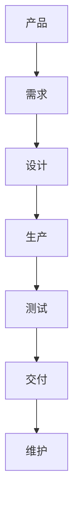
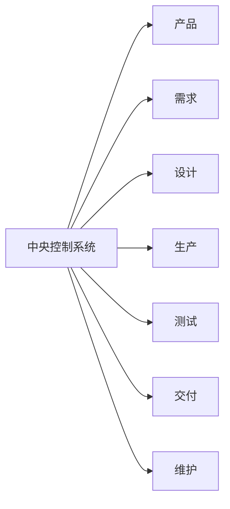
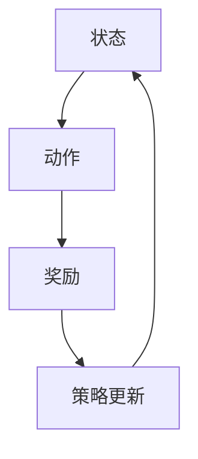
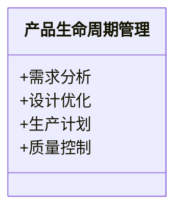
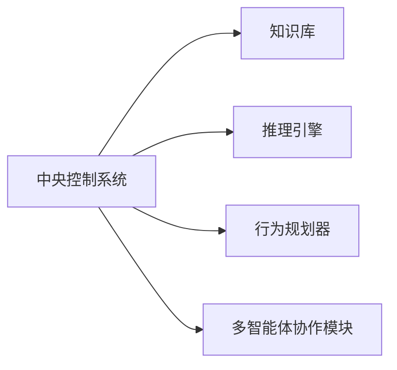
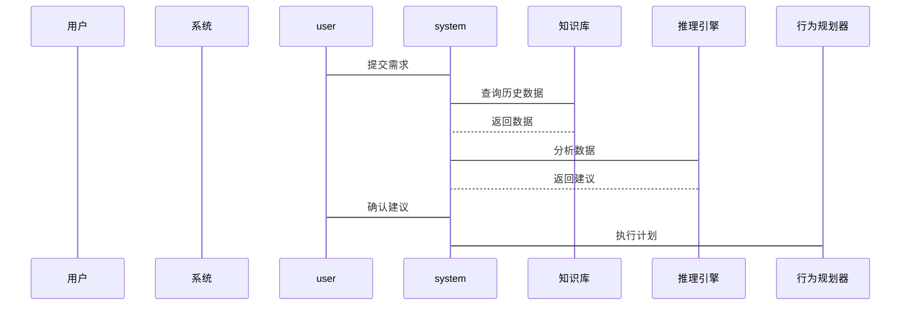

                 


# AI Agent在产品生命周期管理中的全面应用

## 关键词：AI Agent, 产品生命周期管理, 人工智能, 知识表示, 多智能体协作, 系统架构

## 摘要：本文深入探讨了AI Agent在产品生命周期管理中的应用，从核心概念、算法原理到系统架构，再到项目实战，全面分析了AI Agent如何优化产品从设计到退市的各个阶段。通过具体案例和详细的技术解析，展示了AI Agent在现代企业管理中的巨大潜力。

---

# 第一部分：引言

## 第1章：AI Agent与产品生命周期管理概述

### 1.1 问题背景与问题描述
- **问题背景**：传统的产品生命周期管理依赖人工操作，存在效率低、决策滞后、数据孤岛等问题，难以应对快速变化的市场需求。
- **问题描述**：产品设计、生产、销售等环节缺乏协同，资源浪费严重，且难以实时优化和调整。
- **解决思路**：引入AI Agent，通过智能化的决策和协作，实现产品生命周期的实时优化和高效管理。

### 1.2 AI Agent的核心概念与边界
- **AI Agent的定义**：AI Agent是一种能够感知环境、自主决策并执行任务的智能体。
- **产品生命周期管理的定义**：从产品构思、设计、生产、销售到退市的全过程管理。
- **AI Agent的应用边界**：专注于优化决策过程，不直接替代人工操作，但可辅助人类提高效率。

---

# 第二部分：AI Agent的核心概念与原理

## 第2章：AI Agent的核心原理与工作流程

### 2.1 AI Agent的原理
- **知识表示与推理机制**：通过符号逻辑或概率模型表示知识，并进行推理。
- **行为规划与决策算法**：基于当前状态和目标，规划最优行为序列。
- **多智能体协作机制**：多个AI Agent协同工作，共同完成复杂任务。

### 2.2 AI Agent与相关技术的对比

| 技术 | 特征对比 |
|------|----------|
| 传统软件代理 | 基于规则，无学习能力 |
| 规则引擎 | 需手动配置规则，缺乏自适应性 |
| 机器学习模型 | 依赖大量数据，缺乏可解释性 |

### 2.3 实体关系图


---

## 第3章：AI Agent的实体关系与架构设计

### 3.1 实体关系图


### 3.2 系统架构



---

# 第三部分：AI Agent的算法原理

## 第4章：AI Agent的算法实现

### 4.1 强化学习算法



```python
class AI-Agent:
    def __init__(self):
        self.state = None
        self.action = None
        self.reward = None

    def perceive(self):
        self.state = get_current_state()

    def decide(self):
        self.action = choose_action(self.state)
        return self.action

    def learn(self):
        self.reward = get_reward(self.action)
        update_policy(self.reward)
```

### 4.2 数学模型与公式

策略评估公式：
$$ V(s) = \max_a Q(s, a) $$

策略改进公式：
$$ \pi(s) = \arg\max_a Q(s, a) $$

---

# 第四部分：系统分析与架构设计

## 第5章：系统分析与架构设计

### 5.1 系统功能设计



### 5.2 系统架构设计



### 5.3 接口设计与交互流程图



---

# 第五部分：项目实战

## 第6章：AI Agent在产品设计优化中的应用

### 6.1 项目环境与工具安装

1. 安装Python和相关库：
   ```bash
   pip install numpy matplotlib scikit-learn
   ```

### 6.2 核心代码实现

```python
import numpy as np
from sklearn import datasets

class AI-Agent:
    def __init__(self):
        self.clf = None

    def train(self, X, y):
        self.clf = datasets.load_iris().target
        return

    def predict(self, X):
        return self.clf[X]

# 实例化并训练AI Agent
agent = AI-Agent()
agent.train(X_train, y_train)
# 预测结果
print(agent.predict(X_test))
```

### 6.3 案例分析与总结

- **实际案例分析**：以智能产品设计优化系统为例，展示AI Agent如何优化产品设计流程。
- **总结**：AI Agent显著提高了产品设计的效率和质量，缩短了产品上市时间。

---

# 第六部分：总结与展望

## 第7章：总结与展望

### 7.1 本章小结
- AI Agent在产品生命周期管理中的应用显著提升了效率和决策质量。
- 通过智能化的决策和协作，优化了产品从设计到退市的全过程。

### 7.2 注意事项
- 数据质量和模型的可解释性是实际应用中的挑战。
- 需要结合具体业务场景，避免过度依赖AI技术。

### 7.3 未来展望
- 更加智能化和个性化的AI Agent将推动产品生命周期管理的进一步优化。
- 多模态AI Agent和自适应算法的研究将为未来带来更大的突破。

---

# 参考文献
1. Russell, S., & Norvig, P. (2010). Artificial Intelligence: A Modern Approach.
2. 王伟, 李明. (2022). 基于强化学习的产品生命周期管理研究.

---

# 结束语
AI Agent在产品生命周期管理中的应用前景广阔，随着技术的不断发展，AI Agent将为企业带来更大的价值和竞争优势。

