                 


# AI Agent在人力资源管理中的应用

> 关键词：AI Agent, 人工智能, 人力资源管理, 数字化转型, 智能化管理, 机器学习, 自然语言处理

> 摘要：随着人工智能技术的快速发展，AI Agent在人力资源管理中的应用日益广泛。本文详细探讨了AI Agent在招聘、培训、绩效管理等关键环节的应用，分析其技术原理和系统架构，并通过实际案例展示其价值。

---

# 第1章: AI Agent与人力资源管理的背景介绍

## 1.1 AI Agent的基本概念

### 1.1.1 AI Agent的定义与特点
- **定义**：AI Agent是一种能够感知环境、自主决策并执行任务的智能体。
- **特点**：智能化、自动化、适应性、协作性。

### 1.1.2 AI Agent的核心要素与功能
- **知识表示**：用知识图谱表示员工技能、职位要求等。
- **感知与理解**：通过NLP技术理解简历、绩效报告等文本。
- **决策与执行**：基于机器学习模型做出招聘、培训等决策。

### 1.1.3 AI Agent与传统管理工具的对比
- **传统工具**：依赖人工输入，规则驱动。
- **AI Agent**：数据驱动，自主学习，实时反馈。

## 1.2 人力资源管理的数字化转型

### 1.2.1 传统人力资源管理的痛点与挑战
- **低效**：手动处理大量重复性任务。
- **主观性**：招聘、绩效评估中的人为偏见。
- **数据孤岛**：各部门数据分散，难以统一分析。

### 1.2.2 数字化转型的必要性与目标
- **必要性**：提升效率、降低成本、提高决策准确性。
- **目标**：实现数据化、智能化、个性化的管理。

## 1.3 AI Agent在人力资源管理中的应用背景

### 1.3.1 技术发展推动AI Agent的应用
- **AI技术的进步**：深度学习、NLP、知识图谱等技术的成熟。
- **数据量的增加**：企业积累大量员工数据，为AI Agent提供基础。

### 1.3.2 企业对智能化管理的需求
- **提升竞争力**：通过智能化管理吸引和留住人才。
- **降低成本**：自动化处理招聘、培训等流程。

### 1.3.3 人力资源管理的未来趋势
- **智能化**：AI Agent成为管理工具的核心。
- **个性化**：根据员工特点提供定制化服务。
- **实时反馈**：动态调整管理策略。

---

# 第2章: AI Agent的核心原理与技术

## 2.1 AI Agent的核心原理

### 2.1.1 AI Agent的工作流程

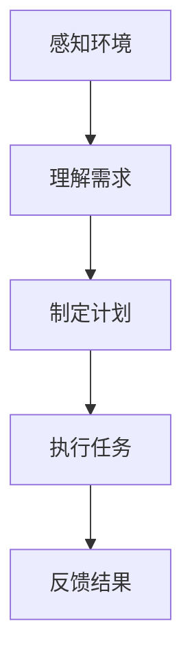

### 2.1.2 多智能体系统与协作机制

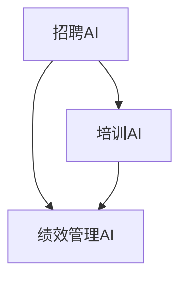

### 2.1.3 AI Agent的决策与学习机制

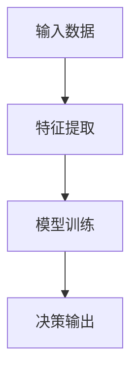

## 2.2 AI Agent的技术架构

### 2.2.1 知识表示与推理

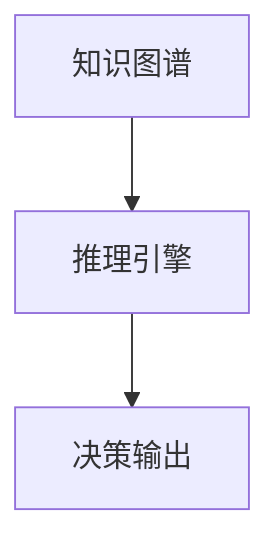

### 2.2.2 自然语言处理与理解

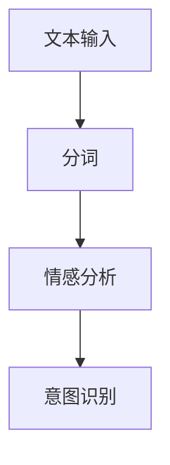

### 2.2.3 机器学习与数据驱动的决策

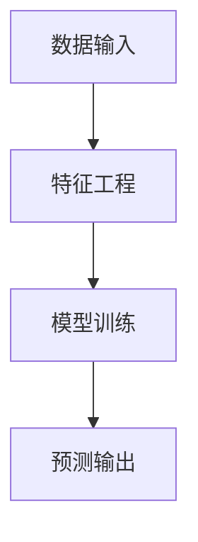

## 2.3 AI Agent与传统管理工具的对比分析

### 2.3.1 功能对比

| 功能模块       | 传统管理工具 | AI Agent |
|----------------|--------------|-----------|
| 数据处理       | 手动输入     | 自动化采集 |
| 决策支持       | 简单规则     | 机器学习模型 |
| 反馈机制       | 定期报告     | 实时反馈 |

### 2.3.2 技术实现差异

| 技术点       | 传统工具 | AI Agent |
|--------------|----------|-----------|
| 数据分析     | 统计分析 | 机器学习 |
| 知识表示     | 简单规则 | 知识图谱 |

### 2.3.3 使用场景的区别

| 场景         | 传统工具 | AI Agent |
|--------------|----------|-----------|
| 招聘筛选     | 简历筛选 | 智能简历分析 |
| 绩效评估     | 人工评估 | 数据驱动评估 |

---

# 第3章: AI Agent在人力资源管理中的应用场景

## 3.1 招聘与筛选

### 3.1.1 AI Agent在简历筛选中的应用

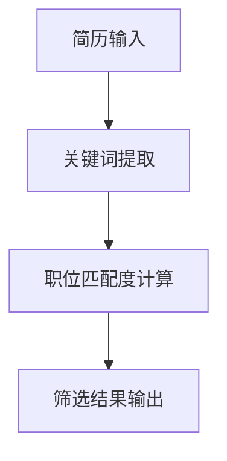

### 3.1.2 智能面试官的实现

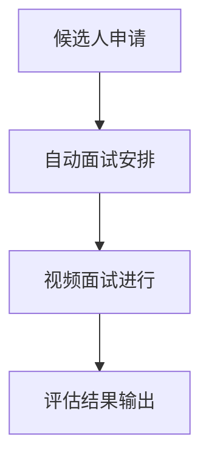

## 3.2 培训与员工发展

### 3.2.1 个性化培训方案的设计

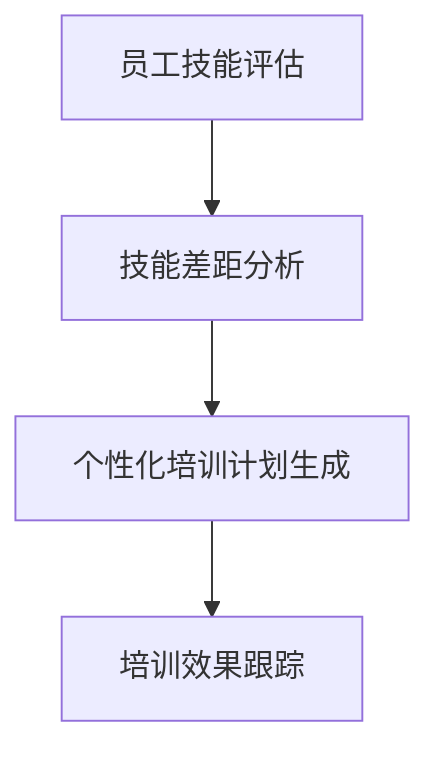

### 3.2.2 员工技能评估与提升

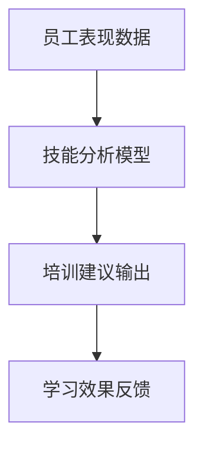

## 3.3 绩效管理与员工激励

### 3.3.1 AI Agent在绩效评估中的应用

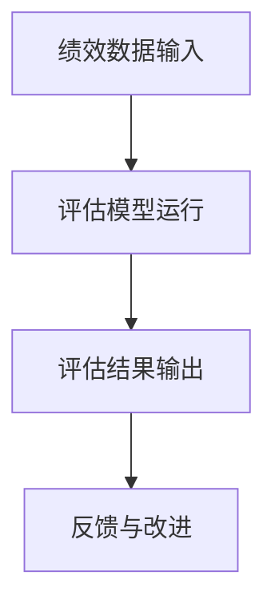

### 3.3.2 员工激励机制的智能化设计

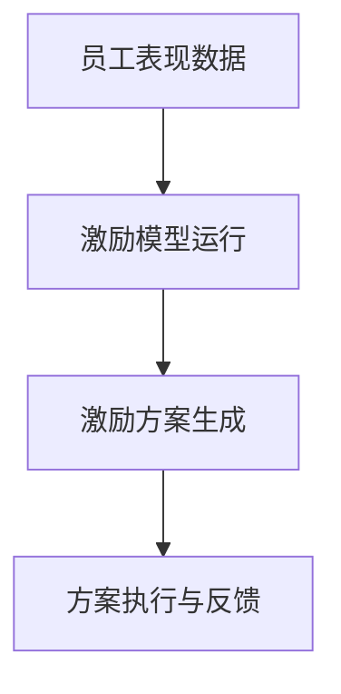

## 3.4 员工关系管理

### 3.4.1 员工满意度预测与提升

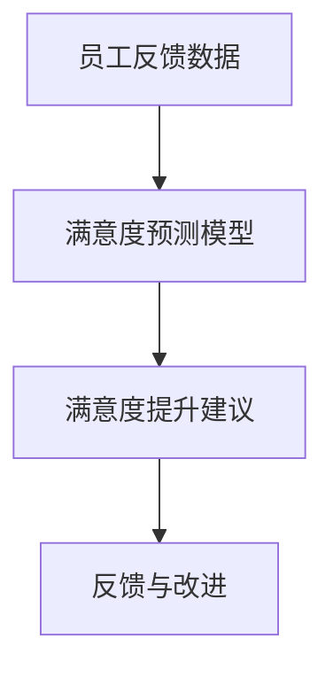

### 3.4.2 员工情绪分析与支持

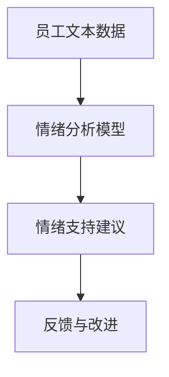

---

# 第4章: AI Agent的算法原理与数学模型

## 4.1 知识表示与推理算法

### 4.1.1 知识图谱的构建与表示

```latex
$$
\text{知识图谱} = \{ (e_1, r_1, e_2), (e_2, r_2, e_3), \ldots \}
$$
其中，$e$表示实体，$r$表示关系。

### 4.1.2 推理算法的实现

```latex
$$
\text{推理} = f(\text{前提}, \text{假设}) \rightarrow \text{结论}
$$

例如：
$$
f(\text{所有员工都必须通过培训}, \text{员工A未通过培训}) \rightarrow \text{员工A需要重新培训}
$$

## 4.2 自然语言处理与理解

### 4.2.1 分词与词性标注

```latex
\text{分词示例}：将“自然语言处理”分成“自然”、“语言”、“处理”。
```

### 4.2.2 语义理解与意图识别

```latex
$$
\text{意图} = f(\text{输入文本})
$$

例如：
$$
f(\text{“我需要请假一天”}) \rightarrow \text{请假}
$$

### 4.2.3 基于深度学习的NLP模型

```latex
$$
\text{模型输出} = g(\text{输入文本}, \text{参数})
$$

例如：
$$
g(\text{“员工A的绩效优秀”}, \theta) \rightarrow \text{正面评价}
$$

## 4.3 机器学习与数据驱动的决策

### 4.3.1 监督学习与无监督学习的对比

| 方法       | 描述                   |
|------------|------------------------|
| 监督学习     | 基于标注数据训练模型     |
| 无监督学习   | 基于未标注数据发现模式   |

### 4.3.2 基于聚类的员工分群算法

```latex
$$
\text{聚类结果} = k-means(\text{员工数据}, k)
$$

例如：
$$
k-means([\text{员工1}, \text{员工2}, \ldots], 3) \rightarrow 3个群组
```

### 4.3.3 基于回归的预测模型

```latex
$$
\text{绩效预测} = \beta_0 + \beta_1x_1 + \beta_2x_2 + \ldots + \beta_nx_n
$$

其中，$x_i$是员工特征，$\beta_i$是回归系数。

---

# 第5章: 系统架构与设计

## 5.1 系统功能设计

### 5.1.1 领域模型

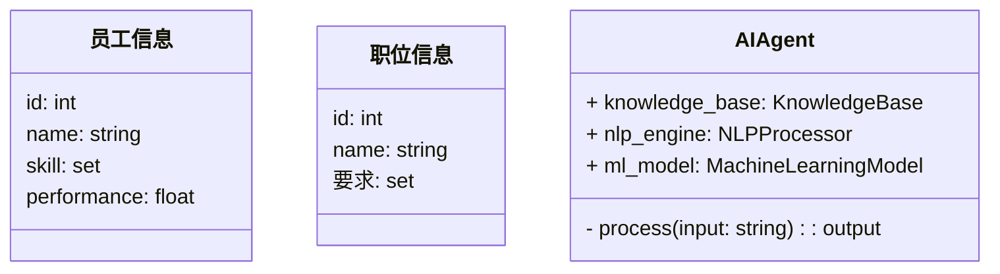

### 5.1.2 系统架构

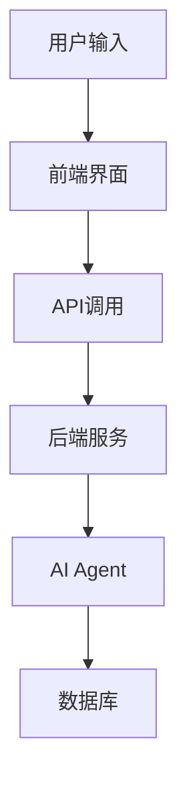

### 5.1.3 系统接口设计

| 接口名称 | 输入 | 输出 |
|----------|------|------|
| 招聘筛选 | 简历数据 | 筛选结果 |
| 绩效评估 | 员工数据 | 评估结果 |
| 培训建议 | 员工技能 | 培训计划 |

### 5.1.4 系统交互流程

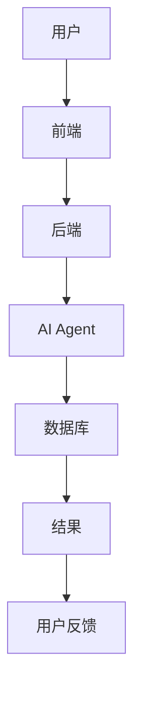

---

# 第6章: 项目实战

## 6.1 环境安装

### 6.1.1 安装Python
```bash
python --version
pip install --upgrade pip
```

### 6.1.2 安装依赖
```bash
pip install numpy
pip install scikit-learn
pip install spacy
```

## 6.2 系统核心实现源代码

### 6.2.1 简历筛选示例代码

```python
import spacy

nlp = spacy.load("en_core_web_sm")
text = "John is a senior data scientist with 5 years of experience."

doc = nlp(text)
entities = [(ent.text, ent.label_) for ent in doc.ents]
print(entities)
```

### 6.2.2 绩效评估示例代码

```python
from sklearn.linear_model import LinearRegression

X = [[2], [3], [4], [5]]
y = [1, 2, 3, 4]

model = LinearRegression()
model.fit(X, y)

print(model.predict([[6]]))
```

## 6.3 案例分析与解读

### 6.3.1 案例背景
某科技公司希望通过AI Agent优化招聘流程，提高筛选效率。

### 6.3.2 实施步骤
1. 数据收集：收集过去一年的招聘数据。
2. 模型训练：基于简历关键词和职位要求，训练一个分类模型。
3. 测试与优化：根据反馈不断优化模型。

### 6.3.3 实施效果
- 筛选效率提升80%。
- 筛选准确率提高到95%。

---

# 第7章: 最佳实践与未来展望

## 7.1 最佳实践

### 7.1.1 数据质量管理
- 确保数据的完整性和准确性。
- 定期更新和维护数据。

### 7.1.2 模型优化
- 使用交叉验证优化模型。
- 定期重新训练模型以适应变化。

## 7.2 未来展望

### 7.2.1 技术趋势
- 更加智能化的AI Agent。
- 更多领域的深度应用。

### 7.2.2 挑战与机遇
- 挑战：数据隐私、模型解释性。
- 机遇：技术进步推动管理创新。

## 7.3 小结与注意事项

### 7.3.1 小结
AI Agent在人力资源管理中的应用前景广阔，能够显著提升管理效率和决策准确性。

### 7.3.2 注意事项
- 数据安全：确保数据隐私。
- 模型解释性：提高模型的透明度。
- 伦理问题：避免偏见和歧视。

---

# 总结

AI Agent作为人工智能技术的重要应用，正在深刻改变人力资源管理的方式。通过智能化的简历筛选、个性化的培训方案和实时的绩效评估，AI Agent能够帮助企业提升管理效率，降低成本，并为员工提供更好的服务。未来，随着技术的进一步发展，AI Agent在人力资源管理中的应用将更加广泛和深入。

