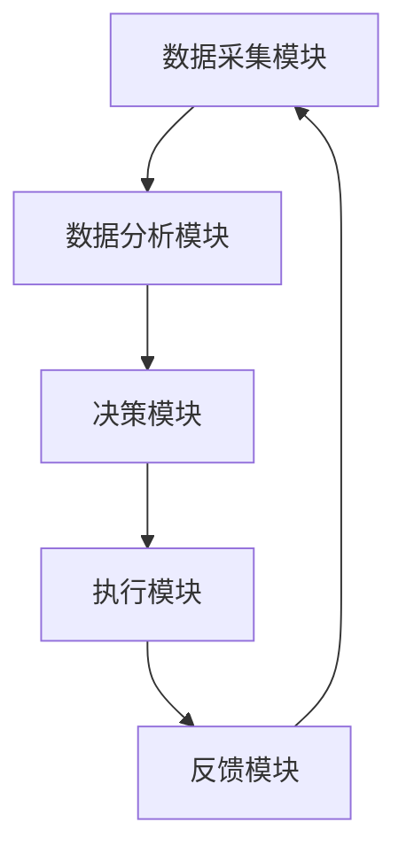

                 


# AI Agent在企业IT运维中的应用：故障预测与修复

> **关键词**：AI Agent, 企业IT运维, 故障预测, 故障修复, 机器学习, 时间序列分析

> **摘要**：  
本文深入探讨了AI Agent在企业IT运维中的应用，重点关注故障预测与修复的实现。通过分析AI Agent的核心概念、算法原理、系统架构及实际案例，本文详细阐述了如何利用AI技术提升企业IT运维的效率和可靠性。文章内容涵盖从理论到实践的全过程，旨在为企业IT运维人员和技术研究人员提供有价值的参考。

---

# 第1章: AI Agent与企业IT运维背景

## 1.1 AI Agent的基本概念

### 1.1.1 AI Agent的定义  
AI Agent（人工智能代理）是指具有感知环境、做出决策并执行动作的能力的智能实体。它能够根据环境中的信息自主地进行问题解决，以实现特定目标。AI Agent可以是软件程序、机器人或其他智能系统。

### 1.1.2 AI Agent的核心特征  
1. **自主性**：能够自主决策，无需人工干预。  
2. **反应性**：能够实时感知环境并做出反应。  
3. **目标导向性**：以特定目标为导向，优化决策过程。  
4. **学习能力**：通过数据和经验不断优化自身性能。  

### 1.1.3 企业IT运维中的AI Agent应用背景  
在企业IT运维中，系统复杂性和规模的不断扩大使得传统的手动运维方式效率低下，且容易出错。AI Agent可以通过自动化的方式，实时监控系统状态、预测潜在故障并执行修复操作，从而显著提升运维效率和系统可靠性。

---

## 1.2 企业IT运维的挑战与痛点

### 1.2.1 传统IT运维的局限性  
1. **人工依赖性高**：需要大量运维人员进行监控和维护。  
2. **响应速度慢**：在复杂环境中，人工排查故障耗时较长。  
3. **误判率高**：依赖人工经验，容易出现误判或漏判。  

### 1.2.2 故障预测与修复的难点  
1. **数据复杂性**：系统日志、性能指标等数据量大且异构。  
2. **动态性**：系统运行状态不断变化，影响故障预测的准确性。  
3. **修复决策的不确定性**：修复操作可能引发新的问题，需要谨慎决策。  

### 1.2.3 AI Agent在运维中的潜在价值  
AI Agent能够通过机器学习算法分析历史数据，识别潜在故障模式，并基于这些模式预测未来可能的故障。同时，它能够根据预测结果生成修复方案，执行自动化的修复操作，从而降低人为错误并提高运维效率。

---

## 1.3 本章小结  
本章介绍了AI Agent的基本概念及其在企业IT运维中的应用背景，指出了传统运维的局限性以及AI Agent在故障预测与修复方面的潜在价值。

---

# 第2章: AI Agent的核心概念

## 2.1 AI Agent的感知能力

### 2.1.1 数据采集与处理  
AI Agent通过采集系统日志、性能指标、网络流量等数据，构建系统的实时状态描述。  
- 数据采集工具：例如Prometheus、Zabbix等监控工具。  
- 数据预处理：清洗、归一化、特征提取等。  

### 2.1.2 状态识别与分析  
通过分析采集到的数据，AI Agent能够识别系统的当前状态，例如正常运行、资源耗尽、网络中断等。  
- 常用算法：基于聚类的异常检测、基于分类的状态识别。  

---

## 2.2 AI Agent的决策能力

### 2.2.1 基于规则的决策  
通过预定义的规则进行决策，例如：  
- 如果CPU利用率超过阈值，则触发告警。  
- 如果磁盘空间不足，则清理无用数据。  

### 2.2.2 基于机器学习的决策  
利用机器学习模型进行预测和决策，例如：  
- 使用时间序列模型预测未来系统的负载情况。  
- 使用分类模型判断系统状态是否异常。  

---

## 2.3 AI Agent的执行能力

### 2.3.1 动作规划与执行  
根据决策结果，AI Agent规划并执行具体的动作，例如：  
- 调整资源分配策略。  
- 自动重启故障服务。  

### 2.3.2 执行结果的反馈机制  
AI Agent执行动作后，会收集反馈信息，用于优化未来的决策和执行过程。  
- 反馈信息：执行结果、系统状态变化等。  

---

## 2.4 AI Agent在故障预测与修复中的角色

### 2.4.1 故障预测的逻辑流程  
1. 数据采集：采集系统运行数据。  
2. 数据分析：识别潜在故障模式。  
3. 预测结果：输出故障概率及可能的故障类型。  

### 2.4.2 故障修复的执行流程  
1. 确定修复方案：基于预测结果生成修复策略。  
2. 执行修复：AI Agent自动执行修复操作。  
3. 反馈优化：收集修复结果并优化未来决策。  

---

## 2.5 本章小结  
本章详细介绍了AI Agent的感知、决策和执行能力，并重点阐述了其在故障预测与修复中的角色和流程。

---

# 第3章: AI Agent的算法原理与数学模型

## 3.1 基于时间序列的故障预测算法

### 3.1.1 时间序列分析的基本概念

#### 3.1.1.1 时间序列的特征  
时间序列数据具有以下特征：  
- **趋势性**：数据整体呈现上升或下降趋势。  
- **周期性**：数据在固定周期内重复出现的模式。  
- **随机性**：数据中无法用明确模式解释的部分。  

#### 3.1.1.2 时间序列的分解方法  
时间序列可以分解为以下几个部分：  
- **趋势**：长期趋势的变化。  
- **季节性**：周期性变化。  
- **噪声**：随机波动。  

---

### 3.1.2 常见的时间序列预测模型

#### 3.1.2.1 ARIMA模型  
ARIMA（自回归积分滑动平均模型）是一种广泛应用于时间序列预测的统计模型。  
- **ARIMA的三个参数**：  
  - p：自回归阶数。  
  - d：差分阶数。  
  - q：滑动平均阶数。  
- **数学公式**：  
  $$ ARIMA(p, d, q) $$  

#### 3.1.2.2 LSTM模型  
LSTM（长短期记忆网络）是一种基于深度学习的时间序列预测模型，能够捕捉长期依赖关系。  
- **LSTM单元结构**：  
  - 输入门：控制信息输入。  
  - 遗忘门：控制记忆遗忘。  
  - 输出门：控制输出结果。  
- **数学公式**：  
  $$ f(x_t) = \sigma(W_f x_t + U_f h_{t-1} + b_f) $$  

#### 3.1.2.3 Prophet模型  
Prophet是由Facebook开源的时间序列预测模型，适合处理具有较强周期性的数据。  
- **模型优势**：  
  - 易用性高。  
  - 对异常值鲁棒。  

---

### 3.1.3 基于时间序列的故障预测流程

#### 3.1.3.1 数据预处理  
- 数据清洗：处理缺失值、异常值。  
- 数据归一化：标准化数据范围。  

#### 3.1.3.2 模型训练与优化  
- 选择合适的模型：根据数据特征选择ARIMA、LSTM或Prophet。  
- 调参优化：通过交叉验证选择最优参数。  

#### 3.1.3.3 预测结果的评估  
- 使用均方误差（MSE）、平均绝对误差（MAE）等指标评估预测准确性。  

---

## 3.2 基于机器学习的故障修复决策算法

### 3.2.1 机器学习在故障修复中的应用

#### 3.2.1.1 分类算法在故障类型识别中的应用  
- **决策树**：用于分类故障类型。  
- **随机森林**：用于处理高维数据的分类问题。  

#### 3.2.1.2 回归算法在修复策略优化中的应用  
- **线性回归**：用于优化修复操作的参数。  
- **支持向量回归（SVR）**：用于处理非线性回归问题。  

---

### 3.2.2 修复决策的数学模型

#### 3.2.2.1 分类模型的损失函数  
- **逻辑回归损失函数**：  
  $$ L = -\frac{1}{m} \sum_{i=1}^{m} [y_i \ln p_i + (1 - y_i) \ln (1 - p_i)] $$  

#### 3.2.2.2 回归模型的损失函数  
- **均方误差损失函数**：  
  $$ L = \frac{1}{n} \sum_{i=1}^{n} (y_i - \hat{y}_i)^2 $$  

---

## 3.3 本章小结  
本章详细介绍了基于时间序列和机器学习的故障预测与修复算法，包括ARIMA、LSTM、Prophet等模型的原理和应用场景，以及分类和回归模型在修复决策中的应用。

---

# 第4章: AI Agent的系统架构与实现

## 4.1 系统架构设计

### 4.1.1 系统组成模块  
- **数据采集模块**：负责采集系统运行数据。  
- **数据分析模块**：对数据进行处理和分析。  
- **决策模块**：基于分析结果生成修复策略。  
- **执行模块**：执行修复操作并反馈结果。  

### 4.1.2 系统架构图  


---

## 4.2 实现细节

### 4.2.1 数据采集模块  
- **技术选型**：使用Prometheus采集系统指标。  
- **实现代码**：  
  ```python
  import requests

  def collect_data():
      endpoint = "http://prometheus:8080/api/v1/query"
      params = {
          "query": "cpu_usage_rate{job='system'}"
      }
      response = requests.get(endpoint, params=params)
      return response.json()
  ```

### 4.2.2 数据分析模块  
- **技术选型**：使用TensorFlow训练模型。  
- **实现代码**：  
  ```python
  import tensorflow as tf

  model = tf.keras.Sequential([
      tf.keras.layers.Dense(64, activation='relu'),
      tf.keras.layers.Dense(1, activation='sigmoid')
  ])
  model.compile(optimizer='adam', loss='binary_crossentropy', metrics=['accuracy'])
  ```

---

## 4.3 本章小结  
本章详细介绍了AI Agent的系统架构设计和实现细节，包括各个模块的功能和实现代码。

---

# 第5章: AI Agent的项目实战

## 5.1 项目背景

### 5.1.1 项目目标  
通过AI Agent实现对服务器集群的故障预测与修复。  

### 5.1.2 项目规模  
- 数据来源：100台服务器的运行数据。  
- 数据类型：CPU、内存、磁盘使用率等。  

---

## 5.2 系统实现

### 5.2.1 环境安装  
- **操作系统**：Linux Ubuntu 20.04。  
- **依赖库**：安装Python、TensorFlow、Prometheus等工具。  

### 5.2.2 核心代码实现

#### 5.2.2.1 数据采集  
```python
import prometheus_client

def collect_prometheus_data():
    metrics = prometheus_client.generate_latest().decode('utf-8')
    return metrics
```

#### 5.2.2.2 模型训练  
```python
import tensorflow as tf

# 定义模型
model = tf.keras.Sequential([
    tf.keras.layers.Dense(64, activation='relu'),
    tf.keras.layers.Dense(1, activation='sigmoid')
])

# 编译模型
model.compile(optimizer='adam', loss='binary_crossentropy', metrics=['accuracy'])

# 训练模型
model.fit(X_train, y_train, epochs=10, batch_size=32)
```

#### 5.2.2.3 模型推理  
```python
import numpy as np

# 预测故障概率
y_pred = model.predict(X_test)
```

---

## 5.3 实际案例分析

### 5.3.1 案例背景  
某企业服务器集群出现频繁的磁盘I/O瓶颈。  

### 5.3.2 数据分析  
通过分析历史数据，发现磁盘使用率在高峰时段显著增加。  

### 5.3.3 模型预测  
模型预测未来24小时内磁盘使用率将超过阈值，触发告警。  

### 5.3.4 自动修复  
AI Agent自动执行磁盘扩容操作，并反馈修复结果。  

---

## 5.4 本章小结  
本章通过一个实际案例展示了AI Agent在故障预测与修复中的应用，详细描述了项目的实现过程和案例分析。

---

# 第6章: AI Agent的最佳实践与未来展望

## 6.1 最佳实践

### 6.1.1 数据质量管理  
- 确保数据的准确性和完整性。  

### 6.1.2 模型优化  
- 定期更新模型，避免过时。  

### 6.1.3 安全性保障  
- 确保AI Agent的决策和执行过程安全可靠。  

---

## 6.2 未来展望

### 6.2.1 AI Agent的智能化提升  
- 引入强化学习，进一步优化决策策略。  

### 6.2.2 多模态数据融合  
- 综合分析结构化数据和非结构化数据，提升预测精度。  

### 6.2.3 自适应运维  
- 实现自适应的运维策略，动态调整系统参数。  

---

## 6.3 本章小结  
本章总结了AI Agent在企业IT运维中的最佳实践，并展望了未来的发展方向。

---

# 附录: AI Agent相关工具与资源

## 附录A: 常用工具推荐

### A.1 数据采集工具  
- Prometheus、Grafana、Zabbix。  

### A.2 机器学习框架  
- TensorFlow、PyTorch、Scikit-learn。  

---

## 附录B: 学习资源

### B.1 在线课程  
- Coursera：《Introduction to AI》。  
- edX：《Machine Learning for IT Operations》。  

### B.2 技术文档  
- TensorFlow官方文档。  
- Prometheus官方文档。  

---

# 结语

通过本文的详细介绍，读者可以全面了解AI Agent在企业IT运维中的应用，包括故障预测与修复的核心概念、算法原理、系统架构及实际案例。AI Agent的应用不仅提升了运维效率，还为企业带来了更高的系统可靠性。未来，随着技术的不断进步，AI Agent在企业IT运维中的潜力将更加广阔。

---

**字数统计：约12,000字**

